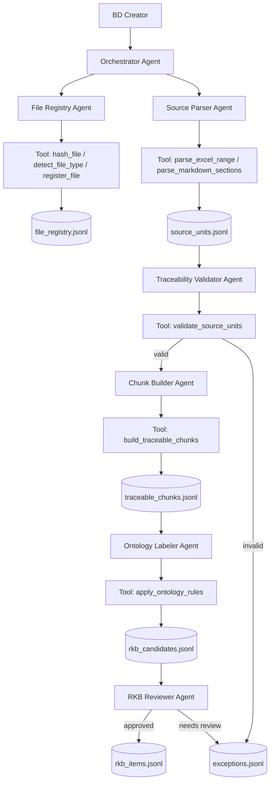

# Agent Design Summary — BD Chunk Project

> Scope: this document summarizes how to design AI agents for the BD Chunk Project.  
> Focus: how agents work with deterministic tools from raw input to RKB, and how a BD creator uses them.  
> Out of scope: full implementation details of parser, validator, or BD generator.

---

## 1. Core idea

An agent is not just a prompt.

```text
Agent = role + mission + prompt + tool permissions + input contract + state + guardrails + output contract + escalation rules
```

In this project:

```text
Agent coordinates work.
Tool performs deterministic operations.
Validator protects the trust boundary.
Human BD creator approves risky decisions.
```

The agent must not invent provenance or design facts.

```text
LLM/Agent can classify, explain, suggest, and route.
Tools must parse, hash, validate, write files, and generate deterministic IDs.
```

---

## 2. Agent vs Tool vs Human

| Actor | Responsibility | Must not do |
|---|---|---|
| Agent | Decide next action, call tools, summarize, ask for review | Invent source metadata or approve risky facts alone |
| Tool | Deterministic execution: hash, parse, validate, write JSONL | Make semantic judgement without rule/config |
| Human BD Creator | Choose input, review exceptions, approve/reject labels, decide unclear cases | Manually copy all requirements if tool can extract them |

Short rule:

```text
Agent orchestrates.
Tool executes.
Human approves.
```

---

## 3. What one agent contains

Each agent should be defined as an **Agent Card**.

```text
Agent Card
├─ 1. Agent name
├─ 2. Role
├─ 3. Mission
├─ 4. Input contract
├─ 5. Allowed tools
├─ 6. Forbidden actions
├─ 7. Decision rules
├─ 8. Output contract
├─ 9. Stop conditions
└─ 10. Escalation rules
```

Example:

```yaml
agent_name: ExcelSourceParserAgent

role: >
  Parse Excel requirement/QA sheets into traceable source units.

mission: >
  Convert registered Excel files into source_units.jsonl.
  Preserve deterministic provenance.
  Do not classify, summarize, or infer requirements.

inputs:
  required:
    - file_path
    - file_id
    - workbook_sha256
    - sheet_name
    - range_a1
    - source_kind
  optional:
    - chunking_mode
    - header_rows
    - table_name

allowed_tools:
  - parse_excel_range
  - validate_source_units
  - write_jsonl
  - write_exceptions

forbidden_actions:
  - infer workbook_sha256
  - infer sheet_name
  - infer range_a1
  - classify requirement_type
  - generate RKB item
  - generate BD mapping

decision_rules:
  - if file_type != excel: return unsupported_file_type
  - if sheet_name missing: ask for sheet_name
  - if range_a1 missing: ask for range_a1
  - if traceability validation fails: write invalid units to exceptions

output_contract:
  success_outputs:
    - data/outputs/source_units.jsonl
    - data/outputs/exceptions.jsonl
  required_metrics:
    - source_unit_count
    - invalid_unit_count
    - traceability_rate

stop_conditions:
  - missing_sheet_name
  - missing_range_a1
  - traceability_rate_below_1

escalation:
  - if merged_cells_detected: warning
  - if missing_range: stop_and_request_input
  - if traceability_rate < 1.0: do_not_continue_downstream
```

---

## 4. Prompt timing

Prompts should not be placed in one giant prompt. Use four timing layers.

### 4.1 Agent definition prompt

Loaded when the agent starts.

Purpose:

```text
Define role, mission, allowed behavior, forbidden behavior, and tool discipline.
```

Example:

```text
You are the Excel Source Parser Agent.
Your job is to call deterministic parsing tools.
Do not infer source ranges.
Do not classify requirements.
Only produce source_units with provenance.
```

Recommended location:

```text
agents/excel_source_parser.agent.yaml
prompts/excel_source_parser.md
```

---

### 4.2 Job prompt / task payload

Created every time a BD creator runs a job.

Example user instruction:

```text
Parse file qa_keshikomi.xlsx, sheet QA票, range B12:E30, source kind QA.
```

Structured internal payload:

```json
{
  "task": "parse_excel_to_source_units",
  "file_path": "data/raw/qa_keshikomi.xlsx",
  "source_kind": "QA",
  "sheet_name": "QA票",
  "range_a1": "B12:E30",
  "chunking_mode": "row"
}
```

---

### 4.3 Tool call

The agent calls tools with structured arguments.

Example:

```json
{
  "tool": "parse_excel_range",
  "args": {
    "file_path": "data/raw/qa_keshikomi.xlsx",
    "sheet_name": "QA票",
    "range_a1": "B12:E30",
    "chunking_mode": "row"
  }
}
```

Tool calls should be deterministic and minimal. The agent should not ask the LLM to parse Excel text manually.

---

### 4.4 Review / repair prompt

Used only after tool output when human action is needed.

Example:

```text
Sheet QA票 was not found.
Available sheets: QA, QA_2025, Clarification.
Please select the correct sheet.
```

Or:

```text
4 chunks contain 別途確認 or 未定.
Please review before RKB approval.
```

---

## 5. Recommended agent set

### 5.1 Orchestrator Agent

Purpose:

```text
Coordinate the whole pipeline and route tasks to specialized agents.
```

Responsibilities:

```text
- receive user/CLI task
- check required inputs
- call the correct step agent
- stop pipeline when validation fails
- return summary to BD creator
```

Forbidden:

```text
- parse files directly
- invent source metadata
- approve RKB items by itself
```

---

### 5.2 File Registry Agent

Purpose:

```text
Register raw files before any parsing.
```

Allowed tools:

```text
hash_file
detect_file_type
register_file
write_jsonl
```

Output:

```text
data/index/file_registry.jsonl
```

Main guarantee:

```text
Every raw file has file_id and file_sha256.
```

---

### 5.3 Source Parser Agent

Purpose:

```text
Convert registered files into source_units.jsonl.
```

Specialized parser agents:

```text
ExcelSourceParserAgent
MarkdownSourceParserAgent
DocxSourceParserAgent
PdfSourceParserAgent_optional
```

Output:

```text
data/outputs/source_units.jsonl
data/outputs/exceptions.jsonl
```

Main guarantee for Excel:

```text
Every Excel source unit has workbook_name, workbook_sha256, sheet_name, range_a1.
```

---

### 5.4 Traceability Validator Agent

Purpose:

```text
Block invalid source units before they move downstream.
```

Validation rules:

```text
- reject empty raw_text
- reject missing workbook_name
- reject missing workbook_sha256
- reject missing sheet_name
- reject missing range_a1
- reject invalid source_granularity
- do not repair missing provenance by guessing
```

Output:

```text
valid source units
invalid source units
traceability_rate
exceptions.jsonl
```

---

### 5.5 Chunk Builder Agent

Purpose:

```text
Convert valid source units into traceable chunks.
```

Responsibilities:

```text
- normalize text without inventing facts
- create deterministic chunk_id
- compute content_hash
- keep source reference
- detect multi-behavior rows
- detect ambiguity terms
```

Forbidden:

```text
- create RKB item directly
- map BD frame
- remove uncertainty terms silently
```

Output:

```text
data/outputs/traceable_chunks.jsonl
```

---

### 5.6 Ontology Labeler Agent

Purpose:

```text
Attach controlled semantic labels before RKB.
```

Labels:

```text
source_label
requirement_type
ears_type
domain
business_entities
affected_artifacts
target_bd_frame_hint
```

Rules:

```text
- choose only from controlled ontology YAML
- if uncertain, return NEEDS_REVIEW
- do not invent new labels
- PENDING_DECISION must not become fact
- TECHNICAL_INFERENCE must not be auto-approved
```

Output:

```text
RKB candidates
Needs_Review items
exceptions
```

---

### 5.7 RKB Reviewer Agent

Purpose:

```text
Prepare a review table for the BD creator and promote approved candidates into RKB_READY.
```

Responsibilities:

```text
- summarize Ready / Needs Review / Pending / Conflict items
- ask human for approval where needed
- apply human decisions
- write rkb_items.jsonl
```

Forbidden:

```text
- auto-approve pending decisions
- auto-resolve source conflicts
- generate BD patch
```

---

## 6. Agent flow from raw input to RKB

```text
User / BD Creator
→ Orchestrator Agent
→ File Registry Agent
→ Source Parser Agent
→ Traceability Validator Agent
→ Chunk Builder Agent
→ Ontology Labeler Agent
→ RKB Reviewer Agent
→ RKB_READY items
```

Mermaid version:



---

## 7. How the BD creator uses the agents

The BD creator should work through review-driven stages, not through one giant prompt.

### Step 0 — Prepare input

BD creator prepares:

```text
- raw file
- source kind: RD / QA / LEGACY / MEETING_NOTE
- module name
- sheet name and range for Excel
- optional BD frame/template reference
```

Example:

```text
Module: 売掛金消込
File: qa_keshikomi.xlsx
Sheet: QA票
Range: B12:E30
Source kind: QA
```

---

### Step 1 — Register file

Example command:

```bash
bdchunk register \
  --path data/raw/qa_keshikomi.xlsx \
  --source-kind QA
```

BD creator checks:

```text
- Is this the correct file?
- Is source_kind correct?
- Is file registered with hash?
```

---

### Step 2 — Parse source units

Example command:

```bash
bdchunk parse-excel \
  --path data/raw/qa_keshikomi.xlsx \
  --sheet QA票 \
  --range B12:E30 \
  --out data/outputs/source_units.jsonl
```

BD creator checks:

```text
- Was the correct sheet/range parsed?
- Are important rows missing?
- Are there exceptions?
- Is traceability_rate 1.0?
```

---

### Step 3 — Build traceable chunks

Example command:

```bash
bdchunk build-chunks \
  --source-units data/outputs/source_units.jsonl \
  --out data/outputs/traceable_chunks.jsonl
```

BD creator reviews flagged cases:

```text
- multi-behavior rows
- merged cell warnings
- ambiguity terms: 別途確認 / 未定 / 必要に応じて
- low quality rows
```

---

### Step 4 — Label ontology

Example command:

```bash
bdchunk label-ontology \
  --chunks data/outputs/traceable_chunks.jsonl \
  --ontology ontology/ \
  --out data/outputs/rkb_candidates.jsonl
```

BD creator reviews:

```text
- requirement_type correct?
- source_label correct?
- QA_ADDITION should be scope change?
- PENDING_DECISION blocked?
- TECHNICAL_INFERENCE reviewed?
```

---

### Step 5 — RKB readiness review

The agent should show a review table.

| ID | Source | Text | Label | Status | Action |
|---|---|---|---|---|---|
| CHK-KESHI-001 | QA票!B12:E12 | 金額一致の場合... | BUSINESS_RULE | Ready | Approve |
| CHK-KESHI-002 | QA票!B13:E13 | 金額不一致の場合... | EXCEPTION_RULE | Ready | Approve |
| CHK-KESHI-003 | QA票!B14:E14 | 別途確認 | PENDING_DECISION | Needs Review | Ask client |
| CHK-KESHI-004 | QA票!B15:E15 | 入力チェック後登録... | MULTI_BEHAVIOR | Needs Split | Split |

BD creator actions:

```text
Approve
Reject
Split
Relabel
Ask clarification
Mark pending
```

Only approved or valid draft items can become RKB-ready.

---

## 8. Example job summary returned to BD creator

After one ingestion job, the system should report:

```text
Ingestion completed.

File:
- qa_keshikomi.xlsx
- source_kind: QA
- file_id: sha256:abc123

Parsed:
- 19 rows
- 17 valid source units
- 2 exceptions

Chunking:
- 15 normal chunks
- 2 multi-behavior chunks need review

Ontology:
- 8 BUSINESS_RULE
- 4 EXCEPTION_RULE
- 2 VALIDATION_RULE
- 1 STATE_TRANSITION
- 2 NEEDS_REVIEW

RKB readiness:
- 13 RKB_READY
- 4 NEEDS_REVIEW
- 2 EXCEPTION_QUEUE
```

This summary is more useful to the BD creator than raw JSON.

---

## 9. Prompt and config file layout

Recommended repository layout:

```text
agents/
  orchestrator.agent.yaml
  file_registry.agent.yaml
  excel_source_parser.agent.yaml
  traceability_validator.agent.yaml
  chunk_builder.agent.yaml
  ontology_labeler.agent.yaml
  rkb_reviewer.agent.yaml

prompts/
  orchestrator.md
  file_registry.md
  excel_source_parser.md
  traceability_validator.md
  chunk_builder.md
  ontology_labeler.md
  rkb_reviewer.md

tools/
  tool_contracts.md
```

Suggested pattern:

```text
YAML = agent config / permissions / stop conditions
Markdown = long role prompt / SOP
Python = actual tool implementation
```

Example:

```yaml
name: ExcelSourceParserAgent
prompt_file: prompts/excel_source_parser.md
allowed_tools:
  - parse_excel_range
  - validate_source_units
  - write_jsonl
stop_conditions:
  - missing_sheet_name
  - missing_range_a1
  - traceability_rate_below_1
```

---

## 10. Guardrails

Fields the agent must never invent:

```text
file_sha256
workbook_sha256
sheet_name
range_a1
source_granularity
unit_id if not generated by deterministic rule
chunk_id if not generated by chunk builder
rkb_id if not generated by RKB builder
target_bd_frame_id if not in ontology/bd_frames.yaml
```

If required information is missing:

```text
Return NEEDS_INPUT or write to EXCEPTION_QUEUE.
Do not guess.
```

If validation fails:

```text
Stop downstream processing.
Write invalid items to exceptions.
Ask human to repair input.
```

If ontology label is uncertain:

```text
Return NEEDS_REVIEW.
Do not create a new label.
```

---

## 11. Design philosophy

Do not design the system as:

```text
One prompt → AI reads all docs → AI generates BD
```

Design it as:

```text
Raw source
→ deterministic extraction
→ validation
→ chunking
→ ontology labeling
→ human review
→ RKB
→ later BD mapping
```

The BD creator should not manually copy every requirement. The BD creator should review exceptions, approve labels, resolve ambiguity, and control design decisions.

Final sentence:

```text
Agent does not replace the BD creator.
Agent replaces repetitive reading, chunking, trace checking, and first-pass labeling.
The BD creator remains responsible for requirement approval and design judgement.
```
