# Agent & Tool Contract Methodology — Methodology, Definition Templates, and Execution Flow

> Scope: quy chuẩn thiết kế Agent, Tool, Matrix, Runner và flow chạy cho BD Chunk Project.  
> Purpose: gom phương pháp luận, define mẫu và flow chạy vào một tài liệu duy nhất để triển khai workflow nhiều agent/tool có kiểm soát.

---

## 1. Why this document exists

BD Chunk Project không nên được xây như một chatbot RAG đơn giản.

Vấn đề cần giải quyết:

```text
Raw source documents
→ deterministic extraction
→ traceable artifacts
→ validated RKB candidates
→ human-gated RKB-ready items
→ governed BD support
```

Nếu chỉ dùng prompt lớn:

```text
Feed all RD/QA/Excel into LLM
→ Ask LLM to generate BD
```

thì có rủi ro:

```text
- hallucinate requirement
- mất traceability
- pending decision bị biến thành fact
- agent/tool vượt quyền
- không biết lỗi xảy ra ở stage nào
- không audit được tool call
- không resume được workflow
- không đo được quality bằng metrics
```

Vì vậy cần một contract layer cho Agent và Tool.

Core rule:

```text
Agent definition controls decision authority.
Tool definition controls execution authority.
Matrix controls who can use what.
Runner enforces the policy.
Validator checks the artifact.
Human gate blocks risky promotion.
```

---

## 2. Methodology foundation

Các define trong tài liệu này không lấy từ một framework duy nhất. Nó là tổng hợp từ nhiều phương pháp luận AI engineering và software engineering.

Tên gọn:

```text
Agent/Tool Contract Design
= Role contract + Interface contract + Permission contract + Risk contract + Runtime contract
```

### 2.1 Methodology map

| Area | Methodology | What it contributes |
|---|---|---|
| Agent role | Agentic AI framework | Agent có name, role, mission, instructions, tools, guardrails |
| Tool interface | Tool-use / function-calling engineering | Tool là capability có input/output schema và side effect |
| Data contract | Schema-first / contract-first design | Input/output phải validate được |
| Execution order | Workflow orchestration / state machine | Stage order, transition, stop condition |
| Runtime safety | Durable execution / observability | run state, logs, metrics, resume |
| Permission | Least privilege / capability-based security | Agent chỉ được gọi tool được phép |
| Accountability | RACI extension | Responsible, accountable, validate, approve, informed |
| Governance | AI risk management | risk level, authority impact, human gate |
| Quality | Evaluation-driven AI development | eval cases, conformance, regression |
| Guardrail | Responsible AI / safety engineering | không invent provenance, không promote pending item |

### 2.2 Practical interpretation

```text
Agent Card = role + mission + decision boundary + allowed tools
Tool Card = capability + input/output schema + side effect + failure mode
Matrix = policy layer for permission and ownership
Runner = enforcement layer
Validator = quality gate
Human Gate = risk control layer
```

---

## 3. Core execution model

Target pattern:

```text
Runner → Agent → Tool → Artifact → Review/Validator → Runner → Next Agent
```

For a concrete simple workflow:

```text
1 Runner
2 Agents
6 Tools
1 Review Gate after Artifacts A
```

High-level flow:

```text
Input
→ Runner
→ Agent 1: IngestAgent
→ Tool 1: hash_file
→ Tool 2: parse_excel_range
→ Tool 3: build_traceable_chunks
→ Artifacts A
→ Review Gate A
→ Agent 2: Ontology/RKB Agent
→ Tool 4: apply_ontology_rules
→ Tool 5: validate_rkb_items
→ Tool 6: write_outputs
→ Artifacts B
→ Output
```

---

## 4. Concrete workflow diagram

```mermaid
flowchart LR
    I[Input<br/>QA票 Excel / RD docs / Config] --> R[Runner<br/>Orchestrator]

    R --> A1[Agent 1<br/>IngestAgent]

    A1 --> T1[Tool 1<br/>hash_file]
    A1 --> T2[Tool 2<br/>parse_excel_range]
    A1 --> T3[Tool 3<br/>build_traceable_chunks]

    T1 --> ART_A[Artifacts A<br/>file_registry.jsonl<br/>source_units.jsonl<br/>traceable_chunks.jsonl<br/>exceptions.jsonl]
    T2 --> ART_A
    T3 --> ART_A

    ART_A --> RG[Review Gate A<br/>Agent or Tool]

    RG --> VT[Validator Tools<br/>schema check<br/>traceability check<br/>provenance check<br/>ambiguity detection]
    VT --> RA[Review Agent<br/>semantic risk review<br/>PASS / NEEDS_REVIEW / FAIL]

    RA --> D{Pass?}

    D -->|PASS| R2[Runner<br/>decide next stage]
    D -->|NEEDS_REVIEW| H[Human Gate<br/>approve / reject / request fix]
    D -->|FAIL| EX[Exception Queue<br/>exceptions.jsonl]

    H -->|Approved| R2
    H -->|Rejected| EX

    R2 --> A2[Agent 2<br/>Ontology/RKB Agent]

    A2 --> T4[Tool 4<br/>apply_ontology_rules]
    A2 --> T5[Tool 5<br/>validate_rkb_items]
    A2 --> T6[Tool 6<br/>write_outputs]

    T4 --> ART_B[Artifacts B<br/>rkb_candidates.jsonl<br/>rkb_items.jsonl<br/>rkb_summary.md<br/>exceptions.jsonl]
    T5 --> ART_B
    T6 --> ART_B

    ART_B --> O[Output<br/>RKB-ready items<br/>review summary<br/>logs / metrics]
```



---

## 5. Responsibility split

### 5.1 Runner

Runner is the workflow enforcement layer.

Responsibilities:

```text
- load workflow.yaml
- load agent/tool/matrix definitions
- validate input
- create run_id
- route execution to the correct agent
- check agent-tool permission before every tool call
- enforce stop conditions
- write state, logs, metrics
- decide whether next stage can run
- trigger human gate when required
```

Runner must not:

```text
- parse Excel directly
- invent source metadata
- modify ontology labels to pass validation
- silently bypass review gates
```

### 5.2 Agent

Agent is a decision worker for a stage.

Agent responsibilities:

```text
- understand stage objective
- plan within its decision scope
- choose allowed tools
- prepare tool input
- interpret tool result
- classify pass/fail/needs_review where allowed
- produce structured stage output
```

Agent must not:

```text
- call forbidden tools
- write artifacts outside allowed paths
- invent provenance
- promote data beyond its authority
```

### 5.3 Tool

Tool is an executable capability.

Tool responsibilities:

```text
- receive structured input
- execute deterministic or clearly declared operation
- return structured output
- report failure with error code
- avoid hidden side effects
```

Tool must not:

```text
- decide workflow stage transition
- silently correct missing source metadata
- approve its own output as source of truth
```

### 5.4 Validator

Validator is the quality gate.

Validator responsibilities:

```text
- check schema
- check traceability
- check business rules
- check ontology labels
- check risk conditions
- return pass/fail/needs_review
```

### 5.5 Human Gate

Human gate is used only for risk cases.

Triggers:

```text
- PENDING_DECISION
- TECHNICAL_INFERENCE
- conflict_flag = true
- low confidence
- missing required provenance
- multi_behavior_row
- ambiguity terms such as 別途確認 / 未定 / 必要に応じて
- before RKB_READY promotion
- before BD generation
```

---

## 6. Agent definition template

Each agent should be defined as an Agent Card.

Minimum required fields:

```yaml
name:
type: agent
stage:
version:
description:

role:
mission:

input_contract:
  required: []
  optional: []

allowed_tools: []
forbidden_tools: []
forbidden_actions: []

decision_scope:
  can_decide: []
  cannot_decide: []

reads: []
writes: []

output_contract:
  artifacts: []
  metrics: []

risk_policy:
  risk_level:
  human_gate_required_when: []

stop_conditions: []
escalation_rules: []

prompt_file:
```

---

## 7. Agent definition example — IngestAgent

```yaml
name: IngestAgent
type: agent
stage: ingest
version: 0.1.0
description: >
  Parse Excel/RD input into traceable intermediate artifacts.

role: >
  Prepare and execute ingestion from raw Excel/RD sources into source units and traceable chunks.

mission: >
  Convert raw source files into file_registry.jsonl, source_units.jsonl,
  and traceable_chunks.jsonl while preserving provenance.

input_contract:
  required:
    - file_path
    - source_kind
    - sheet_name
    - range_a1
    - domain_code
  optional:
    - chunking_mode
    - header_rows

allowed_tools:
  - hash_file
  - parse_excel_range
  - build_traceable_chunks
  - write_outputs

forbidden_tools:
  - apply_ontology_rules
  - validate_rkb_items
  - generate_bd_patch

forbidden_actions:
  - infer_sheet_name
  - infer_range_a1
  - classify_requirement_type
  - create_rkb_item
  - create_bd_mapping
  - promote_rkb_ready

decision_scope:
  can_decide:
    - choose configured chunking mode
    - send invalid source rows to exceptions
  cannot_decide:
    - ontology label
    - source authority ranking
    - RKB_READY promotion
    - BD frame mapping

reads:
  - data/raw/*.xlsx
  - workflows/ingest_excel_to_rkb/workflow.yaml

writes:
  - data/runs/*/outputs/file_registry.jsonl
  - data/runs/*/outputs/source_units.jsonl
  - data/runs/*/outputs/traceable_chunks.jsonl
  - data/runs/*/outputs/exceptions.jsonl

output_contract:
  artifacts:
    - file_registry.jsonl
    - source_units.jsonl
    - traceable_chunks.jsonl
    - exceptions.jsonl
  metrics:
    - source_unit_count
    - chunk_count
    - traceability_rate
    - exception_count

risk_policy:
  risk_level: high
  human_gate_required_when:
    - missing_range_a1
    - traceability_rate_below_1
    - unsupported_merged_cell_layout

stop_conditions:
  - missing_file_path
  - missing_sheet_name
  - missing_range_a1
  - traceability_rate_below_1

escalation_rules:
  - condition: unsupported_merged_cell_layout
    action: NEEDS_REVIEW
  - condition: hidden_rows_detected
    action: WRITE_WARNING

prompt_file: workflows/ingest_excel_to_rkb/prompts/ingest_agent.md
```

---

## 8. Agent definition example — Ontology/RKB Agent

```yaml
name: OntologyRkbAgent
type: agent
stage: ontology_rkb
version: 0.1.0
description: >
  Label traceable chunks with controlled ontology and prepare RKB-ready items.

role: >
  Apply ontology rules, validate candidates, and prepare approved RKB artifacts.

mission: >
  Convert traceable_chunks.jsonl into rkb_candidates.jsonl and rkb_items.jsonl
  using controlled ontology, validators, and human gate when needed.

input_contract:
  required:
    - traceable_chunks_path
    - ontology_config_path
    - review_gate_a_result
  optional:
    - domain_code
    - reviewer_id

allowed_tools:
  - apply_ontology_rules
  - validate_rkb_items
  - write_outputs

forbidden_tools:
  - parse_excel_range
  - build_traceable_chunks
  - generate_full_bd

forbidden_actions:
  - invent_new_ontology_label
  - modify_source_provenance
  - promote_pending_decision_without_approval
  - generate_bd_output

decision_scope:
  can_decide:
    - assign controlled ontology labels
    - mark NEEDS_REVIEW
    - create rkb_candidates
  cannot_decide:
    - change raw_text_ja
    - modify workbook/sheet/range
    - approve technical inference as fact
    - generate final BD

reads:
  - data/runs/*/outputs/traceable_chunks.jsonl
  - ontology/*.yaml

writes:
  - data/runs/*/outputs/rkb_candidates.jsonl
  - data/runs/*/outputs/rkb_items.jsonl
  - data/runs/*/outputs/rkb_summary.md
  - data/runs/*/outputs/exceptions.jsonl

output_contract:
  artifacts:
    - rkb_candidates.jsonl
    - rkb_items.jsonl
    - rkb_summary.md
    - exceptions.jsonl
  metrics:
    - rkb_candidate_count
    - rkb_ready_count
    - needs_review_count
    - ontology_label_error_count

risk_policy:
  risk_level: high
  human_gate_required_when:
    - PENDING_DECISION
    - TECHNICAL_INFERENCE
    - conflict_flag
    - low_confidence
    - invalid_ontology_label

stop_conditions:
  - missing_traceable_chunks
  - invalid_ontology_config
  - unresolved_conflict

prompt_file: workflows/ingest_excel_to_rkb/prompts/ontology_rkb_agent.md
```

---

## 9. Tool definition template

Each tool should be defined as a Tool Card.

Minimum required fields:

```yaml
name:
type: tool
version:
capability_type:
description:

purpose:
owner_agent:
allowed_callers: []

input_schema:
  required: []
  optional: []

output_schema:
  required: []

reads: []
writes: []

side_effect:
deterministic:
idempotent:
risk_level:

validation_rules: []
failure_modes: []

error_output_schema:
  required:
    - error_code
    - error_message
    - recoverable

examples:
  input:
  output:
```

---

## 10. Tool definition example — hash_file

```yaml
name: hash_file
type: tool
version: 0.1.0
capability_type: deterministic_tool
description: Calculate file hash and basic file metadata.

purpose: >
  Produce stable file identity for traceability and file registry.

owner_agent: IngestAgent
allowed_callers:
  - IngestAgent

input_schema:
  required:
    - file_path
  optional: []

output_schema:
  required:
    - file_path
    - file_name
    - file_size_bytes
    - sha256
    - detected_at

reads:
  - data/raw/*
writes: []

side_effect: none
deterministic: true
idempotent: true
risk_level: low

validation_rules:
  - file_path must exist
  - sha256 must be 64 hex characters

failure_modes:
  - file_not_found
  - permission_denied
  - unsupported_file_path

error_output_schema:
  required:
    - error_code
    - error_message
    - recoverable
```

---

## 11. Tool definition example — parse_excel_range

```yaml
name: parse_excel_range
type: tool
version: 0.1.0
capability_type: deterministic_tool
description: Parse Excel range into row-level or block-level source units.

purpose: >
  Convert a configured Excel sheet/range into source_units while preserving
  workbook name, workbook hash, sheet name, range A1, row/block granularity,
  and raw Japanese text.

owner_agent: IngestAgent
allowed_callers:
  - IngestAgent

input_schema:
  required:
    - file_path
    - workbook_sha256
    - sheet_name
    - range_a1
    - chunking_mode
  optional:
    - header_rows
    - skip_empty_rows
    - source_kind
    - domain_code

output_schema:
  required:
    - source_units
    - parse_warnings
    - metrics

source_unit_required_fields:
  - unit_id
  - raw_text_ja
  - workbook_name
  - workbook_sha256
  - sheet_name
  - range_a1
  - source_granularity

reads:
  - data/raw/*.xlsx
writes: []

side_effect: none
deterministic: true
idempotent: true
risk_level: high

validation_rules:
  - workbook_sha256 must match actual file hash
  - sheet_name must exist
  - range_a1 must be valid
  - every source_unit must have workbook_name
  - every source_unit must have sheet_name
  - every source_unit must have range_a1
  - raw_text_ja must not be empty

failure_modes:
  - file_not_found
  - sheet_not_found
  - invalid_range_a1
  - unsupported_merged_cell_layout
  - empty_range
```

---

## 12. Tool definition example — build_traceable_chunks

```yaml
name: build_traceable_chunks
type: tool
version: 0.1.0
capability_type: deterministic_tool
description: Build traceable chunks from source units.

purpose: >
  Transform validated source_units into traceable_chunks while preserving
  source references and detecting ambiguity or multi-behavior rows.

owner_agent: IngestAgent
allowed_callers:
  - IngestAgent

input_schema:
  required:
    - source_units
    - chunking_policy
  optional:
    - ambiguity_terms

output_schema:
  required:
    - traceable_chunks
    - exceptions
    - metrics

reads:
  - data/runs/*/outputs/source_units.jsonl
writes: []

side_effect: none
deterministic: true
idempotent: true
risk_level: high

validation_rules:
  - every chunk must preserve source.unit_id
  - every chunk must preserve workbook_name
  - every chunk must preserve sheet_name
  - every chunk must preserve range_a1
  - traceability_rate must be 1.0

failure_modes:
  - missing_source_units
  - missing_provenance
  - multi_behavior_without_split
  - ambiguity_detected
```

---

## 13. Tool definition example — apply_ontology_rules

```yaml
name: apply_ontology_rules
type: tool
version: 0.1.0
capability_type: rule_based_tool
description: Apply controlled ontology labels to traceable chunks.

purpose: >
  Create rkb_candidates from traceable_chunks using ontology YAML and mapping rules.

owner_agent: OntologyRkbAgent
allowed_callers:
  - OntologyRkbAgent

input_schema:
  required:
    - traceable_chunks
    - ontology_config
  optional:
    - domain_code

output_schema:
  required:
    - rkb_candidates
    - label_warnings
    - metrics

reads:
  - data/runs/*/outputs/traceable_chunks.jsonl
  - ontology/*.yaml
writes: []

side_effect: none
deterministic: true
idempotent: true
risk_level: high

validation_rules:
  - source_label must exist in ontology/source_labels.yaml
  - requirement_type must exist in ontology/requirement_types.yaml
  - target_bd_frame_hint must exist in ontology/bd_frames.yaml
  - pending items must not be marked RKB_READY

failure_modes:
  - ontology_file_missing
  - invalid_source_label
  - invalid_requirement_type
  - invalid_bd_frame
  - unresolved_pending_decision
```

---

## 14. Tool definition example — validate_rkb_items

```yaml
name: validate_rkb_items
type: tool
version: 0.1.0
capability_type: validation_tool
description: Validate RKB candidates before promotion.

purpose: >
  Ensure RKB candidates have valid schema, provenance, ontology labels,
  status, confidence, and review flags before writing rkb_items.jsonl.

owner_agent: OntologyRkbAgent
allowed_callers:
  - OntologyRkbAgent

input_schema:
  required:
    - rkb_candidates
    - ontology_config
  optional:
    - human_decisions

output_schema:
  required:
    - passed
    - valid_items
    - invalid_items
    - needs_review_items
    - errors
    - metrics

reads:
  - data/runs/*/outputs/rkb_candidates.jsonl
  - ontology/*.yaml
writes: []

side_effect: none
deterministic: true
idempotent: true
risk_level: high

validation_rules:
  - rkb_id must follow naming rule
  - source provenance must exist
  - pending decision cannot be RKB_READY
  - technical inference requires human approval
  - conflict_flag true requires human approval
  - low confidence requires human review

failure_modes:
  - missing_provenance
  - invalid_rkb_id
  - pending_marked_ready
  - conflict_without_review
  - low_confidence_without_review
```

---

## 15. Tool definition example — write_outputs

```yaml
name: write_outputs
type: tool
version: 0.1.0
capability_type: file_write_tool
description: Write workflow output artifacts to run directory.

purpose: >
  Persist validated artifacts to data/runs/<run_id>/outputs and update metrics/logs.

owner_agent: IngestAgent
allowed_callers:
  - IngestAgent
  - OntologyRkbAgent
  - Runner

input_schema:
  required:
    - run_id
    - artifacts
    - output_paths
  optional:
    - overwrite_policy

output_schema:
  required:
    - written_files
    - skipped_files
    - errors

reads: []
writes:
  - data/runs/*/outputs/*.jsonl
  - data/runs/*/outputs/*.md
  - data/runs/*/logs/*.jsonl
  - data/runs/*/metrics.json

side_effect: file_write
deterministic: true
idempotent: true
risk_level: high

validation_rules:
  - output path must be inside data/runs/<run_id>/
  - artifact must pass schema before write if marked official
  - do not overwrite official artifact unless overwrite_policy allows it

failure_modes:
  - invalid_output_path
  - permission_denied
  - schema_not_validated
  - write_failed
```

---

## 16. Agent-Tool Governance Matrix

RACI alone is not enough. Use extended RACI:

```text
R = Responsible / manage execution
X = Execute tool
V = Validate output
A = Approve / accountable
I = Informed
- = Not allowed
```

```markdown
| Actor / Tool | hash_file | parse_excel_range | build_traceable_chunks | apply_ontology_rules | validate_rkb_items | write_outputs |
|---|---:|---:|---:|---:|---:|---:|
| Runner | R | R | R | R | R | R |
| IngestAgent | X | X | X | - | - | X |
| OntologyRkbAgent | - | - | - | X | X | X |
| Validator Tools | V | V | V | V | V | V |
| Human Reviewer | A | A | A | A | A | A |
```

Policy:

```text
Tool not listed as allowed for an agent = forbidden by default.
Write permission must be explicit.
Official artifact promotion requires validator pass.
High-risk promotion requires human approval.
```

---

## 17. Artifact Ownership Matrix

```markdown
| Artifact | Producer | Validator | Approver | Consumers | Source of Truth |
|---|---|---|---|---|---|
| file_registry.jsonl | hash_file / IngestAgent | Validator Tools | Runner | All stages | Yes |
| source_units.jsonl | parse_excel_range | Validator Tools | Runner | IngestAgent / OntologyRkbAgent | Yes |
| traceable_chunks.jsonl | build_traceable_chunks | Validator Tools | Runner | OntologyRkbAgent | Yes |
| rkb_candidates.jsonl | apply_ontology_rules | validate_rkb_items | Human Reviewer if risky | OntologyRkbAgent | No |
| rkb_items.jsonl | validate_rkb_items / write_outputs | RKB Validator | Human Reviewer | BD Mapper | Yes |
| exceptions.jsonl | Any stage | Runner | Human Reviewer | PM / BA | Yes |
| rkb_summary.md | write_outputs | Reviewer | Human Reviewer | PM / BA | No |
```

Key rule:

```text
rkb_candidates are not source of truth.
rkb_items become source of truth only after validation and required approval.
```

---

## 18. Risk / Human Gate Matrix

```markdown
| Condition | Detected By | Severity | Auto Continue? | Human Gate? | Action |
|---|---|---:|---:|---:|---|
| missing_sheet_name | Runner / Validator | High | No | Yes | NEEDS_INPUT |
| missing_range_a1 | Runner / Validator | High | No | Yes | NEEDS_INPUT |
| traceability_rate < 1.0 | Validator | Critical | No | Yes | STOP |
| ambiguity_terms_found | Validator | High | No | Yes | REVIEW |
| multi_behavior_row | Validator / ReviewAgent | Medium | No | Yes | SPLIT_OR_REVIEW |
| PENDING_DECISION | OntologyRkbAgent | High | No | Yes | REVIEW |
| TECHNICAL_INFERENCE | OntologyRkbAgent | High | No | Yes | REVIEW |
| conflict_flag = true | RKB Validator | High | No | Yes | REVIEW |
| low confidence label | ReviewAgent | Medium | No | Yes | REVIEW |
| all validation passed | Validator | Low | Yes | No | CONTINUE |
```

---

## 19. Runner enforcement pseudo-code

```python
def run_workflow(request):
    workflow = load_yaml("workflows/ingest_excel_to_rkb/workflow.yaml")
    agent_matrix = load_yaml("registry/agent_tool_governance.yaml")
    artifact_matrix = load_yaml("registry/artifact_ownership.yaml")
    human_gate_matrix = load_yaml("registry/human_gate_matrix.yaml")

    run_state = create_run_state(workflow_id=workflow["id"], request=request)
    validate_input_contract(workflow["input_contract"], request)

    context = {"request": request, "outputs": {}, "metrics": {}}

    for stage in workflow["stages"]:
        agent = load_agent(stage["agent"])
        update_stage_status(run_state, stage["id"], "running")

        tool_plan = agent.plan(stage=stage, context=context)

        for tool_call in tool_plan:
            assert_can_call_tool(
                agent_name=agent.name,
                tool_name=tool_call.name,
                matrix=agent_matrix,
            )

            result = execute_tool(tool_call.name, tool_call.args)
            write_tool_log(run_state, agent.name, tool_call.name, result)

            if result.get("error"):
                write_exception(run_state, result)
                return stop_workflow(stage, result)

        validation_result = run_stage_validator(stage, context)
        write_validation_log(run_state, stage["id"], validation_result)

        if validation_result["status"] == "FAIL":
            write_exception(run_state, validation_result)
            return stop_workflow(stage, validation_result)

        if validation_result["status"] == "NEEDS_REVIEW":
            human_result = request_human_review(validation_result)
            write_human_decision(run_state, human_result)

            if not human_result["approved"]:
                return stop_workflow(stage, human_result)

        context["outputs"][stage["id"]] = validation_result.get("artifacts")
        update_stage_status(run_state, stage["id"], "completed")

    return complete_workflow(run_state, context)
```

---

## 20. Concrete 1 Runner / 2 Agent / 6 Tool workflow.yaml

```yaml
id: ingest_excel_to_rkb_simple
name: Ingest Excel to RKB Simple Workflow
version: 0.1.0

input_contract:
  required:
    - file_path
    - source_kind
    - sheet_name
    - range_a1
    - domain_code

stages:
  - id: ingest
    agent: IngestAgent
    tools:
      - hash_file
      - parse_excel_range
      - build_traceable_chunks
      - write_outputs
    outputs:
      - file_registry.jsonl
      - source_units.jsonl
      - traceable_chunks.jsonl
      - exceptions.jsonl
    review_gate: review_gate_a

  - id: review_gate_a
    type: review_gate
    validator_tools:
      - validate_schema
      - validate_traceability
      - validate_provenance
      - detect_ambiguity_terms
    review_agent: ReviewAgent
    human_gate_required_when:
      - missing_provenance
      - traceability_rate_below_1
      - ambiguity_terms_found
      - multi_behavior_row
    outputs:
      - review_gate_a_result

  - id: ontology_rkb
    agent: OntologyRkbAgent
    tools:
      - apply_ontology_rules
      - validate_rkb_items
      - write_outputs
    inputs:
      - review_gate_a_result
      - traceable_chunks.jsonl
    outputs:
      - rkb_candidates.jsonl
      - rkb_items.jsonl
      - rkb_summary.md
      - exceptions.jsonl

stop_conditions:
  - missing_file_path
  - missing_sheet_name
  - missing_range_a1
  - traceability_rate_below_1
  - invalid_ontology_label
  - unresolved_conflict
```

Note:

```text
write_outputs appears in both stages, but the agent-tool matrix controls what each agent can write.
```

---

## 21. Review Gate A design

Review Gate A sits after Artifacts A.

```text
Artifacts A
→ Validator Tools
→ Review Agent
→ Human Gate if needed
→ Runner decision
```

Review Gate A checks:

```text
- schema valid
- traceability_rate = 1.0
- workbook/sheet/range present
- no missing source text
- ambiguity terms detected
- multi-behavior row detected
- exception queue is explainable
```

Review Gate A returns:

```json
{
  "gate_id": "review_gate_a",
  "status": "PASS",
  "traceability_rate": 1.0,
  "needs_review_count": 0,
  "exception_count": 0,
  "approved_for_next_stage": true
}
```

If risky:

```json
{
  "gate_id": "review_gate_a",
  "status": "NEEDS_REVIEW",
  "reason_codes": ["AMBIGUITY_TERMS_FOUND"],
  "review_items": ["CHK-KESHI-QA-7F91A2"],
  "approved_for_next_stage": false
}
```

---

## 22. Implementation order

Build in this order:

```text
1. Create registry/agent_tool_governance.yaml
2. Create registry/artifact_ownership.yaml
3. Create registry/human_gate_matrix.yaml
4. Create workflows/ingest_excel_to_rkb/workflow.yaml
5. Create agent cards for IngestAgent and OntologyRkbAgent
6. Create tool cards for 6 tools
7. Create schemas for source_units, traceable_chunks, rkb_candidates, rkb_items, exceptions
8. Implement Runner permission check
9. Implement hash_file
10. Implement parse_excel_range
11. Implement build_traceable_chunks
12. Implement Review Gate A validators
13. Implement apply_ontology_rules
14. Implement validate_rkb_items
15. Implement write_outputs
16. Add evals for happy path and fail path
```

Do not start with:

```text
- full BD generation
- complex UI
- GraphRAG
- vector DB
- 20 agents
```

---

## 23. Minimum eval cases

```text
happy_path_excel_to_rkb.yaml
missing_sheet_name_should_stop.yaml
missing_range_a1_should_stop.yaml
traceability_below_1_should_stop.yaml
pending_decision_should_need_review.yaml
invalid_ontology_label_should_fail.yaml
agent_forbidden_tool_should_fail.yaml
write_outside_allowed_path_should_fail.yaml
```

Each eval should verify:

```text
- expected stage status
- expected output artifacts
- expected exception codes
- expected human gate trigger
- expected permission enforcement
```

---

## 24. Final operating model

```text
Runner loads workflow and policy.
Runner calls stage agent.
Agent chooses allowed tools.
Runner checks permission before tool execution.
Tool executes and returns structured output.
Validator checks artifact quality.
Review Gate decides PASS / NEEDS_REVIEW / FAIL.
Human approves only risky items.
Runner moves to next stage only after gate passes.
Artifacts and logs are written to run state.
```

Final rule:

```text
Agent decides within boundary.
Tool executes with contract.
Validator checks correctness.
Matrix controls permission.
Runner enforces everything.
Human gate protects source of truth.
```
