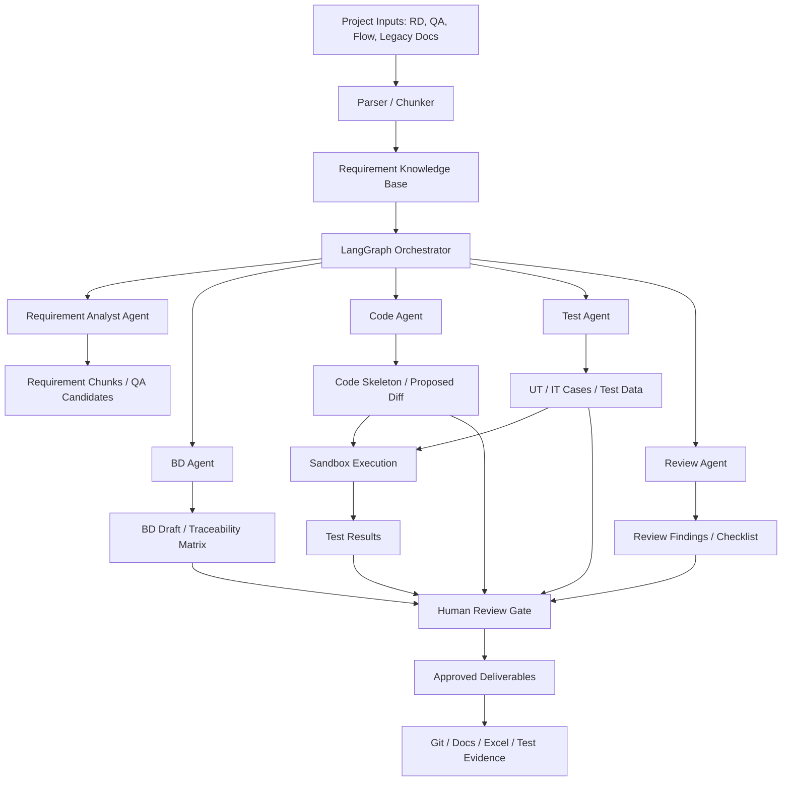

# AI Delivery Harness Plan for Electric Utility Call System Modernization

## 1. Purpose

This document defines a project plan for implementing an **AI Delivery Harness** to support a customer project for modernizing an electric utility call system.

The Harness is not a generic chatbot and not only an AI coding assistant. It is a controlled delivery layer that supports the lifecycle from **Basic Design (BD)** to **coding**, **unit test**, and **integration test (IT)** while preserving traceability, quality gates, human approval, and test evidence.

Target lifecycle:

```text
Requirement / RD / QA / Business Flow
→ Traceable Requirement Knowledge Base
→ Basic Design
→ Coding Draft / Code Skeleton
→ Unit Test
→ Integration Test
→ Review / Evidence
```

Core objective:

```text
Use AI to accelerate delivery without losing requirement traceability, review control, test evidence, or customer-facing quality.
```

---

## 2. Background

The team does not currently have a dedicated Linux server for deploying enterprise-grade agent Harness systems that depend on Docker, iptables, and isolated local networks. Therefore, the practical implementation direction is to build a lightweight internal Harness using:

- **LangGraph** as the orchestration layer.
- **Shared State / Blackboard** as the delivery state layer.
- **Cloud Sandbox or WebAssembly Sandbox** as the safe execution layer.
- **Human-in-the-Loop gates** as the approval and governance layer.
- **Git / Markdown / Excel-compatible outputs** as the delivery artifact layer.

This approach avoids unsafe local execution on Windows/macOS machines while still allowing the team to build a useful multi-agent delivery system quickly.

---

## 3. Project Positioning

Recommended project name:

```text
AI-assisted Delivery Harness for Electric Utility Call System Modernization
```

Short definition:

```text
A controlled AI orchestration layer that links requirement chunks, BD items, code drafts, test cases, test results, and review evidence across the delivery lifecycle.
```

This Harness should be positioned as a **delivery control system**, not as a fully autonomous developer.

It must help the team answer these questions:

1. Which requirement does this BD item come from?
2. Which BD item does this code implement?
3. Which test case verifies this requirement or BD item?
4. Which evidence proves that the implementation passed testing?
5. Which outputs were reviewed and approved by humans?

---

## 4. Scope

## 4.1 In Scope

The Harness supports the following phases:

| Phase | Harness Support |
|---|---|
| Requirement / RD | Chunking, labeling, provenance, QA extraction |
| BD | Draft generation, consistency check, traceability matrix |
| Coding | Code skeleton, implementation draft, proposed diff |
| Unit Test | UT case generation, UT code generation, mock data |
| Integration Test | IT scenario, API/IF test case, expected result, evidence template |
| Review | Human approval, finding list, delivery checklist |

## 4.2 Out of Scope for MVP

The MVP must not include:

- Fully autonomous final BD generation.
- AI direct write to the main source branch.
- AI auto-merge.
- AI direct shell execution on the host machine.
- Direct production system access.
- Use of real sensitive customer data without masking.
- Full enterprise RBAC.
- Full audit dashboard.
- Custom Linux/Docker sandbox implementation.

---

## 5. Core Architecture



Architecture layers:

| Layer | Role |
|---|---|
| Input Layer | RD, QA, flow, legacy spec, customer comments |
| Knowledge Layer | RKB, ontology labels, traceability metadata |
| Orchestration Layer | LangGraph stateful workflow |
| Agent Layer | Requirement, BD, Code, Test, Review agents |
| Execution Layer | E2B, Modal, or WebAssembly sandbox |
| Governance Layer | HITL approval, review logs, quality gates |
| Output Layer | BD draft, code draft, test cases, evidence |

---

## 6. Traceability Model

Traceability is the most important capability of this Harness.

Required trace chain:

```text
Source Document
→ Requirement Chunk
→ RKB Item
→ BD Item
→ Code Unit
→ UT Case
→ IT Scenario
→ Test Evidence
```

Each artifact must carry stable IDs:

| Artifact | Example ID |
|---|---|
| Requirement chunk | REQ-CHUNK-0001 |
| RKB item | RKB-0001 |
| BD item | BD-API-0001 |
| Code unit | CODE-SVC-0001 |
| Unit test | UT-0001 |
| Integration test | IT-0001 |
| Evidence | EV-0001 |

Minimum traceability rule:

```text
No BD without requirement source.
No code without approved BD.
No test case without BD or requirement mapping.
No customer-facing evidence without human review.
```

---

## 7. Agent Design

## 7.1 Requirement Analyst Agent

Purpose:

- Read RD, QA, flow, and legacy notes.
- Convert project input into traceable requirement chunks.
- Detect ambiguous or unresolved statements.
- Suggest QA items for customer confirmation.

Output:

```json
{
  "requirement_id": "REQ-001",
  "source": "QA票.xlsx!QA!B12:H18",
  "label": "BUSINESS_RULE",
  "status": "confirmed",
  "content": "...",
  "open_questions": []
}
```

## 7.2 BD Agent

Purpose:

- Generate BD draft sections from approved RKB items.
- Create screen/API/DB/batch/IF design draft.
- Maintain mapping from BD item to requirement source.
- Generate BD review checklist.

Output:

```json
{
  "bd_id": "BD-API-001",
  "source_requirements": ["REQ-001", "REQ-002"],
  "draft_section": "...",
  "review_points": ["..."],
  "open_questions": []
}
```

## 7.3 Code Agent

Purpose:

- Generate code skeleton or implementation draft from approved BD.
- Follow project coding standard.
- Generate proposed diff only.
- Never write directly to the real source branch without approval.

Output:

```json
{
  "code_unit_id": "CODE-SVC-001",
  "source_bd": "BD-API-001",
  "files": {
    "CallHistoryService.java": "..."
  },
  "risk_note": "Need DB schema confirmation"
}
```

## 7.4 Test Agent

Purpose:

- Generate UT cases from BD and code.
- Generate IT scenarios from business flow and interface design.
- Generate mock data and expected results.
- Map test cases back to BD and requirement chunks.

Output:

```json
{
  "test_id": "UT-001",
  "source_bd": "BD-API-001",
  "source_code": "CODE-SVC-001",
  "condition": "...",
  "expected_result": "...",
  "test_data": "..."
}
```

## 7.5 Review Agent

Purpose:

- Check consistency between requirement, BD, code, and test.
- Detect traceability gaps.
- Detect missing expected results.
- Generate review findings for human reviewers.

Output:

```json
{
  "finding_id": "RV-001",
  "severity": "high",
  "target": "BD-API-001",
  "issue": "API response field is not mapped to any requirement",
  "recommendation": "Confirm whether customer_id should be included"
}
```

---

## 8. Shared State / Blackboard

LangGraph should use one shared state object instead of making agents exchange long chat histories.

Recommended state schema:

```python
class DeliveryHarnessState(TypedDict):
    project_id: str
    phase: Literal["BD", "CODING", "UT", "IT", "REVIEW"]
    task_description: str

    requirement_chunks: list[dict]
    rkb_items: list[dict]
    bd_items: list[dict]
    code_files: dict[str, str]
    test_cases: list[dict]
    test_results: list[dict]

    traceability_matrix: list[dict]
    open_questions: list[dict]
    review_findings: list[dict]

    approval_required: bool
    approval_status: Literal["pending", "approved", "rejected", "not_required"]

    final_output: dict
```

---

## 9. Human-in-the-Loop Gates

Human approval is mandatory at the following gates.

## Gate 1: Requirement Confirmation

Triggered when the input contains ambiguous phrases such as:

```text
必要に応じて
別途確認
現行通り
原則
可能な限り
後続工程で調整
```

Action:

- Create QA candidate.
- Do not promote the item to approved RKB fact.

## Gate 2: BD Approval

Triggered before BD is used for coding.

Action:

- SE/BA reviews BD draft.
- Approved BD receives stable `BD-*` ID.

## Gate 3: Code Write Approval

Triggered when the Code Agent proposes a file change.

Action:

- Show proposed diff.
- Show source BD and test result.
- Human approves, rejects, or requests changes.

## Gate 4: Test Evidence Approval

Triggered before evidence is stored as final project evidence.

Action:

- Reviewer checks test result, expected result, and traceability.

## Gate 5: Customer-Facing Document Approval

Triggered before sending BD, QA, test report, or evidence to customer.

Action:

- Project lead or responsible SE approves manually.

---

## 10. Sandbox Strategy

The Harness must not run untrusted AI-generated code directly on Windows/macOS host machines.

Allowed execution options:

| Option | Use Case | Notes |
|---|---|---|
| E2B Cloud Sandbox | Fast MVP, broader runtime support | Requires cloud policy check |
| Modal Sandbox | Cloud execution alternative | Requires account and setup |
| LangChain Sandbox / Wasm | Local safe execution | Runtime and package support are limited |

Sandbox rules:

```text
No host shell execution.
No direct access to .env or secrets.
No unrestricted file system access.
Timeout is mandatory.
Network access should be disabled or restricted by default.
All stdout/stderr must be logged.
```

---

## 11. Implementation Plan

## Phase 0: Project Setup

Duration: 0.5–1 day

Tasks:

- Create or update project repository.
- Confirm folder structure.
- Define naming convention.
- Define state schema.
- Define traceability rule.
- Define HITL rule.
- Select sandbox backend.

Deliverables:

- Project charter.
- Architecture overview.
- Security policy.
- Traceability rule.
- State schema.
- Tool contract.

Exit criteria:

- Team agrees on Harness scope.
- Repo structure is ready.
- AI write restrictions are clear.

## Phase 1: BD Support MVP

Duration: 2–4 days

Tasks:

- Parse RD/QA/flow inputs.
- Build traceable chunks.
- Label ontology.
- Generate BD draft.
- Generate RD-to-BD traceability matrix.
- Generate QA candidate list.
- Generate review checklist.

Deliverables:

- Requirement chunk list.
- RKB items.
- BD draft.
- Traceability matrix.
- QA list.
- Review checklist.

Exit criteria:

- BD draft can be traced to source requirement chunks.
- Ambiguous items are not treated as confirmed facts.
- Human reviewer can approve BD items.

## Phase 2: Coding Support MVP

Duration: 2–3 days

Tasks:

- Read approved BD items.
- Generate code skeleton.
- Generate implementation draft.
- Generate proposed diff.
- Check coding standard.
- Require approval before writing files.

Deliverables:

- Code skeleton.
- Implementation draft.
- Proposed diff.
- Code review checklist.

Exit criteria:

- Code draft maps to approved BD.
- No code is written to the real workspace without approval.
- Human reviewer can reject or request changes.

## Phase 3: Unit Test Support MVP

Duration: 2–3 days

Tasks:

- Generate UT cases from BD and code.
- Generate UT code.
- Generate mock data.
- Generate expected result.
- Run test in sandbox or controlled test environment.
- Save test result.

Deliverables:

- UT case list.
- UT code.
- Mock data.
- Expected result.
- UT result.
- Coverage map.

Exit criteria:

- Critical code units have UT cases.
- UT cases trace back to BD.
- Test result is stored as evidence candidate.

## Phase 4: Integration Test Support

Duration: 3–5 days

Tasks:

- Read business flow, API design, IF design, and DB design.
- Generate IT scenarios.
- Generate API/IF test cases.
- Generate test data.
- Generate expected result.
- Map IT cases back to requirements and BD.

Deliverables:

- IT scenario list.
- API/IF test cases.
- E2E business flow test cases.
- Test data.
- Expected result.
- IT evidence template.

Exit criteria:

- Critical requirements have IT scenarios.
- IT cases have clear expected results.
- Requirement → BD → Code → IT mapping exists.

## Phase 5: Review and Delivery Evidence

Duration: Continuous

Tasks:

- Check traceability gaps.
- Check BD-code-test consistency.
- Generate review findings.
- Generate defect candidates.
- Generate delivery checklist.
- Consolidate evidence.

Deliverables:

- Review finding list.
- Traceability gap report.
- Test evidence.
- Delivery checklist.
- Customer review package.

Exit criteria:

- No high-severity traceability gap remains.
- Critical requirements are covered by BD and tests.
- Customer-facing documents are human-approved.

---

## 12. 48-Hour Core Build Plan

The first 48 hours should only build the Harness core.

## Day 1: Orchestration and Sandbox

Tasks:

- Implement LangGraph shared state.
- Implement graph nodes.
- Implement Planner/Coder Agent.
- Implement Tester/Verifier Agent.
- Integrate sandbox tool.
- Run one simple code-generation-and-test flow.

Expected demo:

```text
User task
→ Agent creates code
→ Agent creates test
→ Sandbox runs test
→ State stores result
```

## Day 2: HITL and Interface

Tasks:

- Implement Human-in-the-Loop approval gate.
- Add CLI or chat listener.
- Add proposed file change flow.
- Add approval / reject / request changes.
- Add run logs.
- Prepare demo and runbook.

Expected demo:

```text
Approved BD item
→ Code draft
→ Test generation
→ Sandbox test
→ Proposed diff
→ Human approval
→ Write to workspace
```

---

## 13. Repository Structure Extension

Recommended additions to this repository:

```text
bd-chunk-project/
  docs/
    ai_delivery_harness_plan.md
    harness_architecture.md
    harness_security_policy.md
    harness_state_schema.md
    harness_traceability_rule.md

  src/bd_chunk/
    harness/
      __init__.py
      state.py
      workflow.py
      nodes.py
      agents/
        requirement_analyst.py
        bd_agent.py
        code_agent.py
        test_agent.py
        review_agent.py
      tools/
        sandbox.py
        approval.py
        file_writer.py
      integrations/
        cli.py
        chat_listener.py

  tests/
    test_harness_workflow.py
    test_harness_traceability.py
    test_harness_approval.py
    test_harness_sandbox.py
```

---

## 14. MVP Acceptance Criteria

The Harness MVP is accepted when:

1. It can read or receive a requirement/BD-related task.
2. It can maintain shared state across agents.
3. It can generate BD/code/test draft artifacts.
4. It can run generated test code in a sandbox or controlled environment.
5. It can block file writes until human approval.
6. It can preserve traceability from requirement to BD, code, and test.
7. It can generate review findings or open questions.
8. It can export evidence or evidence candidates.
9. It can run on Windows/macOS without requiring local Docker/Linux server.
10. It has a documented security policy and operation runbook.

---

## 15. Quality Gates

| Gate | Condition | Required Action |
|---|---|---|
| Source gate | Source file has no provenance | Reject chunk |
| RKB gate | Requirement is ambiguous | Send to QA list |
| BD gate | BD has no source requirement | Reject BD item |
| Coding gate | Code has no approved BD | Reject code generation |
| Sandbox gate | Test execution fails or times out | Return to agent or human review |
| Approval gate | File write requested | Require human approval |
| Evidence gate | Test result lacks expected result | Reject evidence |
| Customer gate | Customer-facing artifact | Require final human approval |

---

## 16. KPI

| KPI | Target |
|---|---|
| RD to BD traceability coverage | >= 90% |
| Critical requirement IT coverage | >= 90% |
| BD draft creation time | 30–50% reduction |
| Test case draft creation time | 30–40% reduction |
| Requirement ambiguity detection | Increase early detection |
| Human review rejection rate | Track and reduce over time |
| Code draft acceptance rate | Track by module |
| Evidence completeness | >= 95% |

---

## 17. Risk and Mitigation

| Risk | Impact | Mitigation |
|---|---|---|
| Customer data cannot be sent to cloud sandbox | High | Use local Wasm sandbox or masked data |
| Wasm sandbox cannot run project dependencies | Medium | Limit MVP to logic-level tests or use approved cloud sandbox |
| AI invents business rules | High | Force source citation and QA gate |
| AI-generated code overwrites real files | High | Use proposed diff and HITL approval only |
| Traceability becomes incomplete | High | Reject artifacts without mapping |
| Team treats AI output as final | High | Define AI output as draft only |
| Chat integration delays MVP | Medium | Use CLI as fallback |
| Test evidence is insufficient for customer review | High | Add evidence template and human evidence gate |

---

## 18. Operating Rule

The Harness must follow this delivery rule:

```text
AI may draft.
AI may test in sandbox.
AI may propose.
AI may summarize.
AI may detect gaps.

AI must not approve.
AI must not decide unresolved business rules.
AI must not write to real project files without human approval.
AI must not send customer-facing documents directly.
AI must not execute untrusted code on host machines.
```

---

## 19. Recommended Next Step

The next implementation step should be to add a small Harness skeleton under:

```text
src/bd_chunk/harness/
```

Start with these files:

```text
state.py
workflow.py
nodes.py
tools/approval.py
tools/sandbox.py
integrations/cli.py
```

First pilot module should be small and traceable, for example:

```text
Call history search
```

Pilot output should prove this chain:

```text
RD/QA chunk
→ BD draft
→ Code skeleton
→ UT case
→ Sandbox result
→ Review finding
→ Evidence candidate
```

---

## 20. Summary

This Harness should extend the current BD chunking project from a requirement-to-BD pipeline into a controlled delivery pipeline:

```text
Requirement Knowledge Base
→ BD Mapping
→ Coding Draft
→ Unit Test
→ Integration Test
→ Evidence
```

The key value is not only faster coding. The key value is maintaining control across the full delivery lifecycle for a high-risk customer project:

- Traceability
- Human approval
- Sandbox safety
- Review quality
- Test evidence
- Customer-facing reliability
