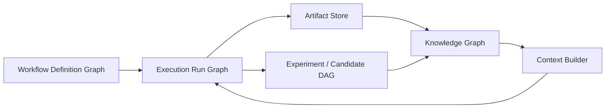

# Graph Engineering Components for Harness

## Scope

This note extracts reusable components from the independently compiled document:

> *Andrej Karpathy — From 1 Loop to 1,000 Agents: The Graph Engineering Manual*

The document is used as a synthesis aid. It is not treated as an official Karpathy or Anthropic publication, and its cross-source conclusions are not automatically adopted as Harness architecture.

## 1. Ratchet Execution Loop

### Problem solved

A long-running agent needs a controlled way to propose changes, evaluate results and preserve only improvements.

### Canonical shape

```text
Inspect
→ Propose one bounded change
→ Execute
→ Measure
→ Keep or revert
→ Record lineage
→ Continue or stop
```

### Harness mapping

- Orchestrator owns loop state.
- Agent proposes a candidate action.
- Executor applies the candidate in a sandbox or controlled workspace.
- Evaluator returns structured metrics and pass/fail evidence.
- Artifact service versions accepted outputs.
- Runtime records rejected candidates rather than silently discarding history.

### Required controls

- bounded iteration count;
- token, cost and time budget;
- deterministic evaluation where possible;
- idempotency key per candidate;
- checkpoint before mutation;
- explicit keep/revert decision;
- human escalation when confidence or impact crosses a threshold.

## 2. Execution DAG

### Problem solved

Sequential branches and pull-request-style coordination become inefficient when many agents explore alternatives concurrently.

### Core model

```text
Experiment node
├── parent references
├── input artifact versions
├── agent and model version
├── execution configuration
├── output artifacts
├── metrics
└── status
```

Edges represent lineage and dependency rather than only source-control branches.

### Harness mapping

The execution DAG should support:

- parent/child lineage;
- fan-out and fan-in;
- leaf/frontier discovery;
- duplicate candidate detection;
- candidate promotion;
- cancellation of dominated branches;
- graph traversal for audit and replay.

### Boundary

The execution DAG is not the same thing as:

- the workflow-definition graph;
- a knowledge graph;
- the Git commit graph.

These graphs may reference each other but must have separate schemas and lifecycle rules.

## 3. Knowledge Graph Memory

### Problem solved

A transcript, summary file or vector store alone does not reliably preserve entity identity, relationships, provenance and change history across many agents.

### Core pipeline

```text
Artifacts and text
→ entity extraction
→ entity resolution
→ relation construction
→ provenance attachment
→ graph storage
→ subgraph retrieval
→ context assembly
```

### Suggested node types for BD Harness

- Requirement
- Business Rule
- Screen
- API
- Data Entity
- Table
- Batch
- Interface
- Artifact
- Artifact Version
- Decision
- Review Finding
- Actor
- Agent
- Tool
- Metric

### Suggested edges

- `DERIVED_FROM`
- `IMPLEMENTS`
- `DEPENDS_ON`
- `CONFLICTS_WITH`
- `VALIDATED_BY`
- `REVIEWED_BY`
- `GENERATED_BY`
- `SUPERSEDES`
- `REFERENCES`
- `AFFECTS`

### Required properties

Every extracted fact should preserve:

- source artifact and version;
- exact evidence location when available;
- extraction method;
- confidence;
- created and superseded timestamps;
- responsible agent/tool version.

### Boundary

Calling the knowledge graph a universal “shared memory layer” is an architectural interpretation. The Harness may combine it with:

- artifact storage;
- relational runtime state;
- vector retrieval;
- cache;
- event log.

## 4. Dynamic Workflow

### Problem solved

Some tasks cannot be fully decomposed before execution because the number and type of sub-tasks depend on discovered evidence.

### Pattern

```text
Goal and policy
→ planner/compiler
→ runtime-generated execution plan
→ fresh-context workers
→ aggregation and evaluation
→ plan revision when needed
```

### Harness mapping

A dynamic workflow definition should still enforce:

- an allowed node catalogue;
- tool and data-access policy;
- maximum fan-out;
- budget and timeout;
- typed input/output contracts;
- review gates;
- auditability of the generated plan.

Dynamic generation must not mean unconstrained execution.

## 5. Workflow Patterns

Reusable patterns include:

1. Prompt chaining
2. Routing
3. Parallelization
4. Orchestrator–workers
5. Evaluator–optimizer

These patterns belong in the component library because several learning days and BD workflows reuse them.

## 6. Relationship Between the Graphs



- **Workflow Definition Graph:** intended process and control flow.
- **Execution Run Graph:** actual runtime instances, retries and state transitions.
- **Experiment DAG:** alternative candidate lineage and evaluation history.
- **Knowledge Graph:** domain facts, relationships and provenance.

## 7. Integration With the Existing Learning Path

The current learning path remains unchanged.

After Day 3, future day documents may link to the following components when relevant:

| Component | Use when studying |
|---|---|
| Workflow patterns | orchestration and workflow design |
| Ratchet execution loop | iterative agent improvement and evaluation |
| Execution DAG | parallel multi-agent exploration |
| Knowledge graph memory | persistent, provenance-grounded context |
| Dynamic workflow | runtime decomposition and worker generation |

The learning path controls sequence. This component note supplies reusable depth.

## 8. Adoption Status

| Concept | Status for BD Harness |
|---|---|
| Workflow patterns | Adopt |
| Ratchet loop | Adopt selectively for bounded iterative tasks |
| Execution DAG | Adopt as target architecture; implement incrementally |
| Knowledge graph | Evaluate through a focused BD traceability PoC |
| Dynamic workflow | Defer unrestricted generation; begin with policy-constrained templates |
| “Graph Runtime” as one unified product concept | Architectural hypothesis, not source-backed standard |
