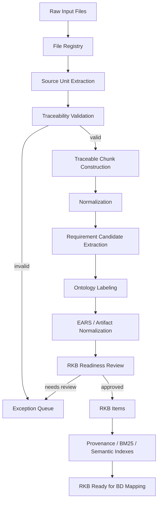
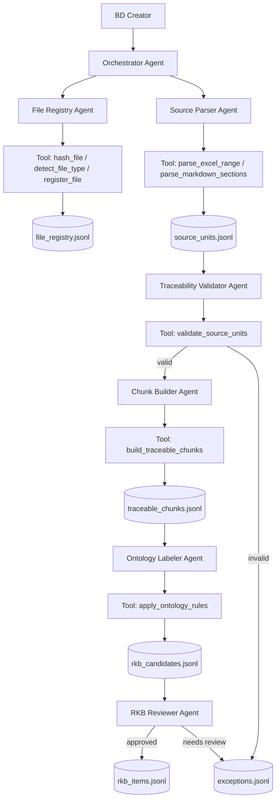

# BD Chunk Project Methodology

> Complete methodology for building a traceable Requirement Knowledge Base (RKB) from raw requirement inputs, using deterministic tools, controlled ontology, agents, skills, and validation gates before BD mapping.

---

## 0. Executive Summary

This project is not a generic RAG chatbot.

It is a controlled methodology and implementation architecture for transforming raw project artifacts into a traceable Requirement Knowledge Base, then using that RKB as the trusted input for Basic Design (BD / 基本設計) mapping and generation.

Core pipeline:

```text
Raw RD / QA / Legacy Inputs
→ File Registry
→ Source Units
→ Traceable Chunks
→ Normalized Requirement Candidates
→ Ontology-Labeled RKB Items
→ RKB Ready
→ Retrieval / BD Mapping
→ BD Patch Generation
```

The key rule:

```text
Raw files must never go directly into BD generation.
Raw files must first become traceable, validated, ontology-labeled RKB items.
```

The methodology is built around five principles:

```text
1. Provenance first
2. Deterministic tools before AI interpretation
3. Controlled ontology instead of free-form labels
4. Human review for risky or ambiguous items
5. Agent/Skill Factory for scalable deployment
```

---

## 1. Project Context

The target use case is enterprise SI / Japanese system development where project teams need to produce Basic Design documents from mixed requirement sources.

Typical inputs:

```text
- RD / 要件定義書
- QA票 Excel
- 業務フロー
- Legacy specifications
- Meeting notes
- Existing BD templates
- Existing DB/API/screen design references
```

Target output before BD mapping:

```text
- file_registry.jsonl
- source_units.jsonl
- traceable_chunks.jsonl
- rkb_candidates.jsonl
- rkb_items.jsonl
- provenance_index.jsonl
- keyword_index.jsonl
- semantic_index_manifest.jsonl
- exceptions.jsonl
```

Target output after BD mapping:

```text
- bd_mapping.jsonl
- bd_patch_ja.md
- review summary
```

This methodology covers the process **up to RKB-ready** and includes the agent/skill architecture needed to scale the process.

---

## 2. Core Concepts

### 2.1 RD

```text
RD = Requirement Definition / 要件定義
```

RD is usually the highest-authority requirement source.

### 2.2 BD

```text
BD = Basic Design / 基本設計
```

BD usually contains:

```text
- screen behavior
- API behavior
- DB design
- batch processing
- external interface
- validation rules
- business rules
- exception handling
- state transitions
```

### 2.3 Source Pool

The Source Pool is the intermediate layer between raw files and RKB.

```text
Raw Files
→ Source Pool
→ Requirement Knowledge Base
```

Source Pool contains:

```text
- parsed source units
- traceable chunks
- raw text with provenance
- classified but not necessarily approved content
```

### 2.4 RKB

```text
RKB = Requirement Knowledge Base
```

Definition:

```text
A traceable, structured knowledge base of approved and reviewable requirements,
consolidated from RD, QA, Legacy, and human decisions,
used as the source of truth for downstream BD mapping.
```

### 2.5 Chunk

A chunk is not just a piece of text.

```text
Chunk = text + source metadata + provenance + content hash + lifecycle status
```

Example source:

```text
qa_keshikomi.xlsx / QA票!B13:E13
```

### 2.6 Index

Indexing means building lookup structures.

Types of index used in this project:

```text
- file registry index
- provenance index
- keyword / BM25 index
- semantic / vector-ready index
- BD mapping index
```

### 2.7 BM25

BM25 is keyword ranking. It is useful for exact Japanese terms, field names, status names, codes, and IDs.

Examples:

```text
取引先コード
請求番号
消込済
別途確認
未定
RKB-KESHI-001
BD-RULE-001
HTTP 500
```

Important:

```text
BM25 retrieves candidate items.
BM25 does not decide BD mapping.
```

### 2.8 Vector / Semantic Index

Vector search is used for semantic similarity.

Example:

```text
金額不一致 ≈ 差額あり
```

Semantic index is useful when wording differs but meaning is close.

Important:

```text
Vector search helps find relevant content.
It does not replace provenance, ontology, or validation.
```

### 2.9 Ontology

Ontology is the controlled semantic model.

```text
Ontology = controlled labels + relationships + mapping rules
```

In this project, ontology answers:

```text
- What source type is this?
- What requirement type is this?
- What business domain does it belong to?
- What artifacts/entities does it affect?
- Is it pending, inferred, conflicting, or safe?
- Which BD frame is it likely to map to later?
```

Short distinction:

```text
Index = where/how to find data.
Vector = semantic similarity.
Ontology = structured meaning.
Validator = trust boundary.
```

---

## 3. End-to-End Methodology

Overall flow:

```text
1. Raw Input Registration
2. Source Unit Extraction
3. Traceability Validation
4. Traceable Chunk Construction
5. Normalization
6. Requirement Candidate Extraction
7. Ontology Labeling
8. EARS / Artifact Normalization
9. RKB Readiness Review
10. Index Preparation
11. RKB Ready for BD Mapping
```

Mermaid overview:



---

## 4. Design Principles

### 4.1 Provenance First

Every item must be traceable to the original source.

For Excel:

```text
workbook_name
workbook_sha256
sheet_name
range_a1
source_granularity = row_range | block_range | cell_range_optional
```

For Word / Markdown:

```text
document_name
document_sha256
heading_path
paragraph_index or line_range
```

For PDF:

```text
file_name
file_sha256
page_number
text_block_id or bbox_optional
```

If provenance is missing:

```text
Do not enter RKB.
Write to exceptions.jsonl.
```

### 4.2 Deterministic Parser Before AI

Correct:

```text
openpyxl reads workbook/sheet/range
→ source unit contains QA票!B12:E12
→ LLM may classify or normalize text later
```

Incorrect:

```text
convert Excel to Markdown
→ ask LLM to guess original range
→ store guessed range in RKB
```

Forbidden:

```text
LLM must not infer workbook name, sheet name, range_a1, file hash, chunk_id, or rkb_id.
```

### 4.3 Chunk by Business Boundary

Do not chunk only by token size.

Priority order:

```text
1. Source structure
2. Business boundary
3. Requirement behavior boundary
4. Token budget
```

Examples:

```text
One Excel QA row describing one rule = one source unit / one chunk.
One RD section describing one screen behavior = one chunk.
One large RD section with multiple behaviors = split into multiple candidate chunks.
```

### 4.4 Parent-Child Hierarchy

Store hierarchy:

```text
Document
→ Section / Sheet
→ Table / Block
→ Row / Paragraph
→ Optional Cell / Sentence
```

For Excel:

```text
workbook → sheet → table/block → row → cell_optional
```

For RD documents:

```text
document → heading → subsection → paragraph/block → sentence_optional
```

### 4.5 Separate Text Fields

Do not use one text field for everything.

Use:

```text
raw_text           = exact parsed source text
normalized_text    = cleaned text preserving meaning
contextual_text    = enriched text for search only
requirement_text   = EARS/RKB-ready requirement statement
```

Important:

```text
contextual_text improves retrieval.
It must not create new facts.
Only raw_text + source are ground truth.
```

---

## 5. Chunking Lifecycle

Lifecycle status:

```text
RAW_REGISTERED
→ PARSED_TO_SOURCE_UNIT
→ SOURCE_VALIDATED
→ CHUNKED
→ NORMALIZED
→ CLASSIFIED
→ ONTOLOGY_LABELED
→ RKB_CANDIDATE
→ RKB_READY
```

If any gate fails:

```text
→ EXCEPTION_QUEUE
```

Review statuses:

```text
Draft
Needs_Review
Approved
Rejected
Superseded
Deprecated
```

---

## 6. Stage 1 — Raw File Registry

### 6.1 Purpose

Register every raw input file before parsing.

Output:

```text
data/index/file_registry.jsonl
```

Example:

```json
{
  "file_id": "sha256:abc123",
  "file_name": "qa_keshikomi.xlsx",
  "file_path": "data/raw/qa_keshikomi.xlsx",
  "file_type": "excel",
  "source_kind": "QA",
  "file_sha256": "abc123",
  "ingested_at": "2026-06-27T10:00:00+09:00",
  "parser_hint": "openpyxl",
  "status": "RAW_REGISTERED"
}
```

Source kind enum:

```text
RD
QA
LEGACY
MEETING_NOTE
BUSINESS_FLOW
EXISTING_BD
TECHNICAL_NOTE
UNKNOWN
```

---

## 7. Stage 2 — Source Unit Extraction

A source unit is the smallest deterministic unit parsed from raw input with source location.

```text
Source Unit = raw text + deterministic source locator
```

Output:

```text
data/outputs/source_units.jsonl
```

A source unit is not always a final requirement.

---

## 8. Excel Chunking Strategy

Excel is the highest priority source for MVP because QA sheets often contain requirement clarifications.

Hierarchy:

```text
Workbook
→ Sheet
→ Logical table/block
→ Row
→ Cell optional
```

Default rule:

```text
1 non-empty business row = 1 source unit
```

Example:

```json
{
  "unit_id": "SRC-QA-00013",
  "file_id": "sha256:abc123",
  "source_type": "excel",
  "raw_text": "差額あり | 金額が不一致 | 手動確認一覧に表示 | 差額理由を確認",
  "source": {
    "workbook_name": "qa_keshikomi.xlsx",
    "workbook_sha256": "abc123",
    "sheet_name": "QA票",
    "range_a1": "QA票!B13:E13",
    "source_granularity": "row_range"
  },
  "status": "PARSED_TO_SOURCE_UNIT"
}
```

Use block-level chunking when a table section spans multiple rows and one row alone is not meaningful.

Example:

```text
QA票!B20:H30 = decision table for clearing result
```

Cell-level trace is optional for MVP. Use it only for:

```text
- high-risk fields
- debugging
- conflicting cells
- generated BD wording validation
```

MVP quality bar:

```text
100% Excel-derived chunks traceable to workbook / sheet / row-range or block-range.
```

Excel parser should capture warnings:

```text
merged_cells_detected
hidden_rows_detected
hidden_columns_detected
formula_cells_detected
empty_required_columns
multi_behavior_row
```

---

## 9. Word / Markdown / PDF Chunking Strategy

### 9.1 Word / Markdown

Hierarchy:

```text
Document
→ Heading path
→ Section block
→ Paragraph
→ Sentence optional
```

Default rule:

```text
1 heading section or paragraph block = 1 source unit
```

Split further if the block contains multiple independent system behaviors.

Example:

```json
{
  "unit_id": "SRC-RD-003-002",
  "file_id": "sha256:rd999",
  "source_type": "markdown",
  "raw_text": "ユーザーが申請を送信した場合、システムは入力項目をチェックし、不備がなければ申請ステータスを承認待ちに更新する。",
  "source": {
    "document_name": "RD_v1.md",
    "document_sha256": "rd999",
    "heading_path": "3. 申請登録 > 3.2 登録処理",
    "line_range": "L120-L128",
    "source_granularity": "section_block"
  }
}
```

### 9.2 PDF

PDF is lower priority because precise layout extraction is harder.

Use PDF only when text extraction and page provenance are reliable.

Required provenance:

```text
file_name
file_sha256
page_number
text_block_id or line_range if available
```

If PDF contains tables or diagrams:

```text
needs_manual_review = true
```

Do not use OCR-derived text as high-authority source unless reviewed.

---

## 10. Traceable Chunk Construction

A traceable chunk is a validated source unit transformed into a cleaner business chunk.

```text
Traceable Chunk = source unit + normalized text + content hash + provenance
```

Output:

```text
data/outputs/traceable_chunks.jsonl
```

Example:

```json
{
  "chunk_id": "CHK-KESHI-001",
  "source_unit_ids": ["SRC-QA-00013"],
  "raw_text": "差額あり | 金額が不一致 | 手動確認一覧に表示 | 差額理由を確認",
  "normalized_text_ja": "金額が不一致の場合、対象明細を手動確認一覧に表示し、差額理由を確認する。",
  "content_hash": "sha256:def456",
  "source": {
    "workbook_name": "qa_keshikomi.xlsx",
    "workbook_sha256": "abc123",
    "sheet_name": "QA票",
    "range_a1": "QA票!B13:E13",
    "source_granularity": "row_range"
  },
  "status": "CHUNKED"
}
```

Chunk ID strategy:

```text
chunk_id = CHK-<domain_or_file_hint>-<short_hash>
short_hash = hash(file_id + source_locator + normalized_text)
```

---

## 11. Normalization Rules

Allowed normalization:

```text
- trim whitespace
- join row cells with separators
- remove duplicated headers
- normalize Japanese punctuation
- preserve domain terms
- rewrite fragmented table text into one readable sentence
```

Forbidden normalization:

```text
- add new business conditions
- infer missing status
- turn pending into confirmed requirement
- remove source uncertainty
- merge unrelated behaviors into one fact
```

Ambiguity terms:

```text
別途確認
未定
必要に応じて
適切に
原則として
できるだけ
なるべく
いい感じに
柔軟に
```

If detected:

```json
{
  "ambiguity_flags": ["別途確認"],
  "review_required": true,
  "allow_rkb_ready": false
}
```

---

## 12. Requirement Candidate Extraction

Extract only actionable system behavior.

Good:

```text
金額が不一致の場合、システムは対象明細を手動確認一覧に表示する。
```

Bad:

```text
ユーザーが使いやすいようにする。
```

Candidate types:

```text
SYSTEM_BEHAVIOR
BUSINESS_RULE
VALIDATION
EXCEPTION
STATE_TRANSITION
DATA_DEFINITION
REFERENCE_ONLY
PENDING_DECISION
NOT_REQUIREMENT
```

If one source unit contains multiple behaviors, split into multiple candidates but keep the same source reference.

---

## 13. Ontology Labeling

Ontology labeling determines what the chunk means and whether it is eligible for RKB.

Attach:

```text
source_label
requirement_type
ears_type
domain
business_entities
affected_artifacts
target_bd_frame_hint
```

Example:

```json
{
  "source_label": "QA_CLARIFICATION",
  "authority_rank": 2,
  "requirement_type": "EXCEPTION_RULE",
  "ears_type": "Complex",
  "domain": "売掛金消込",
  "business_entities": ["Payment", "Invoice"],
  "affected_artifacts": ["ManualReviewList"],
  "target_bd_frame_hint": "BD-EXCEPTION-001"
}
```

Source labels:

```text
RD_FACT
QA_CLARIFICATION
QA_ADDITION
PENDING_DECISION
LEGACY_REFERENCE
TECHNICAL_INFERENCE
```

Requirement types:

```text
BUSINESS_RULE
VALIDATION_RULE
SCREEN_BEHAVIOR
API_BEHAVIOR
BATCH_PROCESS
EXCEPTION_RULE
STATE_TRANSITION
DATA_ITEM
AUTHORIZATION_RULE
NON_FUNCTIONAL_REQUIREMENT
INTERFACE_RULE
```

Rules:

```text
- choose only from controlled ontology YAML
- if uncertain, return NEEDS_REVIEW
- do not invent new labels
- PENDING_DECISION must not become fact
- TECHNICAL_INFERENCE must not be auto-approved
```

---

## 14. EARS and Artifact Normalization

EARS normalization is used only for behavior requirements.

Example fields:

```json
{
  "ears_type": "Complex",
  "when_trigger": "消込判定処理が売掛明細を評価する",
  "if_condition": "金額が不一致である",
  "system_name": "売掛金消込システム",
  "system_response": "対象明細を手動確認一覧に表示する"
}
```

Japanese requirement statement:

```text
消込判定処理が売掛明細を評価する時、金額が不一致の場合、売掛金消込システムは対象明細を手動確認一覧に表示する。
```

Do not force EARS for all items. Use artifact types:

```text
EARS_REQUIREMENT
DECISION_TABLE_REFERENCE
STATE_MATRIX_REFERENCE
DATA_DEFINITION
REFERENCE_ONLY
```

Decision table reference example:

```json
{
  "artifact_type": "DECISION_TABLE_REFERENCE",
  "artifact_id": "DT-KESHI-001",
  "requirement_statement_ja": "消込判定処理が入金明細を評価する時、売掛金消込システムは Decision Table DT-KESHI-001 に従って消込処理区分を判定する。",
  "source": {
    "workbook_name": "qa_keshikomi.xlsx",
    "sheet_name": "QA票",
    "range_a1": "QA票!B20:H30"
  }
}
```

---

## 15. RKB Item Creation

RKB item definition:

```text
RKB Item = traceable chunk + normalized requirement + ontology + status
```

Output:

```text
data/outputs/rkb_items.jsonl
```

Example:

```json
{
  "rkb_id": "RKB-KESHI-002",
  "chunk_id": "CHK-KESHI-002",
  "artifact_type": "EARS_REQUIREMENT",
  "raw_text_ja": "金額が不一致の場合、手動確認一覧に表示する",
  "normalized_text_ja": "金額が不一致の場合、対象明細を手動確認一覧に表示する。",
  "requirement_statement_ja": "消込判定処理が売掛明細を評価する時、金額が不一致の場合、売掛金消込システムは対象明細を手動確認一覧に表示する。",
  "ontology": {
    "source_label": "QA_CLARIFICATION",
    "authority_rank": 2,
    "requirement_type": "EXCEPTION_RULE",
    "ears_type": "Complex",
    "domain": "売掛金消込",
    "business_entities": ["Payment", "Invoice"],
    "affected_artifacts": ["ManualReviewList"],
    "target_bd_frame_hint": "BD-EXCEPTION-001"
  },
  "source": {
    "workbook_name": "qa_keshikomi.xlsx",
    "workbook_sha256": "abc123",
    "sheet_name": "QA票",
    "range_a1": "QA票!B13:E13"
  },
  "status": "Draft",
  "confidence": "high",
  "conflict_flag": false,
  "review_required": false,
  "lifecycle_status": "RKB_READY"
}
```

---

## 16. RKB Readiness Gates

A candidate can become RKB-ready only if all gates pass.

### 16.1 Provenance Gate

```text
[ ] source exists
[ ] file hash exists
[ ] source locator exists
[ ] Excel has workbook/sheet/range
[ ] range granularity is row_range or block_range
```

### 16.2 Content Gate

```text
[ ] raw_text is not empty
[ ] normalized_text is not empty
[ ] content_hash exists
[ ] not pure header/footer/noise
```

### 16.3 Semantic Gate

```text
[ ] requirement_type exists
[ ] source_label exists
[ ] artifact_type exists
[ ] if behavior requirement, requirement_statement_ja exists
```

### 16.4 Risk Gate

Block or mark Needs_Review if:

```text
[ ] PENDING_DECISION
[ ] TECHNICAL_INFERENCE
[ ] conflict_flag = true
[ ] ambiguity_flags not empty
[ ] multiple behaviors not split
[ ] low confidence
```

### 16.5 ID Integrity Gate

```text
[ ] rkb_id unique
[ ] chunk_id exists
[ ] source_unit_ids exist
[ ] no duplicate active item with same content_hash + source
```

---

## 17. Index Preparation Before BD Mapping

BD mapping should not read raw files directly.

Before BD mapping, create:

```text
data/index/file_registry.jsonl
data/outputs/source_units.jsonl
data/outputs/traceable_chunks.jsonl
data/outputs/rkb_items.jsonl
data/index/provenance_index.jsonl
data/index/keyword_index.jsonl
data/index/semantic_index_manifest.jsonl
data/outputs/exceptions.jsonl
```

### 17.1 Provenance Index

```json
{
  "rkb_id": "RKB-KESHI-002",
  "chunk_id": "CHK-KESHI-002",
  "file_id": "sha256:abc123",
  "source_ref": "qa_keshikomi.xlsx / QA票!B13:E13",
  "source_label": "QA_CLARIFICATION",
  "lifecycle_status": "RKB_READY"
}
```

### 17.2 Keyword / BM25 Index

```json
{
  "index_id": "KW-KESHI-002",
  "rkb_id": "RKB-KESHI-002",
  "text_for_keyword_index": "金額 不一致 手動確認 売掛金消込 QA_CLARIFICATION EXCEPTION_RULE",
  "keywords": ["金額不一致", "手動確認", "売掛金消込", "例外処理"]
}
```

### 17.3 Semantic Index Manifest

```json
{
  "index_id": "SEM-KESHI-002",
  "rkb_id": "RKB-KESHI-002",
  "text_for_embedding": "売掛金消込業務の例外処理。金額が不一致の場合、対象明細を手動確認一覧に表示する。",
  "embedding_status": "not_generated",
  "vector_ref": null
}
```

---

## 18. Exception Queue

All failed or risky items must be written to:

```text
data/outputs/exceptions.jsonl
```

Example:

```json
{
  "exception_id": "EXC-001",
  "source_unit_id": "SRC-QA-00021",
  "reason": "PENDING_DECISION detected",
  "raw_text": "処理方式は別途確認",
  "source_ref": "qa_keshikomi.xlsx / QA票!B21:E21",
  "recommended_action": "Human review required before RKB approval"
}
```

---

## 19. Agent Design Methodology

### 19.1 Agent is not only prompt

```text
Agent = role + mission + prompt + tool permissions + input contract + state + guardrails + output contract + escalation rules
```

Agent coordinates. Tool executes. Human approves.

```text
Agent can classify, explain, suggest, route, and summarize.
Tool must parse, hash, validate, write files, and generate deterministic IDs.
Human BD creator approves risky decisions.
```

### 19.2 Agent vs Tool vs Human

| Actor | Responsibility | Must not do |
|---|---|---|
| Agent | Decide next action, call tools, summarize, ask for review | Invent source metadata or approve risky facts alone |
| Tool | Deterministic execution: hash, parse, validate, write JSONL | Make semantic judgement without rule/config |
| Human BD Creator | Choose input, review exceptions, approve/reject labels, decide unclear cases | Manually copy all requirements if tool can extract them |

### 19.3 Agent Card

Each agent should be defined by an Agent Card:

```text
Agent Card
├─ agent name
├─ role
├─ mission
├─ input contract
├─ allowed tools
├─ forbidden actions
├─ decision rules
├─ output contract
├─ stop conditions
└─ escalation rules
```

Example:

```yaml
agent_name: ExcelSourceParserAgent
role: Parse Excel requirement/QA sheets into traceable source units.
mission: Convert registered Excel files into source_units.jsonl and preserve deterministic provenance.
inputs:
  required:
    - file_path
    - file_id
    - workbook_sha256
    - sheet_name
    - range_a1
    - source_kind
allowed_tools:
  - parse_excel_range
  - validate_source_units
  - write_jsonl
  - write_exceptions
forbidden_actions:
  - infer workbook_sha256
  - infer sheet_name
  - infer range_a1
  - classify requirement_type
  - generate RKB item
  - generate BD mapping
stop_conditions:
  - missing_sheet_name
  - missing_range_a1
  - traceability_rate_below_1
```

---

## 20. Prompt Timing

Do not put everything into one giant prompt.

Use four timing layers.

### 20.1 Agent Definition Prompt

Loaded when the agent starts.

Purpose:

```text
Define role, mission, allowed behavior, forbidden behavior, and tool discipline.
```

### 20.2 Job Prompt / Task Payload

Created every time a BD creator runs a job.

Example:

```json
{
  "task": "parse_excel_to_source_units",
  "file_path": "data/raw/qa_keshikomi.xlsx",
  "source_kind": "QA",
  "sheet_name": "QA票",
  "range_a1": "B12:E30",
  "chunking_mode": "row"
}
```

### 20.3 Tool Call

The agent calls tools with structured arguments.

```json
{
  "tool": "parse_excel_range",
  "args": {
    "file_path": "data/raw/qa_keshikomi.xlsx",
    "sheet_name": "QA票",
    "range_a1": "B12:E30",
    "chunking_mode": "row"
  }
}
```

### 20.4 Review / Repair Prompt

Used only when human action is needed.

Example:

```text
Sheet QA票 was not found.
Available sheets: QA, QA_2025, Clarification.
Please select the correct sheet.
```

---

## 21. Recommended Agent Set

Core agents:

```text
1. OrchestratorAgent
2. FileRegistryAgent
3. SourceParserAgent
4. TraceabilityValidatorAgent
5. ChunkBuilderAgent
6. OntologyLabelerAgent
7. RKBReviewerAgent
```

Flow:

```text
User / BD Creator
→ Orchestrator Agent
→ File Registry Agent
→ Source Parser Agent
→ Traceability Validator Agent
→ Chunk Builder Agent
→ Ontology Labeler Agent
→ RKB Reviewer Agent
→ RKB_READY items
```

Mermaid:



---

## 22. How the BD Creator Uses the System

The BD creator works through review-driven stages, not one giant prompt.

### Step 0 — Prepare Input

```text
- raw file
- source kind: RD / QA / LEGACY / MEETING_NOTE
- module name
- sheet name and range for Excel
- optional BD frame/template reference
```

### Step 1 — Register File

```bash
bdchunk register \
  --path data/raw/qa_keshikomi.xlsx \
  --source-kind QA
```

### Step 2 — Parse Source Units

```bash
bdchunk parse-excel \
  --path data/raw/qa_keshikomi.xlsx \
  --sheet QA票 \
  --range B12:E30 \
  --out data/outputs/source_units.jsonl
```

### Step 3 — Build Traceable Chunks

```bash
bdchunk build-chunks \
  --source-units data/outputs/source_units.jsonl \
  --out data/outputs/traceable_chunks.jsonl
```

### Step 4 — Label Ontology

```bash
bdchunk label-ontology \
  --chunks data/outputs/traceable_chunks.jsonl \
  --ontology ontology/ \
  --out data/outputs/rkb_candidates.jsonl
```

### Step 5 — RKB Readiness Review

Review table:

| ID | Source | Text | Label | Status | Action |
|---|---|---|---|---|---|
| CHK-KESHI-001 | QA票!B12:E12 | 金額一致の場合... | BUSINESS_RULE | Ready | Approve |
| CHK-KESHI-002 | QA票!B13:E13 | 金額不一致の場合... | EXCEPTION_RULE | Ready | Approve |
| CHK-KESHI-003 | QA票!B14:E14 | 別途確認 | PENDING_DECISION | Needs Review | Ask client |
| CHK-KESHI-004 | QA票!B15:E15 | 入力チェック後登録... | MULTI_BEHAVIOR | Needs Split | Split |

BD creator actions:

```text
Approve
Reject
Split
Relabel
Ask clarification
Mark pending
```

Only approved or valid draft items can become RKB-ready.

---

## 23. Agent Guardrails

Agents must never invent:

```text
file_sha256
workbook_sha256
sheet_name
range_a1
source_granularity
unit_id if not generated by deterministic rule
chunk_id if not generated by chunk builder
rkb_id if not generated by RKB builder
target_bd_frame_id if not in ontology/bd_frames.yaml
```

If required information is missing:

```text
Return NEEDS_INPUT or write to EXCEPTION_QUEUE.
Do not guess.
```

If validation fails:

```text
Stop downstream processing.
Write invalid items to exceptions.
Ask human to repair input.
```

If ontology label is uncertain:

```text
Return NEEDS_REVIEW.
Do not create a new label.
```

---

## 24. Agent / Skill Factory

Do not hand-write every agent and skill.

Use:

```text
Catalog YAML
→ Templates
→ Generator
→ Validator
→ Eval
→ Deploy
```

Factory definition:

```text
Agent/Skill Factory
= YAML spec
+ Prompt template
+ Tool permission profile
+ Generator
+ Validator
+ Eval gate
+ Deploy script
```

Distinction:

```text
Agent = runtime worker with role, mission, tools, guardrails, state, and output contract.
Skill = reusable capability package / SOP that an agent can use.
Tool = deterministic function or script that performs real work.
```

Recommendation:

```text
Agent ít, skill nhiều, tool strict.
```

---

## 25. Factory Repository Layout

Recommended layout:

```text
registry/
  agent_catalog.yaml
  skill_catalog.yaml
  tool_profiles.yaml
  deployment_targets.yaml

templates/
  agent_prompt.md.j2
  skill.md.j2
  copilot_instruction.md.j2
  eval_case.yaml.j2

scripts/
  generate_agents.py
  validate_agent_specs.py
  validate_skill_specs.py
  deploy_skills.py

agents/
  *.agent.yaml

prompts/
  *.md

.claude/skills/
  <skill-name>/SKILL.md

.github/
  copilot-instructions.md
  instructions/*.instructions.md

evals/
  *.yaml
```

---

## 26. Agent Catalog

`registry/agent_catalog.yaml` is the source of truth for agents.

Example:

```yaml
agents:
  - id: file_registry_agent
    name: FileRegistryAgent
    stage: ingest
    role: Register raw files and compute deterministic file metadata.
    mission: Convert raw file paths into file_registry records with file hash and source kind.
    prompt_template: agent_prompt.md.j2
    tool_profile: read_write_registry
    allowed_tools:
      - hash_file
      - detect_file_type
      - register_file
      - write_jsonl
    forbidden_actions:
      - infer_file_hash
      - parse_requirement
      - create_rkb_item
      - create_bd_mapping
    output_schema: FileRegistryResult
    eval_cases:
      - evals/file_registry_basic.yaml
```

---

## 27. Skill Catalog

`registry/skill_catalog.yaml` defines reusable skills.

Example:

```yaml
skills:
  - id: ingest-excel-source
    command_name: ingest-excel-source
    description: >
      Parse registered Excel QA/RD files into traceable source units.
      Use when the user asks to ingest Excel, parse QA票, or create source_units.jsonl.
    stage: ingest
    invocation: manual_or_auto
    paths:
      - "data/raw/**/*.xlsx"
      - "src/bd_chunk/ingest/**"
    allowed_tools:
      - Read
      - Bash
      - Write
    disallowed_tools:
      - WebFetch
    prompt_template: skill.md.j2
```

Guideline:

```text
Skill descriptions must be specific.
Avoid broad descriptions like "helps with BD project".
```

---

## 28. Tool Profiles

Do not assign tool permissions ad hoc.

Use `registry/tool_profiles.yaml`.

Example:

```yaml
tool_profiles:
  read_only:
    allowed:
      - Read
      - Grep
    disallowed:
      - Bash
      - Write

  parse_excel:
    allowed:
      - Read
      - Bash
      - Write
    constraints:
      - only_run_scripts_under: scripts/
      - only_write_under:
          - data/outputs/
          - data/index/

  review_only:
    allowed:
      - Read
      - Write
    disallowed:
      - Bash
```

Rule:

```text
Skill/agent does not choose tools freely.
It uses reviewed tool_profile.
```

---

## 29. Templates

Use one standard prompt template for many agents.

`templates/agent_prompt.md.j2`:

```md
# {{ agent.name }}

## Role
{{ agent.role }}

## Mission
{{ agent.mission }}

## Allowed tools

- {{ tool }}


## Forbidden actions

- {{ action }}


## Output contract
Return only valid output matching schema: `{{ agent.output_schema }}`.

## Guardrails
- Do not invent provenance.
- Do not infer workbook/sheet/range.
- If required data is missing, return NEEDS_INPUT.
- If validation fails, stop downstream processing.
```

---

## 30. Bulk Creation Workflow

CLI concept:

```bash
bdagent generate \
  --agent-catalog registry/agent_catalog.yaml \
  --skill-catalog registry/skill_catalog.yaml \
  --out .

bdagent validate \
  --agents agents/ \
  --skills .claude/skills/ \
  --tools registry/tool_profiles.yaml

bdagent eval \
  --evals evals/ \
  --target local

bdagent deploy \
  --target repo
```

Flow:

```text
Catalog
→ Generate
→ Validate
→ Eval
→ Deploy
```

Adding 20 skills should mean adding 20 records to `skill_catalog.yaml`, not manually creating 20 folders.

---

## 31. Validation Before Deploy

Mandatory checks:

```text
[ ] agent id unique
[ ] skill command unique
[ ] description is specific
[ ] description not duplicated across skills
[ ] allowed_tools belongs to allowlist
[ ] tool_profile exists
[ ] output_schema exists
[ ] eval_cases exist
[ ] no Bash for review-only skill
[ ] no Write for read-only skill
[ ] no automatic invocation for dangerous skill
[ ] no suspicious phrases like "ignore previous instructions"
```

Validation rule:

```text
No eval = no deploy.
No source provenance = fail.
Dangerous tool permission = fail.
```

---

## 32. Evaluation Strategy

Every agent/skill should have at least one smoke eval.

Example:

```yaml
id: excel_parser_traceability
agent: ExcelSourceParserAgent
input:
  file_path: fixtures/qa_keshikomi.xlsx
  sheet_name: QA票
  range_a1: B12:E13
expected:
  traceability_rate: 1.0
  required_fields:
    - workbook_name
    - workbook_sha256
    - sheet_name
    - range_a1
  forbidden:
    - requirement_type
    - target_bd_frame_id
```

Minimum eval set:

```text
- Excel parse success
- Missing range should fail
- Pending decision blocked
- Ontology label must be from controlled vocabulary
- Review-only skill cannot use Bash
```

---

## 33. Deployment Strategy

### 33.1 Repo-Level Deployment

Fastest target:

```text
agents/*.agent.yaml
prompts/*.md
.claude/skills/<skill-name>/SKILL.md
.github/copilot-instructions.md
.github/instructions/*.instructions.md
AGENTS.md
```

### 33.2 Runtime Deployment

Use later when tools and flow are stable:

```text
OpenAI Agents SDK runner
Google ADK runtime
custom Typer CLI runner
```

### 33.3 CI/CD Deployment

Each catalog update should run:

```text
1. generate files
2. lint YAML
3. lint prompts
4. check duplicate descriptions
5. check allowed tools
6. run smoke evals
7. package skills
8. deploy
```

---

## 34. Recommended Rollout

Do not create 50 agents first.

Use:

```text
few core agents
+ many small skills
+ strict deterministic tools
```

Core agents:

```text
1. OrchestratorAgent
2. FileRegistryAgent
3. SourceParserAgent
4. TraceabilityValidatorAgent
5. ChunkBuilderAgent
6. RKBReviewerAgent
```

Initial skills:

```text
ingest-excel-source
ingest-markdown-source
detect-excel-merged-cells
build-traceable-chunks
detect-ambiguity-terms
label-ontology
normalize-ears-ja
review-rkb-candidates
build-bm25-index
build-semantic-manifest
```

One-week plan:

```text
Day 1: catalogs and templates
Day 2: generator
Day 3: core agents
Day 4: initial skills
Day 5: smoke evals
Day 6: repo deployment
Day 7: runtime PoC
```

---

## 35. Final Operating Model

For `bd-chunk-project`, use:

```text
6 core agents
+ 10-20 project skills
+ deterministic tools
+ YAML catalog
+ generator
+ validation gate
+ smoke evals
+ repo-level deployment first
+ runtime SDK deployment later
```

Final methodology sentence:

```text
Raw files are fingerprinted, parsed into deterministic source units, converted into traceable chunks, normalized without inventing facts, labeled with controlled ontology, reviewed by humans where needed, promoted into an RKB, indexed for retrieval, and only then used for BD mapping.
```

Final agent/skill sentence:

```text
Do not write prompts manually at scale. Build a factory: catalog → template → validate → eval → deploy.
```
