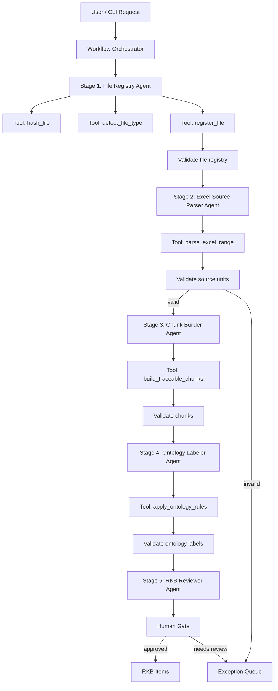

# Workflow Agent Design — From Problem to Methodology to Implementation

> Scope: thiết kế workflow nhiều agent/tool chạy tuần tự cho BD Chunk Project.  
> Goal: gom lại từ vấn đề thực tế, phương pháp luận AI engineering, đến cách làm cụ thể để triển khai workflow đầu tiên `ingest_excel_to_rkb`.

---

## 1. Vấn đề cần giải quyết

Trong dự án Basic Design, input thường đến từ nhiều nguồn không đồng nhất:

```text
RD / 要件定義書
QA票 Excel
業務フロー
legacy documents
meeting notes
existing BD docs
```

Nếu dùng AI theo cách đơn giản:

```text
đưa toàn bộ tài liệu vào LLM
→ yêu cầu tạo BD
```

thì có các rủi ro lớn:

```text
1. LLM có thể bỏ sót requirement.
2. LLM có thể hallucinate requirement không có trong source.
3. Không chứng minh được một BD item đến từ workbook/sheet/range nào.
4. Pending decision có thể bị biến thành fact.
5. QA clarification, RD fact, legacy reference bị trộn authority.
6. Không audit được agent/tool đã làm gì.
7. Không resume được nếu workflow fail giữa chừng.
8. Không đo được chất lượng bằng metric.
```

Vì vậy workflow này không được thiết kế như chatbot RAG thông thường.

Nó phải là một pipeline có kiểm soát:

```text
Raw source
→ deterministic extraction
→ traceable source units
→ validated chunks
→ ontology-labeled RKB
→ human-gated approval
→ retrieval / BD mapping later
```

---

## 2. Design objective

Mục tiêu của workflow nhiều agent/tool là:

```text
Biến raw requirement sources thành RKB items có traceability, validation, ontology label, review status, và audit trail.
```

Không phải mục tiêu ban đầu:

```text
- generate full BD document ngay
- để LLM tự đọc mọi thứ và tự thiết kế
- tạo nhiều agent phức tạp trước khi có một workflow chạy được
```

MVP nên khóa vào một slice hẹp:

```text
Input: QA票 Excel của một domain
Output: RKB-ready items + exception queue + review summary
```

Example MVP:

```text
Domain: 売掛金消込
Domain code: KESHI
Input: qa_keshikomi.xlsx / QA票 / B12:E30
Output: source_units, traceable_chunks, rkb_candidates, rkb_items, exceptions
```

---

## 3. Methodology foundation

Thiết kế này không dựa trên một methodology duy nhất. Nó là kết hợp của nhiều practice trong AI engineering và software engineering.

Tên tổng quát:

```text
Provenance-aware, schema-first, workflow-orchestrated, human-gated agentic RAG system
```

Nói ngắn:

```text
Workflow engineering
+ Tool-use engineering
+ Schema-first contracts
+ Provenance-aware RAG
+ Ontology engineering
+ Human-in-the-loop governance
+ Evaluation-driven LLMOps
```

---

## 4. Methodology map

| Methodology | Áp dụng trong project |
|---|---|
| Agentic workflow orchestration | Orchestrator điều phối các stage agents |
| Workflow-as-code | `workflow.yaml` định nghĩa stage order, input/output, stop conditions |
| Durable execution | `data/runs/<run_id>/` lưu state, logs, outputs |
| Tool-use engineering | Agent gọi deterministic tools thay vì tự làm bằng prompt |
| Schema-first engineering | JSON schema và tool contract là source of truth |
| Provenance-aware RAG | Mọi chunk/RKB item phải trace về source locator |
| Hybrid retrieval | Metadata + BM25 + vector/semantic index |
| Ontology engineering | Controlled labels, entities, BD frame mapping rules |
| Human-in-the-loop governance | Human gate cho pending/conflict/low-confidence |
| Evaluation-driven AI development | `evals/*.yaml`, no eval = no deploy |
| LLMOps / observability | tool logs, validation logs, metrics, audit trail |
| Guardrail engineering | Cấm invent provenance, cấm pending thành fact |
| Spec-driven development | Methodology → workflow contract → schema → eval → implementation |

---

## 5. Core design principle

Câu chốt:

```text
Workflow first, contract first, tool first, prompt last.
```

Không thiết kế theo thứ tự:

```text
Prompt → agent → tool → workflow
```

Mà phải thiết kế theo thứ tự:

```text
Problem
→ MVP boundary
→ workflow contract
→ schema
→ tool contract
→ validator
→ agent permission
→ prompt
→ eval
→ implementation
```

---

## 6. Basic architecture

Một workflow nhiều agent/tool nên chạy như pipeline có Orchestrator:

```text
User / CLI request
→ Workflow Orchestrator
→ Stage 1 Agent
→ Tool calls
→ Validator
→ Stage 2 Agent
→ Tool calls
→ Validator
→ Human gate if needed
→ Final output
```

Roles:

```text
Workflow = orchestration
Agent = stage decision worker
Tool = deterministic executor
Validator = quality gate
State = audit trail
Human gate = risk control
```

---

## 7. Standard flow for `ingest_excel_to_rkb`



---

## 8. Why Orchestrator pattern

Có hai pattern phổ biến trong multi-agent system:

```text
1. Handoff pattern: agent này chuyển quyền cho agent khác.
2. Manager/Orchestrator pattern: một orchestrator điều phối specialist agents.
```

Project này nên dùng Orchestrator pattern vì BD workflow cần:

```text
- traceability chặt
- stage order rõ
- stop condition rõ
- audit trail rõ
- tool permission rõ
- human approval rõ
```

Không nên để agent tự handoff tự do vì sẽ khó audit và khó kiểm soát.

---

## 9. Workflow Orchestrator

Orchestrator là PM của workflow.

Responsibilities:

```text
- nhận user/CLI input
- validate input contract
- tạo run_id
- load workflow.yaml
- gọi stage theo đúng thứ tự
- truyền structured output từ stage trước sang stage sau
- dừng khi validation fail
- mở human gate khi có risk
- ghi run state, logs, metrics
- trả final summary
```

Forbidden:

```text
- không parse Excel trực tiếp
- không tự đoán source range
- không tự approve requirement
- không generate BD từ raw input
- không sửa output để vượt validator
```

---

## 10. Stage Agent

Mỗi stage nên có một responsible agent.

Recommended agents:

```text
FileRegistryAgent
ExcelSourceParserAgent
TraceabilityValidatorAgent
ChunkBuilderAgent
OntologyLabelerAgent
RKBReviewerAgent
```

Principle:

```text
Một agent chỉ nên có một responsibility chính.
```

Ví dụ:

```text
ExcelSourceParserAgent chỉ parse Excel thành source_units.
Nó không classify requirement_type.
Nó không tạo RKB item.
Nó không map BD frame.
```

---

## 11. Tool-use engineering

Agent không làm việc deterministic bằng LLM. Agent gọi tool.

Examples:

```text
hash_file
detect_file_type
register_file
parse_excel_range
validate_source_units
build_traceable_chunks
detect_ambiguity_terms
detect_multi_behavior
load_ontology_yaml
apply_ontology_rules
validate_ontology_labels
write_jsonl
write_exceptions
```

Tool rule:

```text
Same input → same output
```

Forbidden:

```text
LLM must not infer workbook_sha256.
LLM must not infer sheet_name.
LLM must not infer range_a1.
LLM must not invent source_granularity.
LLM must not generate source provenance.
```

---

## 12. Schema-first engineering

Schema là contract giữa:

```text
orchestrator
agent
tool
validator
RKB
BD mapper
```

Required schemas:

```text
source_unit.schema.json
traceable_chunk.schema.json
rkb_candidate.schema.json
rkb_item.schema.json
exception.schema.json
output.schema.json
```

Rule:

```text
No schema = no implementation.
No validation = no RKB promotion.
```

---

## 13. Provenance-aware RAG

Workflow này không dùng RAG kiểu:

```text
chunk text theo 500 tokens
→ vector DB
→ answer
```

Mà dùng RAG có provenance:

```text
Raw file
→ source unit with workbook/sheet/range
→ traceable chunk
→ RKB item with source reference
→ index
→ controlled retrieval
```

Quality bar cho Excel:

```text
100% Excel-derived chunks traceable to workbook / sheet / row-range or block-range.
```

---

## 14. Hybrid retrieval

Sau khi có RKB, retrieval nên là hybrid:

```text
Metadata filter
+ BM25 / keyword search
+ semantic/vector search
+ ontology rules
```

Vai trò từng phần:

```text
Metadata filter = lọc domain/source/status
BM25 = tìm exact Japanese term, code, field, status
Vector = tìm meaning gần nhau
Ontology = hiểu loại requirement và mapping rule
```

Ví dụ:

```text
BM25 tìm: 請求番号, 金額不一致, 消込済
Vector tìm: 差額あり ≈ 金額が不一致
Ontology quyết định: EXCEPTION_RULE → BD-EXCEPTION-001
```

---

## 15. Ontology engineering

Ontology trong project là:

```text
controlled vocabulary
+ business entities
+ source labels
+ requirement types
+ BD frame rules
+ mapping constraints
```

Examples:

```text
source_label: QA_CLARIFICATION
requirement_type: EXCEPTION_RULE
ears_type: Complex
target_bd_frame_hint: BD-EXCEPTION-001
```

Rules:

```text
- agent chỉ chọn label từ ontology YAML
- không invent label mới
- nếu không chắc → NEEDS_REVIEW
- PENDING_DECISION không được thành fact
- TECHNICAL_INFERENCE không được auto approve
```

---

## 16. Human-in-the-loop governance

Human gate chỉ đặt ở điểm rủi ro, không review mọi thứ.

Trigger human review:

```text
PENDING_DECISION
TECHNICAL_INFERENCE
conflict_flag = true
low confidence
multi_behavior_row
ambiguity terms: 別途確認 / 未定 / 必要に応じて
before RKB_READY promotion
before BD mapping or BD generation
```

Rule:

```text
Human reviews risk, not all data.
```

---

## 17. Evaluation-driven AI development

Workflow phải có eval trước khi deploy.

Minimum evals:

```text
happy_path.yaml
missing_sheet_name.yaml
missing_range_a1.yaml
missing_provenance_blocked.yaml
pending_decision_blocked.yaml
ontology_label_controlled.yaml
multi_behavior_needs_split.yaml
```

Rule:

```text
No eval = no deploy.
No source provenance = fail.
Dangerous tool permission = fail.
```

---

## 18. Observability and LLMOps

Mọi workflow run phải có audit trail.

Log files:

```text
agent_steps.jsonl
tool_calls.jsonl
validation_results.jsonl
human_decisions.jsonl
metrics.json
```

Metrics:

```text
traceability_rate
source_unit_count
chunk_count
rkb_candidate_count
rkb_ready_count
needs_review_count
exception_count
auto_label_precision
human_correction_rate
BD citation coverage
```

---

## 19. Guardrail engineering

Guardrail quan trọng nhất trong project này:

```text
Không biến dữ liệu chưa xác nhận thành requirement chính thức.
```

Hard rules:

```text
- raw input không đi thẳng vào BD generation
- pending item không vào RKB_READY
- creator note không phải source fact
- LLM không invent provenance
- ontology label phải nằm trong controlled vocabulary
- validation fail thì stop
```

---

## 20. Recommended repository structure

```text
bd-chunk-project/
  docs/
    methodology.md
    methodology_addendum.md
    workflow_agent_design.md
    language_policy.md

  workflows/
    ingest_excel_to_rkb/
      workflow.yaml
      README.md
      agents/
      prompts/
      tools/
      schemas/
      examples/
      evals/

  registry/
    agent_catalog.yaml
    skill_catalog.yaml
    tool_profiles.yaml
    naming_rules.yaml

  ontology/
    source_labels.yaml
    requirement_types.yaml
    business_entities.yaml
    bd_frames.yaml
    mapping_rules.yaml

  src/bd_chunk/
    ingest/
    chunking/
    ontology/
    rkb/
    index/
    workflows/

  data/
    raw/
    outputs/
    index/
    runs/
```

---

## 21. Workflow folder structure

First workflow:

```text
workflows/
  ingest_excel_to_rkb/
    workflow.yaml
    README.md

    agents/
      file_registry.agent.yaml
      excel_source_parser.agent.yaml
      traceability_validator.agent.yaml
      chunk_builder.agent.yaml
      ontology_labeler.agent.yaml
      rkb_reviewer.agent.yaml

    prompts/
      file_registry.md
      excel_source_parser.md
      traceability_validator.md
      chunk_builder.md
      ontology_labeler.md
      rkb_reviewer.md

    tools/
      tool_contracts.yaml
      tool_permissions.yaml

    schemas/
      input.schema.json
      file_registry.schema.json
      source_unit.schema.json
      traceable_chunk.schema.json
      rkb_candidate.schema.json
      rkb_item.schema.json
      exception.schema.json
      output.schema.json

    examples/
      request.example.json
      source_units.example.jsonl
      traceable_chunks.example.jsonl
      rkb_candidates.example.jsonl
      rkb_items.example.jsonl
      exceptions.example.jsonl
      summary.example.md

    evals/
      happy_path.yaml
      missing_sheet_name.yaml
      missing_range_a1.yaml
      missing_provenance_blocked.yaml
      pending_decision_blocked.yaml
      ontology_label_controlled.yaml
```

---

## 22. Basic `workflow.yaml`

```yaml
id: ingest_excel_to_rkb
name: Ingest Excel to RKB
version: 0.1.0
owner: bd-chunk-project

purpose: >
  Convert Excel QA/RD sheets into traceable source units,
  traceable chunks, ontology-labeled RKB candidates,
  and RKB-ready items.

mvp_scope:
  input_source_type: excel
  source_kind:
    - QA
    - RD
  output_until: RKB_READY
  bd_generation: false

input_contract:
  required:
    - file_path
    - source_kind
    - sheet_name
    - range_a1
    - domain_code
  optional:
    - module_name
    - chunking_mode
    - header_rows

output_contract:
  files:
    - data/index/file_registry.jsonl
    - data/outputs/source_units.jsonl
    - data/outputs/traceable_chunks.jsonl
    - data/outputs/rkb_candidates.jsonl
    - data/outputs/rkb_items.jsonl
    - data/outputs/exceptions.jsonl
  metrics:
    - traceability_rate
    - source_unit_count
    - chunk_count
    - rkb_candidate_count
    - rkb_ready_count
    - needs_review_count
    - exception_count

stages:
  - id: register_file
    agent: FileRegistryAgent
    tools:
      - hash_file
      - detect_file_type
      - register_file
    outputs:
      - file_registry_record
    validator: validate_file_registry

  - id: parse_excel
    agent: ExcelSourceParserAgent
    tools:
      - parse_excel_range
      - validate_source_units
    inputs:
      - file_registry_record
      - sheet_name
      - range_a1
    outputs:
      - source_units
    validator: validate_source_units

  - id: build_chunks
    agent: ChunkBuilderAgent
    tools:
      - build_traceable_chunks
      - detect_multi_behavior
      - detect_ambiguity_terms
    inputs:
      - source_units
    outputs:
      - traceable_chunks
    validator: validate_traceable_chunks

  - id: label_ontology
    agent: OntologyLabelerAgent
    tools:
      - load_ontology_yaml
      - apply_ontology_rules
      - validate_ontology_labels
    inputs:
      - traceable_chunks
    outputs:
      - rkb_candidates
    validator: validate_ontology_labels

  - id: review_rkb
    agent: RKBReviewerAgent
    human_gate: true
    inputs:
      - rkb_candidates
    outputs:
      - rkb_items

stop_conditions:
  - missing_file_path
  - missing_sheet_name
  - missing_range_a1
  - traceability_rate_below_1
  - invalid_ontology_label
  - unresolved_conflict

guardrails:
  forbidden_inference:
    - file_sha256
    - workbook_sha256
    - sheet_name
    - range_a1
    - source_granularity
    - chunk_id
    - rkb_id
  if_missing_required_input: NEEDS_INPUT
  if_validation_failed: STOP_AND_WRITE_EXCEPTION
```

---

## 23. Basic agent config

Example `excel_source_parser.agent.yaml`:

```yaml
name: ExcelSourceParserAgent
stage: parse_excel

role: >
  Parse Excel QA/RD sheets into traceable source units.

mission: >
  Convert registered Excel rows or blocks into source_units.jsonl.
  Preserve workbook, sheet, range, and raw text.

input_contract:
  required:
    - file_path
    - file_id
    - workbook_sha256
    - sheet_name
    - range_a1
    - source_kind
    - domain_code

allowed_tools:
  - parse_excel_range
  - validate_source_units
  - write_jsonl
  - write_exceptions

forbidden_actions:
  - infer_sheet_name
  - infer_range_a1
  - classify_requirement_type
  - normalize_requirement_text
  - create_rkb_item
  - create_bd_mapping

output_contract:
  files:
    - data/outputs/source_units.jsonl
    - data/outputs/exceptions.jsonl
  metrics:
    - source_unit_count
    - invalid_unit_count
    - traceability_rate

stop_conditions:
  - missing_sheet_name
  - missing_range_a1
  - traceability_rate_below_1
```

---

## 24. Tool contract

Example `tool_contracts.yaml`:

```yaml
tools:
  parse_excel_range:
    description: Parse Excel range into row-level source units.
    input_schema:
      required:
        - file_path
        - workbook_sha256
        - sheet_name
        - range_a1
        - chunking_mode
    output_schema:
      required:
        - source_units
      source_unit_required_fields:
        - unit_id
        - raw_text
        - workbook_name
        - workbook_sha256
        - sheet_name
        - range_a1
        - source_granularity

  validate_source_units:
    description: Validate source unit provenance and raw text.
    input_schema:
      required:
        - source_units
    output_schema:
      required:
        - valid_units
        - invalid_units
        - traceability_rate
```

---

## 25. Agent-to-agent handoff

Không truyền dữ liệu giữa agents bằng prose dài. Dùng structured data hoặc file path.

Stage 1 output:

```json
{
  "file_registry_record": {
    "file_id": "sha256:abc123",
    "file_path": "data/raw/qa_keshikomi.xlsx",
    "file_type": "excel",
    "source_kind": "QA",
    "workbook_sha256": "abc123"
  }
}
```

Stage 2 input:

```json
{
  "file_registry_record": "...",
  "sheet_name": "QA票",
  "range_a1": "B12:E30",
  "chunking_mode": "row"
}
```

Stage 2 output:

```json
{
  "source_units_path": "data/outputs/source_units.jsonl",
  "traceability_rate": 1.0,
  "source_unit_count": 19,
  "invalid_unit_count": 0
}
```

Rule:

```text
Agent-to-agent handoff = structured data, not chat-style summary.
```

---

## 26. Workflow state and audit trail

Workflow state must be stored outside conversation memory.

Recommended run folder:

```text
data/runs/
  run-YYYYMMDD-HHMMSS-ingest_excel_to_rkb/
    run.yaml
    inputs.json
    stage_status.json
    metrics.json
    outputs/
      file_registry.jsonl
      source_units.jsonl
      traceable_chunks.jsonl
      rkb_candidates.jsonl
      rkb_items.jsonl
      exceptions.jsonl
    logs/
      agent_steps.jsonl
      tool_calls.jsonl
      validation_results.jsonl
      human_decisions.jsonl
```

Example `stage_status.json`:

```json
{
  "run_id": "run-20260628-001",
  "workflow_id": "ingest_excel_to_rkb",
  "status": "NEEDS_REVIEW",
  "stages": {
    "register_file": "completed",
    "parse_excel": "completed",
    "build_chunks": "completed",
    "label_ontology": "completed",
    "review_rkb": "needs_human_review"
  }
}
```

Benefits:

```text
resume được
audit được
debug được
biết fail ở stage nào
biết agent gọi tool nào
biết human approve gì
```

---

## 27. Failure handling

Each stage must declare failure modes.

```yaml
failure_modes:
  missing_input:
    status: NEEDS_INPUT
    stop: true

  validation_failed:
    status: FAILED_VALIDATION
    stop: true
    write_to: data/outputs/exceptions.jsonl

  low_confidence:
    status: NEEDS_REVIEW
    stop: false
    human_gate: true

  unresolved_conflict:
    status: NEEDS_REVIEW
    stop: true
    human_gate: true
```

Rule:

```text
If required data is missing or validation fails, do not guess. Stop or send to review.
```

---

## 28. Basic runner pseudo-code

```python
def run_workflow(workflow, request):
    run_state = create_run_state(workflow["id"], request)
    validate_input(workflow["input_contract"], request)

    context = {
        "request": request,
        "outputs": {},
        "metrics": {},
    }

    for stage in workflow["stages"]:
        update_stage_status(run_state, stage["id"], "running")

        agent = load_agent(stage["agent"])
        tool_results = agent.run_stage(stage=stage, context=context)

        validation_result = run_validator(stage.get("validator"), tool_results)

        write_tool_logs(run_state, stage, tool_results)
        write_validation_logs(run_state, stage, validation_result)

        if not validation_result["passed"]:
            write_exceptions(validation_result["errors"])
            update_stage_status(run_state, stage["id"], "failed")
            return {
                "status": "failed",
                "failed_stage": stage["id"],
                "errors": validation_result["errors"],
            }

        context["outputs"][stage["id"]] = tool_results
        update_stage_status(run_state, stage["id"], "completed")

        if stage.get("human_gate"):
            review_result = request_human_review(tool_results)
            write_human_decisions(run_state, review_result)

            if not review_result["approved"]:
                update_stage_status(run_state, stage["id"], "needs_review")
                return {
                    "status": "needs_review",
                    "stage": stage["id"],
                    "review_items": review_result["items"],
                }

    final_summary = build_summary(context)
    update_run_status(run_state, "completed")

    return {
        "status": "completed",
        "summary": final_summary,
    }
```

---

## 29. Concrete implementation order

Do this first:

```text
1. Create workflows/ingest_excel_to_rkb/workflow.yaml
2. Create schemas/source_unit.schema.json
3. Create schemas/traceable_chunk.schema.json
4. Create schemas/rkb_candidate.schema.json
5. Create schemas/rkb_item.schema.json
6. Create schemas/exception.schema.json
7. Create evals/happy_path.yaml
8. Create evals/missing_range_a1.yaml
9. Implement hash_file and file registry
10. Implement parse_excel_range with openpyxl
11. Implement validate_source_units
12. Implement build_traceable_chunks
13. Implement rule-based ontology labeler
14. Implement RKB reviewer summary
15. Implement run state logging
```

Do not do first:

```text
- full BD generation
- GraphRAG
- complex vector DB
- 50 agents
- UI
- full skill factory generator
```

---

## 30. Build-vs-defer decision

| Component | MVP | Later |
|---|---:|---:|
| Excel parser | Yes | Improve |
| File registry | Yes | Improve |
| Source units | Yes | Yes |
| Traceable chunks | Yes | Yes |
| Rule-based ontology | Yes | Yes |
| LLM labeling | Limited | Yes |
| BM25 | Simple | Improve |
| Vector index | Manifest only | Yes |
| Agent factory | Skeleton only | Yes |
| GraphRAG | No | Maybe |
| Full BD generation | No | Yes |
| Human review UI | Simple table | Workflow UI |

Rule:

```text
Correct but non-essential components should be deferred.
```

---

## 31. Success criteria

MVP success metrics:

```text
traceability_rate = 100%
rkb_ready_rate >= 70%
auto_label_precision >= 85%
human_correction_rate <= 20%
exception_rate explainable = 100%
```

When BD generation starts:

```text
BD output source citation coverage = 100%
No BD item generated from raw input directly.
Every BD bullet must cite RKB ID and source reference.
```

---

## 32. Anti-patterns

Avoid:

```text
One giant prompt reads all files and generates BD.
LLM guesses Excel range.
Vector DB becomes source of truth.
Pending decisions become requirements.
Every agent has every tool.
Every skill can write anywhere.
No run state.
No evals.
No metrics.
No human approval before RKB_READY.
```

Correct pattern:

```text
Workflow first.
Contract first.
Schema first.
Tool first.
Prompt last.
```

---

## 33. Final design rule

Thiết kế cơ bản của một workflow nhiều agent/tool chạy lần lượt là:

```text
workflow.yaml defines stage order
each stage has one responsible agent
agent only calls allowed tools
tools produce deterministic outputs
validators check outputs
state records progress and audit logs
human gates stop risky cases
only a passed stage can trigger the next stage
```

Final sentence:

```text
Đây không phải chatbot RAG.
Đây là AI engineering pipeline có kiểm soát:
workflow contract → deterministic tools → validated RKB → governed agentic BD support.
```
