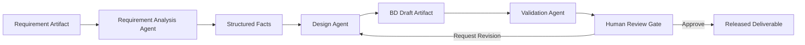
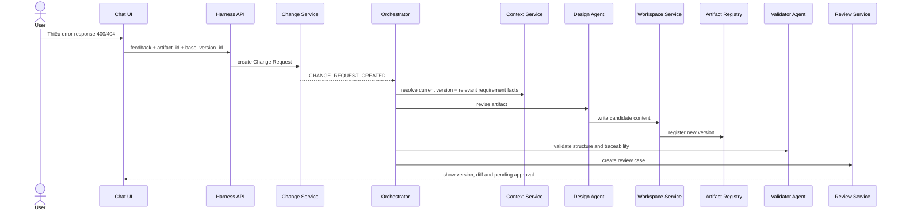
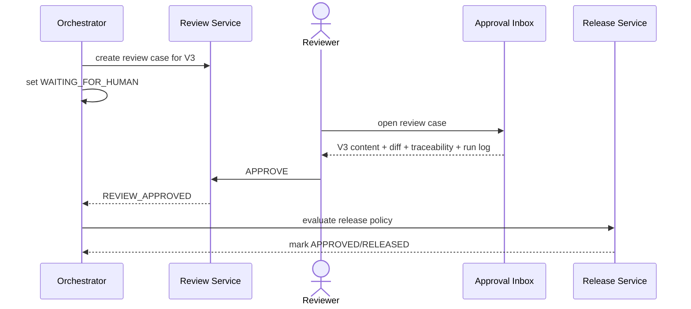
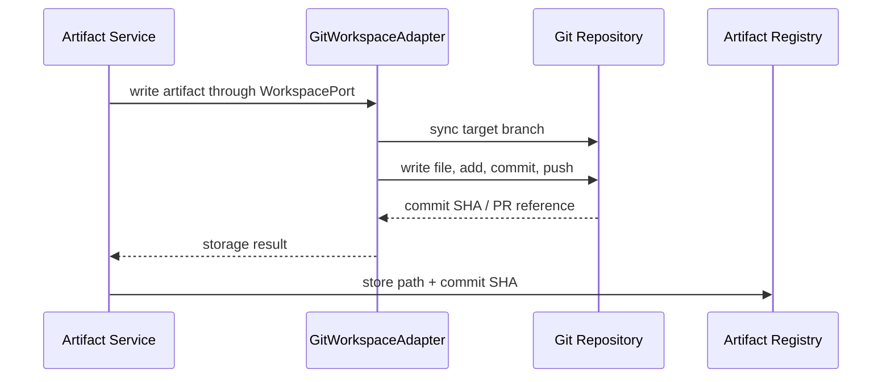

# Day 02 — Artifact-Centric Harness Architecture

> Requirement Definition → Basic Design Document Workflow
>
> Mục tiêu: chuyển toàn bộ nội dung học ngày 2 thành baseline có thể dùng để thiết kế và triển khai Harness.

---

## 1. Learning Objectives

Sau bài này, người học cần hiểu và có thể thiết kế được:

- Artifact là gì, khác deliverable và intermediate artifact như thế nào.
- Workspace, runtime, sandbox, agent và skill khác nhau ra sao.
- Artifact lifecycle từ tạo mới đến review, approval, release và rollback.
- Cách quản lý version, log, audit trail và traceability.
- Cách gắn chat với đúng artifact và đúng version.
- Cách thiết kế review/approval gate trên UI và backend.
- Cách hỗ trợ cả local workspace và Git workspace mà không phải viết lại agent.
- Kiến trúc backend cần có để thực hiện các function trên.

---

## 2. Core Concepts

### 2.1 Artifact

Artifact là một work product mà con người hoặc agent có thể tạo, đọc, sửa, review, version và phát hành.

Ví dụ trong quy trình Requirement Definition → Basic Design:

- Requirement document
- Requirement facts/chunks đã được parse
- Requirement-to-design mapping
- Screen design
- API design
- DB design
- Batch design
- Interface design
- Review report
- Approval record
- Final deliverable

Không phải artifact nào cũng là deliverable.

- **Intermediate artifact**: facts, mapping, draft, validation report, review note.
- **Deliverable artifact**: tài liệu BD đã được approve và release.

### 2.2 Workspace

Workspace là nơi artifact được lưu trữ và được agent thao tác.

Workspace có thể là:

- Local folder
- Git repository
- SharePoint
- Google Drive
- Object storage hoặc document store

Workspace không phải runtime. Workspace giữ dữ liệu; runtime chạy logic.

### 2.3 Runtime

Runtime là môi trường thực thi workflow.

Runtime chứa hoặc điều phối:

- Workflow state
- Orchestrator
- Agent execution
- Tool calls
- Retry
- Checkpoint
- Review gate
- Event/log emission

### 2.4 Sandbox

Sandbox là môi trường thực thi cô lập để agent hoặc tool chạy an toàn mà không ảnh hưởng trực tiếp hệ thống thật.

Ví dụ:

- Chạy script parse Excel
- Generate file
- Validate schema
- Run code
- Clone Git branch tạm thời

### 2.5 Agent

Agent là một execution unit thực hiện một trách nhiệm cụ thể trong workflow.

Ví dụ:

- Requirement Analysis Agent
- API Design Agent
- Validation Agent
- Review Agent

Agent không nhất thiết phải quyết định toàn bộ flow. Nó nhận task, context và artifact đầu vào, sau đó tạo output.

### 2.6 Skill

Skill là capability hoặc instruction package mà agent sử dụng để hoàn thành nhiệm vụ.

Ví dụ:

- `skills/api-design/SKILL.md`
- `skills/requirement-analysis/SKILL.md`
- `skills/traceability-review/SKILL.md`

Skill có thể được lưu trong code repository hoặc skill registry. Nó không nên bị trộn với business artifact trong project workspace, dù về mặt kỹ thuật đều có thể là file.

---

## 3. Artifact-Centric Principle

Artifact-centric nghĩa là artifact là trung tâm của workflow, không phải chat message hay agent session.

Mỗi lần thực thi cần trả lời được:

- Agent nào đã đọc artifact nào?
- Agent tạo ra artifact nào?
- Artifact mới dựa trên version nào?
- Prompt hoặc change request nào gây ra thay đổi?
- Ai review?
- Ai approve?
- Version nào hiện là current head?
- Version nào đã release?



---

## 4. Artifact Lifecycle

### 4.1 Lifecycle States

```text
DRAFT
  ├── submit review ──> IN_REVIEW
  │                       ├── request revision ──> NEEDS_REVISION
  │                       ├── reject ────────────> REJECTED
  │                       └── approve ───────────> APPROVED
  ├── supersede ───────> SUPERSEDED
  └── abandon ─────────> ARCHIVED

APPROVED ── release ──> RELEASED ── deprecate ──> DEPRECATED
```

### 4.2 Core Rules

- Released version là immutable.
- Revision luôn tạo version mới.
- Không sửa trực tiếp version đang được review.
- Approval luôn gắn với một version cụ thể, không approve alias `latest` chung chung.
- Rollback không xóa history; rollback tạo một version mới dựa trên version cũ.
- Intermediate artifact vẫn phải trace được về source requirement.

---

## 5. Target User Journey

1. User chọn Requirement artifact `FNC001_RD v2`.
2. User khởi chạy `Generate Basic Design` từ chat hoặc workflow UI.
3. Orchestrator tạo workflow run, ví dụ `RUN-2026-000123`.
4. Agent tạo intermediate artifacts: facts, mapping và design drafts.
5. Artifact Registry ghi ID, version, trạng thái và source links.
6. Reviewer mở Approval Inbox và xem content, diff, traceability, lifecycle log.
7. Reviewer approve hoặc request revision.
8. Feedback được lưu thành Change Request gắn với version hiện tại.
9. Agent tạo version mới; version cũ vẫn immutable.
10. Artifact đã approve được release thành deliverable.

---

## 6. Functional Requirements

### FR-01 — Artifact Registration

**Mục tiêu:** đăng ký mọi artifact vào Artifact Registry.

**Input:** content hoặc storage reference, project ID, function ID, artifact type, source artifact.

**Output:** artifact ID, version ID, status, checksum, storage path.

**Business rules:**

- Artifact ID ổn định qua nhiều version.
- Version ID là immutable.
- Mỗi artifact phải có type, owner và project scope.

---

### FR-02 — Artifact Retrieval

**Mục tiêu:** đọc artifact theo ID/version thay vì phụ thuộc hoàn toàn vào folder path.

**Input:** artifact ID, optional version ID.

**Output:** content, metadata, lifecycle state và traceability.

**Rule:** nếu không truyền version, API có thể trả current head nhưng UI phải hiển thị version cụ thể.

---

### FR-03 — Artifact Update and New Version

**Preconditions:**

- Artifact và base version tồn tại.
- Actor có quyền edit.
- Version không ở trạng thái `RELEASED`.

**Main flow:**

1. UI hoặc agent gửi `UpdateArtifactCommand`.
2. Registry kiểm tra base version.
3. Workspace Adapter tạo content mới.
4. Hệ thống tính hash và metadata.
5. Version record mới được insert.
6. Event `ARTIFACT_VERSION_CREATED` được ghi.
7. Chat binding chuyển sang version mới.

**Exception:** nếu base version không còn là head hợp lệ, trả `409 VERSION_CONFLICT` và yêu cầu compare/rebase.

**Acceptance:**

- Không mất version cũ.
- Diff hiển thị được.
- Actor, instruction và trace ID truy vết được.

---

### FR-04 — Artifact Naming and Classification

Khuyến nghị naming logic:

```text
{FUNCTION_ID}_{ARTIFACT_TYPE}
```

Ví dụ:

```text
FNC001_RD
FNC001_SCREEN_SPEC
FNC001_API_SPEC
FNC001_DB_SPEC
FNC001_BATCH_SPEC
FNC001_IF_SPEC
```

Version không nhất thiết nằm trong filename nếu Git hoặc Artifact Registry đã quản lý version.

---

### FR-05 — Chat-to-Artifact Binding

**Mục tiêu:** hệ thống biết user đang chat để sửa artifact nào và version nào.

Mỗi conversation hoặc task context cần có:

```json
{
  "project_id": "BD-001",
  "artifact_id": "ART-FNC001-API",
  "base_version_id": "VER-0003",
  "workflow_run_id": "RUN-2026-000123"
}
```

UI cần hiển thị rõ:

- Current artifact
- Current version
- Current workflow run
- Current review status

---

### FR-06 — Lifecycle Event Logging

**Precondition:** mọi request có `trace_id` và actor identity.

**Main flow:**

1. Service phát domain event.
2. Event Store append immutable record.
3. Projection cập nhật timeline hoặc search index.
4. UI hiển thị lifecycle log.

**Event data:**

```text
event_id
occurred_at
trace_id
run_id
artifact_id
version_id
actor_type
actor_id
event_type
payload_json
correlation_id
```

**Acceptance:** dựng lại được timeline đầy đủ mà không phụ thuộc hoàn toàn vào application log text.

---

### FR-07 — Workflow Run Logging

Orchestrator phải ghi lại:

- Workflow ID/version
- Run ID
- Step ID
- Agent/skill/tool đã gọi
- Input artifact IDs
- Output artifact IDs
- Status
- Retry count
- Error category
- Start/end time
- Token/cost metrics nếu dùng LLM

Git history không thay thế workflow log. Git chỉ trả lời file thay đổi thế nào; workflow log trả lời vì sao thay đổi, do task nào và qua bước nào.

---

### FR-08 — Create Review Case

**Preconditions:** version ở `DRAFT` và pass automated validation tối thiểu.

**Main flow:**

1. Snapshot version cần review.
2. Tạo review case.
3. Assign reviewer.
4. Workflow chuyển sang `WAITING_FOR_HUMAN`.
5. Gửi notification.

**Output:** review case ID, reviewer, SLA, status.

---

### FR-09 — Review and Approval Decision

Reviewer được phép:

- `APPROVE`
- `REJECT`
- `REQUEST_REVISION`

Reviewer phải xem được:

- Artifact content
- Diff với version trước
- Source requirement
- Traceability links
- Validation result
- Agent run log
- Previous review comments

Approval luôn gắn đúng version.

---

### FR-10 — Change Request from Human Feedback

Feedback của user không chỉ là chat text. Backend nên chuyển feedback thành Change Request có cấu trúc.

```json
{
  "change_request_id": "CR-00123",
  "artifact_id": "ART-FNC001-API",
  "base_version_id": "VER-0003",
  "instruction": "Thiếu error response 400 và 404",
  "requested_by": "user-01",
  "reason": "Review feedback",
  "status": "APPROVED_FOR_EXECUTION"
}
```

Change Request trở thành input động cho agent ở lần chạy tiếp theo.

---

### FR-11 — Static and Dynamic Context Assembly

Context nên tách thành hai nhóm:

**Static context:**

- Project standards
- Naming conventions
- Templates
- Architecture rules
- Skill instructions

**Dynamic context:**

- Current artifact/version
- Relevant requirement chunks
- Current change request
- Prior review feedback
- Current workflow state

Agent chỉ nhận phần dynamic context cần thiết để tránh context bloat.

---

### FR-12 — Automated Validation for Documents

Tài liệu `.md` không có unit test giống code, nhưng vẫn có thể validate tự động:

- Required sections tồn tại
- Heading structure đúng
- Mandatory fields không trống
- Requirement IDs có mapping
- Broken links
- Duplicate IDs
- API schema completeness
- Naming convention
- Cross-artifact consistency
- Traceability coverage

Validation report cũng là một artifact.

---

### FR-13 — Artifact Lock and Conflict Handling

Hệ thống cần hỗ trợ optimistic locking.

Mỗi update phải gửi `base_version_id`.

Nếu một actor khác đã tạo version mới, backend trả conflict thay vì overwrite.

Review lock là logic lock:

- Version trong review không bị sửa.
- Revision tạo version mới.
- Review case cũ có thể bị supersede.

---

### FR-14 — Rollback Artifact

**Preconditions:** actor có rollback permission; target version tồn tại.

**Main flow:**

1. User chọn version trước.
2. Hệ thống hiển thị impact.
3. Tạo Change Request loại `ROLLBACK`.
4. Copy content target thành version mới.
5. Chạy validation/review theo policy.
6. Set version mới thành current head.

**Rule:** rollback không xóa Git commit hoặc DB version.

Metadata cần có:

```text
restored_from_version_id
rollback_reason
requested_by
approved_by
```

---

### FR-15 — Retry and Runtime Recovery

Runtime error khác review failure.

Error categories nên tách:

- `VALIDATION_ERROR`
- `AGENT_EXECUTION_ERROR`
- `TOOL_ERROR`
- `LLM_PROVIDER_ERROR`
- `WORKSPACE_ERROR`
- `VERSION_CONFLICT`
- `REVIEW_REJECTED`
- `POLICY_BLOCKED`

Orchestrator cần checkpoint để resume từ step phù hợp thay vì chạy lại toàn bộ workflow.

---

### FR-16 — Workspace Abstraction

Business agent không nên biết workspace là local hay Git.

Agent gọi một interface thống nhất:

```text
WorkspacePort
  - read(path or artifact reference)
  - write(content, target)
  - list(scope)
  - exists(target)
  - compare(version A, version B)
  - commit(metadata)
```

Implementation:

- `LocalWorkspaceAdapter`
- `GitWorkspaceAdapter`
- `SharePointWorkspaceAdapter`
- `GoogleDriveWorkspaceAdapter`

---

### FR-17 — Git Synchronization

**Preconditions:** workspace cấu hình Git; branch policy và credential được provision qua secret manager.

**Main flow:**

1. Git adapter checkout/sync target branch.
2. Write artifact file.
3. `git add`.
4. Commit kèm metadata run/artifact.
5. Push branch.
6. Optional create pull request.
7. Trả commit SHA/PR reference về Artifact Registry.

Ví dụ commit message:

```text
artifact(FNC001_API): create v3 [RUN-123]
```

Agent business không được trực tiếp quản lý credential hoặc tự định nghĩa commit policy.

---

### FR-18 — Release and Deliverable Promotion

Chỉ version `APPROVED` mới được promote thành `RELEASED`.

Release cần ghi:

- Released artifact/version
- Release tag
- Reviewer/approver
- Source requirement baseline
- Commit SHA nếu dùng Git
- Release timestamp

---

### FR-19 — Notification

Notification trigger:

- Artifact ready for review
- Review overdue
- Revision requested
- Workflow failed
- Version conflict
- Artifact released

Notification chỉ là delivery channel; review decision phải được persist trong backend.

---

### FR-20 — Search and Traceability View

User cần search theo:

- Function ID
- Requirement ID
- Artifact type
- Artifact status
- Reviewer
- Workflow run
- Commit SHA
- Date range

Traceability view cần thể hiện:

```text
Requirement → Facts → Mapping → Draft → Validation → Review → Released Artifact
```

---

## 7. System Architecture

### 7.1 Logical Architecture

```mermaid
flowchart TB
    UI[Harness UI\nChat | Artifact Viewer | Diff | Approval Inbox | Run Timeline]
    API[Harness API\nCommand API | Query API | AuthZ | Conversation Binding]
    ORCH[Workflow Runtime / Orchestrator\nState | Retry | Gate | Human-in-the-loop]
    ART[Artifact Management Service\nRegistry | Version | Lock | Traceability | Release]
    AGENT[Agent Runner\nLLM | Tools | Skills]
    CONTEXT[Context Service\nStatic + Dynamic Context]
    WS[Workspace Service\nLocal | Git | SharePoint | Drive]
    EVENT[Event Store / Audit Log]
    DB[Operational Database]
    NOTIFY[Notification Service]

    UI --> API
    API --> ORCH
    API --> ART
    ORCH --> AGENT
    ORCH --> CONTEXT
    ORCH --> ART
    ART --> WS
    ORCH --> EVENT
    ART --> EVENT
    API --> DB
    ART --> DB
    ORCH --> NOTIFY
```

### 7.2 Component Responsibilities

| Component | Responsibility |
|---|---|
| Harness UI | Chat, artifact view, diff, approval inbox, run timeline |
| Harness API | Command/query endpoint, authorization, conversation binding |
| Orchestrator | Workflow state, routing, retry, checkpoint, review gate |
| Artifact Service | Registry, version, lifecycle, lock, release, traceability |
| Agent Runner | Run agent with model, skill and tool configuration |
| Context Service | Assemble bounded static/dynamic context |
| Workspace Service | Read/write through pluggable storage adapters |
| Event Store | Immutable business/runtime event history |
| Operational DB | Current state projection and searchable metadata |
| Notification Service | Notify reviewer/user of actionable state changes |

### 7.3 Recommended Architecture Pattern

Với POC, nên dùng **modular monolith** hoặc service-oriented modular backend. Chưa cần tách microservice ngay.

Code boundary nên theo Ports and Adapters:

```text
Domain/Application Layer
  ├── ArtifactApplicationService
  ├── WorkflowApplicationService
  ├── ReviewApplicationService
  └── ReleaseApplicationService

Ports
  ├── WorkspacePort
  ├── ArtifactRepositoryPort
  ├── EventStorePort
  ├── AgentExecutorPort
  ├── GitPort
  └── NotificationPort

Adapters
  ├── LocalWorkspaceAdapter
  ├── GitWorkspaceAdapter
  ├── PostgreSQLArtifactRepository
  ├── PostgreSQLEventStore
  ├── Claude/OpenAI Agent Adapter
  └── Email/Slack Notification Adapter
```

---

## 8. Data Architecture

### 8.1 Core Entities

#### Artifact

```text
artifact_id
project_id
function_id
artifact_type
logical_name
current_version_id
status
owner_id
created_at
```

#### ArtifactVersion

```text
version_id
artifact_id
version_number
storage_uri
content_hash
base_version_id
created_by
created_at
change_request_id
workflow_run_id
commit_sha
status
```

#### WorkflowRun

```text
run_id
workflow_id
workflow_version
status
current_step
started_by
started_at
completed_at
```

#### StepRun

```text
step_run_id
run_id
step_id
agent_id
skill_version
input_artifacts
output_artifacts
status
retry_count
error_code
started_at
completed_at
```

#### ReviewCase

```text
review_case_id
artifact_id
version_id
reviewer_id
status
decision
comment
created_at
decided_at
```

#### ChangeRequest

```text
change_request_id
artifact_id
base_version_id
type
instruction
reason
requested_by
status
created_at
```

#### LifecycleEvent

```text
event_id
trace_id
correlation_id
run_id
artifact_id
version_id
actor_type
actor_id
event_type
payload_json
occurred_at
```

---

## 9. Critical Sequence Flows

### 9.1 User Feedback → New Version



### 9.2 Review and Approval Gate



### 9.3 Git-Backed Workspace



---

## 10. UI/UX Requirements

### 10.1 Artifact Viewer

Hiển thị:

- Artifact name/type
- Function ID
- Current version
- Lifecycle status
- Source requirement
- Content preview/editor
- Version history
- Diff
- Traceability
- Run log

### 10.2 Approval Inbox

Danh sách cần có:

- Artifact
- Version
- Reviewer
- Submitted time
- SLA
- Validation status
- Workflow/run reference

Action:

- View detail
- Approve
- Reject
- Request revision
- Add comment

### 10.3 Chat Header

Chat phải cho user thấy rõ đang thao tác trên:

```text
Project: BD-001
Artifact: FNC001_API_SPEC
Version: v3
Status: NEEDS_REVISION
Run: RUN-2026-000123
```

### 10.4 Run Timeline

Timeline nên hiển thị:

```text
Requirement selected
→ Facts extracted
→ API draft created
→ Validation passed
→ Review requested
→ Revision requested
→ Version v3 created
→ Approved
→ Released
```

---

## 11. Workspace and Folder Standard

Khuyến nghị physical workspace theo project/function để tối ưu traceability; Artifact Registry cung cấp view theo artifact type.

```text
workspace/
└── projects/BD-001/
    └── functions/FNC001/
        ├── input/
        │   └── FNC001_RD.md
        ├── intermediate/
        │   ├── FNC001_FACTS.json
        │   └── FNC001_MAPPING.json
        ├── design/
        │   ├── FNC001_SCREEN_SPEC.md
        │   ├── FNC001_API_SPEC.md
        │   ├── FNC001_DB_SPEC.md
        │   ├── FNC001_BATCH_SPEC.md
        │   └── FNC001_IF_SPEC.md
        ├── validation/
        │   └── FNC001_VALIDATION_REPORT.md
        └── review/
            └── FNC001_REVIEW_REPORT.md
```

Không cần tạo thư mục `v1`, `v2`, `v3` nếu Git hoặc Artifact Registry đã quản lý version. Nếu dùng local-only mà không có version store, cần cơ chế version vật lý hoặc snapshot store riêng.

---

## 12. Non-Functional Requirements

### NFR-01 — Traceability

Mọi deliverable phải truy ngược được về requirement source, workflow run, agent/skill và review decision.

### NFR-02 — Immutability

Lifecycle event và released artifact version không được update tại chỗ.

### NFR-03 — Recoverability

Workflow phải resume được từ checkpoint sau runtime failure.

### NFR-04 — Storage Independence

Switch từ local sang Git không yêu cầu viết lại business agent.

### NFR-05 — Security

Credential của Git/LLM/storage nằm trong secret manager; agent không nhận raw credential.

### NFR-06 — Auditability

Audit query phải xác định được ai, lúc nào, thay đổi gì, vì sao, từ version nào sang version nào.

### NFR-07 — Performance

Metadata query và approval inbox cần phản hồi nhanh mà không phải đọc toàn bộ Git history mỗi lần.

### NFR-08 — Human Control

Client-facing deliverable không được autonomous release trong v0.1.

---

## 13. Function-to-Architecture Mapping

| Function | Primary Component | Supporting Components |
|---|---|---|
| Register artifact | Artifact Service | Workspace, DB, Event Store |
| Create new version | Artifact Service | Workspace Adapter, Event Store |
| Chat artifact binding | Harness API | Conversation Store, Artifact Service |
| Workflow logging | Orchestrator | Event Store, Metrics |
| Review case | Review Service | UI, Notification, Orchestrator |
| Approval gate | Orchestrator | Review Service, Checkpoint Store |
| Rollback | Artifact Service | Change Service, Validation, Review |
| Git sync | GitWorkspaceAdapter | Secret Manager, Artifact Registry |
| Validation | Validator Agent | Context Service, Artifact Service |
| Release | Release Service | Review Service, Registry, Git tag |

---

## 14. Architecture Decisions

### ADR-01 — Artifact Registry is the logical source of truth

Folder path hoặc Git branch không đủ để quản lý lifecycle, status, review và traceability. Artifact Registry giữ logical identity và metadata; workspace giữ physical content.

### ADR-02 — Git history and workflow log are separate

Git quản lý content history. Event Store quản lý business/runtime history. Không dùng Git commit log thay thế toàn bộ orchestration audit.

### ADR-03 — Revision creates a new immutable version

Không overwrite version đang review hoặc đã release.

### ADR-04 — Workspace uses Ports and Adapters

Agent và application service thao tác qua `WorkspacePort`, cho phép thay local bằng Git/SharePoint/Drive.

### ADR-05 — POC starts as modular monolith

Ưu tiên tốc độ triển khai và transaction consistency. Chỉ tách microservice khi scale hoặc ownership thực sự yêu cầu.

### ADR-06 — Skills are governed configuration assets

Skill có thể nằm trong repository riêng hoặc registry, nhưng không được agent tự cập nhật production skill chỉ từ một lần user feedback.

---

## 15. Minimum POC Scope

Để build POC 3 tháng cho RD → BD, ưu tiên:

1. Local workspace adapter
2. Git workspace adapter
3. Artifact Registry
4. Version creation and diff
5. Workflow run/step log
6. Chat-to-artifact binding
7. Review/approval inbox
8. Human feedback → Change Request → new version
9. Markdown validation
10. Release and rollback

Không cần triển khai ngay:

- Full microservices
- Complex enterprise IAM federation
- Autonomous planner tự tạo workflow hoàn toàn mới
- Skill self-modification
- Multi-region event infrastructure

---

## 16. Day 2 Completion Checklist

- [ ] Phân biệt artifact, intermediate artifact và deliverable.
- [ ] Phân biệt workspace, runtime và sandbox.
- [ ] Hiểu skill nằm ở configuration/capability layer, không phải project artifact layer.
- [ ] Mô tả được artifact lifecycle.
- [ ] Giải thích được vì sao Git không thay thế orchestration log.
- [ ] Thiết kế được version, review, approval và rollback.
- [ ] Giải thích được chat-to-artifact binding.
- [ ] Thiết kế được Local/Git Workspace Adapter.
- [ ] Vẽ được architecture backend tối thiểu.
- [ ] Xác định được function cần build cho POC.

---

## 17. Key Takeaway

Artifact-centric Harness không chỉ là một chat UI gọi nhiều agent. Nó là một hệ thống quản trị work product, trong đó mỗi artifact có identity, version, lifecycle, traceability và approval state. Orchestrator quản lý execution; Artifact Service quản lý work product; Workspace Adapter quản lý nơi lưu vật lý; Git quản lý content history; Event Store quản lý business và runtime history.
