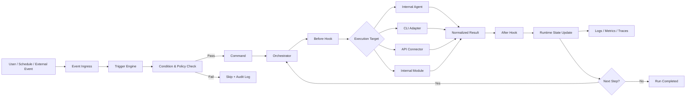
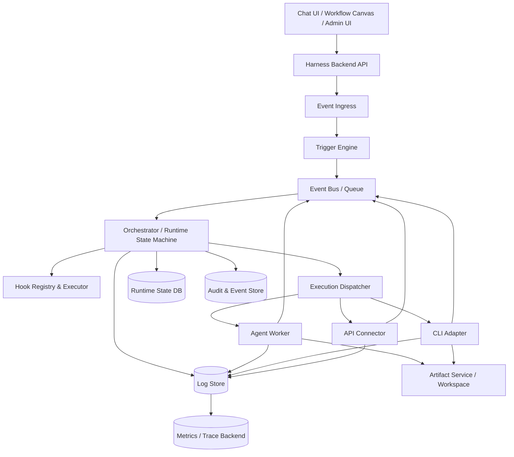

# Day 03 — Hook, Trigger, Integration and Runtime Observability

> Mục tiêu: chuyển nội dung học ngày 3 thành baseline chức năng và kiến trúc có thể dùng để thiết kế, code và review Harness.

---

## 1. Learning Objectives

Sau bài này, người học cần hiểu và có thể thiết kế được:

- Vì sao Harness cần hook và trigger thay vì chỉ có workflow, orchestrator và agent.
- Phân biệt hook, trigger, event, command và API call.
- Khi nào giao tiếp nội bộ không cần API; khi nào phải dùng API hoặc CLI adapter.
- Cách orchestrator kích hoạt agent, module nội bộ, CLI hoặc external service.
- Cách thiết kế retry, timeout, idempotency và error handling.
- Cách log toàn bộ workflow run, agent run, LLM call, hook execution và API call.
- Cách theo dõi runtime trên UI và backend.
- Các function cần có trong Harness để thực hiện các năng lực trên.

---

## 2. Vì sao Harness cần Hook và Trigger

Nếu Harness chỉ có workflow, orchestrator và agent, hệ thống vẫn chạy được khi người dùng bấm `Run`. Tuy nhiên, nó chưa tự phản ứng được khi trạng thái thay đổi.

Ví dụ:

- Artifact được tạo xong nhưng không tự gửi sang review.
- Reviewer approve nhưng bước release không tự chạy.
- File mới được push lên Git nhưng workflow không biết để validate.
- API ngoài trả kết quả nhưng workflow không tự resume.
- Runtime bị lỗi nhưng không phát cảnh báo.

Hook và trigger giải quyết khoảng trống này.

```text
Sự kiện xảy ra
    ↓
Hook quan sát hoặc can thiệp
    ↓
Trigger kiểm tra điều kiện
    ↓
Orchestrator nhận command/event
    ↓
Agent, module, CLI hoặc API được thực thi
```

---

## 3. Core Concepts

### 3.1 Event

Event là một sự kiện đã xảy ra trong hệ thống.

Ví dụ:

- `ARTIFACT_VERSION_CREATED`
- `REVIEW_APPROVED`
- `WORKFLOW_RUN_FAILED`
- `GIT_PUSH_RECEIVED`
- `LLM_CALL_COMPLETED`

Event mô tả sự thật trong quá khứ. Event không trực tiếp ra lệnh cho thành phần khác phải làm gì.

### 3.2 Command

Command là yêu cầu thực hiện một hành động.

Ví dụ:

- `START_WORKFLOW_RUN`
- `VALIDATE_ARTIFACT`
- `CREATE_REVIEW_CASE`
- `RETRY_AGENT_STEP`
- `PUBLISH_ARTIFACT`

Một trigger thường chuyển event thành command khi điều kiện được thỏa mãn.

### 3.3 Trigger

Trigger là định nghĩa cho biết **khi nào** một workflow, step hoặc action phải được kích hoạt.

Trigger cần tối thiểu:

- Event nguồn hoặc lịch chạy.
- Điều kiện.
- Action hoặc command đích.
- Chính sách retry và timeout.
- Quy tắc deduplication/idempotency.
- Logging và audit metadata.

Ví dụ:

```yaml
trigger_id: TRG-REVIEW-001
source_event: ARTIFACT_VERSION_CREATED
condition:
  artifact_type: API_SPEC
  validation_status: PASSED
action:
  command: CREATE_REVIEW_CASE
retry_policy: no_retry
```

### 3.4 Hook

Hook là điểm mở rộng được đặt tại một thời điểm xác định trong lifecycle của workflow hoặc runtime.

Ví dụ:

- `before_workflow_run`
- `after_workflow_run`
- `before_agent_call`
- `after_agent_call`
- `before_artifact_write`
- `after_artifact_write`
- `on_error`
- `on_review_approved`

Hook có thể dùng để:

- Validate input.
- Bổ sung context.
- Kiểm tra policy.
- Ghi log.
- Chặn hành động không hợp lệ.
- Phát event.
- Gửi notification.

**Quan hệ:** Hook là điểm can thiệp; trigger là luật kích hoạt dựa trên event/condition.

### 3.5 Runtime

Runtime là môi trường đang thực thi workflow thật.

Runtime quản lý:

- Workflow run state.
- Step execution.
- Agent invocation.
- Tool/CLI/API invocation.
- Timeout và retry.
- Checkpoint.
- Event emission.
- Runtime logs, metrics và traces.

### 3.6 Integration Module

Integration Module là adapter hoặc service chuyên giao tiếp với thành phần ngoài lõi workflow.

Ví dụ:

- Git adapter.
- Codex CLI adapter.
- Claude CLI adapter.
- LLM provider adapter.
- REST API connector.
- Google Drive connector.
- Notification connector.

Integration Module không tự quyết định flow. Orchestrator quyết định khi nào gọi nó.

---

## 4. Trigger khác Hook như thế nào

| Khía cạnh | Hook | Trigger |
|---|---|---|
| Bản chất | Điểm mở rộng trong lifecycle | Luật kích hoạt hành động |
| Câu hỏi trả lời | Can thiệp ở đâu? | Khi nào phải chạy? |
| Ví dụ | `before_agent_call` | Khi API spec pass validation thì tạo review case |
| Có điều kiện không | Có thể có | Luôn cần điều kiện hoặc lịch |
| Có phát command không | Có thể | Thường có |
| Phạm vi | Runtime/framework/workflow | Business workflow hoặc system automation |

Trong Harness nên hỗ trợ cả hai:

- Hook framework dùng chung toàn platform.
- Trigger definition cấu hình theo project hoặc workflow.

---

## 5. Khi nào cần API, khi nào không

### 5.1 Không cần API

Không bắt buộc dùng API khi orchestrator và agent/module chạy trong cùng process hoặc cùng runtime và có thể gọi trực tiếp qua function/interface.

```text
Orchestrator
    ↓ direct method call
Agent Executor
```

Ví dụ:

- Python function gọi Python module.
- Node service gọi internal class.
- Orchestrator gọi local adapter interface.

### 5.2 Có thể dùng internal message bus hoặc queue

Khi các worker tách process nhưng vẫn thuộc cùng Harness, nên dùng event bus hoặc queue nội bộ.

```text
Orchestrator → Queue → Agent Worker → Result Event → Orchestrator
```

Lợi ích:

- Asynchronous execution.
- Retry.
- Scale worker độc lập.
- Tách runtime state khỏi worker lifecycle.

### 5.3 Cần API

Nên dùng API khi hai đầu là deployable unit hoặc hệ thống độc lập, có boundary rõ ràng.

Ví dụ:

- Harness gọi remote agent service.
- Harness gọi SaaS hoặc enterprise system.
- Orchestrator gọi model gateway.
- Agent gọi remote document service.

Điều kiện thực tế:

- Khác process hoặc host.
- Khác ownership/deployment lifecycle.
- Cần authentication/authorization riêng.
- Cần contract versioning.
- Cần network isolation.

### 5.4 Gọi CLI

Nếu Harness gọi Codex CLI hoặc Claude CLI trong cùng machine/sandbox, không cần tạo REST API giả.

Nên dùng CLI Adapter:

```text
Orchestrator
    ↓
CLI Adapter
    ↓ spawn process
Codex CLI / Claude CLI
    ↓ stdout, stderr, exit code
CLI Adapter
    ↓ normalized result
Orchestrator
```

CLI Adapter chịu trách nhiệm:

- Build command an toàn.
- Set working directory.
- Set environment variables.
- Stream hoặc capture output.
- Timeout và kill process.
- Parse exit code.
- Mask secret.
- Chuẩn hóa kết quả.

---

## 6. Target Execution Flow



---

## 7. Functional Requirements

### FR-01 — Hook Registry

**Mục tiêu:** đăng ký và quản lý các hook mà runtime cho phép sử dụng.

**Hook types tối thiểu:**

- `before_workflow_run`
- `after_workflow_run`
- `before_step`
- `after_step`
- `before_agent_call`
- `after_agent_call`
- `before_tool_call`
- `after_tool_call`
- `before_artifact_write`
- `after_artifact_write`
- `on_error`
- `on_timeout`

**Business rules:**

- Hook phải có ID và version.
- Hook phải có scope: platform, workspace, project, workflow hoặc node.
- Hook có thể là blocking hoặc non-blocking.
- Security hook phải fail-closed.
- Hook không được sửa runtime state ngoài contract được cho phép.

---

### FR-02 — Trigger Definition Management

**Mục tiêu:** tạo, sửa, bật/tắt và version trigger.

**Input:** source event, condition, action, scope, retry policy.

**Output:** trigger ID, version, status.

**Acceptance:**

- Trigger có thể được validate trước khi activate.
- Thay đổi trigger tạo version mới.
- Runtime run phải ghi trigger version đã sử dụng.

---

### FR-03 — Event Ingress

**Mục tiêu:** nhận event từ UI, scheduler, Git webhook, API callback hoặc internal services.

**Event envelope:**

```json
{
  "event_id": "EVT-001",
  "event_type": "ARTIFACT_VERSION_CREATED",
  "occurred_at": "2026-07-26T10:00:00+09:00",
  "source": "artifact-service",
  "workspace_id": "WS-001",
  "project_id": "BD-001",
  "correlation_id": "COR-001",
  "trace_id": "TRC-001",
  "payload": {}
}
```

**Rule:** duplicate event không được tạo duplicate action.

---

### FR-04 — Trigger Evaluation

**Mục tiêu:** kiểm tra event với trigger conditions.

**Output:** matched, skipped hoặc rejected.

**Log bắt buộc:**

- Trigger ID/version.
- Event ID.
- Condition result.
- Action command.
- Skip/reject reason.

---

### FR-05 — Command Dispatch

**Mục tiêu:** chuyển trigger result thành command cho orchestrator.

**Rule:**

- Command phải có idempotency key.
- Command phải có actor và scope.
- Command phải gắn trace ID/correlation ID.
- Command không được chứa secret dạng plaintext trong log.

---

### FR-06 — Internal Agent Invocation

**Mục tiêu:** orchestrator gọi agent nằm trong cùng Harness runtime.

**Execution contract:**

```json
{
  "task_id": "TASK-001",
  "agent_id": "API-DESIGN-AGENT",
  "agent_version": "1.2.0",
  "input_artifacts": ["ART-001:VER-003"],
  "context_ref": "CTX-001",
  "timeout_seconds": 900
}
```

**Output:** normalized agent result, output artifact refs, status, usage metrics.

---

### FR-07 — CLI Adapter Invocation

**Mục tiêu:** gọi Codex CLI, Claude CLI hoặc command-line tool trong sandbox/runtime.

**Acceptance:**

- Không nối chuỗi command không kiểm soát.
- Working directory phải thuộc allowed workspace.
- Có timeout và process termination.
- Capture stdout, stderr và exit code.
- Secret phải được mask.
- CLI output được normalize trước khi trả orchestrator.

---

### FR-08 — API Connector Invocation

**Mục tiêu:** gọi external endpoint qua connector chuẩn hóa.

**Connector config:**

- Base URL.
- Authentication reference.
- Method/path.
- Request/response schema.
- Timeout.
- Retry policy.
- Rate limit policy.
- Circuit breaker policy.

**Rule:** agent không nên tự gọi raw endpoint tùy ý; phải đi qua Tool/Connector Registry và policy gate.

---

### FR-09 — Retry Policy

**Mục tiêu:** tự động retry lỗi tạm thời.

**Retryable:**

- Timeout.
- Connection reset.
- HTTP 429.
- HTTP 502/503/504.
- Worker unavailable.

**Không retry mặc định:**

- Validation error.
- Authentication/authorization failure.
- Invalid prompt contract.
- Business rule rejection.

**Rule:** retry phải dùng exponential backoff và giới hạn số lần.

---

### FR-10 — Idempotency and Deduplication

**Mục tiêu:** cùng một event/command không tạo kết quả lặp.

**Idempotency key có thể gồm:**

```text
workspace_id + workflow_id + event_id + action_type
```

**Acceptance:** hệ thống hỗ trợ at-least-once delivery nhưng business effect chỉ xảy ra một lần.

---

### FR-11 — Timeout and Cancellation

**Mục tiêu:** kiểm soát tác vụ treo hoặc chạy quá lâu.

**Yêu cầu:**

- Timeout ở workflow, step, agent, tool/API/CLI level.
- User có thể cancel run khi policy cho phép.
- Cancellation phải propagate xuống worker/process.
- Partial output phải được đánh dấu rõ, không coi là final artifact.

---

### FR-12 — Runtime Error Classification

**Error categories:**

- `VALIDATION_ERROR`
- `POLICY_DENIED`
- `AGENT_ERROR`
- `LLM_PROVIDER_ERROR`
- `CLI_EXECUTION_ERROR`
- `API_INTEGRATION_ERROR`
- `TIMEOUT`
- `RESOURCE_EXHAUSTED`
- `WORKSPACE_CONFLICT`
- `UNKNOWN_ERROR`

Mỗi error cần có error code, retryable flag, user-safe message và technical detail reference.

---

### FR-13 — Workflow Run Logging

Mỗi lần user bấm `Run` trên workflow canvas, hệ thống tạo một `workflow_run`.

Log tối thiểu:

- Workflow ID/version.
- Run ID.
- Trigger ID/version hoặc manual actor.
- Start/end time.
- Overall status.
- Current step.
- Input/output artifacts.
- Retry count.
- Error summary.
- Token/cost totals.

---

### FR-14 — Step and Agent Run Logging

Mỗi step/agent cần log:

```text
run_id
step_run_id
step_id
agent_id/version
skill_id/version
started_at
ended_at
status
input_refs
output_refs
retry_attempt
error_code
worker_id
```

Agent log và orchestrator log không giống nhau:

- Orchestrator log: flow đi đâu, bước nào đang chạy, tại sao rẽ nhánh.
- Agent log: agent đã xử lý gì và tạo ra kết quả nào.

---

### FR-15 — LLM Call Logging

Mỗi call tới LLM phải có một record riêng.

Nên lưu:

- Provider/model.
- Request timestamp và latency.
- Prompt template/version.
- Context/artifact references.
- Input/output token.
- Cost estimate.
- Finish reason.
- Tool calls.
- Error/retry.
- Safety/policy result.

Không mặc định lưu raw prompt/output nếu có dữ liệu nhạy cảm. Hệ thống cần policy cho redaction, encryption và retention.

---

### FR-16 — Hook Execution Logging

Mỗi hook invocation phải ghi:

- Hook ID/version.
- Hook point.
- Blocking/non-blocking.
- Input reference.
- Decision/result.
- Duration.
- Error.
- State mutation summary nếu có.

---

### FR-17 — API and CLI Call Logging

**API log:** endpoint alias, method, status code, latency, retry, request/response size.

**CLI log:** adapter, executable alias, exit code, duration, stdout/stderr reference.

Không log access token, API key, password hoặc secret command argument.

---

### FR-18 — Metrics and Tracing

Ngoài log, Harness cần metrics và distributed trace.

**Metrics:**

- Run success rate.
- Step failure rate.
- P50/P95/P99 latency.
- Queue wait time.
- Retry count.
- LLM token/cost.
- API rate-limit events.
- Active/stuck runs.

**Trace:** một `trace_id` phải nối được UI action → trigger → orchestrator → agent/tool/API → artifact output.

---

### FR-19 — Runtime Monitoring Dashboard

UI cần hiển thị:

- Running, waiting, completed, failed và cancelled runs.
- Current step và elapsed time.
- Trigger source.
- Agent/tool đang chạy.
- Retry và timeout.
- Input/output artifacts.
- Error detail.
- Logs, metrics và trace timeline.

---

### FR-20 — Alerting

Hệ thống phải phát alert khi:

- Workflow fail sau khi hết retry.
- Step vượt timeout.
- Queue backlog vượt threshold.
- LLM/API provider unavailable.
- Cost/token vượt budget.
- Security hook deny.
- Run bị stuck.

Alert phải gắn run ID, trace ID, severity và recommended action.

---

## 8. Runtime Log Model

### 8.1 Ba tầng log chính

1. **Audit/Event log** — ai làm gì, thay đổi trạng thái nào; immutable.
2. **Runtime execution log** — workflow, step, agent, tool chạy thế nào.
3. **Application/technical log** — diagnostic của service/process.

Không nên trộn cả ba vào một file text duy nhất.

### 8.2 Ví dụ runtime timeline

```text
10:05:00 RUN-001 STARTED by user-123
10:05:01 TRG-MANUAL matched
10:05:02 STEP-01 RequirementAnalysis STARTED
10:05:03 AGENT requirement-agent v1.4 invoked
10:05:25 LLM call completed: model=X, latency=22s, tokens=8,420
10:05:27 ART-FNC001-FACTS VER-001 created
10:05:28 STEP-01 COMPLETED
10:05:29 STEP-02 APIDesign STARTED
10:06:10 CLI codex exited 0
10:06:12 ART-FNC001-API VER-004 created
10:06:13 STEP-02 COMPLETED
10:06:14 RUN-001 COMPLETED
```

---

## 9. Backend Logical Architecture



---

## 10. Suggested Backend Modules

```text
src/
├── api/
├── runtime/
│   ├── orchestrator/
│   ├── state-machine/
│   ├── dispatcher/
│   └── cancellation/
├── hooks/
│   ├── registry/
│   ├── executor/
│   └── builtins/
├── triggers/
│   ├── definitions/
│   ├── evaluator/
│   └── scheduler/
├── events/
│   ├── ingress/
│   ├── bus/
│   └── outbox/
├── agents/
│   ├── registry/
│   └── workers/
├── integrations/
│   ├── api-connectors/
│   ├── cli-adapters/
│   ├── git/
│   └── llm-providers/
├── observability/
│   ├── logging/
│   ├── audit/
│   ├── metrics/
│   ├── tracing/
│   └── alerting/
├── artifacts/
└── policy/
```

---

## 11. Suggested Data Entities

| Entity | Mục đích |
|---|---|
| `hook_definition` | Hook ID, point, scope, version, mode |
| `trigger_definition` | Event, condition, action, version |
| `event_record` | Immutable event envelope |
| `command_record` | Command lifecycle và idempotency |
| `workflow_run` | Tổng trạng thái một lần chạy |
| `step_run` | Trạng thái từng node/step |
| `agent_run` | Execution của agent |
| `tool_call` | API, CLI hoặc tool invocation |
| `llm_call` | Model call metadata và usage |
| `runtime_error` | Error category và detail ref |
| `runtime_metric` | Metrics hoặc aggregate reference |
| `alert_record` | Alert lifecycle |

---

## 12. UI/UX Requirements

### 12.1 Workflow Canvas

Mỗi node cần cấu hình được:

- Agent/module/tool đích.
- Input/output mapping.
- Before/after hooks.
- Timeout.
- Retry policy.
- Error branch.
- Trigger entry nếu node là start node.

### 12.2 Trigger Designer

UI nên cho phép:

- Chọn event nguồn.
- Tạo condition bằng form hoặc expression.
- Chọn action/workflow.
- Test trigger bằng sample event.
- Activate/deactivate.
- Xem version và execution history.

### 12.3 Runtime Run Detail

Cần có:

- Timeline từ trigger đến completion.
- Workflow graph với node status real-time.
- Log theo orchestrator/agent/API/CLI/LLM.
- Input/output artifact links.
- Retry/cancel controls.
- Error details và suggested remediation.

---

## 13. Non-Functional Requirements

### NFR-01 — Reliability

- Event delivery tối thiểu at-least-once.
- Consumer phải idempotent.
- State update dùng optimistic concurrency.
- Critical event dùng transactional outbox.

### NFR-02 — Security

- Secret không xuất hiện trong log.
- Tool/API/CLI call phải qua policy gate.
- Workspace và tenant phải được isolation.
- Hook bảo mật phải fail-closed.

### NFR-03 — Observability

- Mọi run có trace ID.
- Có log, metric và trace correlation.
- Có retention và redaction policy.
- Có SLO cho success rate và latency.

### NFR-04 — Extensibility

- Hook, trigger, connector và adapter phải versionable.
- Có backward compatibility hoặc deprecation policy.
- Agent không phụ thuộc trực tiếp implementation cụ thể của API/CLI.

---

## 14. Architecture Decisions

### ADR-01 — Hook và Trigger là hai capability khác nhau

**Decision:** Hook Registry và Trigger Engine được thiết kế tách biệt.

**Reason:** Hook là lifecycle extension point; trigger là event-condition-action automation.

### ADR-02 — Internal call không bắt buộc đi qua REST API

**Decision:** cùng process dùng interface/function call; cross-process dùng queue/RPC; external boundary mới dùng API connector.

**Reason:** tránh network hop và service fragmentation không cần thiết.

### ADR-03 — CLI được bọc bằng Adapter

**Decision:** Codex CLI/Claude CLI không được gọi trực tiếp từ workflow definition.

**Reason:** kiểm soát sandbox, timeout, command injection, logging và normalized result.

### ADR-04 — Log không phải chỉ là text file

**Decision:** tách audit event, runtime execution log và technical log.

**Reason:** hỗ trợ traceability, monitoring và compliance mà không phụ thuộc folder structure.

### ADR-05 — Git không thay thế runtime observability

**Decision:** Git quản lý content/version; Harness runtime quản lý execution, trigger, agent và integration history.

---

## 15. Minimum POC Scope

POC ngày 3 nên triển khai:

1. Manual trigger từ Workflow Canvas.
2. Một event trigger: `ARTIFACT_VERSION_CREATED`.
3. Hook `before_agent_call` và `after_agent_call`.
4. Một internal agent invocation.
5. Một Codex hoặc Claude CLI adapter.
6. Một REST API connector mẫu.
7. Retry + timeout + idempotency.
8. Workflow/step/agent/tool/LLM logs.
9. Runtime timeline UI cơ bản.
10. Alert khi run fail.

---

## 16. Completion Checklist

- [ ] Phân biệt được event, command, hook và trigger.
- [ ] Biết khi nào dùng direct call, queue, CLI adapter hoặc API connector.
- [ ] Thiết kế được trigger definition có condition và action.
- [ ] Thiết kế được hook points trong runtime.
- [ ] Thiết kế được retry, timeout, cancellation và idempotency.
- [ ] Phân biệt orchestrator log, agent log, LLM log và audit log.
- [ ] Nối được một trace từ UI tới artifact output.
- [ ] Mô tả được backend modules và data entities cần build.
- [ ] Xác định được POC scope cho ngày 3.

---

## 17. Key Takeaway

Một Harness hoàn chỉnh không chỉ là nơi chạy agent. Nó phải có cơ chế nhận sự kiện, đánh giá trigger, thực thi hook, điều phối nhiều loại execution target và quan sát toàn bộ runtime.

Công thức kiến trúc của ngày 3:

```text
Event
→ Trigger
→ Command
→ Orchestrator
→ Hook
→ Agent / Internal Module / CLI Adapter / API Connector
→ Runtime State
→ Log + Metric + Trace + Alert
```
