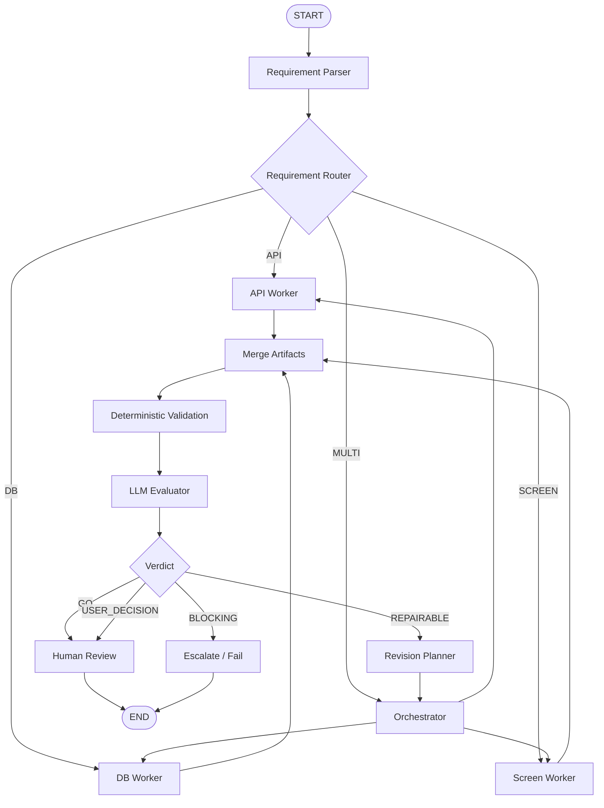

# Day 04 — Workflow Patterns and LangGraph Mapping

> Mục tiêu: hiểu năm workflow pattern cốt lõi, cách chúng map thành graph và cách triển khai PoC bằng LangGraph mà không khóa kiến trúc Harness vào một framework cụ thể.

---

## 1. Learning Objectives

Sau bài này, người học cần hiểu và có thể thiết kế được:

- Phân biệt workflow với agent.
- Nhận diện năm pattern: Prompt Chaining, Routing, Parallelization, Orchestrator–Workers và Evaluator–Optimizer.
- Map business flow thành node, edge, conditional edge, fan-out/fan-in và loop.
- Xác định state cần truyền giữa các node.
- Thiết kế subgraph như một execution unit hoặc agent boundary.
- Sử dụng LangGraph như execution engine cho PoC mà không trộn business logic vào framework API.
- Thiết kế retry kỹ thuật, revision nghiệp vụ và stop condition đúng tầng.

---

## 2. Workflow khác Agent như thế nào

Workflow là luồng điều phối được xác định trước hoặc bị giới hạn trong một tập rule rõ ràng.

Agent là execution unit có khả năng lựa chọn hành động trong phạm vi được cho phép dựa trên context, mục tiêu và kết quả quan sát được.

```text
Workflow
= predefined or policy-bounded coordination

Agent
= bounded decision-making execution unit
```

Không phải mọi node đều là agent. Không phải mọi subgraph đều là agent. Một subgraph chỉ nên được gọi là agent khi nó có ít nhất:

- Mục tiêu riêng.
- Input/output contract riêng.
- Quyền lựa chọn hành động trong allow-list.
- Stop condition.
- Quan sát kết quả và điều chỉnh hành động.

---

## 3. LangGraph Core Primitives

### 3.1 State

State là workflow memory dùng chung trong một graph run.

```python
state = {
    "requirement": None,
    "requirement_type": None,
    "api_spec": None,
    "db_spec": None,
    "screen_spec": None,
    "review": None,
    "iteration": 0
}
```

Node đọc state và trả phần state update. Node không nên gọi trực tiếp node khác.

### 3.2 Node

Node là một bước xử lý độc lập.

Ví dụ:

- Requirement Parser
- Requirement Router
- API Design Worker
- DB Design Worker
- Merge Node
- Reviewer

### 3.3 Edge

Edge xác định thứ tự thực thi.

```text
Parser → Generator → Reviewer
```

### 3.4 Conditional Edge

Conditional edge chọn node tiếp theo dựa trên state hoặc kết quả của router/evaluator.

```text
Reviewer
├── PASS → END
└── FAIL → Generator
```

### 3.5 START và END

`START` là điểm bắt đầu graph. `END` là terminal state.

### 3.6 Subgraph

Subgraph đóng gói một cụm node thành execution unit tái sử dụng.

Ví dụ `API Design Subgraph`:

```text
Parse API Requirement
→ Generate API Draft
→ Validate OpenAPI
→ Review
→ Revise nếu cần
```

---

## 4. Pattern 1 — Prompt Chaining

Prompt Chaining dùng khi bước sau phụ thuộc trực tiếp output bước trước.

```text
Input
→ Extract Facts
→ Generate Draft
→ Format Output
```

### Khi nào dùng

- Có dependency tuyến tính rõ ràng.
- Mỗi bước giảm độ phức tạp cho bước sau.
- Cần validate output trung gian.

### LangGraph mapping

```text
Node A → Node B → Node C
```

### BD example

```text
Requirement Document
→ Requirement Fact Extraction
→ API Draft Generation
→ API Format Normalization
```

### Design rules

- Mỗi node có input/output contract rõ ràng.
- Không truyền raw text vô hạn qua toàn chuỗi.
- Intermediate output quan trọng nên trở thành artifact.
- Validation failure không được âm thầm chuyển sang node tiếp theo.

---

## 5. Pattern 2 — Routing

Routing chọn nhánh xử lý phù hợp theo input hoặc state.

```text
Requirement
→ Classifier
├── API
├── DB
├── SCREEN
└── BATCH
```

Router có thể là:

- Rule-based function.
- Python tool.
- Schema validator.
- LLM classifier.
- Policy engine.

### LangGraph mapping

```text
Router Node
→ add_conditional_edges(...)
```

### Routing contract

```json
{
  "route": "API",
  "reason": "Requirement defines HTTP endpoint and response contract",
  "confidence": 0.91
}
```

`confidence` của LLM chỉ là metadata, không nên là security decision hoặc policy gate duy nhất.

### Design rules

- Route values phải thuộc allow-list.
- Unknown route phải đi vào fallback hoặc human decision.
- Router output phải có reason/evidence.
- Không để LLM trả tên node hoặc command tùy ý.

---

## 6. Pattern 3 — Parallelization

Parallelization chạy đồng thời các task độc lập và hợp nhất kết quả.

```text
Requirement Facts
├── API Worker
├── DB Worker
├── Screen Worker
└── Batch Worker
        ↓
      Merge
```

### Hai dạng chính

1. Sectioning: chia input thành phần độc lập.
2. Voting: nhiều worker xử lý cùng task để tăng độ tin cậy.

### LangGraph mapping

```text
Fan-out → parallel nodes → fan-in/merge node
```

### State design

Không để nhiều worker ghi đè cùng key.

```python
state = {
    "api_outputs": [],
    "db_outputs": [],
    "screen_outputs": [],
    "errors": []
}
```

### Design rules

- Chỉ parallel khi task thật sự độc lập.
- Merge node phải xử lý partial failure.
- Có timeout theo worker.
- Có concurrency limit và cost budget.
- Output của từng worker phải giữ provenance riêng.

---

## 7. Pattern 4 — Orchestrator–Workers

Orchestrator phân tích task, sinh work plan, dispatch worker và tổng hợp kết quả.

```text
Complex Requirement
→ Orchestrator
→ Work Items
├── Worker A
├── Worker B
└── Worker C
→ Aggregator
```

Khác Parallelization cố định, số lượng và loại worker trong pattern này có thể được xác định động.

### Orchestrator responsibilities

- Đọc goal và constraints.
- Chia nhỏ task.
- Chọn worker trong registry.
- Gán input và acceptance criteria.
- Theo dõi completion.
- Tổng hợp hoặc yêu cầu làm lại.

### Worker responsibilities

- Chỉ xử lý task được giao.
- Không tự thay đổi workflow toàn cục.
- Trả normalized result.
- Ghi output artifact và evidence.

### Work item contract

```json
{
  "work_item_id": "WI-001",
  "worker_type": "API_DESIGN",
  "objective": "Generate API design for FNC001",
  "input_artifacts": ["REQ-FNC001:V2"],
  "acceptance_criteria": [
    "All requirement IDs mapped",
    "Error responses defined"
  ],
  "timeout_seconds": 900
}
```

### Design rules

- Orchestrator chỉ được chọn action trong allow-list.
- Có maximum number of work items.
- Có maximum orchestration loops.
- Worker không được cấp toàn bộ context nếu không cần.
- Runtime, không phải orchestrator, kiểm soát lifecycle và retry kỹ thuật.

---

## 8. Pattern 5 — Evaluator–Optimizer

Evaluator–Optimizer tạo feedback loop để cải tiến output.

```text
Generate
→ Evaluate
├── PASS → Accept
└── FAIL_REPAIRABLE → Revise → Evaluate lại
```

### Optimizer

Thành phần tạo hoặc sửa candidate output.

### Evaluator

Thành phần kiểm tra candidate theo tiêu chí định trước.

Evaluator có thể gồm:

- Deterministic validator.
- Python test.
- Schema checker.
- LLM reviewer.
- Human reviewer.

### Verdict đề xuất

```text
GO
NO_GO_REPAIRABLE
NO_GO_BLOCKING
NEED_USER_DECISION
```

### Evaluation contract

```json
{
  "verdict": "NO_GO_REPAIRABLE",
  "score": 78,
  "findings": [
    {
      "criterion": "error_response_design",
      "severity": "major",
      "message": "Missing HTTP 409 for stale version conflict"
    }
  ],
  "required_changes": [
    "Add expected_version",
    "Add VERSION_CONFLICT response"
  ]
}
```

### Retry khác Revision

- Retry kỹ thuật: timeout, HTTP 503, worker crash.
- Revision nghiệp vụ: output tạo thành công nhưng chưa đạt quality gate.

Revision phải tạo attempt mới và thường tạo artifact version mới.

### Stop conditions

```yaml
max_iterations: 3
max_duration_seconds: 1800
max_cost_minor: 3000
minimum_improvement: 3
stagnation_limit: 2
```

---

## 9. Complete Day 4 PoC Graph



---

## 10. Suggested State

```python
from typing import TypedDict, Literal

class BDWorkflowState(TypedDict, total=False):
    run_id: str
    project_id: str
    requirement_artifact_id: str
    requirement_version_id: str
    requirement_text: str
    requirement_type: Literal["API", "DB", "SCREEN", "MULTI", "UNKNOWN"]
    work_items: list[dict]
    worker_results: list[dict]
    output_artifact_ids: list[str]
    validation_result: dict
    evaluation_result: dict
    verdict: str
    iteration: int
    max_iterations: int
    errors: list[dict]
```

State chỉ chứa runtime references và data cần điều phối. Artifact content lớn nên nằm trong Artifact Store, state giữ ID/version reference.

---

## 11. Minimal LangGraph Skeleton

```python
from langgraph.graph import StateGraph, START, END

builder = StateGraph(BDWorkflowState)

builder.add_node("parse", parse_requirement)
builder.add_node("route", route_requirement)
builder.add_node("api", generate_api)
builder.add_node("db", generate_db)
builder.add_node("screen", generate_screen)
builder.add_node("merge", merge_outputs)
builder.add_node("validate", validate_outputs)
builder.add_node("evaluate", evaluate_outputs)
builder.add_node("revise", plan_revision)

builder.add_edge(START, "parse")
builder.add_edge("parse", "route")

builder.add_conditional_edges(
    "route",
    select_requirement_route,
    {
        "API": "api",
        "DB": "db",
        "SCREEN": "screen"
    }
)

builder.add_edge("api", "merge")
builder.add_edge("db", "merge")
builder.add_edge("screen", "merge")
builder.add_edge("merge", "validate")
builder.add_edge("validate", "evaluate")

builder.add_conditional_edges(
    "evaluate",
    select_evaluation_route,
    {
        "GO": END,
        "REPAIR": "revise",
        "BLOCK": END
    }
)

builder.add_edge("revise", "route")

graph = builder.compile()
```

Đây chỉ là execution mapping. Artifact versioning, policy, audit, idempotency và human review vẫn thuộc Harness runtime và surrounding services.

---

## 12. Functional Requirements

### FR-01 — Workflow Definition

Workflow phải có ID, version, nodes, edges, entry point và terminal conditions.

### FR-02 — Node Contract

Mỗi node phải khai báo input state keys, output state keys, timeout, retry policy và execution target.

### FR-03 — Conditional Routing

Conditional edge chỉ được trả route thuộc allow-list đã đăng ký.

### FR-04 — Parallel Execution

Runtime phải hỗ trợ fan-out, concurrency limit, timeout và fan-in aggregation.

### FR-05 — Subgraph Registration

Subgraph phải có ID/version, input/output contract và dependency list.

### FR-06 — Evaluation Loop

Loop phải có verdict contract, maximum iterations, cost/time budget và escalation rule.

### FR-07 — Human Gate

Graph có thể pause tại review node và resume bằng explicit decision bound to artifact version.

### FR-08 — Observability

Mỗi node run phải ghi start/end, status, attempt, input refs, output refs, model/tool và error category.

### FR-09 — Framework Isolation

Business service và worker logic không được phụ thuộc trực tiếp vào LangGraph state object ngoài adapter boundary.

---

## 13. Non-Functional Requirements

- Workflow definitions phải versioned.
- Node execution phải idempotent hoặc có idempotency key.
- State update phải deterministic ở mức control data.
- Không ghi secret vào state hoặc log.
- Parallel fan-out phải có concurrency limit.
- Evaluation loop không được chạy vô hạn.
- Resume phải dùng đúng workflow version và checkpoint version.

---

## 14. Day 4 Completion Checklist

- [ ] Vẽ được năm pattern dưới dạng graph.
- [ ] Phân biệt node, agent và subgraph.
- [ ] Thiết kế state chỉ chứa orchestration data và artifact references.
- [ ] Thiết kế router allow-list.
- [ ] Thiết kế fan-out/fan-in.
- [ ] Phân biệt retry kỹ thuật và revision nghiệp vụ.
- [ ] Đặt stop condition cho evaluator loop.
- [ ] Hiểu LangGraph là execution engine, không phải toàn bộ Harness.

---

## 15. Key Takeaway

Năm workflow pattern không phải năm framework khác nhau. Chúng là năm cấu trúc điều phối có thể biểu diễn bằng graph primitives. LangGraph phù hợp để kiểm chứng các cấu trúc đó trong PoC, nhưng kiến trúc Harness phải giữ business logic, artifact management, policy và runtime governance độc lập với framework.
