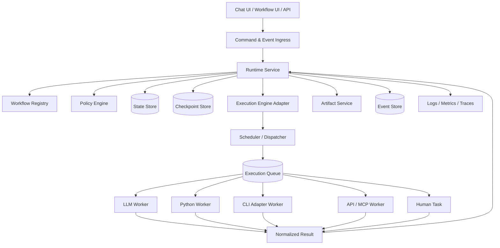

# Day 05 — Execution Runtime Architecture

> Mục tiêu: thiết kế baseline chức năng và kiến trúc cho một Harness Runtime có thể chạy workflow bền vững, quản lý state, checkpoint, retry, pause/resume, artifact, audit và human gate.

---

## 1. Learning Objectives

Sau bài này, người học cần hiểu và có thể thiết kế được:

- Phân biệt workflow definition, execution engine và runtime.
- Vòng đời của một workflow run từ lúc trigger đến khi hoàn tất.
- State, checkpoint, node run, attempt và artifact version khác nhau như thế nào.
- Retry kỹ thuật khác revision nghiệp vụ như thế nào.
- Cách pause/resume cho human-in-the-loop.
- Cách runtime phối hợp với LangGraph, worker, queue, artifact service và policy engine.
- Data model tối thiểu cho một runtime tự build.
- Functional và non-functional requirements cần thiết cho PoC và hướng production.

---

## 2. Runtime là gì

Workflow chỉ mô tả logic cần chạy.

```text
START → Parser → Generator → Reviewer → END
```

Execution engine thực thi graph hoặc state machine.

Runtime quản lý toàn bộ vòng đời thực thi:

- Tạo run.
- Load workflow version.
- Tạo và lưu state.
- Chọn node tiếp theo.
- Dispatch execution.
- Theo dõi attempt.
- Checkpoint.
- Retry.
- Pause/resume.
- Áp dụng policy.
- Ghi log, metrics và traces.
- Đăng ký artifact.
- Kết thúc hoặc hủy run.

```text
Workflow Definition
        ↓
Harness Runtime
        ↓
Execution Engine
        ↓
Node Executor
        ↓
LLM / Python / CLI / API / MCP
```

LangGraph có thể là execution engine. Nó không thay thế toàn bộ runtime và surrounding control plane.

---

## 3. Component Boundaries

### 3.1 Workflow Registry

Quản lý workflow definition và version.

Mỗi workflow version cần có:

- Workflow ID/version.
- Nodes và edges.
- Entry point.
- Terminal conditions.
- Required agent/tool/skill versions.
- Input/output schema.
- Runtime policy reference.

### 3.2 Runtime Service

Điều phối vòng đời run và state transition.

Runtime không nên chứa prompt nghiệp vụ hoặc trực tiếp xử lý document content.

### 3.3 Execution Engine Adapter

Adapter trừu tượng hóa LangGraph, Prefect, Temporal hoặc engine khác.

```python
class ExecutionEngine:
    def start(self, run_context): ...
    def resume(self, checkpoint_ref, input_data): ...
    def cancel(self, run_id): ...
    def get_next_actions(self, state_ref): ...
```

### 3.4 Scheduler and Dispatcher

Xác định execution nào sẵn sàng chạy và dispatch cho worker phù hợp.

### 3.5 Worker / Executor

Thực thi một node cụ thể:

- LLM worker.
- Python worker.
- CLI adapter.
- API connector.
- MCP tool executor.
- Human task adapter.

### 3.6 State Store

Lưu control state của workflow. Không nên dùng state store để lưu toàn bộ file lớn.

### 3.7 Checkpoint Store

Lưu snapshot hoặc durable reference đủ để resume.

### 3.8 Artifact Service

Quản lý artifact identity, version, lifecycle, checksum và provenance.

### 3.9 Event Store / Audit Log

Lưu immutable event history phục vụ audit và reconstruction.

### 3.10 Policy Engine

Quyết định hành động nào được phép:

- Retry hay fail.
- Auto-approve hay human gate.
- Có được gọi tool hay không.
- Budget còn đủ không.
- Loop có được tiếp tục không.

### 3.11 Observability

Thu thập logs, metrics và traces theo run, node, attempt, model và tool.

---

## 4. Target Architecture



PoC có thể chạy cùng process và chưa cần queue. Boundary vẫn nên được giữ bằng interface để sau này tách worker mà không viết lại business logic.

---

## 5. Core Runtime Objects

### 5.1 WorkflowRun

Một lần thực thi của một workflow version.

```yaml
workflow_run_id: RUN-2026-000123
workflow_id: BD-GENERATION
workflow_version: 1.2.0
workspace_id: WS-001
project_id: BD-001
status: RUNNING
current_phase: DESIGN
state_ref: STATE-000123
checkpoint_ref: CP-000008
trigger_id: TRG-001
trigger_version: 2
created_by: user-01
started_at: 2026-08-02T22:00:00+09:00
ended_at: null
```

### 5.2 NodeRun

Một node logical trong một workflow run.

```yaml
node_run_id: NR-001
workflow_run_id: RUN-2026-000123
node_id: API-DESIGN
node_version: 3
status: RUNNING
attempt_count: 2
input_artifact_refs:
  - REQ-FNC001:V2
output_artifact_refs: []
```

### 5.3 ExecutionAttempt

Một lần gọi execution target.

```yaml
attempt_id: ATT-002
node_run_id: NR-001
attempt_number: 2
executor_type: LLM
executor_id: API-DESIGN-AGENT
executor_version: 1.3.0
status: SUCCEEDED
started_at: ...
ended_at: ...
error_category: null
```

Attempt không đồng nghĩa với artifact version. Attempt có thể fail trước khi tạo artifact.

### 5.4 WorkflowState

Control state và references cần để điều phối.

```json
{
  "run_id": "RUN-2026-000123",
  "current_node": "API-DESIGN",
  "requirement_ref": "REQ-FNC001:V2",
  "draft_refs": ["ART-API:V1"],
  "verdict": "NO_GO_REPAIRABLE",
  "iteration": 1,
  "max_iterations": 3,
  "pending_human_task_id": null
}
```

### 5.5 Checkpoint

Durable point để resume.

```yaml
checkpoint_id: CP-000008
workflow_run_id: RUN-2026-000123
workflow_version: 1.2.0
state_ref: STATE-000123-V8
completed_nodes:
  - PARSE
  - ROUTE
current_node: API-DESIGN
created_at: ...
```

Checkpoint phải gắn với workflow version và state schema version cụ thể.

### 5.6 HumanTask

```yaml
human_task_id: HT-001
workflow_run_id: RUN-2026-000123
artifact_version_id: ART-API:V2
task_type: REVIEW
status: PENDING
assigned_to: reviewer-01
decision_options:
  - APPROVE
  - REQUEST_REVISION
  - REJECT
```

---

## 6. Workflow Run Lifecycle

```text
CREATED
→ QUEUED
→ RUNNING
→ WAITING_FOR_HUMAN
→ RUNNING
→ COMPLETED
```

Các terminal states:

```text
COMPLETED
FAILED
CANCELLED
EXHAUSTED
REJECTED
```

### Transition rules

- `CREATED → QUEUED`: workflow và input đã validate.
- `QUEUED → RUNNING`: scheduler cấp execution slot.
- `RUNNING → WAITING_FOR_HUMAN`: tạo human task và checkpoint.
- `WAITING_FOR_HUMAN → RUNNING`: nhận decision hợp lệ đúng artifact version.
- `RUNNING → FAILED`: lỗi blocking hoặc retry exhausted.
- `RUNNING → COMPLETED`: đạt terminal condition và output đã persist.

---

## 7. End-to-End Execution Flow

Ví dụ user bấm `Generate API Design`.

```text
1. API nhận StartWorkflowCommand
2. Validate identity, workspace, workflow version và input artifact
3. Tạo WorkflowRun
4. Tạo initial state
5. Phát WORKFLOW_RUN_CREATED
6. Scheduler chọn entry node
7. Tạo NodeRun và Attempt
8. Dispatch tới worker
9. Worker trả normalized result
10. Runtime persist result và artifact references
11. State transition + checkpoint
12. Chọn node tiếp theo
13. Nếu human gate: tạo HumanTask và pause
14. Khi có decision: validate version và resume
15. Hoàn tất, fail hoặc cancel
```

---

## 8. Functional Requirements

### FR-01 — Start Workflow Run

**Input:** workflow ID/version, workspace, project, input artifact refs, actor, idempotency key.

**Output:** run ID và status.

**Rules:**

- Workflow version phải tồn tại và active.
- Input schema phải pass validation.
- Cùng idempotency key không tạo duplicate run.

### FR-02 — Run State Management

Runtime phải persist state sau mỗi meaningful transition.

State update cần:

- Optimistic locking hoặc version number.
- Schema version.
- Timestamp và actor/system source.
- Trace ID.

### FR-03 — Node Scheduling

Runtime xác định node sẵn sàng dựa trên dependency, conditions và policy.

Không dispatch node nếu input dependencies chưa hoàn tất.

### FR-04 — Execution Dispatch

Mỗi dispatch phải có normalized execution contract:

```json
{
  "run_id": "RUN-001",
  "node_run_id": "NR-001",
  "attempt_id": "ATT-001",
  "executor_type": "PYTHON",
  "executor_ref": "validate_openapi:1.0.0",
  "input_refs": ["ART-API:V1"],
  "context_ref": "CTX-001",
  "timeout_seconds": 300,
  "idempotency_key": "RUN-001:NR-001:ATT-001"
}
```

### FR-05 — Retry Management

Retry kỹ thuật áp dụng cho lỗi tạm thời:

- Timeout.
- Connection reset.
- HTTP 429/502/503/504.
- Worker unavailable.

Không retry mặc định:

- Validation failure.
- Authorization failure.
- Policy rejection.
- Business verdict `NO_GO_BLOCKING`.

Retry policy cần max attempts, exponential backoff và jitter.

### FR-06 — Business Revision Loop

Revision không được dùng chung counter với transport retry.

Runtime phải lưu:

- Iteration number.
- Source evaluator result.
- Change request.
- Candidate artifact version.
- Improvement metric.
- Stop reason.

### FR-07 — Checkpoint

Checkpoint phải được tạo tối thiểu:

- Sau node hoàn tất.
- Trước khi pause human task.
- Trước external callback dài hạn.
- Trước khi workflow chuyển ownership sang worker khác.

### FR-08 — Resume

Resume cần:

- Run ở trạng thái có thể resume.
- Checkpoint hợp lệ.
- Workflow version tương thích.
- Input resume đúng schema.
- Human decision gắn đúng artifact version nếu là review.

### FR-09 — Pause / Human-in-the-Loop

Runtime tạo human task, persist checkpoint và chuyển run sang `WAITING_FOR_HUMAN`.

Runtime không giữ process hoặc thread chờ người dùng.

### FR-10 — Cancellation

User hoặc system có thể cancel run.

Runtime phải:

- Chặn dispatch mới.
- Gửi cancel signal tới attempt đang chạy nếu hỗ trợ.
- Persist `CANCELLED`.
- Không xóa artifact đã tạo.

### FR-11 — Timeout

Timeout cần ở nhiều tầng:

- Workflow run.
- Node run.
- Execution attempt.
- LLM/tool/API/CLI call.
- Human task SLA.

### FR-12 — Artifact Registration

Khi node tạo output, runtime gọi Artifact Service để đăng ký artifact/version và gắn provenance:

```text
workflow version
→ workflow run
→ node run
→ attempt
→ executor/model/tool version
→ input artifact versions
→ output artifact version
```

### FR-13 — Event Emission

Runtime phát domain/runtime events:

- `WORKFLOW_RUN_CREATED`
- `WORKFLOW_RUN_STARTED`
- `NODE_RUN_STARTED`
- `EXECUTION_ATTEMPT_FAILED`
- `CHECKPOINT_CREATED`
- `HUMAN_TASK_CREATED`
- `ARTIFACT_VERSION_CREATED`
- `WORKFLOW_RUN_COMPLETED`

### FR-14 — Idempotency

Các command và callbacks phải có idempotency key.

At-least-once delivery được phép, nhưng business effect chỉ xảy ra một lần.

### FR-15 — Policy Enforcement

Policy engine kiểm tra trước các hành động nhạy cảm:

- Gọi external tool.
- Ghi artifact.
- Tiếp tục revision loop.
- Release output.
- Bỏ qua human gate.

### FR-16 — Runtime Query API

UI cần query được:

- Current status.
- Current node.
- Timeline.
- Attempts.
- Pending human task.
- Input/output artifacts.
- Cost/token metrics.
- Error và retry history.

### FR-17 — Manual Intervention

Operator có thể:

- Retry node có kiểm soát.
- Skip node nếu policy cho phép.
- Supply missing input.
- Resume.
- Cancel.
- Mark failed.

Mọi intervention phải audit được.

---

## 9. Retry, Revision và Resume

Ba khái niệm này phải tách biệt.

### Retry

Thực hiện lại cùng operation vì lỗi kỹ thuật tạm thời.

```text
Attempt 1 → timeout
Attempt 2 → success
```

### Revision

Tạo candidate mới vì output chưa đạt chất lượng.

```text
Artifact V1
→ Evaluator feedback
→ Artifact V2
```

### Resume

Tiếp tục workflow từ checkpoint sau pause hoặc interruption.

```text
WAITING_FOR_HUMAN
→ decision
→ resume từ checkpoint
```

---

## 10. Stop Conditions and Budgets

Mọi loop phải có giới hạn.

```yaml
max_revision_iterations: 3
max_transport_retries: 4
max_run_duration_seconds: 3600
max_node_duration_seconds: 900
max_cost:
  amount_minor: 5000
  currency: JPY
stagnation_limit: 2
human_escalation_after_iteration: 2
```

Stop khi:

- Quality gate pass.
- Blocking finding.
- Budget exhausted.
- Time exhausted.
- Không cải thiện.
- Cần business decision.
- Security/policy violation.

---

## 11. Data Model

### workflow_runs

```text
workflow_run_id PK
workflow_id
workflow_version
workspace_id
project_id
status
state_version
current_node_id
checkpoint_id
trigger_id
trigger_version
created_by
started_at
ended_at
cancel_requested_at
failure_code
failure_message
```

### node_runs

```text
node_run_id PK
workflow_run_id FK
node_id
node_version
status
attempt_count
started_at
ended_at
```

### execution_attempts

```text
attempt_id PK
node_run_id FK
attempt_number
executor_type
executor_id
executor_version
status
input_ref_json
output_ref_json
error_category
error_message
started_at
ended_at
```

### workflow_states

```text
state_id PK
workflow_run_id FK
state_version
schema_version
state_json
created_at
```

### checkpoints

```text
checkpoint_id PK
workflow_run_id FK
workflow_version
state_id
current_node_id
completed_nodes_json
created_at
```

### human_tasks

```text
human_task_id PK
workflow_run_id FK
artifact_version_id
status
assigned_to
decision
decision_comment
created_at
decided_at
```

### runtime_events

```text
event_id PK
workflow_run_id
node_run_id
attempt_id
event_type
occurred_at
trace_id
correlation_id
payload_json
```

---

## 12. Runtime APIs

```text
POST   /workflow-runs
GET    /workflow-runs/{run_id}
POST   /workflow-runs/{run_id}/cancel
POST   /workflow-runs/{run_id}/resume
GET    /workflow-runs/{run_id}/timeline
GET    /workflow-runs/{run_id}/nodes
POST   /node-runs/{node_run_id}/retry
GET    /human-tasks
POST   /human-tasks/{task_id}/decision
```

Command APIs nên trả nhanh sau khi persist command/run. Long-running execution chạy async.

---

## 13. Observability

### Logs

Structured logs phải có:

- `trace_id`
- `correlation_id`
- `workflow_run_id`
- `node_run_id`
- `attempt_id`
- `artifact_id/version_id`
- `executor_id/version`
- Error category

### Metrics

- Active runs.
- Queue depth.
- Node duration.
- Retry rate.
- Failure rate.
- Human wait time.
- Token/cost per run.
- Revision iterations.
- Artifact acceptance rate.

### Traces

Một distributed trace cần nối được:

```text
API request
→ Runtime
→ Scheduler
→ Worker
→ LLM/tool call
→ Artifact write
→ State update
```

---

## 14. Security and Governance

- Runtime không lưu plaintext secret trong state hoặc event.
- Worker chỉ nhận scoped credential reference.
- Tool và API phải qua registry/policy.
- Workspace path phải được allow-list.
- Human decision phải xác thực actor và artifact version.
- Released artifact immutable.
- Manual intervention phải audit được.
- Runtime service account áp dụng least privilege.

---

## 15. PoC Architecture

PoC 3 tháng có thể bắt đầu bằng modular monolith:

```text
FastAPI Backend
├── Runtime Service
├── LangGraph Adapter
├── In-process Scheduler
├── Worker Interfaces
├── Artifact Service
├── Policy Module
└── Observability Module

PostgreSQL
├── Run State
├── Checkpoint
├── Artifact Metadata
└── Audit Events

Local/Git Workspace
└── Artifact Content
```

Có thể chưa cần:

- Kafka.
- Kubernetes.
- Distributed scheduler.
- Dedicated event store.
- Multi-region deployment.

Nhưng interface boundary phải cho phép thêm queue và remote worker sau này.

---

## 16. Production Evolution

```text
PoC: In-process execution
  ↓
Phase 2: Durable DB + background workers
  ↓
Phase 3: Queue + isolated workers/sandboxes
  ↓
Phase 4: Multi-tenant scheduler + policy control plane
```

Có thể thay LangGraph adapter bằng Temporal hoặc engine khác nếu business services và contracts được tách đúng.

---

## 17. Acceptance Criteria

Runtime baseline được coi là đạt khi:

- Tạo và query được workflow run.
- Chạy tuần tự và conditional nodes.
- Persist state sau node.
- Resume từ checkpoint sau restart.
- Retry lỗi tạm thời với giới hạn.
- Pause chờ human decision mà không giữ process sống.
- Gắn output với artifact version.
- Hiển thị timeline run/node/attempt.
- Cancel run có kiểm soát.
- Chặn loop khi đạt stop condition.

---

## 18. Day 5 Completion Checklist

- [ ] Phân biệt workflow, runtime và execution engine.
- [ ] Thiết kế WorkflowRun, NodeRun và Attempt.
- [ ] Thiết kế state và checkpoint.
- [ ] Phân biệt retry, revision và resume.
- [ ] Thiết kế human task không giữ process chờ.
- [ ] Thiết kế stop condition và budget.
- [ ] Xác định Artifact Service và Event Store boundary.
- [ ] Vẽ được PoC modular-monolith architecture.
- [ ] Hiểu cách thay LangGraph mà không thay business logic.

---

## 19. Key Takeaway

Runtime là control plane của workflow execution. Execution engine chỉ chạy graph; worker chỉ thực thi task; artifact service quản lý work product. Một Harness có thể đáng tin cậy khi runtime quản lý được state, checkpoint, retry, pause/resume, policy, provenance và audit độc lập với model hoặc framework orchestration cụ thể.
