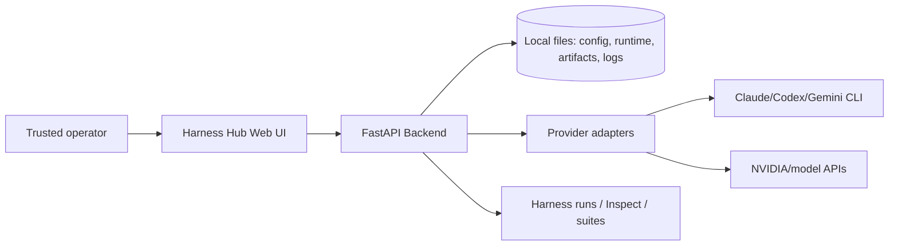
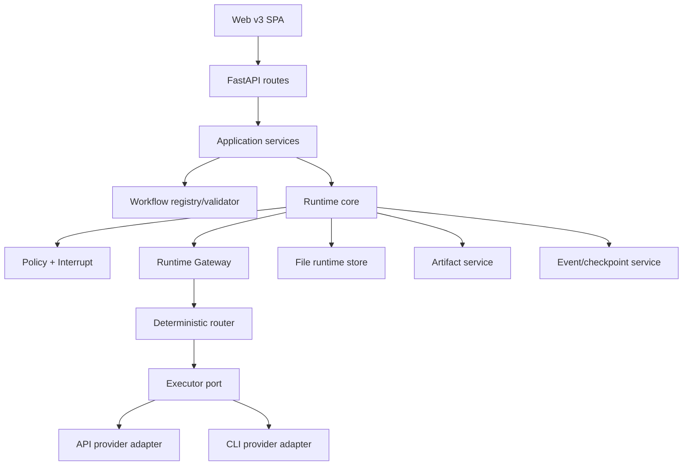

# D01 — Architecture and Scope

```yaml
document_id: HH-DES-D01
version: 1.0
status: In Review
owner: System Architecture
depends_on: [00_INDEX.md]
```

## 1. System intent

Harness Hub là local control-plane và orchestration-plane cho AI harness: quan sát runs/sessions/usage, chạy workflow khai báo, quản lý approval, artifacts và provider execution. Target v1 tối ưu cho một trusted operator trên một máy, không giả lập distributed guarantees.

## 2. Context



External provider và CLI output là untrusted. Workspace, runtime store và secret environment là các trust boundary khác nhau.

## 3. Container/module view



Mọi thành phần chạy in-process trong FastAPI ở target v1. CLI subprocess là execution boundary riêng nhưng chưa phải remote worker.

## 4. Ownership

| Module | Owns | MUST NOT |
|---|---|---|
| API | HTTP/SSE validation và mapping | gọi provider trực tiếp |
| Workflow Registry | YAML parse/validate, layout sidecar | chạy node |
| Runtime Core | run/node/interrupt state, attempts, workflow retry | biết provider protocol |
| Gateway/Router | capability/policy-aware route plan | ghi run state, hạ hard policy |
| Executor | execution lifecycle và normalized result/event | ghi workflow state/artifact business record |
| Provider Adapter | provider transport/protocol/parser | chọn workflow action |
| Policy | risk/path/tool/budget/approval decision | thực thi process |
| Artifact | manifest/version/content access | quyết định route |
| Event/Checkpoint | append/replay/checkpoint | thay thế audit/security evidence |

## 5. Sync, persistence và failure boundary

- API → service và Runtime → Gateway là synchronous in-process calls.
- Provider stream được chuyển thành normalized iterator rồi SSE.
- `run.json` và checkpoint JSON dùng write-temp + atomic replace.
- `events.jsonl` append-only theo một run; target v1 không cam kết broker delivery.
- Provider failure phải được normalize và ghi state trước terminal SSE event.
- Process restart không resume process đang chạy; Runtime recovery đưa attempt về trạng thái cần retry/human decision theo D03.

## 6. Architectural invariants

1. Runtime là writer duy nhất của run/node state.
2. Definition/profile snapshot của một run là immutable.
3. UI/API/provider không bypass Policy.
4. Mọi caller-supplied path phải canonicalize và nằm trong allowed root.
5. Raw secret không xuất hiện trong request persisted, event, artifact hoặc log.
6. State-changing command phải idempotent và có expected version.
7. Workflow v1 reject branch/cycle thay vì diễn giải ngầm.
8. Partial stream không được silent fallback.
9. Adapter capability phải được validate trước launch.
10. Research hoặc future architecture không tự mở rộng scope.

## 7. ADR baseline

### ADR-001 — Modular monolith

**Decision:** giữ FastAPI + in-process services.  
**Rationale:** phù hợp local control plane; ít vận hành và failure mode.  
**Revisit when:** multi-user, remote workers hoặc contention đo được.

### ADR-002 — File-backed target v1

**Decision:** JSON/JSONL + atomic replace; không PostgreSQL/queue.  
**Consequence:** single-host writer assumptions; cần lock trong process và recovery scan.  
**Revisit when:** concurrent replicas hoặc RPO yêu cầu database.

### ADR-003 — Linear workflow v1

**Decision:** đúng một start/end, in/out degree ≤1, mọi node được cover.  
**Consequence:** branch/fan-in bị validation error.  
**Revisit when:** join/error-edge semantics được thiết kế và test.

### ADR-004 — Internal Runtime Gateway

**Decision:** mọi workflow execution qua Gateway/Executor Port.  
**Consequence:** `workflow_exec.py` không gọi `get_provider()` trực tiếp sau migration.

### ADR-005 — SSE

**Decision:** SSE cho stream một chiều; `Last-Event-ID` dùng replay từ persisted sequence.  
**Revisit when:** có use case bidirectional thật.

### ADR-006 — Local CLI is restricted, not production sandbox

**Decision:** CLI adapter chỉ được bật theo capability/policy và allowlist.  
**Consequence:** không quảng cáo isolation mạnh; workspace-writing cần Gate D.

## 8. Evolution boundary

Database, queue/outbox, remote executor và RBAC chỉ được thêm bằng ADR gồm:

- requirement/SLO tạo nhu cầu;
- migration và rollback;
- data ownership và failure model;
- security/threat review;
- compatibility và acceptance tests.

## 9. Acceptance

- Không còn execution path Runtime → provider trực tiếp.
- Module boundary có import/contract test.
- As-is deviation được ghi task, không sửa tài liệu để hợp thức hóa code.
- Mọi new architectural decision có ADR ID và owner.

