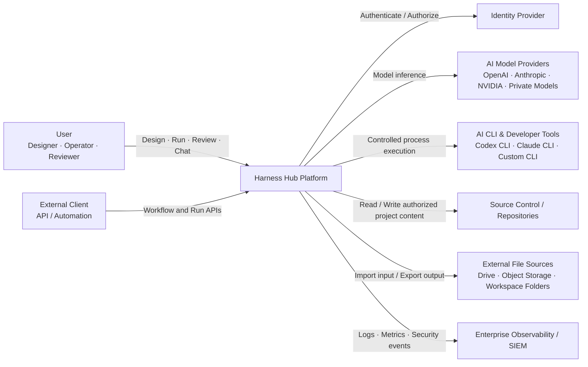
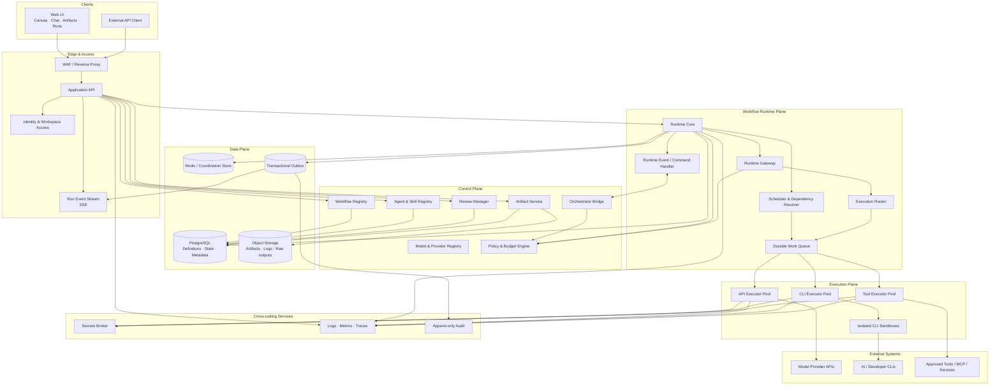
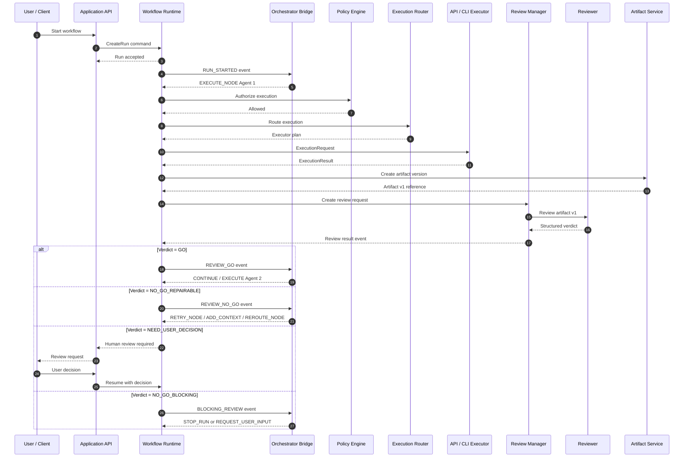
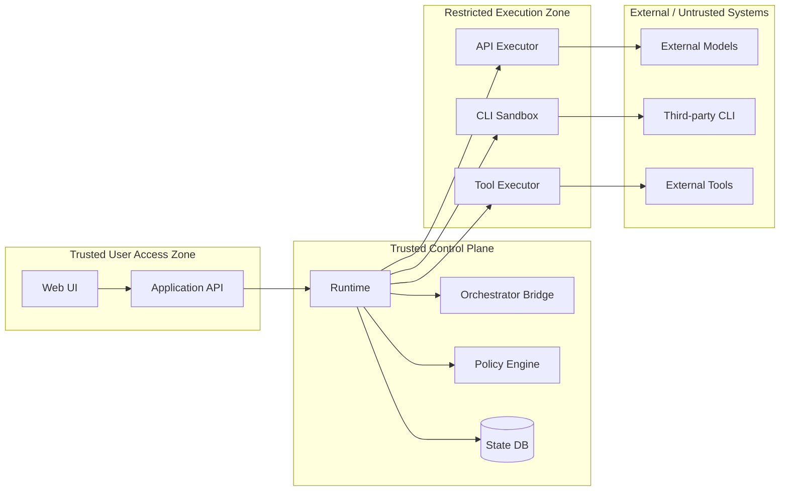

# System Architecture Overview

> Superseded by `../../design/D01_ARCHITECTURE_AND_SCOPE.md`.

```yaml
document_id: HH-ARCH-001
document_type: Architecture Guideline
title: System Architecture Overview
version: 0.3
status: In Review
owner: System Architecture
reviewers:
  - Backend Lead
  - Platform Lead
  - Security Lead
implementation_readiness: Architecture baseline only
depends_on:
  - 00_README.md
related_documents:
  - 02_Architecture_Principles.md
  - 03_Backend_Module_Map.md
  - 04_Domain_Model.md
  - 05_BD_Workflow_Runtime.md
  - 06_BD_Orchestrator_Agent.md
  - 07_DD_Executor_Contract.md
  - 07A_DD_Runtime_Gateway_and_Routing.md
  - 08_DD_API_Executor.md
  - 09_DD_CLI_Executor.md
  - 10_BD_Artifact_Store.md
```

## 1. Mục đích

Tài liệu này mô tả kiến trúc tổng quan của Harness Hub Backend, ranh giới hệ thống, các container logic chính, luồng thực thi workflow và trách nhiệm cấp cao của từng thành phần.

Tài liệu này dùng để:

- Thống nhất cách nhìn giữa Product, Architecture, Backend, Platform, Security và QA.
- Xác định thành phần nào thuộc Harness Hub và thành phần nào là external dependency.
- Chỉ ra ranh giới trách nhiệm giữa Orchestrator, Runtime, Executor, Reviewer và Artifact Store.
- Làm đầu vào cho Basic Design và Detailed Design của từng subsystem.

Tài liệu này **không** định nghĩa chi tiết state transition, API payload, database DDL hoặc executor implementation. Các nội dung đó thuộc tài liệu thiết kế chi tiết liên quan.

---

## 2. Phạm vi hệ thống

Harness Hub là nền tảng để thiết kế, chạy và kiểm soát workflow AI đa agent, đa model và đa phương thức thực thi.

Một workflow điển hình có thể:

1. Nhận input từ file, folder, artifact hoặc API.
2. Chuẩn hóa input bằng Intake node.
3. Giao việc cho Specialist Agent.
4. Thực thi agent bằng API Executor hoặc CLI Executor.
5. Lưu output thành Artifact Version.
6. Gửi output đến Reviewer Agent hoặc deterministic Review Gate.
7. Xử lý verdict `GO`, `NO_GO_REPAIRABLE`, `NO_GO_BLOCKING` hoặc `NEED_USER_DECISION`.
8. Cho Orchestrator Agent quyết định tiếp tục, retry, reroute hoặc escalate.
9. Pause khi cần human review.
10. Resume và hoàn tất workflow với đầy đủ audit trail.

---

## 3. Kiến trúc khái niệm

```text
Workflow Definition = bản thiết kế quy trình
Workflow Run        = một lần chạy cụ thể
Runtime             = bộ máy vận hành và giữ trạng thái
Orchestrator Agent  = bộ phận ra quyết định điều phối
Executor            = thành phần thực thi API hoặc CLI
Reviewer            = thành phần đánh giá output
Artifact Store      = kho lưu kết quả có version và lineage
```

Nguyên tắc trách nhiệm:

```text
Orchestrator quyết định.
Runtime kiểm soát vòng đời.
Executor thực thi.
Reviewer đánh giá.
Policy Engine cho phép hoặc từ chối.
Artifact Service lưu kết quả bền vững.
```

---

## 4. C4 Level 1 — System Context



### 4.1 System boundary

Harness Hub sở hữu:

- Workflow definitions và versions.
- Agent, skill và model configuration.
- Workflow runtime state.
- Orchestrator decisions.
- Execution routing.
- Review requests.
- Artifact metadata và lineage.
- Audit trail và usage metadata.

Harness Hub không sở hữu:

- Model provider infrastructure.
- External source-control platform.
- Enterprise identity provider.
- External file platform.
- CLI product implementation.

---

## 5. C4 Level 2 — Container Architecture



---

## 6. Trách nhiệm của các container chính

### 6.1 Application API

Cung cấp API cho UI và external client.

Application API MUST:

- Xác thực user hoặc service.
- Xác định workspace context.
- Kiểm tra authorization.
- Chuyển command đến application service tương ứng.
- Không gọi model provider hoặc CLI trực tiếp.
- Không tự thay đổi Runtime state ngoài Runtime command contract.

### 6.2 Workflow Registry

Quản lý:

- Workflow Definition.
- Workflow Version.
- Draft và Published state.
- Graph validation ở thời điểm publish.
- Reference đến contract, agent version và policy version.

### 6.3 Agent & Skill Registry

Quản lý:

- Specialist Agent.
- Reviewer Agent.
- Orchestrator Agent template.
- Project-specific orchestrator instance.
- Skill version.
- Tool permission.
- Model policy.

Registry chỉ lưu definition và version; không thực thi agent.

### 6.4 Runtime Core

Runtime là nguồn sự thật duy nhất cho trạng thái Workflow Run.

Runtime MUST:

- Tạo run.
- Giữ run/node/attempt state.
- Resolve dependency.
- Schedule node.
- Áp dụng timeout, retry và cancellation.
- Gửi execution request đến Execution Router.
- Nhận execution result.
- Tạo review request.
- Pause/resume run.
- Phát Runtime Event.
- Nhận và validate Orchestrator Decision.

### 6.5 Orchestrator Bridge

Orchestrator Bridge là adapter giữa Runtime và Orchestrator Agent.

Bridge MUST:

- Chuẩn hóa Runtime Event thành orchestrator input.
- Nạp đúng orchestrator template/version và project instance.
- Gọi Orchestrator Agent qua Executor contract hoặc dedicated inference adapter.
- Validate decision schema.
- Từ chối action ngoài `available_actions`.
- Trả decision về Runtime.

Orchestrator Bridge MUST NOT cập nhật state trực tiếp.

### 6.6 Execution Router

Execution Router chọn executor phù hợp dựa trên:

- Agent configuration.
- Capability requirement.
- Executor type.
- Data classification.
- Model/provider availability.
- Cost and latency policy.
- Workspace requirement.
- Provider quota.

Router trả execution plan; Runtime vẫn kiểm soát lifecycle.

### 6.7 API Executor

API Executor:

- Chuẩn hóa request theo provider.
- Gọi model/tool API.
- Stream output.
- Thu thập usage.
- Phân loại lỗi provider.
- Trả Execution Result theo unified contract.

### 6.8 CLI Executor

CLI Executor:

- Tạo isolated workspace.
- Mount input theo policy.
- Khởi chạy process trong sandbox.
- Capture stdout/stderr.
- Quản lý timeout và cancellation.
- Thu thập file diff.
- Scan output.
- Trả Execution Result theo unified contract.

### 6.9 Review Manager

Review Manager quản lý lifecycle của review:

- Tạo Review Request.
- Gọi Reviewer Agent hoặc deterministic gate.
- Lưu structured verdict.
- Tạo Human Review Task khi cần.
- Quản lý approve/request changes.
- Phát review event cho Runtime.

Review Manager không tự route workflow.

### 6.10 Artifact Service

Artifact Service quản lý:

- Artifact logical identity.
- Immutable Artifact Version.
- Content storage.
- Lineage.
- References.
- Archive/restore.
- Compare versions.
- Generated View và Workspace View projection.

### 6.11 Policy & Budget Engine

Policy Engine là lớp quyết định cuối cùng cho:

- Model/provider permission.
- Data classification.
- Filesystem access.
- Tool permission.
- Network egress.
- Budget.
- Human approval.
- Retry limit.

Orchestrator MAY đề xuất action; Policy Engine có quyền từ chối.

---

## 7. Reviewer execution models

Hệ thống hỗ trợ hai loại review nhưng phải thể hiện rõ trong Workflow Definition.

### 7.1 Deterministic Review Gate

Phù hợp cho:

- JSON Schema.
- Required fields.
- Static validation.
- Security rule.
- File policy.
- Numeric threshold.

Luồng:

```text
Runtime → Review Manager → Deterministic Validator → Verdict
```

### 7.2 Reviewer Agent

Phù hợp cho:

- Semantic completeness.
- Quality.
- Requirement traceability.
- Cross-document consistency.
- Business ambiguity classification.

Reviewer Agent được thực thi qua executor:

```text
Runtime
  → Review Manager
  → Runtime Gateway
  → Execution Router
  → API/CLI Executor
  → Reviewer Agent
  → Structured Verdict
```

Reviewer Agent không được kết nối trực tiếp với worker để điều khiển retry. Reviewer chỉ trả verdict và issue report. Runtime và Orchestrator quyết định action tiếp theo.

---

## 8. Luồng thực thi chuẩn — GO/NO-GO



### 8.1 Kiểm soát quan trọng

- Runtime không gọi Agent trực tiếp.
- Mọi Agent execution đi qua Execution Router và Executor.
- Mọi action của Orchestrator phải qua Policy Engine và Runtime transition validation.
- Artifact phải được persist trước khi gửi review.
- Review result phải là structured contract.
- Human decision phải được audit.

---

## 9. Data ownership

| Dữ liệu | Owner |
|---|---|
| Workspace, membership | Identity & Workspace |
| Workflow Definition/Version | Workflow Registry |
| Agent/Skill Definition/Version | Agent & Skill Registry |
| Workflow Run, Node Run, Attempt | Runtime Core |
| Runtime Event/Command state | Runtime Core |
| Review Request/Result | Review Manager |
| Artifact/Artifact Version/Lineage | Artifact Service |
| Model/provider metadata | Model Registry |
| Policy and budget configuration | Policy Engine |
| Secret material | External Secret Manager / Secrets Broker |
| Operational logs and metrics | Observability |
| Compliance audit event | Audit Service |

Không module nào được cập nhật trực tiếp dữ liệu thuộc module khác nếu không thông qua application contract hoặc domain service đã được định nghĩa.

---

## 10. Runtime event và audit event

Hai loại event phải được phân biệt.

### Runtime Event

Dùng để vận hành workflow, ví dụ:

- `RUN_STARTED`
- `NODE_READY`
- `NODE_COMPLETED`
- `REVIEW_NO_GO`
- `USER_INPUT_REQUIRED`

Runtime Event có thể được consume bởi Runtime, Orchestrator và UI event stream.

### Audit Event

Dùng cho security, compliance và forensic, ví dụ:

- User started run.
- Provider credential reference resolved.
- CLI accessed workspace path.
- Human approved artifact.
- Artifact archived.

Audit Event là append-only và có retention riêng. Audit Event không được dùng làm nguồn điều khiển duy nhất cho Runtime state machine.

---

## 11. Trust boundaries



### 11.1 Security assumptions

- External model output được xem là untrusted input.
- CLI process được xem là untrusted workload.
- Tool response được validate trước khi dùng.
- Model-generated command không được chạy trực tiếp nếu chưa qua policy và adapter.
- Secret không được đưa vào prompt, artifact hoặc log.
- Cross-workspace access mặc định bị từ chối.

---

## 12. Deployment view cấp cao

Giai đoạn MVP SHOULD triển khai dưới dạng modular monolith kết hợp worker pool:

```text
Application API
Runtime Worker
API Executor Worker
CLI Executor Worker
PostgreSQL
Redis / Durable Queue
Object Storage
Secret Manager
Observability
```

Module boundary trong code MUST được giữ rõ để có thể tách thành service độc lập khi cần.

CLI Executor SHOULD chạy trên worker pool hoặc node group riêng vì có risk profile, resource profile và sandbox requirement khác API Executor.

Chi tiết hạ tầng thuộc `14_Infrastructure_and_Deployment.md`.

---

## 13. Các luồng ngoài phạm vi luồng chuẩn

Hệ thống phải dự kiến nhưng chưa mô tả chi tiết trong tài liệu này:

- Parallel fan-out và fan-in.
- Nested workflow/subworkflow.
- Sticky CLI session.
- Partial execution result.
- Provider failover.
- Run recovery sau host failure.
- Artifact compare và chat-based editing.
- Hook-triggered workflow.
- Scheduled workflow.
- Multi-reviewer arbitration.

Các nội dung trên phải được đặc tả trong tài liệu Basic/Detailed Design trước khi implement production.

---

## 14. Ranh giới MVP

### 14.1 Trong phạm vi

- Workflow graph tuyến tính và nhánh song song cơ bản.
- Một Orchestrator Agent mặc định cho mỗi workflow.
- Specialist Agent và Reviewer Agent.
- API Executor với tối thiểu hai provider adapters.
- CLI Executor stateless.
- GO/NO-GO.
- Retry có giới hạn.
- Pause/resume/cancel.
- Human review.
- Artifact version và archive.
- Run log, token, cost và audit cơ bản.
- Workspace isolation cơ bản.

### 14.2 Ngoài phạm vi

- Marketplace công khai.
- Agent tự sinh agent không kiểm soát.
- Multi-cloud active-active.
- Autonomous production deployment không approval.
- Billing platform hoàn chỉnh.
- Cross-region runtime migration.
- Shared sticky CLI session giữa project.
- Self-modifying workflow production.

---

## 15. Quality attributes cấp cao

Các giá trị chi tiết sẽ được chốt trong tài liệu Infrastructure và Test Strategy.

| Attribute | Mục tiêu kiến trúc |
|---|---|
| Reliability | Không mất run state khi service restart |
| Auditability | Truy vết được user, workflow, agent, model, input và output |
| Security | Default deny cho filesystem, tool, network và secret |
| Extensibility | Thêm provider/executor không sửa Runtime Core |
| Recoverability | Có thể resume run từ persisted state |
| Portability | MVP không khóa cứng vào một cloud provider |
| Observability | Mọi node attempt có logs, metrics, trace và usage |
| Cost control | Budget được kiểm tra trước và trong execution |

---

## 16. Quyết định kiến trúc đã chốt trong tài liệu này

1. Runtime là source of truth cho Workflow Run.
2. Orchestrator chỉ ra quyết định, không tự quản process hoặc state.
3. Agent và Reviewer Agent được thực thi qua Executor.
4. Deterministic Review Gate không bắt buộc dùng model.
5. API và CLI phải tuân thủ Unified Executor Contract.
6. Policy Engine có quyền phủ quyết Orchestrator.
7. Artifact Version là immutable.
8. Runtime Event và Audit Event là hai khái niệm khác nhau.
9. CLI Executor nằm trong restricted execution zone.
10. MVP ưu tiên modular monolith và worker pool, không microservice hóa sớm.
11. Runtime Gateway là logical boundary giữa Runtime Core và các Executor; Runtime không gọi Executor trực tiếp.
12. Gateway chỉ sở hữu route/policy enforcement, adapter dispatch và chuẩn hóa stream; Runtime vẫn là source of truth cho run state, workflow retry và approval state.
13. MVP dùng SSE cho event stream một chiều từ backend tới UI; WebSocket chỉ được xem xét khi có use case hai chiều đã được chứng minh.

### 16.1 Runtime Gateway boundary

Luồng thực thi chuẩn là:

```text
Runtime Core
  -> Runtime Gateway
    -> Execution Router
      -> API Executor | CLI Executor
```

Runtime Gateway được triển khai như một module trong modular monolith ở MVP, không phải microservice bắt buộc. Module này không sở hữu workflow state, không ghi artifact nghiệp vụ và không thay thế Policy Engine. Contract, routing precedence, retry ownership và streaming namespace được quy định tại `07A_DD_Runtime_Gateway_and_Routing.md`.

---

## 17. Open decisions

Các điểm sau chưa được chốt trong tài liệu này:

- Queue technology.
- Container/sandbox technology cho CLI.
- Event broker có cần tách khỏi database outbox trong MVP hay không.
- Provider adapters ưu tiên đầu tiên.
- Object storage product.
- Policy language hoặc rules engine.
- Cơ chế multi-reviewer arbitration.
- Data residency theo từng workspace.

Open decision không được coding agent tự quyết nếu làm thay đổi contract hoặc security boundary.

---

## 18. Acceptance criteria của tài liệu

Tài liệu được xem là đạt review khi:

- Context diagram và container diagram được Architecture, Backend và Platform cùng chấp thuận.
- Luồng chuẩn không còn đường gọi trực tiếp Runtime → Agent.
- Reviewer execution models được hiểu thống nhất.
- Data ownership không chồng chéo.
- Trust boundaries được Security Lead xác nhận.
- Các quyết định chưa chốt được ghi rõ là Open Decisions.
- Tài liệu Basic Design tiếp theo không mâu thuẫn với responsibility boundaries trong tài liệu này.

---

## 19. Change log

| Version | Thay đổi |
|---|---|
| 0.1 | Bản tổng quan ban đầu |
| 0.2 | Bổ sung metadata, C4 context/container, execution plane, policy/secrets/queue, reviewer execution models, trust boundaries, data ownership, runtime sequence đúng qua executor, quality attributes và open decisions |
| 0.3 | Bổ sung Runtime Gateway boundary, route Runtime → Gateway → Executor và chốt SSE cho MVP theo DD 07A |
