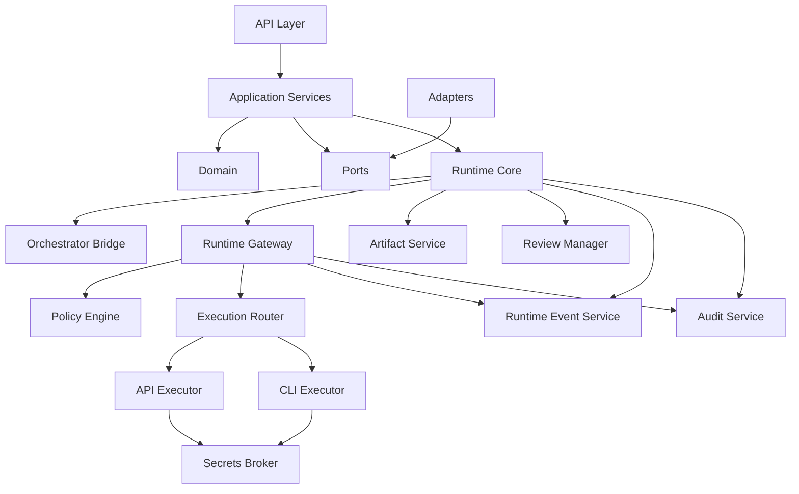

# Backend Module Map

> Superseded by `../../design/D01_ARCHITECTURE_AND_SCOPE.md`.

**Document ID:** HH-ARCH-003  
**Document type:** Architecture Guideline  
**Version:** 0.2  
**Status:** Draft merged — review required

## 1. Module chính

| Module | Trách nhiệm | Không sở hữu |
|---|---|---|
| Identity & Workspace | User, role, workspace, membership | Execution policy |
| Workflow Registry | Definition, version, publish state | Run state |
| Agent Registry | Specialist, reviewer, orchestrator metadata | Executor lifecycle |
| Skill Registry | Skill contract và dependency | Tool execution |
| Runtime Core | Run state, node scheduling, transition, workflow retry | Provider transport |
| Orchestrator Bridge | Gọi orchestrator, validate decision | Run-state mutation |
| Runtime Gateway | Validate execution request, enforce route policy, dispatch adapter, normalize stream | Workflow state, business artifact, workflow retry |
| Execution Router | Chọn executor/model theo deterministic precedence | Policy override, silent fallback |
| API Executor | Gọi model/tool qua provider API | Workflow state |
| CLI Executor | Chạy process trong sandbox, parse event, collect evidence | Workflow state |
| Review Manager | Review request và verdict | Executor routing |
| Artifact Service | Version, lineage, archive | Route decision |
| Model Registry | Provider, model, capability | Secret value |
| Policy Engine | Permission, budget, data and route constraints | Runtime transition |
| Runtime Event Service | Operational event stream và replay cursor | Compliance audit |
| Audit Service | Append-only security/governance evidence | Runtime control |
| Secrets Broker | Resolve credential reference tại execution boundary | Persist secret in request/log |

## 2. Dependency



## 3. Dependency bị cấm

- Agent Registry MUST NOT gọi Executor.
- Artifact Service MUST NOT quyết định route.
- Runtime Core MUST NOT gọi API Executor hoặc CLI Executor trực tiếp.
- Runtime Gateway và Executor MUST NOT cập nhật run state trực tiếp.
- Runtime Gateway MUST NOT tự hạ policy hoặc fallback sau khi đã phát partial output.
- UI/API Layer MUST NOT gọi provider trực tiếp.
- Orchestrator Bridge MUST NOT tự ghi trạng thái node.
- ExecutionRequest, event và log MUST NOT chứa raw API key.
- Runtime Event Service MUST NOT được dùng thay Audit Service.

## 4. Contract giữa các module

| Producer | Contract | Consumer | Tài liệu chuẩn |
|---|---|---|---|
| Runtime Core | `ExecutionRequest` | Runtime Gateway | `07_DD_Executor_Contract.md`, `07A_DD_Runtime_Gateway_and_Routing.md` |
| Runtime Gateway | `RoutingDecision` + normalized request | Executor | `07A_DD_Runtime_Gateway_and_Routing.md` |
| Executor | `ExecutionEvent` + `ExecutionResult` | Runtime Gateway | `07_DD_Executor_Contract.md` |
| Runtime Gateway | Namespaced execution stream | Runtime Core/API | `07A_DD_Runtime_Gateway_and_Routing.md`, `11_DD_Backend_API_Spec.md` |
| Runtime Core | Artifact command | Artifact Service | `10_BD_Artifact_Store.md` |
| Runtime Core | Review request | Review Manager | `12_DD_Review_Gate_and_HITL.md` |

Mọi contract vượt ranh giới module phải có `workspace_id`, correlation identifiers và schema version. Module nhận không được suy diễn quyền hạn từ dữ liệu thiếu; thiếu policy context phải fail closed.

## 5. Repository đề xuất

```text
src/
  api/
  application/
  domain/
  ports/
  runtime/
  gateway/
    routing/
    streaming/
  adapters/
    api_executor/
    cli_executor/
    persistence/
    object_storage/
  infrastructure/
tests/
  contract/
  integration/
docs/
```

## 6. Traceability

- `HH-RES-R01` (`R01_RESEARCH_Runtime_Gateway_Multi_Model.md`) là nguồn nghiên cứu cho Gateway boundary, routing và streaming.
- `HH-RES-R02` (`R02_RESEARCH_Executor_Adapter_Layer.md`) là nguồn nghiên cứu cho adapter interface và API/CLI specialization.
- Khi nguồn nghiên cứu mâu thuẫn với tài liệu normative, thứ tự ưu tiên là Security/Governance → Architecture → DD contract → research reference.

## 7. Change log

| Version | Thay đổi |
|---|---|
| 0.1 | Module map ban đầu |
| 0.2 | Thêm Runtime Gateway, tách runtime event/audit, chuẩn hóa dependency, forbidden edges, module contracts và research traceability |
