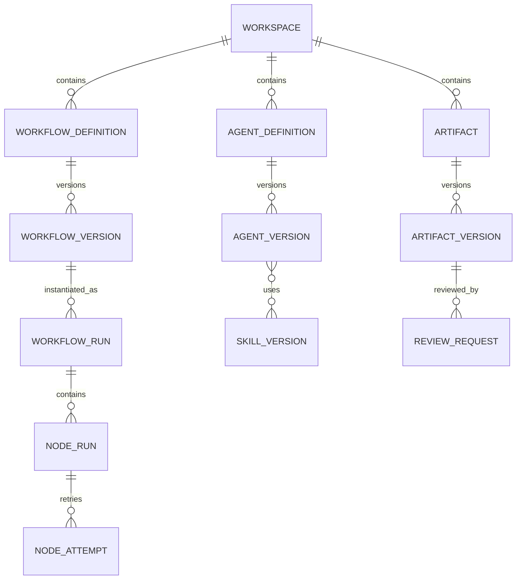

# Domain Model

> Superseded by `../../design/D02_DOMAIN_AND_WORKFLOW_CONTRACTS.md`.

**Document type:** Architecture Guideline  
**Version:** 0.1

## 1. Aggregate

- `Workspace`
- `WorkflowDefinition` và `WorkflowVersion`
- `WorkflowRun`
- `NodeRun` và `NodeAttempt`
- `AgentDefinition` và `AgentVersion`
- `SkillDefinition` và `SkillVersion`
- `Artifact` và `ArtifactVersion`
- `ReviewRequest` và `ReviewResult`

## 2. Quan hệ

## 3. Node types

`INPUT`, `ORCHESTRATOR`, `AGENT`, `REVIEWER`, `GATE`, `AGGREGATE`, `TOOL`, `OUTPUT`, `HUMAN_APPROVAL`.

## 4. Run states

`CREATED`, `QUEUED`, `RUNNING`, `WAITING_FOR_REVIEW`, `WAITING_FOR_USER`, `PAUSED`, `COMPLETED`, `FAILED`, `CANCELLED`.

## 5. Reviewer verdict

`GO`, `NO_GO_REPAIRABLE`, `NO_GO_BLOCKING`, `NEED_USER_DECISION`.

## 6. Orchestrator action

`EXECUTE_NODE`, `CONTINUE`, `RETRY_NODE`, `REROUTE_NODE`, `ADD_CONTEXT`, `CHANGE_EXECUTOR`, `REQUEST_USER_INPUT`, `PAUSE_RUN`, `STOP_RUN`.

## 7. Invariants

- Artifact Version là immutable.
- Run phải tham chiếu đúng workflow version.
- Archived artifact vẫn giữ lineage.
- Reviewer không sửa workflow state trực tiếp.
- Orchestrator không được vượt Policy Engine.
