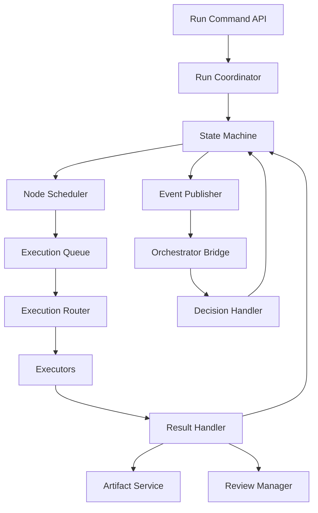

# Basic Design — Workflow Runtime

> Superseded by `../../design/D03_RUNTIME_STATE_EVENTS_AND_RECOVERY.md`.

**Document type:** Basic Design  
**Version:** 0.1

## 1. Mục tiêu

Workflow Runtime biến workflow definition thành run có thể theo dõi, retry, pause, resume và phục hồi.

## 2. Trách nhiệm

Runtime MUST tạo run, resolve dependency, schedule node, nhận execution result, lưu attempt, phát event, áp dụng retry/timeout/budget và pause khi chờ review. Runtime MUST NOT tự viết prompt nghiệp vụ hoặc gọi provider trực tiếp.

## 3. Thành phần

## 4. Runtime loop

1. Load run state.
2. Acquire run lock.
3. Apply event/command.
4. Validate transition.
5. Persist state và event cùng transaction.
6. Schedule node mới READY.
7. Release lock.

## 5. GO/NO-GO

- GO: mở khóa node tiếp theo.
- NO_GO_REPAIRABLE: hỏi Orchestrator để retry/reroute.
- NO_GO_BLOCKING: fail hoặc chờ user theo policy.
- NEED_USER_DECISION: tạo human review task và pause.

## 6. Recovery

Sau restart, runtime đọc active runs, kiểm tra heartbeat/lease, phân loại stale execution và áp dụng retry idempotent.

## 7. Acceptance

- Workflow tuyến tính và song song chạy được.
- GO/NO-GO hoạt động.
- Retry tạo attempt mới.
- Pause/resume không mất state.
- Duplicate event không chạy node hai lần.
