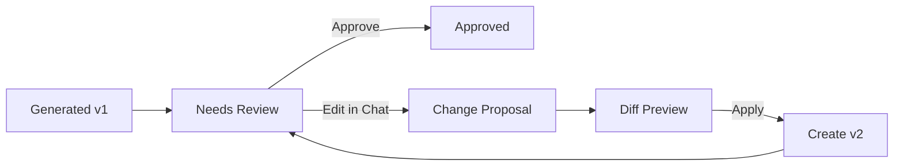

# Basic Design — Artifact Store

> Superseded by `../../design/D05_API_AND_STORAGE_CONTRACTS.md`.

**Document type:** Basic Design  
**Version:** 0.1

## 1. Mục tiêu

Artifact Store quản lý output bền vững do workflow, agent hoặc user tạo. Artifact là đối tượng logic; Artifact Version là snapshot bất biến.

## 2. Hai view

- **Workspace View:** cấu trúc folder để kéo thả input/output.
- **Generated View:** chỉ artifact do workflow/AI tạo, filter theo status, workflow và review.

## 3. Versioning

- Chỉnh sửa qua chat tạo version mới.
- Regenerate tạo version mới hoặc artifact mới theo user intent.
- New artifact có thể archive bản cũ.
- Archive không xóa dữ liệu.

## 4. Lineage

Artifact Version lưu input refs, workflow version, run/node, agent/skill version, reviewer result, references và parent version.

## 5. Review flow

## 6. Storage

Metadata ở relational database; content ở object storage/file storage với checksum.

## 7. Acceptance

- Version cũ không mất.
- Archive/restore và compare hoạt động.
- Chuyển Workspace/Generated view được.
- Lineage truy ngược tới input và agent.
