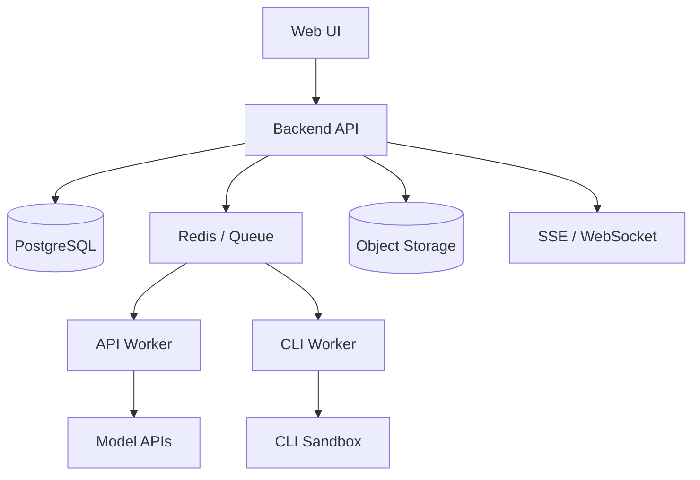
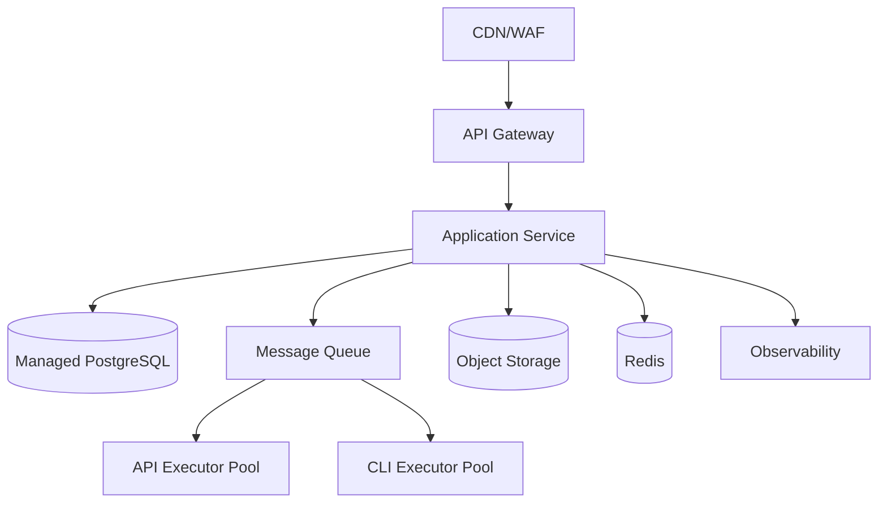

# Infrastructure and Deployment

> Superseded by `../../design/D07_DEPLOYMENT_SLO_AND_OPERATIONS.md`.

**Document type:** Cross-cutting Design  
**Version:** 0.1

## 1. MVP

Thành phần tối thiểu: backend, PostgreSQL, queue, API worker, CLI worker, object storage, secret manager, logs và reverse proxy.

## 2. Production

## 3. Deployment units

`harness-api`, `runtime-worker`, `api-executor-worker`, `cli-executor-worker`, `event-stream-service`.

## 4. Storage

PostgreSQL cho state/metadata, object storage cho artifact/log lớn, Redis cho queue/lock/cache, secret manager cho credential.

## 5. Environments

`local`, `development`, `staging`, `production`; mỗi môi trường có secret, provider và workspace isolation riêng.
