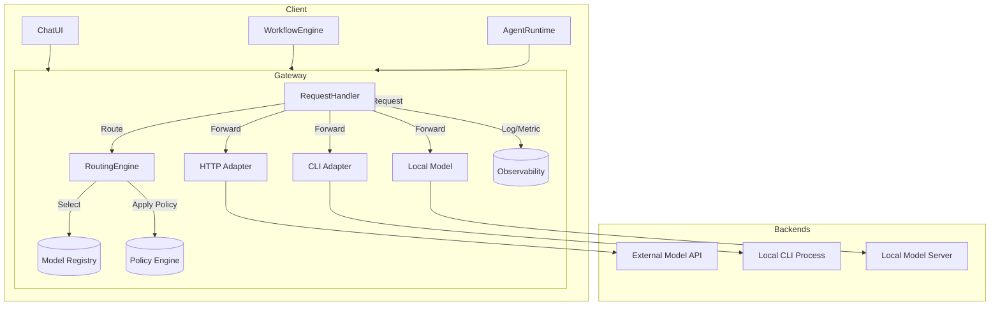

# Kiến trúc Runtime Gateway cho AI Harness đa mô hình

> Reference only. Normative synthesis: `../../design/D04_GATEWAY_EXECUTOR_AND_PROVIDERS.md`.

> **Research source ID:** HH-RES-R01  
> **Status:** Reference only — not approved for coding  
> **Normative targets:** `07A_DD_Runtime_Gateway_and_Routing.md`, `11_DD_Backend_API_Spec.md`, `13_Security_and_Governance.md`, `16_Test_Strategy_and_Acceptance.md`  
> **Renamed for traceability:** 2026-07-27; original filename `deep-research-report (3).md`

## Tóm tắt điều hành  
Đề xuất **Runtime Gateway** (còn gọi là LLM Gateway) là một lớp middleware nằm giữa giao diện ứng dụng/agent runtime và các backend mô hình đa dạng (API, CLI, local). Gateway này nhận một API chung từ UI hoặc workflow, quyết định mô hình/backend thích hợp theo chính sách, chuyển request đến backend qua HTTP hoặc CLI, sau đó chuẩn hóa response, logging và tracking. Với MVP, Gateway nên tập trung vào những chức năng cốt lõi: nhận và chuyển request, định tuyến cơ bản (từ alias tới backend), chuẩn hóa input/output, xử lý streaming, theo dõi sử dụng và quản lý xác thực/tối ưu đơn giản. Các tính năng phức tạp như stateful session, orchestration đa-buộc, đa-tenancy hay policy sâu sẽ được bổ sung dần theo lộ trình.

Lý do chính: một Runtime Gateway giúp ẩn sự khác biệt giữa các nhà cung cấp và phương thức gọi mô hình, tăng khả năng mở rộng, linh hoạt khi thay đổi mô hình/phương pháp, cung cấp khả năng failover và quan sát tập trung. Với nhu cầu ban đầu (người dùng thấp, backend đa dạng gồm CLI và API, đội ngũ nhỏ), ta khởi đầu với phiên bản nhẹ nhưng thiết kế hướng tới mở rộng dần. Phạm vi MVP là: một gateway đơn tiến trình hoặc container (Docker) nhận request JSON, triển khai routing cơ bản qua cấu hình (YAML/DB), hỗ trợ streaming qua SSE, hỗ trợ fallback tối thiểu và ghi logs/metrics cơ bản. Các quyết định phức tạp hơn như orchestration đa-buộc, công cụ (tool) tích hợp phức tạp, hoặc kiểm soát token chuyên sâu có thể tạm thời trì hoãn hoặc thực hiện bằng các service riêng (ví dụ dùng lưu session ngoài Gateway). 

## Vấn đề và phạm vi (Problem Definition)  
Hệ thống cần hỗ trợ:
- UI chat và workflow/agent có thể chỉ định mô hình (ví dụ “GPT4”, “Claude”) hoặc chọn alias (ví dụ “coding-premium”).
- Nhiều backend không đồng nhất: **CLI** (Claude CLI, Codex CLI…), **API HTTP** (NVIDIA-hosted, OpenAI API…), và **local/self-hosted**.
- Mỗi backend có giao diện khác nhau (CLI nhận prompt qua stdin, HTTP qua JSON).
- Gateway phải tiếp nhận request thống nhất, định tuyến đến backend phù hợp, và trả kết quả thống nhất về UI/agent.

**Vấn đề thiết kế chính:** xây dựng một lớp gateway không phụ thuộc vào vendor hoặc giao thức cụ thể, có khả năng tiếp nhận request từ UI/engine và gọi các backend mô hình khác nhau. Gateway cần chuẩn hóa đầu vào/đầu ra, xử lý streaming tương tác, phân giải lỗi, và cung cấp các dịch vụ quản lý (xác thực, timeout, retry, fallback, đăng nhập, đo lường). Đồng thời, kiến trúc không được quá phức tạp cho MVP, nhưng phải mở rộng được cho agent platform hoàn chỉnh. 

Phạm vi **không** bao gồm: phần UI chat, chi tiết prompt engineering, logic RAG/vector DB, business logic workflow engine, hoặc training model. Giới hạn ở lớp điều phối và quản lý thực thi mô hình (giữa agent/workflow và các executor).

## Kiến trúc tham chiếu (Reference Architecture)  
Hệ thống chia thành các thành phần chính: 

- **UI / Agent Runtime / Workflow Engine**: gửi request nhất quán (logical model alias, tin nhắn, metadata) đến Gateway. 
- **Runtime Gateway**: trung tâm điều phối, gồm các chức năng định tuyến, kiểm tra bảo mật, chuẩn hóa request/response, streaming, fallback, logging, throttle/timeout. 
- **Executor Layer**: tập hợp các **adapter** cho từng loại backend: *API HTTP*, *CLI subprocess*, *CLI long-running process*, *Local server*, v.v. Adapter này đóng vai trò chuyển đổi generic request sang định dạng phù hợp với backend (ví dụ gọi CLI với command line hoặc POST HTTP).  
- **Dịch vụ phụ trợ**: Model Registry (cơ sở dữ liệu hoặc config chứa mapping alias → backend cụ thể và thông tin khả năng), Credential Service (lưu trữ khóa API, xác thực), Observability Service (logs, tracing, metrics).

Khoảng cách giữa các phần:
```
User / Agent ---------> Runtime Gateway ---------> Executor Adapters ---------> Model Backends (API/CLI)
```
Trong đó, *Runtime Gateway* chia thành **Control Plane** và **Data Plane**: Control Plane xử lý xác thực, chính sách, định tuyến (routing policy, fallback), quản lý phiên (session), còn Data Plane xử lý luồng dữ liệu thực (chuyển request, streaming response). Gateway không nên thành **god service** làm mọi thứ: ví dụ, lưu state hội thoại dài nên ra dịch vụ riêng; xác thực có thể ủy quyền cho OAuth/RBAC; logging nên đẩy về platform ghi log chuyên dụng. 

Một sơ đồ ngữ cảnh đơn giản: 


*Chú giải:* Gateway nhận request, dùng *RoutingEngine* và *ModelRegistry* để xác định backend. *PolicyEngine* áp dụng chính sách (ví dụ budget, allowlist). Sau đó, RequestHandler chuyển request sang Adapter tương ứng để gọi backend. Kết quả được thu và chuẩn hóa trước khi trả về.

## Ma trận trách nhiệm (Responsibility Matrix)  
Để tránh chồng chéo, các chức năng thuộc về thành phần:
- **UI / Backend Application**: Hiển thị giao diện chat; truyền yêu cầu mô hình; hiển thị/trả lời kết quả; khởi tạo session ở phía client.  
- **Agent/Workflow Engine**: Quyết định luồng agent, quản lý logic business, chỉ định explicit model nếu có (ví dụ trong kịch bản agent, một bước có thể khóa dùng GPT-4). Không xử lý API đặc thù mô hình.  
- **Agent Runtime**: Thực thi agent logic từng bước, gọi gateway mỗi khi cần mô hình trả lời hoặc kích hoạt công cụ (tool). Quản lý state hội thoại/ứng dụng, nhưng không quản lý chung routing hay chính sách.  
- **Runtime Gateway**: Chức năng tập trung: *định tuyến request đến backend*, chuẩn hóa input/output, xử lý streaming, fallback, retry, chính sách chung (token limit, budget), authentication/authorization, logging, metrics. Không hiểu domain cụ thể của agent, chỉ dựa vào metadata và registry.  
- **Executor Adapter Layer**: Thư viện hoặc service gọi backend cụ thể: ví dụ HTTP client cho API, khởi CLI process cho command, tiến hành giải mã output của CLI. Đây là phần *executor manager*. Gateway gọi các adapter này nhưng adapter chịu trách nhiệm chi tiết gọi và quản lý process.  
- **Credential Service**: Cung cấp và quản lý secrets/keys cho gateway hoặc adapter (ví dụ lưu OpenAI key, Claude key). Gateway truy cập service này để lấy credential, không lưu trực tiếp trong code.  
- **Observability Service**: Cấp nhật thông tin logs, tracing, metrics. Gateway gửi log và dữ liệu telemetry (request ID, latency, token usage) đến hệ thống giám sát tập trung.

Bảng tóm tắt:

| Chức năng                      | UI/App | Workflow/Agent | Gateway         | Executor Adapter | CredentialSvc | ObservabilitySvc |
|-------------------------------|:------:|:--------------:|:---------------:|:----------------:|:-------------:|:----------------:|
| Định tuyến request            |        |                | **Có** (Core)  |                  |               |                  |
| Chuẩn hóa Request/Response    |        |                | **Có**          |                  |               |                  |
| Streaming response            |        |                | **Có** (và đẩy tiếp) |                |               |                  |
| Bảo mật/Authorization         |        |                | **Có** (RBAC, tenant check) |            |               |                  |
| Chỉnh sách (retry, fallback)  |        |                | **Có**          |                  |               |                  |
| Giám sát (logging, metrics)    |        |                | **Có**          |                  |               | **Tích hợp**      |
| Quản lý session/state         |        | **Có** (Agent) | (ít)           | **Có** (CLI có context) |         |                  |
| Quản lý flow agent & tool use |        | **Có**         | (không)         |                  |               |                  |
| Triển khai CLI/process        |        |                |                | **Có** (xử lý call) |           |                  |
| Quản lý cấu hình model (registry) | |  | **Có**           |                  |               |                  |

## Hợp đồng request/response thống nhất (Unified Contract)  
Gateway cần định nghĩa một hợp đồng (contract) chung để UI/agent gửi request và nhận kết quả, độc lập với kiểu backend. 

**Request schema (ví dụ JSON):**  
```json
{
  "model": "logical_model_alias",        // Model logic alias (không kèm nhà cung cấp)
  "provider": "optional_provider_id",   // (tùy chọn) yêu cầu cụ thể provider
  "messages": [ ... ],                  // Thông tin tương tác chat (OpenAI style)
  "system_instructions": "...",         // (nếu có) hướng dẫn hệ thống
  "tools": [ ... ],                     // (nếu agent) danh sách công cụ được phép gọi
  "tool_schemas": { ... },              // (tùy chọn) schema các công cụ
  "attachments": [ ... ],               // (file, ảnh) nếu có
  "workdir": "...",                     // (nếu CLI) thư mục làm việc
  "env": { ... },                       // (nếu CLI) biến môi trường
  "session_id": "uuid",                 // ID session/phiên người dùng
  "conversation_id": "uuid",            // ID hội thoại (nhiều turn)
  "workflow_id": "uuid",                // ID chạy workflow (nếu agent)
  "agent_id": "optional",               // ID agent (nếu multi-agent)
  "timeout_ms": 30000,                  // Timeout cho request
  "stream": true,                       // Có cần streaming hay không
  "response_format": "text|json",       // Định dạng mong muốn (ví dụ text hoặc JSON struct)
  "token_limit": 500,                   // (tùy chọn) giới hạn token sử dụng
  "cost_budget": 10.0,                  // (tùy chọn) ngân sách chi phí (đơn vị tiền)
  "retry_policy": { "max_retries": 2 }, // Chính sách retry
  "fallback_policy": [ "modelA", "modelB" ], // Chuỗi fallback nếu model chính bận/hỏng
  "security_context": { ... },          // (như quyền tenant, roles)
  "metadata": { ... },                  // Thông tin tuỳ ý (trace id, user tier)
  "trace_id": "uuid"                    // (tùy chọn) mã trace cho phân tích end-to-end
}
```  
*(Ví dụ trên chỉ mang tính minh hoạ; một số trường là mở rộng tùy case.)*

**Response schema:**  
- Đầu ra dạng text: `{ "text": "...", "usage": { "prompt_tokens":..., "completion_tokens":..., "total_tokens":... }, "model": "...", "provider": "...", "status": "success|error", "error": null }`.
- Dạng JSON (structured): tương tự nhưng payload là JSON thay vì text.
- Với streaming: gateway gửi các *chunks* qua SSE hoặc protocol đã chọn, mỗi chunk kèm kiểu (text_delta, tool_call, usage_update, warning, error, done). Ví dụ mỗi event có `{ "type": "delta", "data": "..." }` hoặc `{ "type": "error", "error": { code, message }}`.
- Ngoài ra: metadata provider-specific có thể đính kèm vào response như thẻ `extra_fields`.

**Phân ranh core vs provider-ext:** Những trường chung (messages, model, stream, timeout, các ID) thuộc hợp đồng cốt lõi. Các phần đặc thù như tên model đầy đủ cho từng provider hay cài đặt riêng nên nằm ở phần mở rộng (extensions) của provider. Ví dụ, gateway có thể chuyển `model: "openai/gpt-4o"` xuống request OpenAI, hoặc dùng `"claude/claude-sonnet"` cho Anthropic. 

Các thông tin về công cụ (tools, schemas) được giữ nguyên trong request và gateway chuyển đúng đến MCP/MCP-gateway (nếu dùng), hoặc chỉ đính kèm metadata để agent runtime hiểu. Hợp đồng phản hồi phải bao gồm thông tin usage (token count, chi phí ước tính) để dễ theo dõi, cũng như error code chung (ví dụ HTTP 400, 429, 500) kèm thông điệp chuẩn hoá.

## Cơ chế quyết định routing (Routing Decision Model)  
Routing policy định nghĩa cách gateway chọn backend khi có nhiều lựa chọn:

- **Nguồn quy tắc:** có thể có nhiều nguồn quyết định: (1) Model do người dùng/agent yêu cầu (ví dụ UI chọn GPT-4); (2) Cấu hình agent/workflow gán model cụ thể; (3) Model mặc định của quy trình/tenant; (4) Chính sách tổ chức (ví dụ chỉ dùng local model cho dữ liệu nhạy cảm); (5) Điều kiện động như độ trễ/mức tải; (6) Ngân sách/chi phí.  
- **Chiến lược routing:** 
  - *Routing cấp độ mô hình* (Model-aware): chỉ định theo tên mô hình (ví dụ “gpt-4”); 
  - *Routing theo khả năng* (Capability-based): nếu agent workflow yêu cầu, ví dụ “cần tool-calling” thì chỉ chấp nhận providers hỗ trợ tính năng tool; 
  - *Chi phí/hiệu năng*: tùy chính sách, có thể chọn provider rẻ nhất, nhanh nhất, hoặc cân bằng tải; 
  - *Fallback route:* danh sách dự phòng khi chính bị lỗi (ví dụ A -> B -> C); 
  - *Canary/A-B testing:* chia tỉ lệ cho thử nghiệm mô hình mới.  
- **Ưu tiên:** thường ưu tiên theo thứ tự: (1) Kịch bản cụ thể của agent hay yêu cầu explicit từ UI; (2) Alias mặc định của workflow; (3) Chính sách tổ chức (liên quan quyền riêng tư, budget); (4) Tình trạng backend (dịch vụ nào đang lành mạnh nhất). Cần đảm bảo thuật toán quyết định rõ ràng và nhất quán. 
- **Triển khai:** có thể dùng YAML cấu hình hay engine Luật (rule engine). Ví dụ, LiteLLM hỗ trợ routing cân bằng tải theo trọng số và fallback theo config. OpenRouter hay Inworld Router cho phép định nghĩa routing có điều kiện qua biểu thức (CEL) dựa trên metadata request. 

Ví dụ chính sách (đánh giá đơn giản):  
```
if request.model == "coding-premium":
    candidates = ["codex-cli:codex-davinci", "claude-cli:claude-2", "nvidia-api:codegen"]
    # chọn theo ưu tiên cụ thể hoặc load balancing
elif user.tier == "enterprise":
    prefer frontier models (GPT-4, Claude Next)
elif data.sensitivity == "high":
    restrict providers to on-prem or HIPAA-compliant only
else:
    use default provider pool
```
Hệ thống cần một thuật toán quyết định xác định rõ ràng backend cuối cùng và fallback chain. Chẳng hạn, nếu model gốc bị giới hạn tài nguyên, Gateway sẽ thử provider thay thế theo thứ tự định trước. Xử lý xung đột (như policy tổ chức cản trở model do người dùng chọn) nên có thứ tự ưu tiên rõ ràng, ví dụ policy bảo mật có thể override yêu cầu user.

## So sánh frontend CLI vs API backend  
Các backend mô hình có đặc thù khác nhau:  
- **API HTTP (stateless):** Gọi request qua HTTP, thường trả về JSON. Ưu: triển khai dễ, hỗ trợ đa platform, hủy request đơn giản (timeout). Nhược: kết nối nhanh gọn nhưng mỗi request độc lập, nếu cần trạng thái chuỗi hội thoại (như stateful context) phải tự quản lý (ví dụ truyền cùng ID). Streaming thường qua SSE hay HTTP chunked.  
- **CLI subprocess (one-shot):** Mỗi request khởi một tiến trình CLI, truyền prompt qua stdin, lấy output từ stdout. Khởi động chậm hơn (đọc model vào GPU tốn vài giây lần đầu); phù hợp model nhẹ hoặc dùng ít request. Streaming khó triển khai (phải đọc stdout liên tục). Quản lý hủy: kill process để hủy.  
- **CLI session (stateful):** Khởi daemon CLI lâu dài (ví dụ khởi Claude CLI server, hoặc vLLM server), tiếp tục giữ token/context giữa các request. Tối ưu cho chat dài (tiết kiệm load model). Cần quản lý session (mã hóa context giữa client và server CLI). Hủy request có thể phức tạp (cần kill thread bên trong).  
- **Local model server (một tiến trình):** Triển khai model như HTTP/gRPC server (ví dụ FastAPI, Triton). Thao tác giống API HTTP nhưng có thể hỗ trợ session nội bộ hoặc streaming tốt hơn. Cần cài đặt môi trường, bảo mật file system.  
- **Executor remote (CLI từ xa):** Gateway gởi yêu cầu đến một máy khác qua SSH hoặc RPC để chạy CLI. Tăng độ phức tạp mạng nhưng cho phép sử dụng tài nguyên riêng biệt. Cần quản lý connection, bảo mật dữ liệu truyền. 

Các tiêu chí khác:  
- **Độ trễ khởi tạo:** CLI khi cold start chậm nhất, API nhanh nhất. Long-running CLI, server model có độ trễ cao lần đầu nhưng reuse tốt.  
- **Streaming:** SSE/HTTP dễ triển khai cho API; CLI streaming phức tạp (phải đọc stdout dần). WebSocket có thể cho CLI session lâu dài.  
- **Hủy:** HTTP abort dễ; CLI phải kill process/thread, cần thiết lập watcher để không để tiến trình con rơi ra.  
- **Đa luồng/tồn tại:** API thường thread-safe nhiều request; CLI một tiến trình thường chỉ thực thi lần lượt hoặc giới hạn concurrency (có thể chạy nhiều tiến trình song song, nhưng cần điều phối tài nguyên).  
- **Bảo mật:** CLI chạy local có quyền truy cập file toàn cục – cần sandbox (ví dụ chroot, container) để tránh lỗ hổng (như injection). HTTP server có thể kiểm soát CORS, auth qua SSL.  
- **Làm sạch:** CLI cần dọn dẹp process con sau khi hoàn thành hoặc timeout. API server dọn các kết nối tự động.  
- **Tái sử dụng:** CLI session là reuse, tốt cho chat. Một-shot CLI không reuse.  

Tóm lại, nên hỗ trợ cả hai kiểu: API cho hầu hết provider “cloud” và CLI (cả one-shot lẫn daemons) cho các model self-hosted/không có API. Gateway cần một lớp adapter/driver riêng biệt cho mỗi loại.  

## Streaming và event model  
Đối với tính năng chat tức thời, gateway phải hỗ trợ **streaming** response. Các giao thức phổ biến:

- **Server-Sent Events (SSE):** Nhiều dịch vụ LLM (OpenAI, Anthropic, Google) dùng SSE cho streaming token. SSE chỉ một chiều từ server về client, phù hợp luồng trả về token từng phần. SSE tích hợp sẵn cơ chế tự reconnect, qua được hầu hết proxy HTTP mà không cần upgrade connection. Mỗi sự kiện có thể gồm `data:` JSON delta hoặc `event:` với loại cụ thể.  
- **WebSocket:** Cho phép hai chiều, nhưng LLM streaming thường không cần gửi dữ liệu từ client trong khi stream diễn ra. Thiết lập phức tạp hơn (handshake upgrade) và dễ gặp giới hạn (proxy, domain). Latency thấp hơn SSE (~1-3ms vs 5-10ms) nhưng lợi ích này ít cần thiết vì chính độ chậm của mô hình (token đợi) đã lớn hơn. SSE có ưu điểm tương thích và cấu hình đơn giản.  
- **HTTP chunked:** Gửi các chunk dữ liệu qua một HTTP response mở (không dùng SSE frame). Ít dùng cho JSON (phải tự xử lý phân tách), không hỗ trợ reconnect.  
- **Message Queue / Event Bus (nội bộ):** Trong hệ thống microservice, gateway có thể đẩy event vào queue (Kafka/RabbitMQ) để stream tới client/người dùng cuối. Phức tạp hơn và thường dùng cho workflow nội bộ, không phải UI chat realtime.  
- **Internal async iterator:** Trong code (như Python async), sử dụng async stream giữa các thành phần.

**Khuyến nghị:** MVP nên dùng SSE hoặc HTTP chunked streaming trực tiếp từ gateway đến client (ví dụ trả các chunk `data: ...`). SSE là lựa chọn an toàn vì được nhiều provider áp dụng và dễ tích hợp với UI. Về lâu dài có thể bổ sung WebSocket nếu cần tính năng hai chiều (ví dụ client có thể huỷ stream qua socket) hoặc mở rộng cho agent real-time. Giao thức SSE cũng phù hợp nâng cấp (HTTP/2 SSE, gRPC streaming nếu cần độ tin cậy/giao thức nhị phân).

## Độ tin cậy (Reliability)  
Để hệ thống vững chắc, cần xét các cơ chế:

- **Xử lý timeout:** Có nhiều mức: timeout toàn cục cho gateway request (ví dụ 30s), timeout cho từng provider call, timeout cho queue (nếu có luồng đợi). Đặt chính sách ưu tiên: nếu provider chậm > timeout, gateway có thể retry hoặc fallback.  
- **Retry/backoff:** Phân biệt lỗi tạm thời và vĩnh viễn. Lỗi **retryable** thường là HTTP 5xx (500, 502, 503, 504) và 429 (rate limit). Với những lỗi này, gateway nên thử lặp lại call với backoff ngắn (exponential) trên cùng backend trước khi chuyển sang fallback. Lỗi **không retry** là 400 (bad request, prompt quá dài), 401/403 (xác thực), 422 (không parse prompt), 404 (model không tồn tại). Những lỗi này trả ngay cho caller và không cố retry.  
- **Idempotency:** Phải đảm bảo không sinh tác vụ ẩn ý (tool, database update) nếu request được gửi lại. Ví dụ, hệ thống tool-calling nên có token định danh request để tránh thực thi công cụ hai lần trong retry. Nếu không thể đảm bảo hoàn toàn idempotent, khi retry gateway phải cân nhắc cho phép lặp lại hay báo lỗi.  
- **Circuit breaker:** Theo dõi sức khỏe các backend: nếu một provider liên tiếp trả lỗi hoặc chậm vượt mức, “bẻ cầu” (circuit break) bỏ qua provider đó trong một khoảng thời gian ngắn để tránh lặp lỗi. Theo dõi liên tục tỉ lệ lỗi và độ trễ để tái mở lại khi tốt.  
- **Bulkhead (cô lập):** Giới hạn tài nguyên (thread, connection) trên mỗi backend để tránh một backend hỏng ảnh hưởng toàn hệ thống. Ví dụ, mỗi backend có một hàng đợi riêng, hoặc mỗi tenant/quota có rate limit riêng.  
- **Backpressure:** Nếu quá tải, thay vì từ chối đột ngột, gateway có thể queue yêu cầu hoặc giảm độ ưu tiên (ví dụ throttle streaming). Tốt nhất là thiết lập giới hạn concurrency hoặc token bucket cho mỗi API key/tenant.  
- **Graceful degradation:** Nếu streaming gặp lỗi giữa chừng (vd. kết nối bị cắt), gateway nên xác định là run incomplete. Nếu được, gửi cho client partial response kèm cảnh báo. Nếu không, fallback sang provider khác.  
- **Client disconnect:** Nếu client bỏ stream, gateway cần hủy call đang chờ backend và dọn dẹp tài nguyên. Đây là trường hợp timeout đặc biệt (client-initiated cancel).  
- **Orphan process:** Với các adapter CLI, cần đảm bảo kill process con nếu gateway dừng hoặc bị crash (có thể dùng watcher hoặc supervisor).  

Tóm lại, chia lỗi thành: 
- **Retryable** (tạm thời, có thể thử lại hoặc fallback) – ví dụ 5xx, 429. 
- **Không retry** (logic yêu cầu) – ví dụ request sai/thiếu, auth fail. 
- **Fallback**: nếu retry trên cùng backend hết mà vẫn lỗi, chuyển sang backend khác trong chuỗi fallback. 
- **Báo trực tiếp**: nếu lỗi nghiêm trọng (như bảo mật), trả lỗi cho caller ngay và không thử tiếp. 

## Trạng thái và phiên (State and Session)  
Gateway nên cố gắng **stateless** càng nhiều càng tốt để dễ scale, nhưng một số trạng thái vẫn cần:
- **Phiên/hội thoại:** Gateway có thể nhận `session_id`/`conversation_id` từ client để gắn request vào context chung. Tuy nhiên, bản thân gateway không cần lưu nội dung hội thoại (để giảm tải). Stateful conversation có thể do agent runtime hoặc dịch vụ hội thoại riêng quản lý. 
- **CLI session reuse:** Nếu gọi backend CLI lâu dài, gateway (hoặc adapter) có thể khởi process một lần và duy trì session, gắn session ID với một tiến trình. Cần quyết định: mỗi session user dùng một process riêng (sticky session), hay chia sẻ pool. Ví dụ LingWing: giọng 1 thuê bao tương ứng 1 daemon CLI.  
- **Session affinity:** Nếu gateway scale ra nhiều instance (cluster), cần sticky session hoặc chia sẻ state (có thể thông qua DB/Redis) để request cùng session về đúng node. Nhưng khuyến khích giới hạn global state trong gateway để đơn giản (token bucket, user quota có thể dùng cache phân tán như Redis).  
- **Lưu bên ngoài:** Lưu metadata lâu dài (như conversation history, context) nên nằm ngoài gateway (ví dụ DB hoặc agent runtime). Gateway chỉ nhận ID để gắn trace.  
- **Kịch bản crash/restart:** Nếu gateway phải giữ state (ví dụ list future tasks), nên có cơ chế backup state (persistent queue, recovery). Tuy nhiên, đề xuất MVP tạm là stateless hoặc chỉ lưu queue ngắn hạn bộ nhớ (bằng cách chọn timeout ngắn, không build queue lâu dài). 

**Khuyến nghị MVP:** Gateway ban đầu nên **stateless** hoặc chỉ dùng kết nối bộ nhớ đơn giản. Các session ID chỉ dùng để ghi log/correlation. Agent runtime hoặc conversation service xử lý nhớ-vả-trở-tiếp. Khi scale, có thể thêm component “Session Store” (ví dụ Redis) lưu tạm request in-flight cho phát lại khi cần.

## Bảo mật (Security & Threat Model)  
Gateway được coi là biên giới bảo mật giữa môi trường sử dụng và backend. Các nguy cơ cần xem xét:

- **Prompt injection**: Người dùng có thể gửi prompt độc hại (như bỏ lệnh CLI) ảnh hưởng đến routing. Cần validation không cho phép metadata đặc biệt hoặc ký tự lạ (như `; rm -rf`) nếu chia sẻ với CLI. Sandbox CLI (container, user không root).  
- **Command injection**: Nếu gateway gắn trực tiếp tham số user vào command line, có thể bị injection. Dùng thư viện gọi CLI (không thông qua shell), hoặc sanitize tham số.  
- **Env var leakage**: Không để lộ các biến môi trường quan trọng (như key API) vào output. Gatewayshould strip sensitive data from logs.  
- **Secrets leakage**: Bảo mật thông tin xác thực backend (API keys) bằng dịch vụ secret vault. Không lưu trong code config công khai.  
- **Cross-tenant access**: Nếu nhiều tenant/trạm dùng chung gateway, cần phân tách dữ liệu (logs, usage, cache) theo tenant. Không được để tenant A truy cập dữ liệu của B. Mã nguồn gateway và logic phải kiểm tra rõ tenancy trên mỗi request.  
- **Filesystem access**: Nếu adapter CLI cho phép đọc file (file upload/attachment), phải hạn chế đường dẫn (chroot hoặc whitelist). Nguy cơ: user có thể yêu cầu model đọc file nhạy cảm.  
- **Unauthorized model selection**: Gắn quyền cho từng alias/model (RBAC). Không cho tenant được quyền gọi model/nhà cung cấp không có trong policy.  
- **Budget abuse**: Xác thực API key, theo dõi chi phí. Thiết lập giới hạn ngân sách/quota để ngăn lạm dụng token. Nếu vượt cap, trả lỗi 429.  
- **DDoS từ người dùng**: Tạo rate-limit để mỗi API key/tenant chỉ một số request trên giây. Dùng limiter global nếu cần.  
- **Malicious tool call**: Nếu cho phép agent gọi công cụ (tool), kiểm soát nghiêm túc quyền thực thi. Cấm gọi tool ngoài danh sách trắng. Dữ liệu trả về tool phải được filter (ví dụ lệnh `exec()` không chạy lệnh độc hại).  
- **Log chứa dữ liệu nhạy cảm**: Không log đầy đủ prompt hoặc output có PII. Cài filter để ẩn các trường nhạy cảm (profile name, địa chỉ) trước khi ghi log.  
- **Untrusted output**: Model trả về dữ liệu nguy hiểm (xúc phạm, thông tin sai, code độc hại). Cần nội dung kiểm duyệt (ví dụ tích hợp trình kiểm duyệt PII, từ khóa) tại gateway hoặc agent. Có thể dùng công cụ content-filtering (ví dụ GPT-based hoặc static list). Không để output trực tiếp đến client trước khi qua firewall/gatekeeper.  

Biện pháp:
- **Xác thực (Authentication):** Gateway chỉ chấp nhận yêu cầu từ nguồn tin cậy (SSL/TLS). Hỗ trợ API key hoặc OAuth (ví dụ JWT trong header) để xác thực client (UI/agent). Mỗi request cần kèm tenant ID.  
- **Phân quyền (Authorization):** Cấp quyền truy cập mô hình dựa trên tenant/role. Ví dụ, tenant test chỉ được phép gọi model open-source trên-prem. Dùng token gắn phân quyền.  
- **Chia tách đa-tenancy:** Thiết kế dữ liệu và luồng xử lý để chắc chắn không lọt request giữa các khách hàng. Có thể dùng database riêng cho mỗi tenant hoặc schema phân biệt.  
- **Sandbox:** Đối với mọi tiến trình CLI, chạy trong container hoặc VM giới hạn tài nguyên (CPU, RAM, disk). Không cho CLI mở cổng mạng trừ khi cần.  
- **Kiểm tra Content:** Trước khi gọi backend, có thể filter prompt (ví dụ xóa credential user vô tình điền) và sau khi nhận kết quả, kiểm duyệt output. 
- **Chính sách allowlist:** Chỉ cho phép gọi các mô hình/backends đã đăng ký (đã whitelist). Bảo vệ khỏi gọi bất kỳ endpoint ngoài ý muốn.  
- **Giới hạn tài nguyên:** Đặt giới hạn bộ nhớ/CPU cho các adapter, để tránh process lỗi làm sập hệ thống.  
- **Audit logging:** Mỗi request ghi log có đủ thông tin (ai, khi nào, model gì, success/fail). Đảm bảo logs đủ cấp chứng cứ cho cuộc điều tra nếu cần.  
- **Khóa riêng/Không lưu data:** Nếu data nhạy cảm, chọn provider có chính sách không lưu bản ghi (zero-retention) và đảm bảo tuân thủ GDPR/HIPAA nếu cần.

Tóm lại, tất cả request/response cần qua các bước security scan cơ bản (xác thực, phân quyền, lọc dữ liệu). Sử dụng thiết bị đầu cuối (terminal) cho CLI phải tuyệt đối an toàn, và không cho phép “đường vòng” để truy cập hệ thống file hoặc lệnh ngoại lệ.

## Quan sát và đo lường (Observability)  
Gateway cần thu thập các chỉ số và log tối thiểu để theo dõi tình trạng hoạt động:

**Metrics cơ bản cần ghi:**
- **Request count**: số request đến gateway (có phân loại theo model/back-end/thời gian).  
- **Run count**: số lần thực thi thực tế trên back-end. (Nếu fallback, có thể đếm mỗi lần gọi provider).  
- **Tỉ lệ thành công/thất bại**: phần trăm request hoàn tất hoặc lỗi (mỗi loại lỗi).  
- **Độ trễ**: thời gian đợi backend phản hồi (từ lúc gửi đến khi nhận chunk đầu tiên – time-to-first-token, và đến khi kết thúc).  
- **Thời gian xếp hàng (queue time)**: nếu có hàng đợi nội bộ, thời gian chờ trung bình trước khi được xử lý.  
- **Token usage**: số token prompt/completion cho mỗi request và tích lũy theo tenant.  
- **Chi phí ước tính**: dựa trên token hoặc giá nhà cung cấp, để theo dõi ngân sách.  
- **Thời gian khởi động adapter CLI**: độ trễ khởi model lần đầu.  
- **Exit code và tín hiệu lỗi của CLI**: nếu dùng CLI, ghi mã trả về để biết crash hay từ lỗi.  
- **Retry count/Fallback count**: tần suất retry và fallback sử dụng, để đánh giá reliability của từng provider.  
- **Cancellation count**: số lần client hủy request (để xem bao nhiêu yêu cầu bị cut).  
- **Active processes**: hiện có bao nhiêu process CLI đang chạy (giúp kiểm soát tải).  
- **Tình trạng backend**: health check (API lên/xuống), error rates per provider.

**Tracing:** Luồng trace từ UI đến provider rất quan trọng. Mỗi request nên có **trace ID** hoặc **request ID** duy nhất, truyền xuyên suốt:
```
UI req → (Workflow) → Gateway → Adapter → Provider
```
Với OpenTelemetry hoặc Zipkin, gắn trace ID từ khi nhận request đến khi trả result. Kết hợp logs/metrics theo trace. Ví dụ, TrueFoundry nhấn mạnh theo dõi end-to-end (vòng đời request). 

**Logs:** Cần log ở mức error/warn minh bạch: khi failover xảy ra, log chi tiết chain các thử, bao gồm provider nào thử và lỗi gì. Log access thông tin cơ bản (model, user, provider, tokens) nhưng không chứa nội dung prompt nhạy cảm nếu có. Metadata như client IP, user ID, agent ID nên có trong log để truy vết. Logs cũng nên cho biết khi nào request bị block do policy (ví dụ vượt ngân sách). 

**Alerting:** Đặt ngưỡng báo động cho tỉ lệ lỗi cao, độ trễ tăng đột biến, hoặc có backend ngừng phản hồi. Ví dụ, nếu 5xx > 5% trong 5 phút, gửi cảnh báo. Hay nếu token usage vượt hạn mức ngân sách đã định. 

Tóm lại, **quan sát** tại tầng gateway giúp nhanh chóng phát hiện sự cố: lỗi kết nối, hết tài nguyên, vi phạm chính sách… Mọi thông tin này nên tập trung (ví dụ qua Grafana/Prometheus và hệ thống log tập trung) để tổng hợp và điều tra.

## So sánh lựa chọn kiến trúc (Architecture Options)  
Xét ba cấp độ:

- **Phương án A – Thin Gateway (Gateway gầy):** Chỉ làm nhiệm vụ tối thiểu: *resolve model alias → adapter*, và chuyển request qua. (Không có policy phức tạp, fallback, caching, monitoring hạn chế.)  
  - *Ưu:* Rất đơn giản; phát triển nhanh MVP; ít điểm lỗi; dễ bảo trì ban đầu.  
  - *Nhược:* Thiếu các tính năng cần thiết để production (không tự động failover, không tracking chi phí, không giới hạn rate). Khó kiểm soát khi dùng multi-model hoặc sự cố xảy ra.  

- **Phương án B – Policy-aware Gateway:** Gateway với routing policy, retry, fallback, rate-limit, logging. Tất cả chức năng quan trọng cho production: cân bằng tải, ghi log chi tiết, semantic/elastic caching nếu cần (LiteLLM style), enforce ngân sách.  
  - *Ưu:* Đáng tin cậy hơn, ít code riêng ở client, dễ cấu hình backend mới. Đơn vị vận hành mạnh mẽ (có thể dùng file YAML để cấu hình routing/chính sách, như LiteLLM).  
  - *Nhược:* Phức tạp hơn, thời gian phát triển lâu hơn. Cần lưu thêm metadata (policy), khả năng tích hợp nhiều thành phần khác. Nếu thực hiện không tốt, gateway có thể trở thành nút cổ chai (bottleneck) cho hệ thống.  

- **Phương án C – Full Control Plane Gateway:** Bổ sung quản lý session/phân vùng, hàng đợi nội bộ, lifecycle executor, multi-tenancy isolate. Gần như một **platform**: không chỉ định tuyến mà còn thực thi, đếm, giới hạn ngang, recovery.  
  - *Ưu:* Giải pháp toàn diện; có thể giám sát và điều khiển mọi tầng (như TrueFoundry hay Portkey hướng tới). Tốt cho quy mô enterprise, multi-team.  
  - *Nhược:* Rất phức tạp để phát triển từ đầu. Dễ xảy ra lỗi mới; khó scale; có khả năng bị over-engineer cho MVP.  

- **Phương án D – Dùng Gateway có sẵn (Adopt Existing):** Chọn một trong các giải pháp có sẵn (LiteLLM, Helicone, Portkey, OpenRouter, Kong AI Gateway, Braintrust, v.v.), sau đó mở rộng để hỗ trợ CLI và yêu cầu đặc thù.  
  - *Ưu:* Tiết kiệm thời gian (đặc biệt những tính năng cơ bản như đa-provider, fallback đã có). Nếu lựa chọn OSS, tránh lock-in.  
  - *Nhược:* Hầu hết gateway hiện tại tối ưu cho API OpenAI-compatible, ít có giải pháp tích hợp CLI. Có thể phải viết thêm adapter cho CLI. Cần đánh giá tính mở rộng (ví dụ LiteLLM Python có thể kém hiệu năng so với Rust). Một số như OpenRouter là SaaS, không hỗ trợ on-prem hoặc CLI.  

**Khi nào chọn:**
- **Thin (A)**: dùng làm PoC trong tuần lễ, khi cần nhanh, focus trên proof-of-concept, user thấp.  
- **Policy-aware (B)**: khi hệ thống cần production ổn định với chức năng cơ bản (routing, retry). Đây là lựa chọn tốt cho giai đoạn MVP-hardening.  
- **Full Control (C)**: khi có ngân sách/time lớn, yêu cầu phức tạp (đa-tenant, SLA cao, giám sát, quản trị tập trung). Không khuyến khích cho MVP.  
- **Adopt existing (D)**: nếu có giải pháp OSS phù hợp (ví dụ LiteLLM cho API) và đội ngũ nhỏ thì nên tận dụng core, chỉ bổ sung CLI adapter. Nếu dùng managed (như Kong AI Gateway hay Portkey Enterprise) thì nhanh nhưng mất tính self-host.  

Mỗi phương án có **độ phức tạp**, **tốc độ MVP**, **khả năng mở rộng** khác nhau. Phải cân nhắc trade-off: đơn giản hay chức năng, tự làm hay dùng sẵn.

## Cảnh quan công nghệ hiện có (Technology Landscape)  
Các giải pháp tồn tại (tính đến 2026) bao gồm cả open-source và thương mại:

- **LiteLLM (BerriAI)**: Open-source, Python, tự-host, hỗ trợ >100 providers. Router của nó xử lý load balancing, retry, fallback, semantic caching (qua Redis/Qdrant). Hạn chế: hiệu suất Python có thể chậm dưới tải cao, cần cấu hình YAML, một số tính năng cao cấp (JWT, audit log) chỉ Enterprise. Rất phù hợp cho teams dev (tự điều chỉnh).  
- **Helicone**: Open-source (Rust), focus vào routing và observability. Hỗ trợ tính năng circuit-breaking, cross-provider caching. Tuyệt vời về hiệu năng (Rust), nhưng thiếu conditional routing phức tạp. Thường dùng kết hợp với gateway khác (như lớp monitoring).  
- **Portkey (Palo Alto)**: OSS + SaaS, tích hợp route, giám sát, guardrails, compliance (SOC2, HIPAA). Hỗ trợ đa modal (text, vision). Cần học thuật toán phức tạp; lock-in cao do gói tích hợp nhiều.  
- **OpenRouter**: Managed, không tự host, hỗ trợ ~400 mô hình từ 70+ provider. Đơn giản cho dev, miễn phí cho test, nhưng không on-prem và không CLI. Không theo hình self-host, người dùng phụ thuộc service.  
- **Vercel AI Gateway**: Managed, tích hợp Vercel, hỗ trợ OpenAI/Anthropic SDK, fallback cơ bản. Không self-host, hạn chế quan sát sâu.  
- **Kong AI Gateway**: Là giải pháp thương mại (xây trên Kong Gateway). Hỗ trợ cả API và Agent, cho phép deploy on-prem, tích hợp bảo mật doanh nghiệp. Độ trễ rất thấp (sub-ms). Tuy nhiên để customized khá nặng, và tính năng LLM nâng cao (caching, semantic routing) chỉ có ở phiên bản cao cấp.  
- **Braintrust**: Gateway + observability, đóng gói tracing/ caching. Hỗ trợ nhiều provider. Tốt cho AI teams cần quan sát, nhưng không tập trung vào routing đa dạng.  
- **IBM ContextForge (MCP)**: (nếu tồn tại) là OSS cho Model Context Protocol, hầu như tập trung MCP chứ không phải LLM proxy.  
- **llmgateway.io (theopenco)**: Dự án OSS cung cấp unified OpenAI-compatible API cho nhiều provider (~200 models). Tính năng đầy đủ căn bản, ít được biết đến.  
- **Bifrost (Maxim.ai)**: OSS (Go/Rust) LLM router, support load balancing + caching. Mới nổi, cho phép fallback cơ bản.  
- **Kubernetes-based (SageMaker, TF Serving)**: Nếu sử dụng model local, có thể coi SageMaker Multi-Model Endpoint, Seldon Core, BentoML, Triton Inference Server… Những platform này giúp phục vụ model qua HTTP/gRPC. Tuy nhiên, chúng chủ yếu cho local models, không tự xử lý đa-provider API.  
- **MCP Gateways (Tool access)**: Ví dụ TrueFoundry MCP Gateway hoặc OSS như AgentAny, để phân quyền công cụ bên cạnh LLM gateway.

Các dự án này cung cấp hình mẫu kiến trúc:
- **LiteLLM docs** nêu rõ cách load balancing và fallback, là tài liệu kỹ thuật giá trị cho tính năng routing.  
- **OpenRouter blog**mô tả các đặc điểm cần có: failover, multi-model, cost-tracking, differential routing.  
- Bảng so sánh trên OpenRoutercho thấy về tính năng (open-source, self-host, số providers), tóm tắt điểm mạnh của mỗi giải pháp.

**Lựa chọn:** Với nhóm nhỏ, MVP tập trung vào tự-host, giảm lock-in, LiteLLM hoặc Kong (phiên bản OSS) là ứng viên. LiteLLM có thể cần mở rộng để hỗ trợ CLI. Helicone có thể dùng cho tính năng monitoring nếu cần hiệu năng nhanh. Portkey/Kong/Braintrust chỉ xét nếu yêu cầu compliance hoặc có CISO chỉ đạo.

## Mô hình mối đe dọa (Security & Threat Model)  
| Nguy cơ / Tấn công             | Đường tấn công                        | Khả năng xảy ra | Tác động           | Biện pháp giảm thiểu                  | Rủi ro còn lại   |
|-------------------------------|----------------------------------------|---------------|--------------------|-------------------------------------|-----------------|
| **Prompt/command injection**  | Kẻ tấn công gửi input chứa lệnh shell đến CLI adapter | Vừa phải    | Mất toàn bộ hệ thống (nếu không sandbox)| Chạy CLI trong sandbox/container, validate escape, gọi command không qua shell.| Thấp nếu chú ý. |
| **SQL injection (nếu dùng DB)**| Input chứa ký tự độc hại khi lưu model registry hoặc logs | Thấp       | Lộ/Cân máy chủ DB  | Dùng Prepared Statements, validate đầu vào| Rất thấp       |
| **XSS/CSRF (API)**           | Sai sót phản hồi qua API bị khai thác  | Thấp       | Hỏi thông tin người dùng| Sử dụng header CORS, escape output nếu API trả HTML    | Rất thấp       |
| **Data leakage (sensitive)**  | Prompt hoặc response có PII bị log/kết xuất ra ngoài | Vừa phải    | Tiết lộ dữ liệu cá nhân | Redact/ẩn thông tin nhạy trong log; zero-retention logs| Trung bình nếu không kiểm soát. |
| **Unauthorized access**       | Kẻ dùng khoá hoặc token sai để gọi API   | Cao        | Truy cập miễn phí hoặc giới hạn model | Xác thực mạnh (API key, JWT, OAuth); RBAC theo model | Thấp nếu auth tốt. |
| **Tenant hijack**            | Kẻ bên thuê này truy cập data của thuê khác | Vừa phải    | Đánh cắp thông tin, lạm dụng budget | Thiết kế đa-tenant đúng (phân cách dữ liệu, policy)   | Trung bình (phụ thuộc config) |
| **DoS/DDoS**                 | Quá tải request (có chủ đích hoặc vô tình) | Trung bình | Ứng dụng chậm/ngừng hoạt động | Rate-limit tổng thể, giới hạn concurrency, circuit breaker| Giảm nếu có throttle. |
| **Abuse (budget/tracking)**  | Dùng tài nguyên quá mức, phá ngân sách  | Vừa phải    | Tốn kém thanh toán  | Tự động cắt/báo khi chạm ngưỡng ngân sách; rate-limit   | Thấp nếu có hạn. |
| **Cross-site scripting** (điều hướng) | Gateway chuyển hướng URL đến UI hoặc agent   | Thấp       | Redirect gián điệp, chiếm session | Kiểm tra `redirect_uri`, chống tham số URL không tin cậy| Rất thấp       |
| **Model output attack**       | Model tạo ra nội dung độc hại (code, PII, bạo lực) | Trung bình | Hại người dùng, vi phạm chính sách| Thanh lọc nội dung (PII-filter), giám sát bằng rule/tracing | Phụ thuộc độ chính xác filter. |
| **CLI tool misuse**           | Agent gọi tool không được phép hoặc gây hại | Vừa phải   | Hệ thống bị thao túng | Chỉ whitelist tools, sandbox, audit mỗi lần gọi tool   | Thấp nếu whitelists chặt. |
| **SSL termination**          | Nghe lén nếu không dùng TLS           | Cao        | Lộ data/keys qua mạng | Luôn dùng HTTPS, mã hóa token trong transit          | Thấp nếu dùng TLS. |
| **Insider threat**           | Người trong tổ chức tùy tiện add model/tool| Trung bình| Lỗi config, lộ data    | Logging/audit, phân quyền chặt việc config và deploy    | Trung bình. |
| **Unknown provider issue**   | API trả unexpected format/data          | Trung bình| Lỗi parsing, crash    | Hợp đồng strict, validate output, sơ đồ fallback     | Phụ thuộc độ phức tạp backend. |

Bảng trên chỉ mang tính minh hoạ mẫu (các mối đe dọa phải điều chỉnh tùy thực tế). Mục tiêu là khoanh vùng chính sách và giới hạn hậu quả (ví dụ, prompt injection phải được chặn hoàn toàn ở gateway).

## Mô hình lỗi và khôi phục (Failure Model)  
| Tình huống lỗi                  | Phát hiện                | Retry / Thử lại        | Fallback             | Ảnh hưởng người dùng      | Cleanup                  |
|---------------------------------|--------------------------|------------------------|----------------------|---------------------------|--------------------------|
| **5xx, 429 tại provider**       | HTTP status từ provider  | Retry theo policy (backoff) | Nếu retry hết, gọi fallback tiếp theo | Nếu thành công cuối, người dùng có kết quả; nếu không, báo lỗi tổng thể | Huỷ request, tiến trình con (nếu có) |
| **Timeout (provider)**         | Hết time (socket)        | Giống 5xx (xem phần trên) | Tiếp tục fallback    | Tương tự 5xx            | Đóng kết nối, kill subproc |
| **Network error (DNS, conn refused)** | Kết nối thất bại        | Thường không retry (lỗi cấu hình); một số trường hợp retry ngắn | Thử provider khác ngay   | Trả lỗi nếu tất cả fail, không retry (fail-fast) | Dọn socket/chan |
| **Invalid request (400, 422)**  | HTTP 400/422             | Không retry            | Không fallback (lỗi yêu cầu) | Trả lỗi chi tiết cho client (đầu vào không hợp lệ) | Không cần dọn nhiều |
| **Unauthorized (401, 403)**     | HTTP 401/403             | Không retry            | Không fallback (cùng auth) | Trả lỗi auth; yêu cầu client gửi lại | -                        |
| **Client abort (disconnect)**   | Xác nhận connection đóng | Không retry            | --                     | Streaming dừng, user không nhận thêm token | Kill provider call |
| **Process crash (CLI crash)**   | Exit code !=0            | Không retry tự động    | Kỹ thuật khôi phục: restart process hoặc dùng fallback | Nếu fallback model khác, user nhận phản hồi từ model khác; nếu không, lỗi | Restart/kill process, release GPU |
| **Partial stream fail**         | Không nhận đủ chunks     | Thoạt đầu fallback?   | Tùy policy: có thể resume từ model khác nếu có cached prompt | Kết quả có thể thiếu phần sau; thông báo *aborted* | Clean stream buffer |
| **Gateway failure (CRASH)**     | Service down (monitoring)| Với cluster: request chuyển sang instance khác | Chưa attempt fallback riêng | Không có kết quả, user cần thử lại lần sau | Instance tự phục hồi, notify DevOps |
| **Resource limit (OOM)**       | Container/pod OOM       | NA                     | NA                   | Lỗi 503 cho request    | Restart container, thu thập dump |
| **Policy violation (exceed budget)** | Gateway phát hiện    | Không retry            | Không fallback (bởi provider) | Trả lỗi 429 (Quota Exceeded) | - |

Thất bại được xử lý qua các tầng:
- **Detect**: qua mã trả về HTTP hoặc exception trong Adapter, hoặc health check.
- **Retry**: với các mã retryable, theo backoff (có thể tối đa vài lần).
- **Fallback**: sau khi retry hết, sang mô hình khác trong chuỗi fallback (độc lập với lý do lỗi).
- **Trả user**: Nếu hết fallback hoặc lỗi không retry, trả cho UI/agent error đã chuẩn hóa (có thể kèm metadata như “provider down”).  
- **Cleanup**: đảm bảo không còn process con/rác, logs đầy đủ lỗi để debug.

## Khuyến nghị MVP (MVP Recommendation)  
Cho giai đoạn MVP (Proof-of-Concept đến phiên bản ổn định đầu tiên) với nguồn lực hạn chế:

- **Gateway Core**: Chỉ triển khai một process/container duy nhất (không cluster), tập trung vào *thin hoặc policy-aware* level. Tính năng tối thiểu: cho phép gọi nhiều provider khác nhau bằng một API chung (OpenAI-compatible request), định tuyến cơ bản (cấu hình YAML list model→providers). Ví dụ: khởi đầu bằng LiteLLM proxy hoặc tự triển khai nhỏ.  
- **Model Registry tối thiểu**: Dùng YAML/JSON tĩnh xác định alias -> backend map. Không cần DB cho giai đoạn này.  
- **Adapter**: Hỗ trợ trước 2 loại: *HTTP model API* (ví dụ OpenAI/Azure) và *CLI one-shot* (ví dụ Claude CLI). Các adapter này xử lý auth (tải key từ biến môi trường hoặc file config), gọi provider, trả kết quả về. Streaming ở mức cơ bản: nếu backend có stream (như OpenAI), gateway truyền thẳng; CLI có thể trả full text ngay (không streaming).  
- **Authentication**: MVP có thể dùng API key đơn giản (Bearer token) cho gateway. Tương lai có thể thêm OAuth.  
- **Logging & Metrics**: Ghi log đơn giản (stdout) với ít nhất request ID và outcome. Xuất metrics (prometheus) cơ bản: request count, latency, lỗi.  
- **Session**: Ban đầu không lưu state ngoài, chỉ sử dụng session_id từ client để correlate logs. Không xây hệ thống lưu conversation.  
- **Chính sách**: Giới hạn đơn giản – có thể chỉ là throttle RPS (ví dụ 5 req/s) để tránh quá tải. Chưa cần budget tracking.  
- **Fallback**: Triển khai tối thiểu: nếu có nhiều provider cho model, cho phép cấu hình fallback đơn giản. Không cần thuật toán nâng cao ngay.  
- **Cancellations/Timeouts**: Dùng timeout thiết lập (ví dụ 30s) và nếu quá, kill request. Streaming tự cancel nếu client đóng kết nối.  
- **Quan sát**: Sử dụng metrics & logs local (ví dụ Grafana + Prometheus). Ở MVP, trace tầng đơn giản (sử dụng request ID trong log).  

Không cần làm hết:
- Streaming hoàn chỉnh cho CLI (nếu phức tạp có thể tạm skip).  
- Policy phức tạp (chỉ cần routing theo alias, bỏ qua CEL hay A/B routing).  
- Multi-tenancy đầy đủ (có thể tách qua API key config trước).  
- Bản đồ dịch vụ phức tạp (circuit-breaker, backpressure nếu chưa quá tải).  
- Giám sát doanh nghiệp (SOC2, et al).  

Mục tiêu MVP là chứng minh kiến trúc đúng và dùng thực tiễn: user có thể gọi cùng một API để thử ChatGPT, Claude, local model, và gateway giúp chuyển đổi, ghi nhận và hiển thị kết quả cho user.

## Lộ trình phát triển (Evolution Roadmap)  
Các giai đoạn dự kiến:

- **Phase 0 (Proof-of-Concept):** Xây mẫu gateway đơn giản (thin/proxy). Hỗ trợ 2-3 backend (ví dụ OpenAI API và một CLI local). Kiểm thử chức năng cơ bản và tương tác với UI.  
- **Phase 1 (MVP):** Triển khai bộ chính sách cơ bản: routing (alias→backend), retry+fallback cơ bản, logging, basic metrics. Thêm streaming SSE cho chat. Mở rộng adapter cho thêm model (ví dụ NVIDIA API). Thử nghiệm self-host simple (Docker).  
- **Phase 2 (Production Hardening):** Bổ sung cứng nhắc: multi-tenancy (tenant isolation, RBAC), chính sách token/budget, full logging/audit, circuit breaker. Thêm quan sát (distributed tracing, dashboard). Tối ưu hiệu suất (scale out multiple instances, container orchestration). Triển khai CI/CD, test coverage, security review.  
- **Phase 3 (Distributed/Multi-tenant Platform):** Hệ thống cluster: Gateway horizontal scale, registry động (DB), multi-region và failover toàn hệ. Tích hợp orchestration (Có thể dùng Kubernetes Jobs cho các CLI executor phức tạp). Kết nối với hệ thống lớn (MCP Gateway, Vault, IAM). Nghiên cứu khả năng tích hợp agent gateway cao cấp (như workflow-level orchestration).
  
Mỗi phase có thể yêu cầu điều chỉnh thiết kế (xem Final Recommendation bên dưới).

## ADR (Architectural Decision Records) (tóm tắt)  
- **Gateway vs Executor Boundary:** Gateway chỉ điều phối, không chứa logic agent hay tool. Phân tầng rõ ràng **Gateway** ↔ **Executor Adapters**. Điều này giúp module hóa: nếu gateway là API/REST, thì executor có thể là CLI gọi từ trong container riêng.  
- **Hợp đồng runtime request:** Chọn JSON OpenAI-compatible làm khởi điểm (như LiteLLM, OpenRouter) để tận dụng SDK hiện có. Mở rộng thêm trường metadata cần thiết (session_id, trace_id, model_alias, etc).  
- **Ưu tiên routing:** Quyết định rằng nếu user chọn model thì bỏ qua các chính sách ưu tiên thấp hơn (ví dụ model alias do agent config > default workflow). Đồng thời, policy an toàn (ví dụ one phải on-prem) override user choice nếu không thỏa. Đây là precedence hợp lý (người dùng explicit > workflow default > tenant policy).  
- **Giao thức streaming:** Chọn SSE làm giao thức streaming mặc định cho MVP và có thể giữ nguyên lâu dài.  
- **Lưu trữ state:** Ban đầu làm gateway **stateless** (ngoại trừ một số cache nội bộ) để dễ triển khai. Các phiên lâu dài do Agent hoặc external service quản lý.  
- **Xây mới vs Dùng sẵn:** Dùng LiteLLM làm cơ sở nếu cần một giải pháp OSS nhanh, và custom thêm để hỗ trợ CLI. Không build trọn vẹn từ 0 để giảm rủi ro, nhưng cũng tránh lock-in với SaaS.  
- **Chuẩn hoá lỗi:** Định nghĩa taxonomy lỗi chung (ví dụ: “ProviderError”, “TimeoutError”, “AuthError”, “ValidationError”) và map từ các exception/provider status code vào các mã này. Điều này để UI/agent xử lý dễ dàng.  

## Backlog triển khai (Implementation Backlog)  
- **Epic: Setup Gateway Framework**  
  - Tạo HTTP server (ví dụ FastAPI/Kong Plugin/Envoy LUA) làm gateway proxy.  
  - Task: Thiết lập route cơ bản cho `/v1/chat/completions`.  
  - Task: Xác thực API key từ header.  
- **Epic: Model Registry**  
  - Tạo config (YAML/JSON) định nghĩa các alias và backend.  
  - Task: Nạp config lúc khởi động, API endpoint admin (tương lai) quản lý model.  
- **Epic: Request Handling**  
  - Task: Parse request JSON theo schema (validate có trường cần thiết).  
  - Task: Route: từ alias chọn provider (dựng danh sách candidate từ registry).  
  - Task: Transform: mapping hợp đồng chung sang payload provider cụ thể.  
- **Epic: Adapter Execution**  
  - Task (HTTP): Gọi OpenAI/Azure API, xử lý error codes.  
  - Task (CLI): Spawn subprocess (Claude CLI) với prompt, parse output.  
  - Task: Streaming: nếu provider HTTP có stream, dùng SSE để hồi cho client. Nếu CLI, chỉ trả full text.  
  - Task: Cancellation: support abort (cancel context) cắt subprocess nếu client drop.  
- **Epic: Retry/Fallback**  
  - Task: Cấu hình số lần retry/cooldown.  
  - Task: Nếu error retryable, thử lại theo backoff, sau đó fallback model khác.  
  - Task: Logging chi tiết mỗi lần thử.  
- **Epic: Logging/Observability**  
  - Task: Ghi log request/response (transaction ID, model, provider, status).  
  - Task: Export metrics (Prometheus): rate, latency, error rate.  
- **Epic: Policies**  
  - Task: Implement rate-limit (per API key) with token bucket.  
  - Task: (Sau) Budget tracking: accumulate token usage và so sánh giới hạn.  
- **Epic: Security**  
  - Task: Setup TLS.  
  - Task: Validate và sanitize inputs (block suspicious sequences).  
  - Task: Add CORS/CSRF nếu UI web gọi.  
- **Epic: Tests**  
  - Task: Viết unit test cho logic routing.  
  - Task: Viết integration test mô phỏng nhiều provider (có thể dùng stub server).  
  - Task: Scripting để load test cơ bản (hiệu năng).  
- **Epic: Deployment**  
  - Task: Dockerize gateway.  
  - Task: CI/CD pipeline (GitHub Actions) build/test/image push.  
  - Task: Helm/K8s manifest (pha sau).  
- **Epic: CLI Support (giai đoạn sau)**  
  - Task: Adapter cho Codex CLI, hay bất kỳ model CLI khác.  
  - Task: Xác nhận security của CLI (sandbox).  

**Tiêu chí nghiệm thu:** Gateway phải nhận được yêu cầu mẫu qua API, forward đúng đến provider, và trả kết quả text cho client. Các tính năng căn bản (xác thực, routing alias, fallback) có test case verify. Observability đo được metric request thành công/tốc độ.

## Kết luận và kiến nghị (Final Recommendation)  
Đề xuất cuối cùng: **Xây một Runtime Gateway ở mức Policy-aware (Phương án B)**. Lý do: so với Thin thì hệ thống ngay lập tức thu được lợi ích về khả năng failover, đa provider và governance. So với Full, B vẫn đơn giản đủ cho giai đoạn đầu và dễ mở rộng. Cân bằng giữa tính khả thi (team nhỏ, MVP nhanh) và tính hữu dụng (không redeploy code khi thêm model/provider).

Điều kiện cho phương án: cơ sở hạ tầng cloud/hardware đáp ứng, có người có kinh nghiệm lập trình tích hợp (Python/Go). Nếu team còn rất nhỏ và ưu tiên time-to-market, có thể dùng LiteLLM OSS làm khởi điểm, sau đó tùy chỉnh. Khi tải tăng, xem xét triển khai nhiều instance, cân nhắc chuyển dần sang ngôn ngữ hiệu năng cao (Rust, Go) nếu cần (nhưng chỉ khi thực sự cần, tránh premature optimization). 

**Khi cần thay đổi kiến trúc:** Nếu bước đầu người dùng nhiều hơn dự kiến, gateway sẽ cần scale, có thể tách thành microservices (e.g. separate dịch vụ policy, executor). Nếu thêm nhiều loại backend (ví dụ HPC GPUs, HSM cryptography), có thể mở rộng phần adapter. Nếu yêu cầu agent workflows phức tạp (multi-turn, tool chaining), cần tích hợp agent gateway hoặc workflow orchestrator riêng biệt (như CrewAI, LangGraph) ở tầng trên. 

**Giả định quan trọng:** Giả định ban đầu là model selection logic không quá phức tạp và nhóm có thể chấp nhận code thương mại cho MVP. Các tính năng agentic (tool, memory) phần lớn do agent runtime/engine lo, gateway chỉ xử lý routing. 

Kiến trúc đề xuất sẽ giúp team triển khai bước đầu ổn định, hạn chế lock-in với nhà cung cấp cụ thể, và dễ dàng bổ sung chức năng khi nhu cầu tăng lên. 

**Nguồn tham khảo:** Tài liệu về LLM Gateway, LiteLLM, OpenRouter, Kong AI Gateway, và blog kỹ thuật về streaming, fallback đều được sử dụng để xây dựng thiết kế trên.
