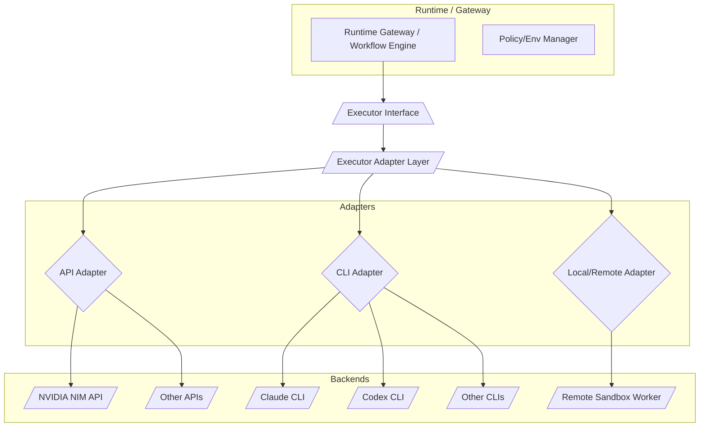
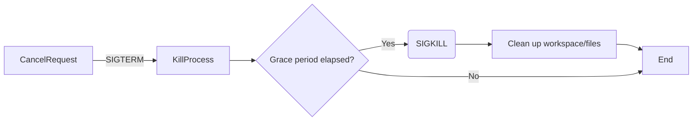
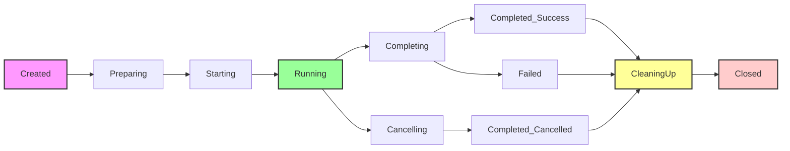

# Tóm tắt giải pháp

> Reference only. Normative synthesis: `../../design/D04_GATEWAY_EXECUTOR_AND_PROVIDERS.md`.

> **Research source ID:** HH-RES-R02  
> **Status:** Reference only — not approved for coding  
> **Normative targets:** `07_DD_Executor_Contract.md`, `08_DD_API_Executor.md`, `09_DD_CLI_Executor.md`, `13_Security_and_Governance.md`, `16_Test_Strategy_and_Acceptance.md`  
> **Renamed for traceability:** 2026-07-27; original filename `deep-research-report (4).md`

Chúng tôi đề xuất một *Executor Adapter Layer* đa nền tảng, đóng vai trò như lớp “cầu nối” để trừu tượng hóa các chi tiết thực thi riêng của từng backend (CLI, HTTP API, local, remote, v.v.). Lớp adapter này định nghĩa một **hợp đồng thực thi (execution contract)** chung, gồm cấu trúc đầu vào và đầu ra thống nhất, cũng như một hệ thống sự kiện dùng chung để báo cáo kết quả. Mỗi adapter cụ thể (*provider* như Claude, Codex, NVIDIA) được xây dựng dưới dạng plugin/đối tượng tuân theo giao diện (interface) chuẩn, nhưng có thể gồm nhiều thành phần (ví dụ: transport, session manager, parser). Việc tách biệt giữa **provider** (ví dụ: Claude hoặc Codex), **transport** (HTTP hay tiến trình) và **phiên làm việc (session)** giúp giảm liên kết (coupling) và tăng khả năng mở rộng.  

Thiết kế cũng đưa ra mô hình **năng lực (capability model)** cho adapter – một bản khai báo những tính năng adapter hỗ trợ (như streaming, gọi tool, structured output, hủy bỏ, báo cáo sử dụng, v.v.) để runtime có thể kiểm tra trước và xử lý tương ứng. Kết quả thực thi được đồng bộ hóa qua một dải sự kiện thống nhất (event stream) bao gồm các loại như `message.delta`, `tool.call`, `usage.updated`, `execution.completed`, v.v. mỗi sự kiện mang thông tin tiêu chuẩn (timestamp, turnId, thông tin phiên). Ví dụ, Crossfire – một thư viện agent – định nghĩa đến 17 loại sự kiện bình thường hoá (NormalizedEvent) như `message.delta`, `tool.result`, `usage.updated`, `turn.completed`, với các trường chung như `timestamp`, `adapterSessionId`.  

Đối với MVP, chúng tôi đề xuất bắt đầu với các executor chạy **cục bộ (local)**: khởi tạo tiến trình cho CLI (Claude Code, Codex) và gọi HTTP cho NVIDIA NIM/Llama, mỗi lần chỉ một “turn” hoặc truy vấn. Hủy bỏ (cancel) tiến trình và timeout được thực hiện qua tín hiệu OS (SIGTERM/SIGKILL) hoặc huỷ yêu cầu HTTP. Kết quả và sự kiện được chuẩn hoá và trả về cho runtime. Với thiết kế module hoá, tương lai có thể mở rộng sang sandbox (container/MicroVM) và remote worker bằng cách thay thế driver thực thi mà không đổi hợp đồng.  

Về bảo mật, chúng tôi khuyến nghị mức độ *isolation* cho MVP là **quá trình trên host**, với đệm workspace và giới hạn tài nguyên ở mức OS. Cho giai đoạn sau, xem xét chạy trong container có seccomp/SELinux hoặc microVM (Firecracker/Kata) để ngăn chặn code độc hại và tấn công. Tất cả bí mật (API keys) chỉ được truyền an toàn qua biến môi trường hoặc file mount được giới hạn, không ghi vào logs. Mọi truy cập file và mạng đều phải tuân theo chính sách (phải khai báo trước). 

Cuối cùng, chúng tôi định nghĩa mô hình miền và giao diện cụ thể (bằng pseudo-code/TypeScript), bao gồm khái niệm **Executor**, **ExecutionRequest**, **ExecutionEvent**, **ExecutionResult**, **SessionHandle**, **Workspace**, **CredentialContext**, v.v. Kèm theo đó là sơ đồ khối (Mermaid) minh hoạ kiến trúc cục bộ, tương lai mở rộng ra worker, luồng hủy, vòng đời workspace, v.v. Một ma trận so sánh (Claude CLI vs Codex CLI vs NVIDIA API) tóm tắt các điểm khác nhau về transport, stream, session, hủy, xác thực, báo cáo sử dụng, mô hình lỗi… Cuối cùng, chúng tôi trình bày tiêu chí “không làm” trong MVP và lộ trình tiến hóa theo pha, cùng các ADR quan trọng về kiến trúc adapter, giao thức, sandbox, hủy, v.v., để làm rõ lựa chọn thiết kế.

## 1. Mô hình miền

- **Executor**: Là thành phần chịu trách nhiệm khởi chạy một tác vụ AI trên một backend cụ thể. Trong thiết kế của chúng tôi, Executor được xem như một đối tượng (hoặc plugin) tuân theo giao diện chuẩn. Nó bao gồm chi tiết về *provider* (ví dụ: Claude, Codex, NVIDIA), *transport* (ví dụ: HTTP hay subprocess), *model/mode*, và *phiên (session)* nếu cần. Một `Executor` có thể được chia thành các thành phần con như: **Transport** (giao tiếp HTTP hoặc khởi tạo tiến trình CLI), **SessionManager** (quản lý trạng thái phiên/tiến trình), **WorkspaceManager**, và **OutputParser**. Thiết kế ưu tiên *composition* hơn là thừa kế sâu: ví dụ, ta có thể có lớp `CliExecutor` chứa một `ProcessManager` và một `Parser`, thay vì tạo nhiều lớp con thừa kế. Mỗi Executor cũng có thể đăng ký **capability manifest** (một struct hoặc metadata) liệt kê các năng lực nó hỗ trợ, ví dụ `supportsStreaming`, `supportsTools`, `supportsFileIO`, v.v. (tương tự `AdapterCapabilities` trong Crossfire).  

- **Adapter**: Mỗi Executor là một loại adapter cho một backend cụ thể. Ví dụ: `ClaudeCliAdapter`, `CodexCliAdapter`, `NvidiaApiAdapter`. Các adapter này có nhiệm vụ đóng gói API hay CLI client vào trong một giao diện chung. Do sự khác biệt lớn giữa các backend, chúng ta tách biệt rõ ràng *transport* và *provider*. Ví dụ, một kiến trúc có thể có một lớp `CliTransport` chung cho việc khởi tiến trình và đọc stdout, kết hợp với các protocol riêng như `ClaudeCliProtocol` hay `CodexJsonRpcProtocol`. Tương tự, `HttpTransport` dùng cho giao tiếp HTTP (OpenAI/NVIDIA), với các client riêng. Việc tách rời giúp tránh tạo ra interface quá chung chung (như bắt một hàm `execute(params)`) mà không nắm được chi tiết riêng biệt.  

- **Session**: Có khái niệm phiên cho backend có trạng thái (như tiến trình CLI lâu dài hoặc session API). Ví dụ, khi gọi `claude` không với `-p`, ta bắt đầu một phiên CLI. `Executor` sẽ trả về một `SessionHandle` để theo dõi. Với APIs, có thể đơn giản là không có session (stateless), hoặc lưu session ID từ provider. Session manager quản lý lifecycle của phiên (tạo, duy trì, đóng). Crossfire đặt `session.started` là sự kiện đầu tiên khi một phiên mở. Một số backend hỗ trợ *resume* (tiếp tục hội thoại) tự nhiên (Claude, Codex CLI), thể hiện qua `supportsResume` flag.  

- **ExecutionRequest**: Là cấu trúc đầu vào cho một lần chạy. Nó chứa các thông tin chung: ID của chạy (run ID), loại executor (để phân biệt adapter), cấu hình backend (endpoint, model name, credentials), danh sách tin nhắn/lệnh cần thực thi, định dạng mong muốn (text/json/stream), tài nguyên/sandbox cần thiết (timeout, workspace, policy filesystem/mạng, v.v.), token hủy, và metadata theo dõi (trace ID). Ví dụ, Crossfire định nghĩa `StartSessionInput` gồm `model`, `workingDirectory`, `permissionMode`, `policy`, `providerOptions` v.v.. Chúng tôi sẽ đề xuất schema JSON cho *ExecutionRequest* thống nhất gồm các trường như `model`, `messages`, `inputFiles`, `workspace`, `envVars`, `credentials`, `timeout`, `cancelToken`, v.v. Phạm trù *portable* sẽ ở đầu schema (các trường chung), còn phần dưới sẽ chừa chỗ cho phần mở rộng riêng provider (ví dụ `claudeOptions`).  

- **ExecutionEvent**: Là các sự kiện được adapter sinh ra trong quá trình chạy (ở dạng stream). Các event này gồm nhiều loại: ví dụ như `executionStarted`, `message.delta`, `toolCall.started`, `toolCall.completed`, `file.change`, `artifact.generated`, `usage.updated`, `warning`, `error`, `executionCompleted`, `executionCancelled`… Mỗi event sẽ có trường chung như `timestamp`, `sessionId`, `turnId` (nếu có), loại event (`kind`), và trường dữ liệu tuỳ loại (như delta text, tên tool, chi phí token, exit code, v.v.). Tài liệu Crossfire đã định nghĩa 17 loại `NormalizedEvent` (session, text, thinking, plan, tool, approval, subagent, metrics, turn, error) với các trường đi kèm. Chúng tôi sẽ xây dựng tập hợp tương tự, chú trọng vào dịch vụ LLM: ví dụ `message.delta` (chuỗi ký tự bổ sung từ model), `message.final`, `tool.call` (yêu cầu gọi công cụ), `usage.updated` (báo cáo token/cost), `turn.completed`, `executionFailed`, v.v. Trật tự (sequence) của event sẽ tuân thủ quy ước: cuối cùng cho một turn phải là `turn.completed` (với usage).  

- **ExecutionResult**: Kết quả cuối cùng của một chạy. Có thể bao gồm text đầu ra (đã hoàn chỉnh), JSON/structured output nếu có, các artifact tạo ra, và thông tin tổng kết (exit code, total usage, tóm tắt chi phí, status hủy hay lỗi). Ví dụ: `ExecutionResult` có thể gộp lại tất cả event quan trọng nhất (hoặc build thành object JSON) sau khi việc chạy kết thúc. Trong trường hợp stream, ta còn giữ các event stream để upstream xử lý thời gian thực.  

- **Workspace**: Là thư mục ảo chứa các file, thư viện mà executor có thể truy cập. Workspace có thể là thư mục chung (dự án), hay thư mục tạm cho từng run. Hệ thống cần quản lý sao cho executor chỉ truy cập trong boundary được phép. Chúng tôi đề xuất interface `WorkspaceHandle` với phương thức như `readFile(path)`, `writeFile(path, content)`, hoặc mount directory, và việc dọn dẹp sau chạy. Workspace sẽ chịu chính sách permission (chỉ đọc/viết gì, có cho phép shell chạy…).  

- **CredentialContext**: Chứa thông tin xác thực cần thiết cho backend (API keys, token, thông tin dịch vụ). Adapter sẽ nhận credentials dưới dạng tham chiếu (ID bí mật) hoặc giá trị an toàn. Ví dụ, ta có thể yêu cầu `credentialContext` chứa API key cho OpenAI hoặc Anthropic; adapter lấy ra, inject vào biến môi trường hoặc header tương ứng, sau đó không log giá trị này.  

- **Capability**: Mỗi executor adapter cần tuyên bố khả năng của nó. Ví dụ: `{ textGeneration: true, streaming: true, toolCalling: true, fileIO: true, shell: true, session: false, cancelable: true, usageReporting: true }`. Crossfire cung cấp mô hình `AdapterCapabilities` gồm các cờ như `supportsStreamingDelta`, `supportsApproval`, `supportsSubagents`. Chúng tôi sẽ thiết kế tương tự, cho phép runtime và policy kiểm tra xem executor có đáp ứng nhu cầu của run không (ví dụ run yêu cầu tính năng tool-calling nhưng adapter không hỗ trợ => lỗi ngay trước khi chạy).  

  

## 2. Kiến trúc tham chiếu

Sơ đồ kiến trúc tổng quan của hệ thống có thể biểu diễn như sau:



*Giải thích sơ đồ*: Thành phần **Gateway/Workflow Engine** khởi tạo `ExecutionRequest` và gửi qua **Executor Interface** vào **Adapter Layer**. Tại đây, Adapter Layer chọn adapter thích hợp (API, CLI, Local/Remote) dựa trên `executorId` hoặc `backend config`. Mỗi adapter lại cụ thể hóa cho backend (ví dụ adapter CLI cho Claude, Codex; adapter HTTP cho NIM, v.v.). Adapter có thể khởi tiến trình cục bộ hoặc gọi mạng. Kết quả và sự kiện được chuẩn hóa đưa ngược lên Gateway. Policy/EnvManager quản lý biến môi trường, chính sách (chế độ sandbox, tokens).  

**Luồng dữ liệu CLI (ví dụ Claude/Codex)**: Gateway -> ExecutorInterface -> CLIAdapter (process manager) -> khởi subprocess `claude` hoặc `codex` -> đọc stdout/stderr. Streaming: adapter đọc liên tục và phát ra event `message.delta` khi có ký tự đầu ra. Sau khi quá trình kết thúc, adapter gửi `turn.completed` (với exit code, usage). Trong sessionful mode (vd. thực thi CLI nhiều lượt), adapter duy trì phiên qua các lệnh tiếp theo. Trạng thái thay đổi được bình thường hóa thành event và đẩy lên Runtime.  

**Luồng dữ liệu API (NVIDIA NIM)**: Gateway -> ExecutorInterface -> APIAdapter -> gọi HTTP POST `/v1/chat/completions` hoặc `/v1/completions`. Nếu streaming được bật, adapter duyệt các sự kiện SSE và chuyển thành event `message.delta`. Sau khi phản hồi kết thúc, tạo `turn.completed` event. Adapter thu thập usage (ví dụ token count từ header/body) và phát thành `usage.updated` hoặc gộp trong `turn.completed.usage`.  

**Thử thách hủy và thời gian**: Runtime có thể gửi `cancelToken` đến adapter. Đối với CLI: gửi SIGTERM tới tiến trình, đợi grace period rồi SIGKILL nếu cần, rồi dọn dẹp. Đối với API: hủy HTTP request nếu có thể (đóng kết nối). Cả hai trường hợp cần đảm bảo xóa workspace tạm, báo event `executionCancelled`.  

**Hướng mở rộng sang Remote Worker**: Adapter Local có thể khởi tạo worker trên mạng (ví dụ SSH, gRPC) với giao thức tự định nghĩa. Các giao tiếp giữa Gateway và worker có thể dùng HTTP/gRPC/WebSocket. Remote worker sẽ nhận *ExecutionRequest* qua giao thức này, chạy tương tự CLI/API bên trong container/MicroVM và phát sự kiện qua kênh.  

Dưới đây là ví dụ luồng hủy (pseudo-code) với CLI: 



Thao tác này đảm bảo hủy tiến trình một cách êm dịu nếu có thể.

Ngoài ra, chúng ta sẽ minh hoạ *quy trình chuẩn bị workspace* và *quy trình dọn dẹp*:

```mermaid
flowchart TD
    CreateRun["Run Created"]
    PrepareWS["Prepare Workspace (clone repo, COW)"]
    PreExec["Set up Env (vars, creds)"]
    StartExec["Executor.Start()"]
    if Stream? then Stream["Emit Streaming Events"] else Exec["Execute and wait"]
    EndExec["Execution Ended (Completed/Error)"]
    PostProc["Collect Artifacts & Logs"]
    CleanupWS["Cleanup Workspace"]
    Closed["Run Closed"]
    
    CreateRun --> PrepareWS --> PreExec --> StartExec --> EndExec --> PostProc --> CleanupWS --> Closed
    StartExec --> Stream
    Stream --> EndExec
```

Mỗi trạng thái sẽ phát ra event tương ứng (ví dụ `executionStarted`, `workspaceReady`, `executionCompleted`, `executionFailed`, `cleanupDone`).

  

## 3. Thiết kế giao diện lập trình

Dưới đây là các interface chính (có thể minh hoạ bằng TypeScript/Python):

```ts
// Mô tả các khả năng của executor
interface ExecutorCapabilities {
  supportsStreaming: boolean;
  supportsToolCalls: boolean;
  supportsStructuredOutput: boolean;
  supportsFileIO: boolean;
  supportsSandbox: boolean;
  supportsSession: boolean;
  supportsCancel: boolean;
  supportsParallel: boolean;
  // ...
}

// Đầu vào cho một lần thực thi
interface ExecutionRequest {
  runId: string;
  executorId: string;     // định danh adapter
  model: string;          // mã mô hình hoặc config
  messages: Message[];    // chuỗi prompt/message
  inputFiles?: Artifact[];// dữ liệu đầu vào
  workspaceId?: string;   // ID workspace (nếu chia sẻ)
  workingDir?: string;    // thư mục làm việc
  envVars?: Record<string,string>; // ENV
  credentialId?: string;  // tham chiếu tới secret
  timeoutMs?: number;
  idleTimeoutMs?: number;
  stream: boolean;
  outputFormat?: "text"|"json";
  sessionId?: string;
  resourceLimits?: ResourceLimits; // CPU/GPU/RAM
  networkPolicy?: NetworkPolicy;
  filesystemPolicy?: FilePolicy;
  cancelToken?: string;
  traceId?: string; 
  providerOptions?: any;  // thả nổi riêng cho provider
}

// Xử lý ngắt/hủy
interface CancellationToken {
  isCancelled(): boolean;
  onCancel(cb: () => void): void;
}

// Context cho workspace (đọc/ghi file)
interface WorkspaceHandle {
  id: string;
  workingDir: string;
  readFile(path: string): Promise<Buffer>;
  writeFile(path: string, data: Buffer): Promise<void>;
  // ...
  cleanup(): Promise<void>;
}

// Định nghĩa sự kiện đã chuẩn hoá
interface ExecutionEvent {
  kind: string;           // ví dụ: 'message.delta','tool.call','usage.updated',...
  timestamp: number;      // UNIX ms
  runId: string;
  adapterId: string;
  sessionId?: string;
  turnId?: string;
  // Các dữ liệu phụ thuộc kind:
  data?: any;
}

// Ví dụ: kết quả sau khi chạy xong (non-stream)
interface ExecutionResult {
  textOutput?: string;
  structuredOutput?: any;
  artifacts?: Artifact[];
  usage?: {
    inputTokens: number;
    outputTokens: number;
    totalCostUsd?: number;
    // ...
  };
  exitCode?: number;
  error?: string;
}

// Artifact đại diện file tạo ra
interface Artifact {
  path: string;
  size?: number;
  digest?: string;
}
```

**Giải thích các interface**:  

- `ExecutorCapabilities`: Adapter sẽ trả về thông tin về năng lực của nó. Điều này giúp hệ thống/runtime biết có thể yêu cầu streaming, tool calls, hay các tính năng đặc biệt không.  

- `ExecutionRequest`: Chứa tất cả tham số cần thiết cho một lượt chạy. Ví dụ **credentials** sẽ được truyền qua `credentialId` (tham chiếu đến Vault, hoặc được inject trước khi chạy); `timeoutMs` cho timeout tổng; `cancelToken` để runtime có thể hủy tác vụ. Chúng tôi phân biệt rõ các phần chung (portable) và `providerOptions` để cho phép mở rộng (vd. `{temperature:0.7}` cho model OpenAI). Schema này có thể hiện thực dưới dạng JSON Schema để validate.  

- `CancellationToken`: Cung cấp khả năng hủy bất cứ khi nào. Adapter kiểm tra token thường xuyên và clean-up khi nhận tín hiệu. Đối với HTTP có thể abort request; với subprocess thì kill process.  

- `WorkspaceHandle`: Tương tự như handle file system cục bộ; đảm bảo khả năng *chủ động* đọc/ghi file trong workspace đã cho. Executor chỉ truy cập thông qua interface này (dễ dàng kiểm soát sandbox).  

- `ExecutionEvent`: Sự kiện đầu ra theo kiểu “discriminated union”: trường `kind` xác định loại event. Mỗi sự kiện kèm theo dữ liệu thích hợp. Ví dụ, event `{kind: "message.delta", data: {text: "Hello"}}` đại diện bước bổ sung văn bản. Event `{kind: "usage.updated", data: {...}}` chứa token count. Event `{kind: "tool.call", data: {toolName: "...", args: ...}}` khi model gọi công cụ. Sự kiện cuối cùng có thể là `{kind: "execution.completed", data: {exitCode:0}}`. Các trường chung như `timestamp`, `runId`, `sessionId` giúp phân biệt và liên kết (ví dụ `turnId` để nối streaming). Các trường usage (token cost) cũng tuân theo định dạng thống nhất.  

- `ExecutionResult`: Tóm tắt kết quả cuối cùng (dùng khi không stream). Ví dụ nếu gọi một phiên **one-shot** (không cần stream), adapter có thể trả kết quả này (text + usage) thay cho event stream.  

Mỗi adapter sẽ triển khai interface `Executor` hoặc `ExecutorFactory` với các phương thức như `startExecution(request: ExecutionRequest): Promise<ExecutionHandle>`, `cancelExecution(runId)`, v.v. `ExecutionHandle` sẽ có một `onEvent(cb)` để đăng ký listener các `ExecutionEvent`, và `await handle.waitForCompletion()` hoặc tương tự.

## 4. Định nghĩa schema chuẩn

Chúng tôi đề xuất sử dụng JSON Schema để mô tả hợp đồng giao tiếp:

**ExecutionRequest Schema (đầu vào):**

```json
{
  "title": "ExecutionRequest",
  "type": "object",
  "required": ["runId","executorId","messages"],
  "properties": {
    "runId": {"type":"string"},
    "executorId": {"type":"string"},
    "backendConfig": {
      "type":"object",
      "properties": {
        "model": {"type":"string"},
        "endpoint": {"type":"string"},
        "apiKey": {"type":"string"}
      },
      "required":["model"]
    },
    "messages": {
      "type":"array",
      "items": {
        "type":"object",
        "required":["role","content"],
        "properties": {
          "role": {"enum":["system","user","assistant"]},
          "content": {"type":"string"}
        }
      }
    },
    "inputFiles": {
      "type":"array",
      "items": {"type":"string"}  // paths in workspace
    },
    "workingDir": {"type":"string"},
    "envVars": {
      "type":"object",
      "additionalProperties": {"type":"string"}
    },
    "timeoutMs": {"type":"integer","minimum":0},
    "idleTimeoutMs": {"type":"integer","minimum":0},
    "stream": {"type":"boolean"},
    "outputFormat": {"enum":["text","json","stream-json"]},
    "sessionId": {"type":"string"},
    "resourceLimits": {
      "type":"object",
      "properties": {
        "cpu": {"type":"number"},
        "memoryMb": {"type":"number"},
        "gpu": {"type":"number"}
      }
    },
    "networkPolicy": {"type":"string"},
    "filesystemPolicy": {"type":"string"},
    "cancelToken": {"type":"string"},
    "traceId": {"type":"string"},
    "providerOptions": {"type":"object"}
  }
}
```

Các trường **di động (portable)** như `runId`, `executorId`, `messages`, `timeoutMs`, `stream` là chung. Phần `backendConfig` và `providerOptions` dành cho tuỳ chỉnh từng provider (ví dụ Anthropic có `maxTokens`, NVIDIA NIM có `engineId`). 

**ExecutionEvent Schema (đầu ra):**

```json
{
  "title": "ExecutionEvent",
  "type": "object",
  "required": ["kind","timestamp","runId","adapterId"],
  "properties": {
    "kind": {
      "type":"string",
      "enum":[
        "session.started", "message.delta", "message.final",
        "tool.call","tool.result","tool.denied","plan.updated",
        "subagent.started","subagent.completed",
        "usage.updated","turn.completed",
        "run.warning","run.error","execution.cancelled","execution.completed"
      ]
    },
    "timestamp": {"type":"integer"},
    "runId": {"type":"string"},
    "adapterId": {"type":"string"},
    "sessionId": {"type":"string"},
    "turnId": {"type":"string"},
    "data": {"type":"object"}
  }
}
```

Các sự kiện cụ thể (`message.delta`, `tool.call`, v.v.) có thể có schema con trong `data`. Ví dụ:

- `message.delta`: `data: {"text": string}`
- `tool.call`: `data: {"toolName":string,"args":object}`
- `usage.updated`: `data: {"inputTokens":int,"outputTokens":int,"totalCostUsd":number}`.

**ExecutionResult Schema (kết quả cuối):**

```json
{
  "title": "ExecutionResult",
  "type": "object",
  "properties": {
    "text": {"type":"string"},
    "structured": {"type":"object"},
    "exitCode": {"type":"integer"},
    "usage": {
      "type":"object",
      "properties": {
        "inputTokens":{"type":"integer"},
        "outputTokens":{"type":"integer"},
        "totalCostUsd":{"type":"number"}
      }
    },
    "artifacts": {
      "type":"array",
      "items":{
        "type":"object",
        "properties":{
          "path":{"type":"string"},
          "digest":{"type":"string"},
          "size":{"type":"integer"}
        }
      }
    },
    "logs": {"type":"string"}
  }
}
```

**Error Schema:** Bao gồm `errorCode`, `message`, `details`. Ví dụ:

```json
{
  "title": "ExecutorError",
  "type": "object",
  "properties": {
    "errorCode": {"type":"string"},
    "message": {"type":"string"},
    "retryable": {"type":"boolean"},
    "visible": {"type":"boolean"}
  }
}
```

**Capability Manifest Schema:** Mỗi adapter có thể cung cấp file JSON mô tả khả năng. Ví dụ:

```json
{
  "title": "CapabilityManifest",
  "type": "object",
  "properties": {
    "executorId": {"type":"string"},
    "version": {"type":"string"},
    "capabilities": {
      "type":"object",
      "properties": {
        "textGeneration": {"type":"boolean"},
        "streaming": {"type":"boolean"},
        "toolCalling": {"type":"boolean"},
        "structuredOutput": {"type":"boolean"},
        "vision": {"type":"boolean"},
        "fileIO": {"type":"boolean"},
        "shell": {"type":"boolean"},
        "session": {"type":"boolean"},
        "cancel": {"type":"boolean"},
        "usageReporting": {"type":"boolean"},
        "costReporting": {"type":"boolean"},
        "parallelism": {"type":"boolean"}
      }
    },
    "configSchema": {"type":"object"}  // schema of executor-specific options
  }
}
```

Tóm lại, chúng ta chuẩn hóa đầu vào/đầu ra ở mức chung nhất có thể, và cho phép mở rộng (các trường provider-specific sẽ nằm trong `providerOptions` hoặc manifest).

## 5. Ma trận so sánh adapter

| **Đặc tính**           | **Claude CLI**                   | **Codex CLI**                   | **NVIDIA NIM API**         |
|------------------------|---------------------------------|---------------------------------|-----------------------------|
| **Transport**          | Subprocess CLI (native binary)  | Subprocess CLI (Rust binary)    | HTTP JSON (OpenAI-compat)   |
| **Quá trình**          | Dài/hữu hạn (phiên tương tác)    | Dài/hữu hạn (giao diện TUI)      | Mỗi gọi một phiên (stateless) |
| **Streaming**          | Có thể (nhật ký token JSON)     | Có (show trên UI; dùng RPC)     | Có (SSE trên `/v1/chat/...`) |
| **Session (stateful)** | Có; CLI duy trì hội thoại        | Có; local session (có resume)   | Không; phải gửi lịch sử trong message list |
| **Hủy**                | SIGTERM/SIGKILL (graceful)     | SIGTERM/SIGKILL                 | Abort HTTP request           |
| **Xác thực**           | Claude subscription token / SSO | ChatGPT/Plus token              | API Key/OAuth               |
| **Môi trường làm việc** | Truy cập workspace local        | Truy cập workspace local        | Chỉ dữ liệu gửi kèm qua HTTP |
| **Báo cáo sử dụng**     | Nhận token usage từ JSON-nld    | RPC event `thread/tokenUsage`   | Trong header/body response   |
| **Mô hình lỗi**        | Non-zero exit code, message     | RPC error, non-zero exit code   | HTTP status, JSON error      |
| **Đầu ra có cấu trúc**  | JSON stream tùy flags (`--output-format json`) | JSON-RPC objects trên stdout  | Hỗ trợ function calling returns (JSON) |
| **Cần PTY?**           | Thường *không*, trừ interactive| Thường *không*, trừ interactive| N/A                        |
| **Đầu vào tệp**         | Có thể đọc tệp qua flag         | Có thể pipe/cung cấp tệp        | Đọc từ URL hoặc base64 (nếu hỗ trợ) |
| **Concurrency**        | Nhiều tiến trình song song      | Được (chịu tải của máy)         | Vì REST, có thể nhiều request song song |
| **Khả năng mở rộng**    | Cần thêm binary hoặc flag mới   | Cần nâng cấp phiên bản CLI      | Chuyển model qua parameter   |

Các điểm khác biệt quan trọng: *Claude/Codex CLI* chạy cục bộ, nên có thể truy cập workspace, chạy shell, gọi tool (như gỡ lỗi, lệnh shell) trực tiếp. *NVIDIA NIM API* chỉ nhận ngôn ngữ/lệnh, không truy cập file hệ thống và trả về kết quả qua HTTP. Do đó, adapter CLI phải quan tâm đến quản lý process, PTY (nếu cần), xử lý ANSI codes, buffer output; trong khi adapter HTTP phải quản lý HTTP client, streaming SSE, retry logic.  

Ví dụ: Codex CLI hỗ trợ **multimodal input** (hình ảnh) và chạy một session UI đầy đủ, trong khi NVIDIA NIM có khả năng *function calling* tương đương OpenAI API v4 với structured JSON response (sẽ parse thành tool call event).  

## 6. Phân loại lỗi (Error Taxonomy)

Chúng tôi phân loại lỗi theo ngữ cảnh:

- **Lỗi cấu hình (Configuration error)**: Sai định danh executor, thiếu/ sai định dạng đầu vào. Không thể khởi tác vụ. Ví dụ: yêu cầu `executorId` không tồn tại. (Không retry; user-visible)
- **Lỗi xác thực (Authentication error)**: Token/API key không hợp lệ hoặc hết hạn. Thông báo `AuthFailed`. Có thể hiển thị cho user, có thể retry sau khi refresh token (nếu backend hỗ trợ).
- **Lỗi năng lực (Capability error)**: Yêu cầu tính năng adapter không hỗ trợ (ví dụ yêu cầu streaming nhưng adapter không hỗ trợ). Phát hiện trước execution, trả về ngay.
- **Lỗi khởi tạo (Startup error)**: CLI không tìm thấy (path sai), hoặc HTTP endpoint không đáp. Có thể retry (tại application level hoặc user fix). Lỗi này thường retry hoặc báo alert.
- **Lỗi mạng/transport (Transport error)**: HTTP timeout, kết nối bị reset, DNS error. Thường retry được theo chính sách thang phân (exponential backoff). Mức ảnh hưởng: có thể gây tác vụ bị delayed hoặc abort nếu hết retry.
- **Lỗi provider (Provider error)**: Backend trả lỗi (HTTP 5xx, hoặc hàm SDK ném exception do server error). Xem xét: nên retry (trừ khi lỗi 4xx vô dụng như `invalid_request`). Ví dụ HTTP 429 có thể retry sau delay.
- **Lỗi tiến trình (Process error)**: Tiến trình CLI bị sập (crash), hay exit code ≠ 0 nhưng không có kết quả. Mức độ: tuỳ trường hợp, có thể retry (nếu lỗi tạm thời), hoặc báo `run.error`. Cần clean-up child processes (xem zombie).
- **Lỗi parsing (Output parsing error)**: Dữ liệu đầu ra không đúng format mong đợi (VD: JSON parse fail). Thường do phiên bản CLI không hỗ trợ JSON, hoặc output lẫn ANSI. Cần báo `run.error` và có thể yêu cầu chỉnh sửa phiên bản/flag.
- **Timeout (quá thời gian)**: Timeout tổng hoặc idle. Cần kill tiến trình/abort HTTP, báo `ExecutionFailed("timeout")`.
- **Lỗi hủy (Cancellation)**: Phát hiện token cancel => ngắt thử với SIGTERM, đợi grace, sau đó SIGKILL. Báo `execution.cancelled`. Có thể coi là clean state (không cần retry).
- **Lỗi tài nguyên (Resource limit)**: Vượt CPU/memory. Hệ thống OS kill (SIGKILL). Cần bắt và báo `resource limit exceeded`.
- **Lỗi bảo mật (Security violation)**: Phát hiện hành động vi phạm policy (file ngoài workspace, network forbidden). Báo `security violation`; có thể stop ngay.
- **Lỗi cleanup (Cleanup error)**: Không xóa được workspace/tệp tạm. Nên log cảnh báo, cố gắng tiếp tục để không block next run.

Mỗi lỗi sẽ gắn cờ `retryable` tùy loại: ví dụ mạng gián đoạn nên retry, nhưng lỗi parsing/đầu vào thì không. Một số lỗi là user-visible (API key invalid, syntax prompt), một số là nội bộ (timeout, zombie). Telemetry nên ghi rõ `errorCode` và `kind`. Ví dụ mã lỗi: `AUTH`, `TIMEOUT`, `PARSE_ERROR`, `SIGTERM`, ... phải có trong logs.

## 7. Vòng đời tiến trình

Ta định nghĩa trạng thái và chuyển đổi của một nhiệm vụ (run) như sau:



- **Created**: Run khởi tạo, chuẩn bị input.
- **Preparing**: Chuẩn bị workspace, biến môi trường, credentials.
- **Starting**: Khởi tiến trình/phiên (khởi CLI hoặc gửi HTTP).
- **Running**: Tiến trình/chạy API đang hoạt động, phát sinh sự kiện `message.delta` v.v.
- **Cancelling**: Nhận được yêu cầu hủy; adapter đang gửi tín hiệu dừng (SIGTERM...) và đợi.
- **Completing**: Tiến trình kết thúc bình thường hoặc gặp lỗi bên trong. Kết quả hoặc lỗi đầu ra được thu thập.
- **Completed_Success**: Hoàn thành không lỗi. (Có thể phát `execution.completed`.)
- **Failed**: Hoàn thành bất thường (exit code ≠0 hoặc exception). (Phát `execution.failed`.)
- **Completed_Cancelled**: Kết thúc do hủy. (Phát `execution.cancelled`.)
- **CleaningUp**: Dọn dẹp workspace (đóng file, xóa tạm).
- **Closed**: Kết thúc hoàn toàn, đóng handle.

Race condition cần lưu ý: Hủy trong lúc đang chuẩn bị, đang chạy, hoặc sau khi kết thúc. Việc xóa workspace nên thực hiện dù đã lỗi/cancel. Chỉ sang trạng thái `Closed` khi mọi tác vụ cleanup xong. 

## 8. Mô hình an ninh

**Trust boundaries & Threats**: Editor (runtime) và adapter chạy trên cùng host. Phân vùng: host OS (trusted), workspace (tương đối tin cậy), tiến trình con của CLI (không tin cậy). Các chuỗi đáng chú ý: lệnh CLI từ prompt do LLM tạo có thể chèn mã ác (command injection). Tệp trong workspace (repo) có thể chứa mã nguy hiểm. Môi trường có chứa token bí mật cần bảo vệ.

**Các ngưỡng uy tín**:  
- *Trong host*: Code chúng ta viết (Executor Layer).  
- *Workspace*: chứa mã dự án do user cung cấp – không tin hoàn toàn, nhưng nằm chung.  
- *Sandbox/proc*: tiến trình CLI chạy: KHÔNG tin tưởng, nó thể hiện các lời gọi hệ thống với tập tin user-provided.

**Kiểm soát truy cập**:  
- **Filesystem policy**: Chỉ cấp quyền đọc/ghi trong workspace cụ thể. Nếu provider cần chroot/container hóa, thì thiết lập sandbox tách biệt. Chặn path traversal, symbolic link đến ngoài workspace. Tuân thủ phiên bản có thể dùng kỹ thuật mount read-only theo chính sách.  
- **Network policy**: Mặc định vô hiệu mạng cho tiến trình CLI (trừ khi cần, ví dụ NVIDIA API cho phép outbound). Nếu CLI agent cần Internet (MCP…), chỉ cho phép đến các domain đen (trường hợp đặc biệt).  
- **Secret handling**: Không để lộ API key/token trong logs hoặc đầu ra. Chỉ inject vào biến môi trường trong runtime và rút ngay sau. Đảm bảo không qua lớp transport (như URL). Kiểm tra container/ổ cắm có khả năng thu thập secret hay không. Cân nhắc cho mỗi run token mới (không reuse).  

**Sandboxing**: Đối với MVP, có thể chọn chạy tiến trình dưới *OS user hạn chế* (ví dụ Linux user không có quyền cao). Lý tưởng hơn là container nhẹ (ví dụ Docker với seccomp hạn chế). Đối với sản phẩm sau, microVM (Firecracker/Kata) sẽ bảo đảm an toàn cao nhất. Thông tin tham khảo cho thấy **containers chia sẻ kernel** là điểm yếu (có thể bị escape). **gVisor** là lớp ảo hóa system-call để giảm bề mặt tấn công, phù hợp chạy AI agent ảo hóa mà không cần VM đầy đủ. **Firecracker/Kata** cung cấp tách hẳn nhân, phù hợp cho workloads không tin tưởng (như agents).  

**Kiểm soát tài nguyên**: Dùng cgroup (container) hoặc cgroups native để giới hạn CPU, RAM, I/O. Tránh tình huống *fork bomb* – giới hạn số tiến trình con. Đặt thời gian timeout. Giám sát lượng output (có thể pipe vào buffer, tránh chiếm full RAM).

**Audit & Logging**: Ghi lại audit log (ai gì yêu cầu gì trên workspace?). Theo dõi: hành động đọc/ghi file, network request được thực hiện (nhất là trong CLI tool calls). Tách log người dùng (text output của LLM) và log hệ thống (debug, stderr) để không gây nhầm lẫn.

**Chiến lược**: Triển khai theo bước. MVP có thể chỉ cần container (Docker/namespace) để phân tách môi trường. Giai đoạn sau triển microVM (an toàn hơn) nếu cần multi-tenant. Luôn áp dụng *principle of least privilege*: mỗi executor chỉ có quyền cần thiết (đặc biệt limit filesystem và user).

## 9. Chiến lược kiểm thử

- **Unit tests**: Cho từng module adapter (ví dụ ProcessManager, HTTP client wrapper) sử dụng mocking.  
- **Contract tests**: Tập hợp kiểm tra chung cho mọi executor: ví dụ khởi một `ExecutionRequest` mẫu, adapter bắt phải phát ra đúng các `ExecutionEvent` đã định (ví dụ luôn có `turn.completed` cuối cùng, usage, v.v.). Crossfire đã có ví dụ contract tests cho khả năng `approve` và `interrupt`.  
- **Golden output tests**: Chạy thử CLI/API với prompt cố định, so sánh output (text hoặc JSON) với kết quả mong đợi đã lưu. Kiểm tra parsing.  
- **Parser tests**: Đưa ra chuỗi raw output (có thể có escape code) và so sánh với dữ liệu event mong muốn.  
- **Fake process tests**: Dùng một tiến trình giả (script echo hoặc sleep) để giả lập CLI, kiểm tra hủy, timeout, và capture cả stdout/stderr.  
- **Fake HTTP provider tests**: Bẫy adapter gọi tới fake server (ví dụ bằng wiremock) để kiểm thử retry, hủy request, JSON parse, timeout.  
- **Chaos tests**: Đột ngột kill process, phân mảnh kết nối, cho API trả JSON không mong đợi. Xem adapter phản ứng thế nào (phải thành `run.error`/`run.warning` hợp lý).  
- **Cancellation tests**: Đưa token cancel trong lúc adapter đang chạy dài, đảm bảo process bị kill đúng và events phản hồi `execution.cancelled`.  
- **Timeout tests**: Giả lập CLI/Sleep > timeout, adapter phải kill và trả lỗi.  
- **Process-tree cleanup**: Tạo tiến trình cha và con trong CLI, kiểm tra adapter kill toàn bộ tree (loại zombie).  
- **Workspace isolation tests**: Trong adapter CLI, thử đọc/ghi file vượt giới hạn (path traversal) và kiểm tra policy ngăn cản.  
- **Security tests**: Tấn công injection (vd. tên file chứa chuỗi lệnh shell) và đảm bảo adapter xử lý an toàn (nếu dùng exec shell, phải escape).
- **Compatibility tests**: Với nhiều phiên bản CLI (mocks/containers), kiểm thử adapter hoạt động với cả phiên bản mới và cũ.  

Chúng tôi kiến nghị xây dựng một *bộ kiểm thử compliance* (độc lập) cho mọi executor: nghĩa là mỗi adapter cần vượt qua cùng một tập bài kiểm tra chung. Ví dụ: adapter phải tạo `turn.completed` event cuối cùng và báo `usage.updated` nếu có usage, không xóa turnId, v.v. (Crossfire nhắc khả năng này: *“Contract tests enforce selected capability claims”*).  

## 10. Thiết kế MVP (Minimum Viable Product)

MVP cần sớm có thể chạy được với mức độ đơn giản:

- **Executor cục bộ**: Hỗ trợ chạy tiến trình CLI tại chỗ (Claude và Codex), và gọi HTTP (NVIDIA NIM). Chưa cần remote execution.  
- **Interface & contract tối thiểu**: Thực hiện đầy đủ các contract tests cơ bản.  
- **Sự kiện chung**: Dùng event stream để báo output, usage, errors.  
- **Hủy/timeout**: Triển khai hủy cơ bản: SIGTERM->SIGKILL cho CLI, abort HTTP cho API.  
- **Workspace**: Đơn giản: copy-on-write repository hoặc thư mục hiện tại làm workspace cho mỗi run. Giới hạn quyền nhưng chưa container hóa.  
- **Secrets**: Chỉ hỗ trợ đưa biến môi trường từ runtime vào context; không triển khai hệ thống vault hoàn chỉnh (dùng .env hoặc Config). Không log secrets.  
- **Logging**: Định dạng JSON logs, phân tách rõ output user và log debug.  
- **Testing**: Đầy đủ unit/contract/golden tests cho các adapter được hỗ trợ.  
- **Event Model**: Ít nhất các event: `message.delta`, `turn.completed`, `usage.updated`, `run.error`. Bổ sung khi needed.  
- **Structured output**: Hỗ trợ JSON nếu backend trả JSON (vd. Codex CLI JSON-RPC).  

**Không làm trong MVP:**  
- Chưa cần multi-tenancy, cluster job scheduling.  
- Không thiết kế pool session CLI liên tục (tách session pool hoặc daemon phức tạp; CLI chỉ khởi theo yêu cầu).  
- Chưa tích hợp full policy enforcement trên filesystem/mạng (chỉ dựng cột sandbox tối thiểu).  
- Không hỗ trợ GPT function calling phức tạp (có thể parse thành `tool.call` ngôn ngữ đơn giản).  
- Chưa thêm plugin loader động; adapter cài cứng hoặc DI.  
- Không triển khai gVisor/MicroVM ngay (chỉ container thông thường hoặc host user).  
- Không làm lịch sử phức tạp, rollback workspace.  

Mục tiêu: Trong MVP, hệ thống có thể chạy trên một máy với cả Claude CLI, Codex CLI và NVIDIA NIM. Các tính năng chính được đưa vào code, tuy có thể chưa hoàn thiện, nhưng không đứt gãy kiến trúc cho tương lai.

## 11. Kế hoạch prototype

Một số giả định cần chứng minh qua PoC:

- **Stream CLI đầu ra**: Hypothesis: CLI (Claude, Codex) có thể stream token ra stdout để adapter đọc. Hãy thử `claude -p "test"` và xem output từng phần trong thời gian thực. *Thành công* nếu adapter nhận dải sự kiện delta liên tục thay vì một mẩu duy nhất. *Thất bại* nếu CLI chỉ in lúc kết thúc. Nếu không, xem xét cờ `--output-format stream-json`.  
- **PTY vs pipe**: Hypothesis: Không phải lúc nào cần PTY. Thử chạy lệnh tương tác (ví dụ `claude agents`) trong adapter bằng pipe và PTY. Đo: cờ màu, con trỏ, tính chính xác. *Thành công* nếu pipe đơn giản xử lý đủ (nếu output là text thuần); *thất bại* nếu gặp vấn đề với escape code hay output treo. (Gemini đã chứng minh lợi thế PTY cho ứng dụng tương tác.)  
- **Hủy và kill process-tree**: Hypothesis: Gửi SIGTERM vào tiến trình CLI sẽ dừng nó; nhưng cần kill cả child. PoC: giả lập subprocess tạo child (ví dụ `bash -c "sleep 10 & wait"`). Gửi SIGTERM. Kiểm tra nếu child còn tồn tại (Zombie). *Thành công* khi adapter có thể tìm và kill cả tree (code sẽ đệ quy kill).  
- **Isolation workspace**: Hypothesis: Executor chỉ có thể đọc/ghi workspace được phép. PoC: adapter chạy một lệnh CLI cố gắng truy cập `../` hoặc `/etc/passwd`. Kiểm tra policy (nếu cài pải). *Thành công* khi lệnh bị chặn hoặc không cho phép ra ngoài.  
- **Event normalization**: Hypothesis: Các adapter khác nhau có thể ánh xạ vào một tập event chung. PoC: Thiết lập một scenario có tool call và usage trên Claude và Codex, kiểm tra sự kiện thu về. Chuẩn bị parser để chuẩn hóa. *Thành công* nếu hai event map về cùng loại (ví dụ `tool.call`).  
- **Hợp đồng API vs CLI**: Hypothesis: Mặc dù semantics khác, có thể triển khai adapter gốc để đồng bộ. PoC: Đề bài thử một query đơn giản (ví dụ "List primes < 10") và kiểm tra đầu ra từ Claude CLI vs NIM API có khả năng so sánh. *Thành công* nếu kết quả có thể được đồng nhất (dù noise khác).  

Mỗi PoC sẽ đo lường: correctness (đúng định dạng), latency, tính ổn định. Kết quả giúp thiết kế sửa nếu cần (ví dụ chuyển sang gRPC nếu HTTP chưa tốt, hay thêm cờ cho CLI).

## 12. Lộ trình tiến hóa

Chúng tôi đề xuất chia thành các giai đoạn:

- **Phase 0 (Proof of Concept)**: Triển khai nhanh một bản mẫu nguyên lý hoạt động (có thể là script mẫu) thể hiện khả năng chạy Claude CLI, Codex CLI, NVIDIA API với contract tối thiểu, theo dõi logic cancel timeout và event stream.  
- **Phase 1 (Local Adapter ổn định)**: Bổ sung đầy đủ interface, policies, handling edge cases (keyboard interrupt, errors). Hoàn thiện testing (unit+integration). Chạy được đáng tin trên một host.  
- **Phase 2 (Sandbox/Container hóa)**: Thêm tùy chọn chạy executor trong container hoặc sandbox nhẹ (Docker/gVisor). Tích hợp policy filesystem, giới hạn resource.  
- **Phase 3 (Remote workers)**: Thiết kế và triển khai module làm việc với worker từ xa. Ví dụ spawn process trên một node khác hoặc gửi job đến hệ thống server (Kubernetes job, serverless). Cập nhật giao thức (HTTP/gRPC) giữa gateway và worker. Cơ chế phát hiện mất worker, retry.  
- **Phase 4 (Đa đa năng – Multi-tenant)**: Hỗ trợ nhiều tenant/user/chạy song song. Xây dựng điều phối tài nguyên, giám sát cluster, load balancing. Thêm bảo mật L3 (k8s network policy), audit log tổng thể.  

Mỗi phase có bộ tiêu chí nghiệm thu và hiệu chỉnh tương ứng. 

## 13. ADR (Architectural Decision Records)

Một số quyết định quan trọng:

- **Tách adapter theo chức năng (decomposition)**: Chúng tôi chọn **composition & plugin** thay vì ghép tất cả vào một interface đơn nhất. Mỗi executor sẽ gồm các thành phần: Transport (HTTP hay Process), Parser, SessionManager. Điều này tránh tạo interface quá chung (chống pattern “God interface”). (Củng cố bởi ví dụ Crossfire là các module `adapter-claude`, `adapter-codex` riêng biệt, hoặc dự án adapter OpenAI hỗ trợ nhiều adapter dạng plugin.)  
- **Hợp đồng thực thi chung**: Sử dụng event stream thống nhất như định nghĩa. Tiêu chí: không ép buộc tất cả provider giống nhau, nhưng adapter phải chuyển các hành động cụ thể (tool call, token, file change) về tập event chung. Cảm hứng từ Crossfire NormalizedEvent.  
- **Sử dụng PTY**: Quyết định: chỉ dùng PTY khi cần tương tác (shell full-screen) hoặc để thu màu/ANSI. Không mặc định dùng PTY cho CLI (nó phức tạp và tốn chi phí). Ví dụ Gemini CLI chỉ bật PTY khi lệnh nhập tương tác. Nếu CLI run đơn giản, dùng pipes.  
- **Đấu thầu retry**: Quyết định: Để retry giới hạn ở phạm vi adapter. Ví dụ nếu HTTP gặp lỗi mạng, adapter tự retry (theo policy) trước khi trả lỗi cho runtime. Điều này tránh nested retries. Tham khảo cách OpenAI SDK xử lý retry một vài lần tự động.  
- **Quản lý workspace**: Workspace là ở runtime, không giao cho adapter. Adapter chỉ nhận đường dẫn đến workspace đã chuẩn bị, và chỉ làm việc trong đó. Điều này giữ cho adapter khỏi phải biết clone repo, pull changes, etc.  
- **Credential injection**: Quyết định: Dùng biến môi trường hoặc file mount. Adapter không tự tìm credential (không login SSO...). Thay vào đó runtime cung cấp `credentialContext` và adapter inject vào tiến trình. Không mã hóa hay lưu token trong request payload chung. Ví dụ, Claude CLI hỗ trợ OAuth -> nhưng adapter có thể sử dụng `claude auth` command nếu cần.  
- **Isolation level**: MVP sử dụng OS user hoặc container nhẹ. Không dùng microVM ngay (chi phí cao). Khi cần, nâng cấp lên Kata/GVisor trong Phase 2-3. Như tài liệu chỉ ra, container nhanh nhưng dễ leo thang; gVisor/hypervisor an toàn hơn.  
- **Plugin**: Chọn cấu trúc plugin cho adapter (mỗi adapter là package riêng kèm manifest), thay vì build-in. Lợi ích: dễ deploy riêng, versioning, ngăn lỗi xuyên adapter. Nhược: thêm boilerplate. Ví dụ see dự án openai-adapter trên npm.  
- **Event model**: Xác định event chung và yêu cầu mỗi adapter map đúng. Không cho phép adapter gửi event ngoài danh sách chuẩn, ngoại trừ trường `data` tuỳ chỉnh. Bởi vì event là hợp đồng giữa adapter và runtime. (Đa số thỏa thuận này dựa trên ví dụ Crossfire.)  
- **Quy tắc ưu tiên hủy và timeout**: Hủy xếp trên timeout – nếu client gửi cancel, luôn cố gắng hủy trước. Timeout là dự phòng nếu adapter tự chạy quá lâu.  
- **Không ép abstraction cho all**: Ví dụ, không cố gắng ép CLI support structured output nếu backend không có. Giữa abstract hoàn hảo và phù hợp thực tế. Hỗ trợ hàm parser plugin chuyên cho từng backend nếu cần.  
- **Signature giao tiếp với worker**: Khởi đầu dùng REST (HTTP+JSON). Sau này có thể chuyển WebSocket/gRPC nếu cần hiệu năng (cần benchmark).

Mỗi ADR sẽ được lưu trong repo để theo dõi.  

## 14. Kiến nghị cuối cùng

- **Kiến trúc adapter**: Đề nghị theo mô hình *ports-and-adapters* (hexagonal) với nhiều lớp con: tách transport vs provider. Các adapter cụ thể (Claude CLI, Codex CLI, NVIDIA API) triển khai interface chung của Executor. Thiết lập plugin structure cho từng adapter. Dùng composition thay vì kế thừa: e.g. một `CliExecutor` chứ không phải `ClaudeExecutor extends BaseExecutor`.  

- **Interface tối thiểu**: Có một interface `Executor` với các phương thức như `execute(request)` trả về `ExecutionHandle` và `cancel()`. `ExecutionHandle` có `onEvent` và `getResult()`. Phân công rõ ràng: Factory lo khởi tạo đúng adapter theo `executorId`; Executor chỉ lo chạy. Lifetime: Request tạo handle, handle duy trì đến khi clean-up.  

- **Composition vs Inheritance**: Nên sử dụng composition cho các chức năng chung (ví dụ ProcessManager, EventParser), tránh đa kế thừa. Ví dụ, không nên tạo class `CliAdapter` kế thừa `HttpAdapter`; thay vào đó có thể share code qua utility.  

- **Hành vi đặc thù provider**: Không cố ép các hành vi riêng thành interface chung. Ví dụ: Nếu một CLI không hỗ trợ streaming, đừng bắt adapter đó phải trả event `message.delta`. Nếu một API có response trì hoãn, adapter phải xử lý nhưng đó không phải phần của contract (có thể coi đó là `execution error` nếu timeout).  

- **Sandbox MVP**: Chọn mức độ container hoá nhẹ (có thể chỉ làm user tách) cho MVP. Đừng phức tạp hoá bằng microVM vội. Chỉ khi yêu cầu bảo mật cao hoặc đa-tenant mới đến giai đoạn microVM.  

- **Giả định cần verify trước production**:  
  - Streaming CLI: Thử đa phiên bản CLI để đảm bảo streaming ổn định (có thể có drift).  
  - Xử lý ANSI/Unicode: CLI đôi khi trả màu/Unicode (vd. Codex CLI UI). Adapter cần cách lọc.  
  - Hủy sạch: Đảm bảo tiến trình con không tồn dư (quan trọng để tránh leak tài nguyên).  
  - Compatibility: CLI/SDK version drift – phải phát hiện xem thông tin phiên bản và test tương thích (như Codex có `codex --version`).  
  - Structured output: Chỉ tin cậy JSON nếu có flag. E.g. Claude CLI cần `--output-format json` hoặc `stream-json` để có định dạng parse được.  

Tóm lại, thiết kế này cân bằng giữa tính chung cần thiết (interface executor, event flow, schema) và sự linh hoạt cho từng backend. Triển khai MVP local nhanh để có feedback, rồi mở rộng dần sang container/worker. Tránh lock-in vendor bằng interface ổn định, và luôn giám sát (telemetry) mọi interaction để cải tiến sau. 

**Tài liệu tham khảo**: Các thiết kế và số liệu kỹ thuật được tham chiếu từ tài liệu chính thức và nghiên cứu (ví dụ: Crossfire Adapter Layer, blog triển khai CLI Gemini, NVIDIA NIM docs, và blog kỹ thuật về sandboxing), cùng các bài viết kỹ thuật cập nhật về agent orchestration.
