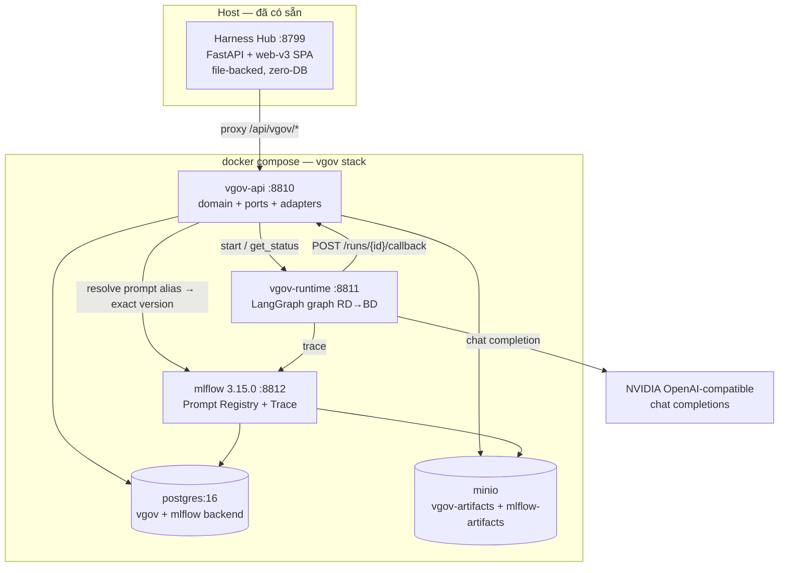
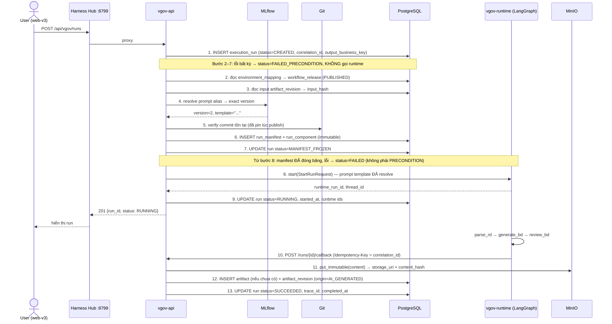

# SD — Version Governance POC (Harness Hub)

**Date:** 2026-08-02
**Status:** 🟢 Approved (v1.1 — sửa 14 lỗi từ review, xem §13)
**Author:** Claude (Opus 5)
**Phase gate:** GATE 2 — APPROVED 2026-08-02
**Upstream:** [`01_requirements.md`](01_requirements.md)

SD này chỉ thiết kế các thành phần Harness Hub sở hữu `[BD §10]`. Không thiết kế lại internal của
LangGraph, MLflow, Git, PostgreSQL, S3/MinIO.

---

## 1. Architecture Overview



**Nguyên tắc bố trí:** Harness Hub giữ nguyên vai trò control plane và frontend duy nhất `[PB §10.11]`.
`vgov-api` là backend module, không có UI riêng. Hub proxy `/api/vgov/*` sang `vgov-api`.

### 1.1 Package layout

```text
harness/version-governance/
  app/
    domain/              # dataclass thuần + rule. CẤM import langgraph/mlflow/boto3/sqlalchemy
      release.py  environment.py  run.py  manifest.py
      artifact.py  baseline.py  lineage.py  difference.py
    ports/               # Protocol + DTO. CẤM import vendor SDK
      runtime.py  prompt_registry.py  blob_store.py  source_control.py
    adapters/            # nơi DUY NHẤT được import vendor SDK
      langgraph_runtime.py  mlflow_prompt.py  minio_blob.py  git_source.py
    persistence/         # SQLAlchemy models + repositories
      models.py  repositories.py  session.py
    services/            # use case, orchestration
      release_service.py  run_service.py  artifact_service.py
      baseline_service.py  lineage_service.py  difference_service.py
    api/                 # FastAPI routers
      releases.py  environments.py  runs.py  artifacts.py
      baselines.py  lineage.py  difference.py  health.py
    migrations/          # Alembic
    config.py  main.py
    tests/
  runtime/               # LangGraph app — Git-pinned, commit SHA vào release
    graph.py  server.py  Dockerfile
  deploy/
    docker-compose.yml  .env.example  init-minio.sh
```

**NFR-004 enforce bằng test:** `tests/test_boundaries.py` parse AST mọi file trong `domain/` và
`ports/`, fail nếu có import `langgraph`, `mlflow`, `boto3`, `sqlalchemy`, `psycopg`, `fastapi`.

---

## 2. Data Model

### 2.1 Enum + hàm chặn ghi

> **Thứ tự migration bắt buộc:** enum → `trg_block_write()` → bảng → trigger. PostgreSQL yêu cầu
> function tồn tại trước `CREATE TRIGGER`, nên khối này phải chạy **đầu tiên**.

```sql
CREATE TYPE release_status  AS ENUM ('DRAFT','PUBLISHED');
CREATE TYPE environment_name AS ENUM ('DEV','PROD');
CREATE TYPE run_status AS ENUM (
  'CREATED','MANIFEST_FROZEN','RUNNING',
  'SUCCEEDED','FAILED','FAILED_PRECONDITION','CANCELLED');
CREATE TYPE component_kind AS ENUM ('PROMPT','AGENT','TOOL','MODEL');
CREATE TYPE origin_type AS ENUM ('AI_GENERATED','HUMAN_EDITED','IMPORTED');
```

`component_kind` **chỉ** có 4 giá trị. `git_commit`, `input_hash`, `runtime_adapter_id`,
`model_profile` là **cột của `run_manifest`**, không phải row của `run_component` — nếu để cả hai chỗ
thì cùng một fact có hai nơi lưu, đi ngược NFR-005.

```sql
-- SQLSTATE riêng 'VG409' để phân biệt với CHECK constraint thật (23514).
-- errors.py map VG409 → HTTP 409 IMMUTABLE_OBJECT, 23514/23505 → HTTP 422 VALIDATION_ERROR.
CREATE FUNCTION trg_block_write() RETURNS trigger AS $$
BEGIN
  RAISE EXCEPTION '% is immutable (%)', TG_TABLE_NAME, TG_OP USING ERRCODE = 'VG409';
END $$ LANGUAGE plpgsql;
```

Bảng đúng `[PB §8 Minimal Data Boundary]` + `approved_baseline` (bắt buộc bởi `[BD §6.5]`).
**Không** tạo generic `asset` framework `[PB §8]`. **Không** bảng `lineage` riêng — lineage là FK
traversal `[BD §5.2]`.

### 2.2 workflow_release — FR-REL-001..004

```sql
CREATE TABLE workflow_release (
  id                   uuid PRIMARY KEY DEFAULT gen_random_uuid(),
  workflow_id          text NOT NULL,
  release_version      text NOT NULL,
  status               release_status NOT NULL DEFAULT 'DRAFT',
  git_repo             text NOT NULL,
  git_ref              text NOT NULL,                 -- ref yêu cầu lúc tạo draft
  git_commit           char(40),                      -- resolve lúc publish
  entrypoint           text NOT NULL,                 -- 'graph:build_graph'
  state_schema_version text NOT NULL,
  bindings             jsonb NOT NULL,                -- node → {agent, prompt_ref, tool_refs}
  runtime_adapter_id   text NOT NULL,                 -- 'langgraph'
  model_profile        text NOT NULL,                 -- con trỏ trừu tượng: 'design-accurate@v1'
  model_name           text NOT NULL,                 -- model thật đã pin: 'meta/llama-3.1-8b-instruct'
  created_at           timestamptz NOT NULL DEFAULT now(),
  created_by           text NOT NULL,
  published_at         timestamptz,
  published_by         text,
  CONSTRAINT uq_release UNIQUE (workflow_id, release_version),
  CONSTRAINT ck_published_complete CHECK (
    status = 'DRAFT' OR (git_commit IS NOT NULL AND published_at IS NOT NULL))
);
```

**Trigger immutability — NFR-001, FR-REL-002:**

```sql
CREATE FUNCTION trg_release_immutable() RETURNS trigger AS $$
BEGIN
  IF TG_OP = 'DELETE' THEN
    IF OLD.status = 'PUBLISHED' THEN
      RAISE EXCEPTION 'workflow_release % is PUBLISHED and immutable', OLD.id
        USING ERRCODE = 'VG409';
    END IF;
    RETURN OLD;
  END IF;
  IF OLD.status = 'PUBLISHED' THEN
    RAISE EXCEPTION 'workflow_release % is PUBLISHED and immutable', OLD.id
      USING ERRCODE = 'VG409';
  END IF;
  -- DRAFT: chỉ cho phép chuyển sang PUBLISHED, mọi cột định nghĩa phải giữ nguyên
  IF NEW.workflow_id IS DISTINCT FROM OLD.workflow_id
     OR NEW.release_version IS DISTINCT FROM OLD.release_version
     OR NEW.git_repo   IS DISTINCT FROM OLD.git_repo
     OR NEW.entrypoint IS DISTINCT FROM OLD.entrypoint
     OR NEW.state_schema_version IS DISTINCT FROM OLD.state_schema_version
     OR NEW.bindings   IS DISTINCT FROM OLD.bindings
     OR NEW.runtime_adapter_id IS DISTINCT FROM OLD.runtime_adapter_id
     OR NEW.model_profile IS DISTINCT FROM OLD.model_profile
     OR NEW.model_name IS DISTINCT FROM OLD.model_name THEN
    RAISE EXCEPTION 'workflow_release definition columns are not updatable'
      USING ERRCODE = 'VG409';
  END IF;
  RETURN NEW;
END $$ LANGUAGE plpgsql;

CREATE TRIGGER release_immutable BEFORE UPDATE OR DELETE ON workflow_release
  FOR EACH ROW EXECUTE FUNCTION trg_release_immutable();
```

> Muốn đổi một release đã publish → tạo release mới. FR-REL-003, `[CC §10.2]`.

**`model_profile` vs `model_name` — cùng khuôn mutable pointer → immutable target như prompt.**

| | Prompt | Model |
|---|---|---|
| Con trỏ (người dùng đặt) | alias `production` | `model_profile` = `design-accurate@v1` |
| Đích bất biến (resolve rồi pin) | `prompt_version` = `8` | `model_name` = `meta/llama-3.1-8b-instruct` |
| Ghi vào `run_component` | `ref=mlflow://<name>`, `exact_version=<số>` | `ref=model://<profile>`, `exact_version=<model_name>` |

Đúng RD Q7: *"pin tên model trong config của release"*. Nhờ tách hai giá trị, Explain Difference
phân biệt được **đổi profile** với **đổi model thật** — nếu gộp làm một thì hai tình huống đó không
còn phân biệt được.

`run_manifest` **chỉ** giữ `model_profile`, **không** thêm cột `model_name`: model thật đã nằm trong
`run_component`, thêm nữa là lưu cùng một fact ở hai nơi, vi phạm NFR-005.

### 2.3 environment_mapping + audit — FR-ENV-001..004

```sql
CREATE TABLE environment_mapping (
  id                  uuid PRIMARY KEY DEFAULT gen_random_uuid(),
  environment         environment_name NOT NULL,
  workflow_id         text NOT NULL,
  workflow_release_id uuid NOT NULL REFERENCES workflow_release(id),
  updated_at          timestamptz NOT NULL DEFAULT now(),
  updated_by          text NOT NULL,
  CONSTRAINT uq_env UNIQUE (environment, workflow_id)
);

CREATE TABLE environment_mapping_audit (          -- append-only
  id               uuid PRIMARY KEY DEFAULT gen_random_uuid(),
  environment      environment_name NOT NULL,
  workflow_id      text NOT NULL,
  from_release_id  uuid REFERENCES workflow_release(id),
  to_release_id    uuid NOT NULL REFERENCES workflow_release(id),
  actor            text NOT NULL,
  reason           text,
  at               timestamptz NOT NULL DEFAULT now()
);
CREATE TRIGGER env_audit_append_only BEFORE UPDATE OR DELETE
  ON environment_mapping_audit FOR EACH ROW EXECUTE FUNCTION trg_block_write();
```

Application rule: chỉ trỏ tới release có `status='PUBLISHED'`. Promote và rollback dùng **cùng một**
endpoint — rollback chỉ là trỏ về release cũ hơn, không xóa gì `[CC §4.5]`, FR-ENV-003.

### 2.4 execution_run — FR-RUN-001..004

```sql
CREATE TABLE execution_run (
  id                  uuid PRIMARY KEY DEFAULT gen_random_uuid(),
  project_key         text NOT NULL,
  workflow_id         text NOT NULL,
  -- nullable: run row được INSERT ở bước 1, TRƯỚC khi resolve environment → release (bước 2).
  -- Nếu env chưa trỏ release nào thì run vẫn phải lưu được ở FAILED_PRECONDITION để audit.
  workflow_release_id uuid REFERENCES workflow_release(id),
  output_business_key text NOT NULL,          -- identity của artifact sẽ sinh ra, vd 'F001'
  output_artifact_type text NOT NULL DEFAULT 'API_BASIC_DESIGN',
  environment         environment_name,
  execution_mode      text NOT NULL DEFAULT 'ENVIRONMENT',  -- ENVIRONMENT | PINNED_RELEASE
  status              run_status NOT NULL DEFAULT 'CREATED',
  correlation_id      uuid NOT NULL UNIQUE,
  runtime_provider    text,
  runtime_run_id      text,
  runtime_thread_id   text,
  trace_provider      text,
  trace_id            text,
  error_code          text,
  error_message       text,
  created_at          timestamptz NOT NULL DEFAULT now(),
  started_at          timestamptz,
  completed_at        timestamptz,
  -- release chỉ được phép thiếu ở hai trạng thái đầu vòng đời
  CONSTRAINT ck_release_required CHECK (
    status IN ('CREATED','FAILED_PRECONDITION') OR workflow_release_id IS NOT NULL)
);
CREATE INDEX ix_run_project ON execution_run (project_key, created_at DESC);
```

`correlation_id` là ID xuyên Harness Hub → LangGraph → MLflow (NFR / FR-RUN-003). Nó cũng là
idempotency key của callback.

`output_business_key` do **user cung cấp lúc start run** (`POST /runs`), không phải do runtime tự
đặt. Runtime chỉ trả nội dung; identity nghiệp vụ của artifact là quyết định của Harness Hub
`[CC §4.9]`. Nếu để runtime tự đặt business key thì cùng một artifact có thể bị tách thành nhiều
identity giữa các run, phá vỡ revision chain và Explain Difference.

### 2.5 run_manifest + run_component — FR-MAN-001..005

```sql
CREATE TABLE run_manifest (
  id                  uuid PRIMARY KEY DEFAULT gen_random_uuid(),
  run_id              uuid NOT NULL UNIQUE REFERENCES execution_run(id),
  workflow_release_id uuid NOT NULL REFERENCES workflow_release(id),
  git_repo            text NOT NULL,
  git_commit          char(40) NOT NULL,
  model_profile       text NOT NULL,
  runtime_adapter_id  text NOT NULL,
  environment         environment_name,
  input_source_ref    text NOT NULL,           -- 'artifact_revision:<uuid>'
  input_hash          char(71) NOT NULL,       -- 'sha256:' + 64 hex
  manifest_hash       char(71) NOT NULL,       -- hash canonical của toàn manifest
  frozen_at           timestamptz NOT NULL DEFAULT now(),
  CONSTRAINT ck_input_hash CHECK (input_hash ~ '^sha256:[0-9a-f]{64}$')
);

CREATE TABLE run_component (
  id            uuid PRIMARY KEY DEFAULT gen_random_uuid(),
  manifest_id   uuid NOT NULL REFERENCES run_manifest(id),
  kind          component_kind NOT NULL,
  ref           text NOT NULL,          -- 'mlflow://api-bd-generator'
  exact_version text NOT NULL,
  extra         jsonb NOT NULL DEFAULT '{}'::jsonb,
  CONSTRAINT uq_component UNIQUE (manifest_id, kind, ref),
  -- FR-MAN-004 / [PB §11]: cấm alias lọt vào manifest
  CONSTRAINT ck_no_alias CHECK (
    lower(exact_version) NOT IN ('production','prod','latest','staging','champion','current')),
  CONSTRAINT ck_prompt_numeric CHECK (
    kind <> 'PROMPT' OR exact_version ~ '^[0-9]+$')
);

CREATE TRIGGER manifest_immutable  BEFORE UPDATE OR DELETE ON run_manifest
  FOR EACH ROW EXECUTE FUNCTION trg_block_write();
CREATE TRIGGER component_immutable BEFORE UPDATE OR DELETE ON run_component
  FOR EACH ROW EXECUTE FUNCTION trg_block_write();
```

`ck_no_alias` + `ck_prompt_numeric` là hàng rào DB cho anti-pattern `[CC §10.1]` — không dựa vào
code path.

`manifest_hash` = sha256 của JSON canonical (`sort_keys=True`, `separators=(',',':')`, UTF-8) gồm
release_id, git_commit, model_profile, runtime_adapter_id, input_hash và danh sách component đã sort
theo `(kind, ref)`. Dùng cho NFR-006: hai run cùng cấu hình → cùng `manifest_hash`.

### 2.6 artifact + artifact_revision — FR-ART-001..007

```sql
CREATE TABLE artifact (
  id            uuid PRIMARY KEY DEFAULT gen_random_uuid(),
  project_key   text NOT NULL,
  artifact_type text NOT NULL,          -- 'API_BASIC_DESIGN' | 'RD_SOURCE'
  business_key  text NOT NULL,          -- 'F001'
  display_name  text NOT NULL,
  created_at    timestamptz NOT NULL DEFAULT now(),
  CONSTRAINT uq_artifact UNIQUE (project_key, artifact_type, business_key)
);

CREATE TABLE artifact_revision (
  id                 uuid PRIMARY KEY DEFAULT gen_random_uuid(),
  artifact_id        uuid NOT NULL REFERENCES artifact(id),
  revision_no        int  NOT NULL,
  origin             origin_type NOT NULL,
  source_run_id      uuid REFERENCES execution_run(id),
  parent_revision_id uuid REFERENCES artifact_revision(id),
  content_hash       char(71) NOT NULL,
  storage_uri        text NOT NULL,
  mime_type          text NOT NULL,
  size_bytes         bigint NOT NULL,
  created_at         timestamptz NOT NULL DEFAULT now(),
  created_by         text NOT NULL,
  CONSTRAINT uq_revision UNIQUE (artifact_id, revision_no),
  CONSTRAINT ck_content_hash CHECK (content_hash ~ '^sha256:[0-9a-f]{64}$'),
  -- FR-ART-007: AI-generated PHẢI có manifest; human/import PHẢI có origin tường minh
  CONSTRAINT ck_provenance CHECK (
    (origin = 'AI_GENERATED'  AND source_run_id IS NOT NULL) OR
    (origin = 'HUMAN_EDITED'  AND parent_revision_id IS NOT NULL) OR
    (origin = 'IMPORTED'      AND source_run_id IS NULL))
);
CREATE TRIGGER revision_immutable BEFORE UPDATE OR DELETE ON artifact_revision
  FOR EACH ROW EXECUTE FUNCTION trg_block_write();
```

FR-ART-006: bảng chỉ giữ metadata. Nội dung nằm ở MinIO qua `storage_uri`.

### 2.7 approved_baseline — FR-BASE-001..005

```sql
CREATE TABLE approved_baseline (
  id                     uuid PRIMARY KEY DEFAULT gen_random_uuid(),
  artifact_id            uuid NOT NULL REFERENCES artifact(id),
  scope                  text NOT NULL DEFAULT 'default',
  artifact_revision_id   uuid NOT NULL REFERENCES artifact_revision(id),
  approved_by            text NOT NULL,
  approved_at            timestamptz NOT NULL DEFAULT now(),
  superseded_baseline_id uuid REFERENCES approved_baseline(id),
  active                 boolean NOT NULL DEFAULT true
);
-- FR-BASE-002: đúng 1 active baseline / (artifact, scope)
CREATE UNIQUE INDEX uq_baseline_active
  ON approved_baseline (artifact_id, scope) WHERE active;
```

Baseline là **mutable pointer**, nên UPDATE được phép — nhưng chỉ đúng một chuyển dịch: hạ cờ
`active` từ `true` xuống `false`. Mọi cột khác bất biến.

```sql
CREATE FUNCTION trg_baseline_pointer_only() RETURNS trigger AS $$
BEGIN
  IF TG_OP = 'DELETE' THEN
    RAISE EXCEPTION 'approved_baseline % cannot be deleted', OLD.id USING ERRCODE = 'VG409';
  END IF;
  IF NEW.artifact_id IS DISTINCT FROM OLD.artifact_id
     OR NEW.scope IS DISTINCT FROM OLD.scope
     OR NEW.artifact_revision_id IS DISTINCT FROM OLD.artifact_revision_id
     OR NEW.approved_by IS DISTINCT FROM OLD.approved_by
     OR NEW.approved_at IS DISTINCT FROM OLD.approved_at
     OR NEW.superseded_baseline_id IS DISTINCT FROM OLD.superseded_baseline_id THEN
    RAISE EXCEPTION 'approved_baseline: only the active flag is updatable'
      USING ERRCODE = 'VG409';
  END IF;
  IF NOT (OLD.active AND NOT NEW.active) THEN
    RAISE EXCEPTION 'approved_baseline.active may only go true -> false'
      USING ERRCODE = 'VG409';
  END IF;
  RETURN NEW;
END $$ LANGUAGE plpgsql;

CREATE TRIGGER baseline_pointer_only BEFORE UPDATE OR DELETE ON approved_baseline
  FOR EACH ROW EXECUTE FUNCTION trg_baseline_pointer_only();
```

Approve mới, trong **một** transaction: `UPDATE ... SET active=false` cho row cũ → INSERT row mới với
`superseded_baseline_id` trỏ row cũ. Chuỗi `superseded_baseline_id` chính là audit trail
`[BD §6.5 Required audit]`.

FR-BASE-003: không có bất kỳ code path nào tự set baseline; chỉ endpoint `POST /baselines`.

### 2.8 Error code mapping ở tầng dữ liệu

| SQLSTATE | Nguồn | HTTP | code |
|---|---|---|---|
| `VG409` | trigger immutability (`trg_block_write`, `trg_release_immutable`, `trg_baseline_pointer_only`) | 409 | `IMMUTABLE_OBJECT` |
| `23514` | CHECK constraint (`ck_no_alias`, `ck_provenance`, `ck_content_hash`, …) | 422 | `VALIDATION_ERROR` |
| `23505` | unique violation (`uq_baseline_active`, `uq_revision`, `uq_release`) | 409 | `CONFLICT` |

Không dùng chung SQLSTATE giữa trigger và CHECK — nếu dùng chung thì một INSERT vi phạm
`ck_no_alias` sẽ bị trả nhầm thành `IMMUTABLE_OBJECT`.

### 2.9 Lineage — FR-LIN-001..003

Không bảng riêng. Chain đã nằm trong FK:

```text
artifact_revision.source_run_id → execution_run.id
execution_run.id                → run_manifest.run_id
run_manifest.workflow_release_id→ workflow_release.id
run_manifest.id                 → run_component.manifest_id   (PROMPT / TOOL / MODEL / AGENT)
run_manifest.git_commit
run_manifest.input_hash + input_source_ref → artifact_revision (RD_SOURCE)
```

Một query JOIN duy nhất trả toàn bộ upstream. Đệ quy chỉ dùng khi đi ngược `parent_revision_id` của
chuỗi human edit. `[CC §10.6]` — không graph DB.

---

## 3. Ports — Interface Contract

Tất cả DTO là dataclass do vgov sở hữu. Không type nào của vendor xuất hiện trong signature.

### 3.1 WorkflowRuntimePort — FR-ADP-001..004

```python
# app/ports/runtime.py
from dataclasses import dataclass, field
from typing import Protocol, Any

@dataclass(frozen=True)
class ResolvedPromptBinding:
    node: str
    name: str
    version: int
    template: str

@dataclass(frozen=True)
class StartRunRequest:
    correlation_id: str
    run_id: str
    entrypoint: str
    state_schema_version: str
    model_profile: str
    model_name: str
    prompts: tuple[ResolvedPromptBinding, ...]   # đã resolve, runtime KHÔNG tự tra registry
    input_payload: str
    input_hash: str
    callback_url: str
    config: dict[str, Any] = field(default_factory=dict)
    # KHÔNG có business_key: artifact identity là quyết định của Harness Hub, không phải runtime.
    # Runtime chỉ trả nội dung; vgov-api gắn nội dung đó vào artifact theo
    # execution_run.output_business_key đã lưu từ lúc POST /runs.

@dataclass(frozen=True)
class ResumeRunRequest:
    correlation_id: str; runtime_run_id: str; payload: dict[str, Any]

@dataclass(frozen=True)
class CancelRunRequest:
    correlation_id: str; runtime_run_id: str; reason: str | None = None

@dataclass(frozen=True)
class RuntimeHandle:
    provider: str                 # 'langgraph'
    runtime_run_id: str
    runtime_thread_id: str | None
    status: "RuntimeStatus"

@dataclass(frozen=True)
class RuntimeStatus:
    canonical: str                # PENDING|RUNNING|SUCCEEDED|FAILED|CANCELLED
    provider_status: str          # nguyên văn của runtime, chỉ để hiển thị
    detail: str | None = None

class WorkflowRuntimePort(Protocol):
    async def start(self, req: StartRunRequest) -> RuntimeHandle: ...
    async def resume(self, req: ResumeRunRequest) -> RuntimeHandle: ...
    async def cancel(self, req: CancelRunRequest) -> RuntimeHandle: ...
    async def get_status(self, runtime_run_id: str) -> RuntimeStatus: ...
```

`resume` / `cancel` có trong port nhưng `LangGraphRuntimeAdapter` raise
`RuntimeCapabilityNotSupported` ở POC — FR-ADP-003, `[PB §4.4]`.

**Canonical status mapping** (FR-ADP-004):

| LangGraph runtime | Canonical | run_status |
|---|---|---|
| `pending` / `queued` | PENDING | RUNNING |
| `running` | RUNNING | RUNNING |
| `success` | SUCCEEDED | SUCCEEDED |
| `error` / `timeout` | FAILED | FAILED |
| `cancelled` | CANCELLED | CANCELLED |
| không nhận diện được | FAILED | FAILED (`error_code=RUNTIME_STATUS_UNKNOWN`) |

### 3.2 PromptRegistryPort — FR-ADP-005

```python
# app/ports/prompt_registry.py
@dataclass(frozen=True)
class ResolvedPrompt:
    registry: str      # 'mlflow'
    name: str
    version: int       # LUÔN là số nguyên, không bao giờ là alias
    template: str
    uri: str           # 'prompts:/api-bd-generator/2'

class PromptResolutionError(Exception): ...

class PromptRegistryPort(Protocol):
    def resolve(self, name: str, *, alias: str | None = None,
                version: int | None = None) -> ResolvedPrompt: ...
```

Adapter dùng MLflow 3.15.0 — **bắt buộc `MlflowClient`, cấm `mlflow.genai.load_prompt`**:

```python
# app/adapters/mlflow_prompt.py  — nơi DUY NHẤT import mlflow
from mlflow import MlflowClient
client = MlflowClient()
p = (client.get_prompt_version_by_alias(name, alias) if alias
     else client.get_prompt_version(name, str(version)))
return ResolvedPrompt(registry="mlflow", name=p.name, version=int(p.version),
                      template=p.template, uri=f"prompts:/{p.name}/{int(p.version)}")
```

> ⚠️ **`mlflow.genai.load_prompt` cache alias trong process — không được dùng.** Đo thật trên
> MLflow 3.15 (2026-08-02): warm cache bằng một lần đọc alias `production`=1, rồi để **process
> khác** flip alias sang 2, đọc lại trong process cũ:
>
> ```text
> mlflow.genai.load_prompt("prompts:/api-bd-generator@production")   -> 1   (STALE)
> MlflowClient().get_prompt_version_by_alias(...)                    -> 2   (đúng)
> ```
>
> `vgov-api` là process sống lâu. Dùng `load_prompt` thì Frozen Run Manifest ghi **sai** prompt
> version mỗi khi alias được ai đó di chuyển từ bên ngoài — phá FR-MAN-001 và DoD #3, và tệ hơn là
> hỏng **âm thầm**: manifest vẫn hợp lệ về mặt schema, chỉ là ghi nhầm version.
>
> Lỗi này đã thực sự xảy ra khi chạy demo scenario B: alias đã là 2 nhưng manifest ghi `1`.

Alias `production` được resolve **một lần** lúc freeze, rồi ghi `exact_version` là số. FR-MAN-004.
Không resolve được → `PromptResolutionError` → run `FAILED_PRECONDITION`, không tạo manifest
(FR-MAN-005, NFR-003).

**Đã verify thật trên MLflow 3.15.0 (Step A0 spike, `scripts/spike_a0.py`, 2026-08-02):**

| Điều cần biết | Kết quả thật |
|---|---|
| Type trả về | `mlflow.entities.model_registry.prompt_version.PromptVersion` |
| `.version` | `int` — **không** cần ép kiểu từ str |
| Field dùng được | `name`, `version`, `template`, `uri`, `aliases`, `commit_message`, `tags`, `variables` |
| Alias là mutable pointer | `set_prompt_alias(name, "production", version=2)` di chuyển được ✓ |
| Exact version là immutable target | `prompts:/<name>/1` vẫn trả version 1 + template gốc sau khi alias đã đổi ✓ |
| Alias không tồn tại | raise `mlflow.exceptions.MlflowException` — **không** trả `None`, nên fail-closed hoạt động ✓ |

`MlflowPromptAdapter` chỉ cần bắt `MlflowException` và bọc lại thành `PromptResolutionError`.

### 3.3 BlobStorePort — FR-ADP-007, NFR-009

```python
@dataclass(frozen=True)
class BlobRef:
    uri: str; content_hash: str; size_bytes: int; mime_type: str

class BlobStorePort(Protocol):
    def put_immutable(self, *, key: str, data: bytes, mime_type: str) -> BlobRef: ...
    def get(self, uri: str) -> bytes: ...
    def exists(self, key: str) -> bool: ...
```

Object key content-addressed, tự nhiên immutable:

```text
s3://vgov-artifacts/{project_key}/{artifact_type}/{business_key}/{sha256}.md
```

`put_immutable` gọi `exists()` trước; nếu key đã có thì **không ghi đè**, trả về `BlobRef` cũ (cùng
hash = cùng nội dung, idempotent). Bucket bật versioning + object lock ở chế độ governance.

### 3.4 SourceControlPort — FR-ADP-008

```python
class SourceControlPort(Protocol):
    def resolve_commit(self, repo: str, ref: str) -> str: ...   # 40 hex
    def commit_exists(self, repo: str, sha: str) -> bool: ...
```

Chỉ chạy lúc publish release. Không copy source vào DB `[BD §4.3]`.

---

## 4. Sequence — Freeze then Execute

Đây là sequence quan trọng nhất của POC. Thứ tự **không** được đảo.



**Bước 1 trước bước 8** thỏa DoD #2 `[PB §10.2]`. **Bước 6 trước bước 8** thỏa DoD #4.

**Phân định trạng thái lỗi theo mốc freeze:**

| Lỗi ở bước | Status | Có row `run_manifest`? |
|---|---|---|
| 2–5 (resolve environment/input/prompt/git) | `FAILED_PRECONDITION` | **Không** |
| 6–7 (ghi manifest) | `FAILED_PRECONDITION` | Không (transaction rollback) |
| 8 (`start()` ném lỗi hoặc runtime unreachable) | `FAILED`, `error_code=RUNTIME_UNAVAILABLE` | **Có** — đã đóng băng, giữ lại để audit |

Manifest tồn tại trong khi run `FAILED` là **đúng thiết kế**, không phải rác: manifest ghi lại cấu
hình đã được resolve tại thời điểm đó, có giá trị audit độc lập với việc execution có chạy hay không.

### 4.1 Reconciliation — chống run mồ côi

Callback có thể mất vĩnh viễn theo **hai** cách khác nhau, cả hai đều phải được `reconcile()` xử lý:

1. **Chưa từng có claim** — runtime chết trước khi callback handler kịp chạy bước 1 của `[SD §4.2]`
   (`INSERT ... ON CONFLICT DO NOTHING`). Không có row `runtime_callback` nào tồn tại.
2. **Claim mồ côi** — callback handler đã claim thành công (row `runtime_callback` tồn tại,
   `response_body IS NULL`) nhưng tiến trình xử lý nó chết giữa chừng — container bị kill, exception
   không bắt được, mất kết nối DB — trước khi chạy tới bước 3–4 (ghi blob, `UPDATE response_body`).
   Row tồn tại vĩnh viễn với `response_body IS NULL`.

Case 1 là hành vi gốc của ADR ban đầu. Case 2 là gap được `[ADR-010]` lấp: kiểm tra "có row hay
không" không phân biệt được claim đang xử lý thật với claim đã chết — nếu chỉ dựa vào callback (hoặc
chỉ vào "có row hay không") thì run kẹt `RUNNING` mãi và DoD #12 (demo lặp lại được) hỏng.

Vì vậy `GET /runs/{id}` **không** chỉ đọc DB:

```text
nếu status == RUNNING và runtime_run_id không rỗng:
    st = await runtime_port.get_status(runtime_run_id)
    nếu st.canonical thuộc {SUCCEEDED, FAILED, CANCELLED}:
        callback = lookup runtime_callback theo correlation_id
        mồ_côi = callback là None                                          # case 1
                  hoặc (callback.response_body IS NULL                     # case 2
                        và now() - callback.received_at > VGOV_CALLBACK_GRACE_SECONDS)
        nếu mồ_côi:
            → đánh dấu run theo st, error_code = CALLBACK_LOST
            → KHÔNG tự tạo artifact_revision (nội dung nằm ở callback payload, không có ở status)
```

`VGOV_CALLBACK_GRACE_SECONDS` (mặc định 120s, `[ADR-010]`) tồn tại vì `response_body IS NULL` cũng là
trạng thái bình thường của một callback đang xử lý hợp lệ — nó đang ở giữa lúc ghi blob lên MinIO và
insert `artifact_revision`. Đóng run ngay khi thấy claim sẽ cướp quyền của callback đang chạy đúng.
Ngưỡng cố định không phân biệt được "chậm" với "chết" — đây là đánh đổi có chủ ý, xem `[ADR-010]`.

Không có job nền quét định kỳ các claim mồ côi — nằm ngoài phạm vi POC. Reconcile vẫn chỉ chạy khi có
người gọi `GET /runs/{id}`.

Đây là lý do `WorkflowRuntimePort.get_status()` tồn tại trong port (FR-ADP-001) chứ không phải chỉ để
trang trí. Run bị `CALLBACK_LOST` được coi là failed và phải chạy lại — chấp nhận được ở POC vì
manifest vẫn còn nguyên để so sánh.

> ⚠️ **Runtime chỉ được báo trạng thái terminal SAU KHI callback đã gửi thành công.**
>
> Nếu runtime chuyển sang `success` ngay khi graph chạy xong, sẽ có một khe giữa *graph xong* và
> *callback tới nơi*. Trong khe đó `get_status()` trả `SUCCEEDED` nhưng chưa có row
> `runtime_callback` — đúng bằng điều kiện kích hoạt reconciliation ở trên. Reconcile sẽ đóng run là
> `CALLBACK_LOST` và **không** tạo `artifact_revision`; callback tới sau chỉ sửa được `status`, còn
> client đã kịp đọc phải một run "SUCCEEDED nhưng không có output".
>
> Đây là race **đã quan sát được thật** khi chạy `demo_run.py` (2026-08-03): run báo SUCCEEDED,
> `GET /artifacts` trả rỗng, artifact xuất hiện vài giây sau đó.
>
> Ràng buộc: giữ trạng thái runtime ở `running` cho tới khi POST callback trả 200. Khi đó
> "`get_status()` terminal" kéo theo "callback chắc chắn đã được nhận", nên reconciliation chỉ còn
> kích hoạt đúng trường hợp callback mất thật.

### 4.2 Idempotency của callback — FR-RUN-004, NFR-002

Bảng phụ. `response_body` **nullable** vì row được claim **trước** khi xử lý:

```sql
CREATE TABLE runtime_callback (
  correlation_id uuid PRIMARY KEY REFERENCES execution_run(correlation_id),
  received_at    timestamptz NOT NULL DEFAULT now(),
  completed_at   timestamptz,
  response_body  jsonb                    -- NULL khi đang xử lý
);
```

Thứ tự bắt buộc trong **một** transaction:

```text
1. INSERT INTO runtime_callback (correlation_id) VALUES (:cid) ON CONFLICT DO NOTHING
2. nếu rowcount == 0:
       SELECT response_body FROM runtime_callback WHERE correlation_id = :cid FOR SHARE
       nếu response_body IS NULL  → 409 CALLBACK_IN_PROGRESS (runtime sẽ retry)
       ngược lại                  → 200 + response_body cũ, DỪNG
3. put_immutable(content) → INSERT artifact_revision → UPDATE execution_run
4. UPDATE runtime_callback SET response_body = :body, completed_at = now()
```

Claim ở bước 1 là điểm chốt: hai callback song song thì cái thứ hai đụng PK conflict **trước khi**
ghi blob hay tính `revision_no`, nên không thể tạo revision thứ hai. Nếu claim ở cuối thì cả hai đã
chạy hết phần xử lý rồi mới phát hiện trùng — vô tác dụng.

### 4.3 Cấp `revision_no` — chống race

`revision_no = max + 1` không an toàn nếu đọc `max` bằng `SELECT` thường. Bắt buộc khóa row cha:

```sql
SELECT id FROM artifact WHERE id = :artifact_id FOR UPDATE;   -- serialize theo artifact
SELECT coalesce(max(revision_no), 0) + 1 FROM artifact_revision WHERE artifact_id = :artifact_id;
```

`uq_revision` là hàng rào cuối; nếu vẫn dính `23505` thì retry tối đa 3 lần.

---

## 5. Explain Difference — FR-DIF-001..004

### 5.1 Input

```python
@dataclass(frozen=True)
class DiffSide:
    run_id: str | None = None
    revision_id: str | None = None      # đúng một trong hai
```

Nếu là `revision_id`:
- `origin=AI_GENERATED` → dùng `source_run_id`.
- `origin=HUMAN_EDITED` → đi ngược `parent_revision_id` tới tổ tiên `AI_GENERATED` gần nhất để lấy
  manifest, và đánh dấu `human_edit=True` cho phía đó.
  **Nếu đi hết chuỗi mà gốc là `IMPORTED`** (user edit một RD đã import) → không có manifest nào →
  HTTP 422 `NO_MANIFEST_FOR_REVISION`.
- `origin=IMPORTED` → không có manifest → HTTP 422 `NO_MANIFEST_FOR_REVISION`.

Hai revision thuộc **hai artifact khác nhau** vẫn so được (đó chính là so hai output), nhưng response
phải ghi rõ `artifact_id` của mỗi bên để người đọc không nhầm là cùng một artifact.

### 5.2 Thuật toán — deterministic, không LLM

```text
1. Nạp manifest L, R + toàn bộ run_component của mỗi bên.
2. Index component thành dict[(kind, ref)] → exact_version.
3. Với mỗi trong 7 category, so sánh tập facet đã sort:

   INPUT            facets: input_hash, input_source_ref
   WORKFLOW_RELEASE facets: workflow_release_id, release_version,
                            git_commit, entrypoint, state_schema_version
   PROMPT           facets: mỗi (ref → exact_version) của kind=PROMPT
   MODEL            facets: model_profile + (ref → exact_version) của kind=MODEL
   TOOL             facets: mỗi (ref → exact_version) của kind=TOOL + kind=AGENT
   RUNTIME          facets: runtime_adapter_id, environment
   HUMAN_EDIT       facets: human_edit_present bên trái / bên phải

4. Một facet có mặt một bên, thiếu bên kia → changed, giá trị thiếu = null (ADDED/REMOVED).
5. category.changed = OR của mọi facet trong category.
6. Sort output theo thứ tự category cố định (đúng thứ tự liệt kê trên), facet theo tên. Không dùng
   wall-clock, không random, không LLM.  [PB §4.8], [BD §6.6]
```

**Vì sao 7 chứ không phải 6:** `[PB §4.8]` liệt kê 6 nhóm (input, workflow release, prompt, model
profile, tool configuration, human edit), còn `[BD §6.6 POC classification]` liệt kê thêm
**"Runtime configuration changed"**. Manifest đã có `runtime_adapter_id`; nếu không so nó thì hai run
khác runtime adapter sẽ bị báo "unchanged toàn bộ" — sai. Lấy hợp của hai danh sách = 7 category.
FR-DIF-002 yêu cầu tối thiểu 6 nhóm kia được phân loại đúng, thêm RUNTIME không vi phạm.

### 5.3 Output

```json
{
  "left":  {"run_id": "...", "revision_id": "...", "artifact_id": "...", "manifest_hash": "sha256:..."},
  "right": {"run_id": "...", "revision_id": "...", "artifact_id": "...", "manifest_hash": "sha256:..."},
  "same_artifact": true,
  "verdict": "DIFFERENT",
  "changed": [
    {"category":"PROMPT","facet":"mlflow://api-bd-generator","from":"1","to":"2"}
  ],
  "unchanged": [
    {"category":"INPUT","facet":"input_hash","value":"sha256:aaa…"},
    {"category":"WORKFLOW_RELEASE","facet":"release_version","value":"1.0.0"},
    {"category":"WORKFLOW_RELEASE","facet":"git_commit","value":"a8c917f…"},
    {"category":"MODEL","facet":"model_profile","value":"design-accurate@v1"},
    {"category":"TOOL","facet":"rd-reader","value":"1.0.0"},
    {"category":"RUNTIME","facet":"runtime_adapter_id","value":"langgraph"},
    {"category":"HUMAN_EDIT","facet":"human_edit_present","value":"false"}
  ]
}
```

Đúng dạng kỳ vọng của `[PB §9]`. `verdict = "IDENTICAL"` khi `changed` rỗng — cũng là cách kiểm
NFR-006 (`manifest_hash` bằng nhau).

---

## 6. REST API Contract

Base path `/api/vgov`. Mọi endpoint nhận header `X-Actor` (default `local-user`, Q6).

| Method | Path | Body / Query | Trả về | FR |
|---|---|---|---|---|
| POST | `/releases` | workflow_id, release_version, git_repo, git_ref, entrypoint, state_schema_version, bindings, runtime_adapter_id, model_profile | 201 release DRAFT | FR-REL-001 |
| POST | `/releases/{id}/publish` | — | 200 release PUBLISHED (git_commit đã resolve) | FR-REL-001 |
| GET | `/releases` | `workflow_id`?, `status`? | 200 list | FR-REL-004 |
| GET | `/releases/{id}` | — | 200 release | FR-REL-004 |
| GET | `/environments` | **`workflow_id`** | 200 `{DEV: release, PROD: release}` | FR-ENV-001 |
| PUT | `/environments/{env}` | workflow_id, release_id, reason | 200 mapping + audit row | FR-ENV-001/003/004 |
| GET | `/environments/{env}/audit` | `workflow_id` | 200 list | FR-ENV-004 |
| POST | `/inputs` | multipart file, project_key, business_key | 201 artifact_revision `IMPORTED` | Q1 |
| GET | `/inputs` | **`project_key`** | 200 list revision RD_SOURCE | Q1 |
| POST | `/runs` | project_key, workflow_id, (environment \| release_id), input_revision_id, **output_business_key**, output_artifact_type | 201 run RUNNING, hoặc 422 FAILED_PRECONDITION | FR-RUN-001/002 |
| GET | `/runs` | **`project_key`**, `workflow_id`? | 200 list | FR-RUN-002 |
| GET | `/runs/{id}` | — | 200 run + runtime/trace ref; nếu `RUNNING` thì reconcile qua `get_status()` `[SD §4.1]` | FR-RUN-002 |
| GET | `/runs/{id}/manifest` | — | 200 manifest + components | FR-MAN-002 |
| POST | `/runs/{id}/callback` | status, output{content, mime}, trace_id, error | 200 (idempotent), 409 nếu đang xử lý | FR-RUN-004 |
| GET | `/artifacts` | **`project_key`**, **`artifact_type`** | 200 list + baseline hiện tại | FR-ART-001 |
| GET | `/artifacts/{id}/revisions` | — | 200 list revision | FR-ART-001 |
| GET | `/revisions/{id}` | — | 200 metadata | FR-ART-002 |
| GET | `/revisions/{id}/content` | — | 200 text/markdown | FR-UX-003 |
| POST | `/revisions/{id}/edit` | content | 201 revision mới `HUMAN_EDITED` | FR-ART-005 |
| GET | `/revisions/{id}/lineage` | — | 200 upstream chain | FR-LIN-001 |
| POST | `/baselines` | artifact_id, scope, revision_id | 201 baseline mới, cũ `active=false` | FR-BASE-001/004 |
| GET | `/baselines` | `artifact_id` | 200 lịch sử baseline | FR-BASE-004 |
| POST | `/explain-difference` | left{run_id\|revision_id}, right{...} | 200 diff §5.3 | FR-DIF-001/002 |
| GET | `/health` (và `/api/vgov/health`) | — | **200** khi mọi dependency ok, **503** khi có cái lỗi; body luôn liệt kê trạng thái từng cái | — |

> **Quy ước cột Query:** tên in **đậm** là **bắt buộc**, tên có hậu tố `?` là tuỳ chọn.
>
> `project_key` bắt buộc ở mọi endpoint liệt kê là **có chủ đích**, không phải thiếu sót: không có
> endpoint nào quét được toàn bộ artifact/run của mọi project. Cho phép bỏ trống sẽ tạo sẵn một
> đường rò rỉ chéo project ngay khi POC bước sang multi-tenant.

**Error mapping:**

| Tình huống | HTTP | code |
|---|---|---|
| Sửa/xóa object immutable (SQLSTATE `VG409`) | 409 | `IMMUTABLE_OBJECT` |
| Vi phạm CHECK constraint (SQLSTATE `23514`) | 422 | `VALIDATION_ERROR` |
| Vi phạm unique (SQLSTATE `23505`) | 409 | `CONFLICT` |
| Alias không resolve được | 422 | `PROMPT_UNRESOLVED` |
| Environment chưa trỏ release nào | 422 | `NO_RELEASE_FOR_ENVIRONMENT` |
| Trỏ environment tới release DRAFT | 422 | `RELEASE_NOT_PUBLISHED` |
| Runtime không reachable | 502 | `RUNTIME_UNAVAILABLE` |
| Explain Difference trên revision không có manifest (IMPORTED, hoặc chuỗi human-edit gốc IMPORTED) | 422 | `NO_MANIFEST_FOR_REVISION` |
| Callback trùng đang xử lý | 409 | `CALLBACK_IN_PROGRESS` |
| Ghim `release_id` không tồn tại | 422 | `RELEASE_NOT_FOUND` |
| `input_revision_id` không tồn tại | 422 | `INPUT_NOT_FOUND` |
| Git commit pin trong release không còn trong repo | 422 | `GIT_COMMIT_NOT_FOUND` |
| Hai node khai cùng `(kind, ref)` nhưng khác version | 422 | `CONFLICTING_COMPONENT_VERSION` |
| Không tìm thấy tài nguyên theo id | 404 | `NOT_FOUND` |
| `callback_url` trỏ ra ngoài origin cho phép (**do vgov-runtime trả**, không phải vgov-api) | 422 | `CALLBACK_URL_NOT_ALLOWED` |

**Mã ghi vào `execution_run.error_code`, KHÔNG phải mã HTTP.** Client đọc chúng qua
`GET /runs/{id}`, không nhận trực tiếp trong response lỗi:

| Mã | Nghĩa |
|---|---|
| `CALLBACK_LOST` | Runtime báo terminal nhưng callback không bao giờ hoàn tất — xem `[ADR-010]` |
| `RUNTIME_OUTPUT_MISSING` | Callback báo SUCCEEDED nhưng thiếu `output.content`; run bị đánh FAILED |
| `RUNTIME_STATUS_UNKNOWN` | Runtime trả status không nhận diện được; quy về FAILED |

**Mã lỗi cấu hình — không phải lỗi người dùng, không cần xử lý ở client.** Chúng chỉ xuất hiện khi
release hoặc môi trường bị cấu hình sai, và luôn kèm HTTP 422 hoặc 500:
`BLOB_STORE_REQUIRED`, `INVALID_BINDING:<node>`, `INVALID_TOOL_REFS`, `MISSING_AGENT_VERSION`,
`MISSING_TOOL_VERSION`, `PRECONDITION_FAILED`, `DATABASE_ERROR`.

> `DATABASE_ERROR` cố tình **không** kèm message: chuỗi lỗi thô của psycopg chứa câu SQL, tên
> bảng/cột và cả giá trị tham số. Nó được log ở server, client chỉ nhận mã.

> **Không có endpoint `PUT`/`DELETE` cho release, manifest, component, revision.** Immutability được
> chứng minh ở tầng DB (test gọi SQL trực tiếp), không qua HTTP — API đơn giản là không hở đường sửa.

### 6.1 Proxy trong Harness Hub

Thêm vào `harness/hub/server.py`, theo đúng pattern `@app.<verb>` phẳng hiện có (đặt sau nhóm
artifacts, ~line 1302):

```python
@app.api_route("/api/vgov/{path:path}",
               methods=["GET", "POST", "PUT", "DELETE"])
async def api_vgov_proxy(path: str, request: Request):
    ...  # httpx.AsyncClient stream tới config.VGOV_BASE_URL
```

Hub thêm đúng **một** dependency: `httpx`. Không thêm psycopg/mlflow/langgraph vào
`requirements-hub.txt` — hub vẫn chạy được khi Docker tắt (proxy trả 502).

---

## 7. vgov-runtime — LangGraph app

```python
# runtime/graph.py — langgraph 1.2.10
class BDState(TypedDict):
    rd_text: str
    prompts: dict[str, str]        # node → template ĐÃ resolve, do vgov-api truyền vào
    model: str
    parsed: str
    draft: str
    reviewed: str

graph = StateGraph(BDState)
graph.add_node("parse_rd", parse_rd)
graph.add_node("generate_bd", generate_bd)
graph.add_node("review_bd", review_bd)
graph.add_edge(START, "parse_rd")
graph.add_edge("parse_rd", "generate_bd")
graph.add_edge("generate_bd", "review_bd")
graph.add_edge("review_bd", END)
```

`runtime/server.py` là FastAPI mỏng:

- `POST /runs` — nhận `StartRunRequest` đã serialize, sinh `runtime_run_id`, chạy graph trong
  background task, trả handle ngay.
- `GET /runs/{id}` — trạng thái.
- Khi xong: `POST {callback_url}` kèm `Idempotency-Key: {correlation_id}`, retry backoff 3 lần.
- Tracing: `mlflow.langchain.autolog()` + `mlflow.set_experiment("vgov")`, tag run bằng
  `correlation_id`; trả `trace_id` trong callback.

**Không dùng LangGraph Platform server.** `[PB §4.4]` chỉ yêu cầu start / read status / nhận
completion / capture identifiers — wrapper mỏng đủ, tránh thêm licensing surface và giữ `runtime/`
là code của repo này để pin commit (Q4).

**Runtime tuyệt đối không gọi MLflow Prompt Registry.** Prompt template đến từ `StartRunRequest`.
Nếu runtime tự tra thì alias có thể resolve khác thứ đã ghi trong manifest → phá reproducibility.

---

## 8. Deployment topology

```yaml
# deploy/docker-compose.yml (rút gọn — bản đầy đủ ở Phase A)
services:
  postgres:      # postgres:16-alpine, 2 DB: vgov + mlflow, healthcheck pg_isready
  minio:         # minio/minio, 2 bucket: vgov-artifacts (versioned) + mlflow-artifacts
  minio-init:    # minio/mc, tạo bucket + bật versioning, exit 0
  mlflow:        # build deploy/mlflow.Dockerfile (KHÔNG dùng thẳng image gốc — xem dưới)
                 # --backend-store-uri postgresql://…/mlflow
                 # --artifacts-destination s3://mlflow-artifacts, port 8812
  vgov-api:      # build ../app, alembic upgrade head rồi uvicorn, port 8810
  vgov-runtime:  # build ../runtime, port 8811
```

**MLflow phải build image dẫn xuất, không dùng thẳng `ghcr.io/mlflow/mlflow:v3.15.0`.** Image gốc chỉ
cài `mlflow`; nó **không** có driver PostgreSQL và không có `boto3`, nên `--backend-store-uri
postgresql://…` và `--artifacts-destination s3://…` sẽ làm service crash lúc start và cả stack không
lên healthy:

```dockerfile
# deploy/mlflow.Dockerfile
FROM ghcr.io/mlflow/mlflow:v3.15.0
RUN pip install --no-cache-dir psycopg2-binary boto3
```

**Hai chi tiết vận hành đã verify thật trên máy (2026-08-02), không suy đoán:**

1. **Healthcheck của `minio/minio` phải dùng `curl`, không `wget`.** Image
   `RELEASE.2025-09-07T16-13-09Z` không có `wget` — healthcheck `wget --spider` trả exit 127, service
   kẹt `health: starting` vĩnh viễn và mọi service `depends_on: service_healthy` không bao giờ khởi
   động.
   ```yaml
   test: ["CMD-SHELL", "curl -fsS http://localhost:9000/minio/health/live"]
   ```

2. **MLflow 3.15 bật security middleware mặc định chỉ cho localhost.** `vgov-api` gọi tới
   `http://mlflow:8812` sẽ gửi `Host: mlflow:8812` và bị chặn. Phải khai báo tường minh:
   ```
   --allowed-hosts mlflow,mlflow:8812,localhost,localhost:8812,127.0.0.1,127.0.0.1:8812
   ```
   **Không** dùng cờ tắt toàn bộ security — chỉ mở đúng host cần.

3. **MLflow 3.15 mất ~2 phút để 4 worker boot xong** trên máy này. Đã quan sát thật: với
   `interval: 5s, retries: 20, start_period: 10s` container bị đánh `unhealthy` sau ~100s — trước khi
   nó kịp sẵn sàng — và cả chain `depends_on` chết theo. Dùng **`start_period: 240s`**.

4. **`ENV PYTHONPATH=/app` là bắt buộc trong `app/Dockerfile`.** `alembic` và `uvicorn` chạy qua
   console script nên `sys.path[0]` là `/usr/local/bin`, không phải cwd — thiếu dòng này thì
   `from persistence.models import Base` trong `migrations/env.py` ném `ModuleNotFoundError`.

5. **`docker-entrypoint-initdb.d` chỉ chạy khi data dir RỖNG.** Nếu volume postgres đã tồn tại thì
   `init-postgres.sql` (tạo DB `vgov_test`) **không** chạy. Hai cách: `docker compose down -v` rồi
   `up` lại, hoặc `CREATE DATABASE vgov_test` thủ công một lần. Đừng giả định script đã chạy.

6. **`VGOV_S3_ACCESS_KEY/SECRET` phải TRÙNG `MINIO_ROOT_USER/PASSWORD`.** `init-minio.sh` chạy
   `mc alias set local $VGOV_S3_ENDPOINT $VGOV_S3_ACCESS_KEY $VGOV_S3_SECRET_KEY` để đăng nhập vào
   MinIO vốn khởi động bằng `MINIO_ROOT_USER/PASSWORD`. Lệch nhau thì `minio-init` fail, và vì
   `mlflow` lẫn `vgov-api` đều `depends_on: minio-init: service_completed_successfully` nên **cả
   chain chết theo**. `.env.example` đặt cả bốn giá trị giống nhau nên ràng buộc này vô tình luôn
   đúng và rất dễ bị bỏ sót khi ai đó đổi từng biến một.

7. **Phải set biến `MLFLOW_TRACKING_URI`, không chỉ `VGOV_MLFLOW_TRACKING_URI`.** SDK mlflow đọc đúng
   tên chuẩn đó. Nếu thiếu, `mlflow.set_experiment()` trong `vgov-runtime` ghi vào `./mlruns` bên
   trong container thay vì tracking server, và `trace_id` trả về trong callback trỏ vào hư không —
   DoD về trace reference sẽ đỗ giả.

| Biến môi trường | Dùng ở | Ghi chú |
|---|---|---|
| `VGOV_DATABASE_URL` | vgov-api | postgresql+psycopg://… |
| `VGOV_MLFLOW_TRACKING_URI` | vgov-api, runtime | `http://mlflow:8812` |
| `VGOV_RUNTIME_BASE_URL` | vgov-api | `http://vgov-runtime:8811` |
| `VGOV_CALLBACK_BASE_URL` | vgov-api | `http://vgov-api:8810` |
| `VGOV_S3_ENDPOINT` / key / secret | vgov-api, mlflow | MinIO |
| `VGOV_GIT_REPO_PATH` | vgov-api | bind-mount read-only repo để resolve commit |
| `NVIDIA_API_KEY` | vgov-runtime | lấy từ `.env` repo-root, cùng key hub đang dùng |
| `VGOV_BASE_URL` | Harness Hub (host) | `http://127.0.0.1:8810` |
| `MLFLOW_TRACKING_URI` | vgov-api, runtime | **Bắt buộc** — SDK mlflow chỉ đọc tên chuẩn này, không đọc `VGOV_MLFLOW_TRACKING_URI` |
| `VGOV_CALLBACK_GRACE_SECONDS` | vgov-api | Ngưỡng coi một callback claim là mồ côi. Mặc định `120`. Xem `[ADR-010]` |
| `VGOV_TEST_DATABASE_URL` | vgov-api (test) | DB `vgov_test` cho pytest; tách khỏi DB thật |
| `MLFLOW_ADMIN_DATABASE_URL` | mlflow | Trỏ DB `vgov` để tạo DB `mlflow` lúc khởi động |
| `VGOV_LLM_BASE_URL` | vgov-runtime | Endpoint OpenAI-compatible, mặc định `https://integrate.api.nvidia.com/v1` |
| `MINIO_ROOT_USER` / `MINIO_ROOT_PASSWORD` | minio | **Phải trùng `VGOV_S3_ACCESS_KEY`/`VGOV_S3_SECRET_KEY`** — xem cảnh báo §8 mục 6 |

Pin version: `mlflow==3.15.0`, `langgraph==1.2.10`, `postgres:16-alpine`, python 3.11.
Không fork/sửa lõi LangGraph hay MLflow (NFR-008, `[PB §5]`).

---

## 9. Ánh xạ System of Record — NFR-005

Đối chiếu trực tiếp `[BD §3]`:

| State | System of record | vgov lưu gì |
|---|---|---|
| Graph execution, checkpoint | LangGraph | `runtime_run_id`, `runtime_thread_id`, canonical status |
| Prompt version, alias | MLflow | `run_component(kind=PROMPT).exact_version` (số) |
| Trace, span | MLflow | `trace_id`, `trace_provider` — **không** copy span |
| Source code | Git | `git_repo` + `git_commit` — **không** copy source |
| Blob nội dung | MinIO | `storage_uri` + `content_hash` |
| Workflow Release, Env pointer, Manifest, Artifact, Revision, Baseline, Lineage | **Harness Hub** | bảng ở §2 |

Không lifecycle nào tồn tại song song ở hai nơi `[BD §2.2]`.

---

## 10. Testing Strategy

| Nhóm | Nội dung | Chứng minh |
|---|---|---|
| `test_boundaries.py` | AST-scan `domain/` + `ports/` cấm import vendor | NFR-004 |
| `test_immutability.py` | UPDATE/DELETE lên published release, manifest, component, revision → 409 | NFR-001, FR-REL-002, FR-MAN-003, FR-ART-004 |
| `test_no_alias.py` | INSERT `exact_version='production'` → DB reject; resolve alias ghi ra số | FR-MAN-004 |
| `test_freeze_order.py` | Spy adapter: assert `run_manifest` tồn tại **trước** khi `start()` được gọi | DoD #2, #4 |
| `test_fail_closed.py` | MLflow trả lỗi → 422, không manifest, không gọi runtime | FR-MAN-005, NFR-003 |
| `test_callback_idempotent.py` | Gửi callback 3 lần → đúng 1 revision; 2 callback song song → 1 thành công + 1 nhận 409 | FR-RUN-004, NFR-002 |
| `test_reconcile.py` | Run `RUNNING` không có callback → `GET /runs/{id}` gọi `get_status()`, đóng run với `CALLBACK_LOST` | `[SD §4.1]` |
| `test_revision_race.py` | 2 callback đồng thời trên cùng artifact → `revision_no` 1 và 2, không vỡ `uq_revision` | `[SD §4.3]` |
| `test_baseline.py` | 2 active baseline cùng (artifact, scope) → unique index reject; supersede ghi đúng | FR-BASE-002/004 |
| `test_difference.py` | Kịch bản `[PB §9]` A/B/C, assert đúng 6 category | FR-DIF-002/004 |
| `test_lineage.py` | Revision → chain đầy đủ tới input hash | FR-LIN-001 |
| `test_rollback.py` | Rollback pointer, release cũ còn nguyên | FR-ENV-003 |

Adapter được mock bằng fake implement đúng Protocol — tests không cần Docker, trừ một nhóm
`integration/` chạy khi compose đang up.

---

## 11. Rủi ro thiết kế còn mở

| Rủi ro | Xử lý ở BD |
|---|---|
| MLflow 3.15 `mlflow.genai.load_prompt` trả object có field khác dự kiến | Step A0 spike: verify field `name/version/template` trước khi viết adapter |
| Image mlflow dẫn xuất vẫn thiếu dependency khác | Step A0 spike: chạy thử `mlflow server --backend-store-uri postgresql://…` trong container trước khi viết compose |
| `mlflow.langchain.autolog()` có thể không bắt trace của LangGraph 1.2 | Fallback: runtime tự tạo MLflow run và trả `run_id` làm `trace_id`. Không chặn DoD vì `[BD §5.3]` chỉ yêu cầu **reference** |
| Git resolve commit từ trong container | Bind-mount repo read-only; nếu vướng `dubious ownership` thì set `safe.directory` trong Dockerfile |
| LOC vượt guardrail `[PB §12]` | BD ước tính LOC từng task; vượt thì cắt scope trước khi code |

---

## 12. Bước tiếp theo

```text
harness/version-governance/50_sdd/03_build_plan.md
```

BD chia task theo Phase A–F, mỗi task ghi rõ file tạo/sửa, test verify, LOC ước tính, đối chiếu
guardrail `[PB §12]`.

---

## 13. Changelog

**v1.1 — 2026-08-02, sửa theo review độc lập:**

| # | Sửa |
|---|---|
| 1 | `output_business_key` chuyển sang `POST /runs` + cột `execution_run`; bỏ khỏi callback. Trước đó không nguồn nào cấp business key cho artifact → DoD #6 không thể pass |
| 2 | `execution_run.workflow_release_id` thành nullable + `ck_release_required`. Trước đó bước 1 của §4 INSERT run trước khi resolve release → vi phạm NOT NULL |
| 3 | `runtime_callback.response_body` thành nullable, đổi sang claim-then-update. Trước đó `NOT NULL` + `ON CONFLICT DO NOTHING` ở đầu transaction là mâu thuẫn logic |
| 4 | Thêm §4.1 Reconciliation. Trước đó callback mất → run kẹt `RUNNING` vĩnh viễn |
| 5 | Thêm §4.3 khóa `FOR UPDATE` khi cấp `revision_no`. Trước đó race làm vỡ `uq_revision` |
| 6 | Trigger immutability dùng SQLSTATE riêng `VG409`. Trước đó dùng chung `23514` với CHECK constraint → lỗi validation bị trả nhầm thành 409 |
| 7 | `trg_block_write()` chuyển lên §2.1. Trước đó định nghĩa ở §2.8 nhưng được dùng từ §2.3 → migration không chạy được theo thứ tự trình bày |
| 8 | Viết DDL đầy đủ cho `trg_baseline_pointer_only`. Trước đó chỉ có mô tả bằng lời |
| 9 | `component_kind` bỏ `GIT`, `INPUT`, `RUNTIME` — 3 giá trị chết, mở đường lưu trùng fact đã có ở cột `run_manifest` |
| 10 | Explain Difference: 6 → **7 category**, thêm `RUNTIME`. `[BD §6.6]` có "Runtime configuration changed" mà bản v1 bỏ sót |
| 11 | Xử lý case chuỗi `HUMAN_EDITED` có gốc `IMPORTED` → 422; thêm `artifact_id` + `same_artifact` vào output diff |
| 12 | MLflow phải build image dẫn xuất cài `psycopg2-binary` + `boto3`. Image gốc không có → stack không lên healthy |
| 13 | §4 phân định rõ lỗi trước freeze (`FAILED_PRECONDITION`, không manifest) vs sau freeze (`FAILED`, giữ manifest) |
| 14 | Ghi rõ không có endpoint `PUT`/`DELETE` cho object immutable |

---

*Version Governance POC — SD v1.1 | 2026-08-02*
