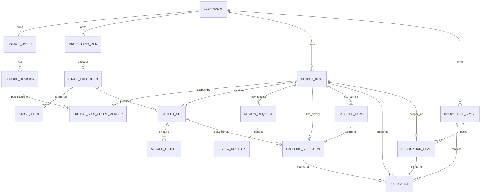

# ReqKB Ingestion Logical Data Model

**Status:** POC architecture baseline  
**Scope:** Logical entity model, relationships, cardinality và invariants cho ReqKB ingestion  
**Depends on:** `00_database_review_methodology.md`, `01_design_methodology.md`, `02_storage_boundary.md`  
**Not in scope:** Physical DDL, PostgreSQL/SQLite-specific types/indexes, Neo4j physical publication strategy

---

## 1. Purpose

Tài liệu này chuyển các architecture invariant đã chốt thành **logical data model**.

Mục tiêu:

- định nghĩa stable identity của từng entity;
- chốt relationship và cardinality;
- phân biệt immutable history/facts với mutable lifecycle pointer/state;
- bảo vệ exact lineage;
- support linear workflow, DAG và fan-in mà không tạo table theo workflow node;
- tạo đầu vào đủ rõ cho physical schema ở tài liệu tiếp theo.

Logical model không được phụ thuộc G0/G1/G2 cụ thể.

---

## 2. Architecture decision rule

Mọi logical-model decision lớn dùng format:

```text
Context
→ Decision
→ Rationale
→ Consequence / Trade-off
```

Nếu decision chọn implementation strategy dài hạn hoặc có nhiều phương án hợp lý với trade-off lớn, tạo ADR theo rule của `02_storage_boundary.md`.

---

## 3. Core logical model

```text
Workspace
 ├── SourceAsset
 │     └── SourceRevision [0..N]
 │
 ├── ProcessingRun
 │     └── StageExecution [0..N]
 │            ├── StageInput [0..N]
 │            └── OutputSet [0..N]
 │                   └── StoredObject [1..N when registered]
 │
 ├── OutputSlot / ArtifactSeries
 │     ├── OutputSlotScopeMember [1..N] → SourceRevision
 │     ├── OutputSet [0..N]
 │     ├── BaselineSelection [0..N]
 │     └── BaselineHead [0..1]
 │
 └── KnowledgeSpace
       ├── Publication [0..N]
       └── PublicationHead [0..1 per OutputSlot]
```

Governance flow:

```text
StageExecution
   ↓ creates
OutputSet
   ↓ candidate revision of
OutputSlot
   ↓ selected by
BaselineSelection
   ↓ published by
Publication
   ↓ visible when active in
KnowledgeSpace
```

---

## 4. Entity definitions

### 4.1 Workspace

Logical isolation root của ingestion data.

Current application có thể map `Workspace` = `Project`.

Responsibilities:

- tenant/project boundary;
- owner scope cho source, run, artifacts, baseline và publication;
- authorization anchor cho application layer.

Logical identity:

```text
workspace_id
```

Invariant:

> Mọi governed entity phải resolve về đúng một Workspace.

---

### 4.2 SourceAsset

Stable business identity của một source/document qua nhiều content revision.

```text
SOURCE-001
Customer Management Requirement Definition
```

Relationship:

```text
Workspace 1 ─── 0..N SourceAsset
SourceAsset 1 ─── 0..N SourceRevision
```

Cho phép SourceAsset tồn tại trước revision đầu tiên để registration/import không cần giả lập revision chưa có bytes.

`SourceAsset` không đại diện cho bytes cụ thể.

---

### 4.3 SourceRevision

Immutable revision của `SourceAsset`.

Identity thay đổi khi source content version thay đổi.

Logical attributes:

```text
source_revision_id
source_asset_id
content_hash
raw_object_ref
revision_reason
created_at
```

Invariant:

- thuộc đúng một SourceAsset;
- identity/content hash/raw reference không mutate sau khi registration hoàn tất;
- raw artifact phải có integrity reference tới Object Store.

---

### 4.4 ProcessingRun

Correlation container cho một workflow/processing invocation.

Logical attributes:

```text
processing_run_id
workspace_id
runtime_ref
status
started_at
completed_at
```

`ProcessingRun` không quyết định baseline, artifact truth hoặc publication.

Relationship:

```text
Workspace 1 ─── 0..N ProcessingRun
ProcessingRun 1 ─── 0..N StageExecution
```

Cho phép run được tạo trước khi stage đầu tiên start.

---

### 4.5 StageExecution

Một execution cụ thể của một processing capability.

Logical attributes:

```text
stage_execution_id
processing_run_id
stage_type
component_ref
configuration_hash
schema_contract_ref
runtime_ref
status
started_at
completed_at
```

Optional AI provenance:

```text
model_ref
prompt_ref
ruleset_ref
trace_ref
```

Relationship:

```text
StageExecution 1 ─── 0..N StageInput
StageExecution 1 ─── 0..N OutputSet
```

Failed execution có thể không tạo OutputSet.

Sau khi execution terminal, input bindings và resolved producer/config facts không được rewrite.

---

### 4.6 StageInput

Immutable binding mô tả exact input mà StageExecution đã consume.

Một StageInput có:

```text
stage_input_id
stage_execution_id
input_role
binding_mode
resolved_hash
ordinal
```

Logical target chỉ được thuộc controlled set:

```text
SourceRevision
OR
OutputSet
```

Nếu input được resolve từ baseline, StageInput còn pin:

```text
source_baseline_selection_id
```

để biết execution đã consume baseline revision nào tại thời điểm chạy.

---

### 4.7 OutputSlot / ArtifactSeries

Stable identity của logical artifact đang được version.

Ví dụ:

```text
SLOT-17 = CHUNK_SET derived for REV-003
```

Logical attributes:

```text
output_slot_id
workspace_id
artifact_role
slot_key / logical_name
created_at
```

Một OutputSlot có nhiều candidate OutputSet revision.

Relationship:

```text
OutputSlot 1 ─── 0..N OutputSet
OutputSlot 1 ─── 0..N BaselineSelection
OutputSlot 1 ─── 0..1 BaselineHead
```

---

### 4.8 OutputSlotScopeMember

Explicit relation xác định source revision nào tạo scope cho OutputSlot.

```text
output_slot_id
source_revision_id
scope_role
ordinal
```

Current single-document flow thường có một member:

```text
SLOT-17 → REV-003
```

Fan-in có thể có nhiều member:

```text
SLOT-90
 ├── REV-A3
 └── REV-B7
```

Relationship:

```text
OutputSlot 1 ─── 1..N OutputSlotScopeMember
SourceRevision 1 ─── 0..N OutputSlotScopeMember
```

---

### 4.9 OutputSet

Coherent logical result do StageExecution tạo ra và là một candidate revision của đúng một OutputSlot.

Logical attributes:

```text
output_set_id
output_slot_id
producer_execution_id
integrity_status
schema_version
created_at
```

Relationships:

```text
StageExecution 1 ─── 0..N OutputSet
OutputSlot 1 ─── 0..N OutputSet
OutputSet 1 ─── 1..N StoredObject khi registration complete
```

Invariant:

- thuộc đúng một StageExecution;
- thuộc đúng một OutputSlot;
- producer/slot identity và registered membership không rewrite sau registration completion;
- integrity lifecycle được phép transition tới terminal state;
- chỉ baseline-eligible khi integrity requirements pass.

---

### 4.10 StoredObject

Registry record cho physical payload trong Object Store.

Logical attributes:

```text
stored_object_id
output_set_id
object_role
object_uri
content_hash
schema_version
media_type
integrity_status
size_bytes
created_at
```

Relationship:

```text
OutputSet 1 ─── 1..N StoredObject khi registration complete
```

Canonical bytes nằm Object Store; Catalog DB giữ registry/integrity facts.

Object URI/hash/role không mutate sau verification; `integrity_status` chỉ transition theo lifecycle đã định nghĩa.

---

### 4.11 ReviewRequest

Optional governance object khi policy yêu cầu review.

Logical attributes:

```text
review_request_id
workspace_id
output_slot_id
status
recommended_output_set_id
recommendation_score
recommendation_evidence_ref
created_at
resolved_at
```

Review không bắt buộc cho AUTO selection.

Invariant:

> `recommended_output_set_id`, nếu có, phải thuộc cùng OutputSlot của ReviewRequest.

---

### 4.12 ReviewDecision

Immutable final decision record của một review request.

Logical attributes:

```text
review_decision_id
review_request_id
decision
selected_output_set_id
decided_by
decision_reason
decided_at
```

Relationship:

```text
ReviewRequest 1 ─── 0..1 ReviewDecision
```

Invariant:

> `selected_output_set_id`, nếu decision chọn candidate, phải thuộc cùng OutputSlot của ReviewRequest.

Một resolved request chỉ có một final decision record; re-open/re-review tạo request/decision mới thay vì mutate audit history.

---

### 4.13 BaselineSelection

Append-only governance record chọn một exact OutputSet làm baseline cho một OutputSlot.

Logical attributes:

```text
baseline_selection_id
output_slot_id
output_set_id
previous_baseline_selection_id
selection_mode
review_decision_id
selection_reason
selected_by
selected_at
```

Relationship:

```text
OutputSlot 1 ─── 0..N BaselineSelection
OutputSet 1 ─── 0..N BaselineSelection
```

Invariant quan trọng:

> OutputSet được chọn phải thuộc chính OutputSlot của BaselineSelection và phải baseline-eligible.

Nếu có ReviewDecision, decision đó phải resolve cùng OutputSlot/output selection.

---

### 4.14 BaselineHead

Mutable control pointer cho current baseline của một OutputSlot.

Logical attributes:

```text
output_slot_id
current_baseline_selection_id
lock_version
updated_at
```

`BaselineSelection` là immutable history; `BaselineHead` chỉ là current pointer/compare-and-swap control state.

Relationship:

```text
OutputSlot 1 ─── 0..1 BaselineHead
BaselineHead ─── 1 BaselineSelection
```

---

### 4.15 KnowledgeSpace

Logical ReqKB publication target trong một Workspace.

Ví dụ:

```text
KNOWLEDGE-SPACE-01 = ReqKB của Project A
```

Logical attributes:

```text
knowledge_space_id
workspace_id
name
status
```

Relationship:

```text
Workspace 1 ─── 0..N KnowledgeSpace
KnowledgeSpace 1 ─── 0..N Publication
```

Whole-KB `KnowledgeRelease` chưa được materialize trong POC.

---

### 4.16 Publication

Publication attempt/history record cho một exact baseline/output set vào một KnowledgeSpace.

Logical attributes:

```text
publication_id
knowledge_space_id
output_slot_id
baseline_selection_id
output_set_id
previous_publication_id
status
manifest_object_ref
created_at
activated_at
```

Relationship:

```text
KnowledgeSpace 1 ─── 0..N Publication
OutputSlot 1 ─── 0..N Publication
BaselineSelection 1 ─── 0..N Publication
```

Publication status có thể gồm:

```text
PENDING
MATERIALIZING
VERIFIED
ACTIVE
FAILED
SUPERSEDED
```

Pinned references (`knowledge_space_id`, `output_slot_id`, `baseline_selection_id`, `output_set_id`) không được rewrite sau materialization start; lifecycle `status` được phép transition.

Only `ACTIVE` publication được downstream coi là visible semantic state.

---

### 4.17 PublicationHead

Mutable pointer xác định publication đang active cho một `(KnowledgeSpace, OutputSlot)`.

Logical attributes:

```text
knowledge_space_id
output_slot_id
current_publication_id
lock_version
updated_at
```

Publication history/facts được giữ; head chỉ biểu diễn active pointer.

Whole-KB active state không được đồng nhất với một PublicationHead đơn lẻ.

---

## 5. Logical ERD



`StageInput` target polymorphism không thể hiện trong Mermaid ERD trên; section 7 chốt controlled-reference semantics.

---

## 6. Cardinality summary

| Parent | Child | Cardinality | Rule |
|---|---|---:|---|
| Workspace | SourceAsset | 1:0..N | source luôn thuộc một workspace |
| SourceAsset | SourceRevision | 1:0..N | asset có thể tồn tại trước revision đầu tiên |
| ProcessingRun | StageExecution | 1:0..N | run có thể tồn tại trước stage đầu tiên |
| StageExecution | StageInput | 1:0..N | support fan-in |
| StageExecution | OutputSet | 1:0..N | failed stage có thể không có output |
| OutputSlot | ScopeMember | 1:1..N | Stage 1 slot phải có source scope |
| OutputSlot | OutputSet | 1:0..N | nhiều candidate revision |
| OutputSet | StoredObject | 1:1..N once registered | coherent result có ít nhất một payload |
| OutputSlot | BaselineSelection | 1:0..N | append-only history |
| OutputSlot | BaselineHead | 1:0..1 | chưa chọn baseline thì chưa có head |
| ReviewRequest | ReviewDecision | 1:0..1 | một request có tối đa một final decision |
| Workspace | KnowledgeSpace | 1:0..N | publication target |
| KnowledgeSpace + OutputSlot | PublicationHead | 1:0..1 | tối đa một active pointer mỗi scope |

---

## 7. Decision LM-01 — controlled StageInput reference

**Context:** `02` yêu cầu StageExecution support nhiều input nhưng không chấp nhận free-form `ref_type + string id` làm mất referential integrity.

**Decision:** POC chỉ cho phép StageInput target hai loại immutable/version-pinned input:

```text
SourceRevision
OutputSet
```

Configuration/model/prompt/schema identity nằm trong StageExecution metadata. Nếu một schema/terminology package cần được xử lý như data input có lifecycle riêng, nó phải được materialize thành SourceRevision hoặc OutputSet thay vì dùng arbitrary string reference.

**Rationale:** giữ multi-input/DAG flexibility nhưng vẫn có controlled identity và FK-able target set.

**Trade-off:** thêm loại input mới cần explicit model change/ADR thay vì chỉ thêm string type.

**ADR trigger:** nếu sau pilot cần generic resource registry với nhiều target type, phải có ADR vì ảnh hưởng referential integrity và extensibility model.

---

## 8. Decision LM-02 — OutputSlot scope dùng explicit source membership

**Context:** OutputSlot cần stable identity của artifact series. Hard-code một `source_revision_id` sẽ không support fan-in; free-form scope key lại yếu về integrity.

**Decision:** OutputSlot thuộc Workspace và có `OutputSlotScopeMember` 1..N tới SourceRevision.

**Rationale:** support cả single-source và multi-source artifact series bằng explicit relational membership.

**Trade-off:** thêm association entity và cần rule canonical ordering/role nếu cùng set source nhưng semantic scope khác nhau.

POC `slot_key/logical_name + artifact_role + ordered scope members` phải đủ để application tránh tạo duplicate logical slot.

---

## 9. Decision LM-03 — một StageExecution có thể tạo nhiều OutputSet

**Context:** một processing capability có thể tạo nhiều logical artifact series độc lập; ép 1 execution = 1 OutputSet sẽ khiến OutputSet phải gom các artifact có lifecycle/baseline khác nhau.

**Decision:** `StageExecution 1 → 0..N OutputSet`; mỗi OutputSet vẫn thuộc đúng một OutputSlot.

**Rationale:** baseline/version governance được giữ theo logical artifact series thay vì theo execution container.

**Trade-off:** producer phải register rõ output nào thuộc slot nào; failure semantics có thể có partial output registration và cần integrity state per OutputSet.

---

## 10. Decision LM-04 — BaselineSelection history + BaselineHead pointer

**Context:** baseline history phải append-only nhưng concurrent approval cần atomic compare-and-swap current state.

**Decision:** tách:

```text
BaselineSelection = immutable history
BaselineHead      = mutable current pointer + lock_version
```

**Rationale:** history không bị overwrite, trong khi current baseline có một concurrency anchor rõ ràng.

**Trade-off:** thêm một mutable control projection phải luôn nhất quán với BaselineSelection history.

Logical transaction:

```text
1. verify candidate eligibility
2. verify expected BaselineHead.lock_version
3. append BaselineSelection
4. move BaselineHead pointer
5. increment lock_version
```

Steps 2-5 phải atomic trong Catalog DB transaction ở physical design.

---

## 11. Decision LM-05 — staleness derive từ baseline lineage

**Context:** OutputSet cũ vẫn là historical evidence hợp lệ khi upstream baseline đổi; mutate provenance để phản ánh current relevance sẽ làm lẫn execution fact và governance state.

**Decision:** StageInput luôn pin exact target. Nếu input được lấy từ baseline, nó còn pin `source_baseline_selection_id`. Fresh/stale được derive bằng cách so với current BaselineHead của upstream OutputSlot.

```text
StageInput.source_baseline_selection_id == current upstream BaselineHead
→ CURRENT

khác
→ STALE relative to current baseline
```

**Rationale:** giữ immutable provenance, đồng thời phát hiện downstream derivation không còn theo current baseline.

**Trade-off:** lineage query có cost; production có thể materialize freshness projection sau.

`STALE` không đồng nghĩa tự động rerun; runtime policy quyết định rerun.

---

## 12. Decision LM-06 — OutputSet eligibility là derived integrity invariant

**Context:** baseline không được chọn artifact incomplete/corrupt.

**Decision:** OutputSet chỉ baseline-eligible khi:

```text
all required StoredObjects exist
AND hashes verify
AND required schema/contract validation passes
AND OutputSet registration complete
```

`integrity_status` biểu diễn verified lifecycle fact; `baseline_eligible` ưu tiên derive thay vì trở thành mutable duplicate truth.

**Rationale:** tránh race giữa object write, registration và review/selection.

**Trade-off:** cần biết object role nào `required` cho từng OutputSet contract.

Physical design phải chọn cách encode required-role contract mà không hard-code workflow node.

---

## 13. Decision LM-07 — Publication history + PublicationHead pointer

**Context:** Publication phải auditable nhưng downstream cần biết publication nào active cho từng artifact scope trong KnowledgeSpace.

**Decision:** tách:

```text
Publication     = publication attempt/history + lifecycle
PublicationHead = active pointer cho (KnowledgeSpace, OutputSlot)
```

Pinned publication references không rewrite; lifecycle status được phép transition tới terminal state.

**Rationale:** cùng pattern history-vs-current như baseline; partial publication mới không thay active state trước activation.

**Trade-off:** activation cần protocol giữa Catalog DB và Neo4j; physical strategy vẫn cần ADR theo `SB-07`.

Whole-KB `KnowledgeRelease` vẫn là concept riêng, chưa materialize ở POC.

---

## 14. Decision LM-08 — Workspace là mandatory isolation root

**Context:** retrofit tenant/project isolation sau khi schema đã có data dễ tạo leak risk và migration lớn.

**Decision:** SourceAsset, ProcessingRun, OutputSlot và KnowledgeSpace trực tiếp thuộc Workspace; các entity con phải resolve cùng workspace qua parent relationships.

**Rationale:** data model có security anchor từ đầu mà không cần nhét `workspace_id` tùy tiện vào mọi child entity ở logical level.

**Trade-off:** physical schema phải quyết định nơi denormalize `workspace_id` cho RLS/query performance mà không tạo inconsistent ownership.

Tenant/RLS implementation cần ADR khi chốt PostgreSQL/Neo4j security strategy.

---

## 15. State and transition invariants

### StageExecution

```text
PENDING → RUNNING → SUCCEEDED
                  ↘ FAILED
                  ↘ CANCELLED
```

Sau terminal state, execution inputs và producer/config facts không mutate.

### StoredObject integrity

```text
WRITING → WRITTEN → VERIFIED → AVAILABLE
                    ↘ INVALID
```

Object identity/hash/URI trở thành immutable sau verification.

### OutputSet integrity

OutputSet membership/producer/slot được freeze khi registration complete; integrity state có thể transition cho tới terminal verification result.

### Baseline

Không có `FINAL` state trên OutputSet.

Baseline truth = BaselineHead trỏ tới exact BaselineSelection.

### Publication

```text
PENDING
  ↓
MATERIALIZING
  ↓
VERIFIED
  ↓
ACTIVE
  ↓
SUPERSEDED

failure anywhere before ACTIVE
→ FAILED / previous PublicationHead unchanged
```

Pinned source references không mutate trong lifecycle.

---

## 16. Cross-entity invariants

Các invariant phải được enforce bằng DB constraint/transaction nếu physical engine cho phép; nếu không, phải có application invariant + verification rõ ràng.

```text
INV-L01
Mọi entity cùng lineage phải cùng Workspace.

INV-L02
SourceRevision thuộc đúng một SourceAsset và content identity immutable sau registration.

INV-L03
StageExecution input target phải tồn tại và version-pinned.

INV-L04
OutputSet thuộc đúng một StageExecution và một OutputSlot.

INV-L05
StoredObject thuộc đúng một OutputSet.

INV-L06
ReviewRequest recommendation/ReviewDecision selection chỉ được tham chiếu OutputSet thuộc cùng OutputSlot.

INV-L07
BaselineSelection chỉ được chọn OutputSet thuộc cùng OutputSlot.

INV-L08
BaselineHead chỉ được trỏ BaselineSelection thuộc cùng OutputSlot.

INV-L09
Một OutputSlot có tối đa một BaselineHead/current baseline.

INV-L10
Baseline candidate phải pass integrity eligibility.

INV-L11
Nếu StageInput binding_mode=BASELINE thì source_baseline_selection_id bắt buộc và phải resolve đúng target OutputSet.

INV-L12
Publication phải pin exact BaselineSelection và exact OutputSet được baseline đó chọn.

INV-L13
Publication, OutputSlot và KnowledgeSpace phải resolve cùng Workspace.

INV-L14
PublicationHead chỉ trỏ ACTIVE Publication trong cùng KnowledgeSpace + OutputSlot.

INV-L15
Publication chưa ACTIVE không visible cho downstream knowledge query.

INV-L16
Historical StageInput/BaselineSelection/ReviewDecision không rewrite để phản ánh current state; lifecycle entities chỉ transition theo state machine hợp lệ.
```

---

## 17. Delete and retention semantics

Không hard-delete entity đang tham gia provenance chain.

### Immutable governance/history

Ưu tiên retain:

```text
SourceRevision identity
terminal StageExecution facts
StageInput
OutputSet registry
BaselineSelection
ReviewDecision
Publication history
```

### Object payload retention

StoredObject bytes có thể áp dụng retention/GC chỉ khi policy cho phép và không phá replay/audit requirement.

Nếu bytes bị archive/delete theo policy, registry phải giữ tombstone/retention fact thay vì giả định object vẫn available.

### Projection

Queryable projection có thể rebuild/drop/recreate vì không canonical.

---

## 18. Query paths logical model phải support

Trước physical schema, model phải trả lời được các query sau mà không dựa vào folder naming hoặc runtime checkpoint:

```text
Q1. Current baseline của OutputSlot X là gì?
Q2. Baseline hiện tại do ai/policy nào chọn và vì sao?
Q3. OutputSet X được tạo bởi execution nào, component/config nào?
Q4. Execution X đã consume exact inputs nào?
Q5. OutputSet nào stale so với current upstream baselines?
Q6. Từ Publication X trace ngược tới SourceRevision nào?
Q7. Publication nào active cho OutputSlot X trong KnowledgeSpace Y?
Q8. StoredObject nào thiếu/corrupt làm OutputSet chưa eligible?
Q9. Candidate history của một OutputSlot gồm những revision nào?
Q10. Tất cả data thuộc Workspace nào?
```

Physical indexes chỉ được thiết kế sau khi xác nhận representative query volume/concurrency.

---

## 19. Open ADR triggers trước physical implementation

Không chốt trong tài liệu này:

| Topic | Trigger |
|---|---|
| StageInput physical subtype/FK strategy | Chọn table-per-target, supertype registry hay alternative |
| Neo4j publication visibility | Chọn publication tagging, shadow graph hay versioned semantic records |
| KnowledgeRelease | Khi downstream cần reproducible whole-KB snapshot |
| Workspace isolation | Khi chốt PostgreSQL RLS / Neo4j tenant strategy |
| Required StoredObject contract | Khi chốt cách version contract/required roles cho OutputSet |

Mỗi ADR phải ghi Context, Options, Decision, Rationale, rejected alternatives, consequences và migration implication.

---

## 20. Gate A-C review checklist

### Gate A — Domain & identity

- [ ] Workspace là isolation root rõ ràng.
- [ ] SourceAsset và SourceRevision tách identity.
- [ ] ProcessingRun/StageExecution không bị dùng làm artifact identity.
- [ ] OutputSlot là stable identity của artifact series.
- [ ] OutputSet là candidate revision với identity/membership ổn định sau registration.
- [ ] Publication không bị coi là whole-KB release.

### Gate B — Ownership / version governance

- [ ] Canonical owner tuân theo `02_storage_boundary.md`.
- [ ] Exact StageInput pinning reconstruct được lineage.
- [ ] Baseline history append-only + current head rõ ràng.
- [ ] Concurrent baseline update có lock_version semantics.
- [ ] Stale state derive được từ baseline lineage.
- [ ] Publication history/lifecycle tách active pointer.
- [ ] Failed publication không đổi active knowledge.

### Gate C — Logical relational model

- [ ] Cardinality không ép child record tồn tại trước lifecycle thực tế.
- [ ] StageInput target type controlled, không arbitrary string ref.
- [ ] OutputSet → StageExecution và OutputSlot đều mandatory.
- [ ] StoredObject → OutputSet mandatory sau registration.
- [ ] Review/Baseline selection không thể chọn candidate khác OutputSlot.
- [ ] Publication pin exact baseline/output set.
- [ ] Workspace cross-boundary reference bị cấm.
- [ ] Delete/retention không phá provenance.

---

## 21. Handoff sang physical schema

Sau khi Gate A-C pass, tài liệu tiếp theo:

```text
04_physical_schema.md
```

phải chốt:

1. SQLite POC schema;
2. PK/FK/UNIQUE/CHECK constraints;
3. cách implement controlled StageInput reference;
4. BaselineHead optimistic concurrency;
5. OutputSet/StoredObject integrity state;
6. workspace scoping;
7. representative indexes/query paths;
8. transaction boundaries;
9. portability notes SQLite → PostgreSQL;
10. migration/schema-as-code strategy.

Physical design không được làm yếu các invariant trong tài liệu này chỉ để schema đơn giản hơn.
