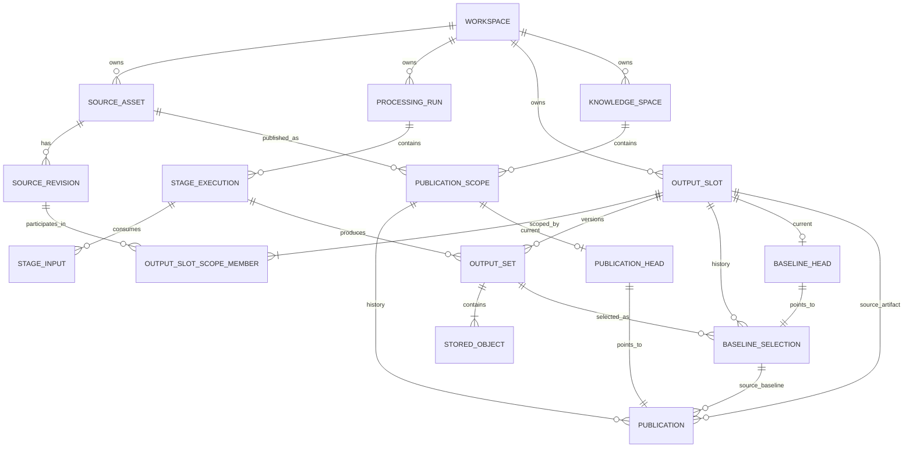

# ReqKB Ingestion Logical Data Model

**Status:** POC architecture baseline  
**Scope:** Logical entity model, relationships, cardinality và invariants cho ReqKB ingestion  
**Depends on:** `00_database_review_methodology.md`, `01_design_methodology.md`, `02_storage_boundary.md`  
**Related ADR:** `adrs/ADR-001-publication-scope.md`  
**Not in scope:** Physical DDL, PostgreSQL/SQLite-specific types/indexes, Neo4j physical publication strategy

---

## 1. Purpose

Tài liệu này chuyển architecture invariant đã chốt thành **logical data model** đủ ổn định cho main nhưng vẫn có thể implement nhanh trong POC.

Mục tiêu:

- định nghĩa stable identity của từng entity;
- chốt relationship và cardinality;
- phân biệt immutable history/facts với mutable current pointer/state;
- bảo vệ exact lineage;
- support linear workflow, DAG và fan-in mà không tạo table theo workflow node;
- tránh logical abstraction buộc POC phải implement mọi capability enterprise ngay lập tức;
- tạo đầu vào rõ cho `04_physical_schema.md`.

Logical model không phụ thuộc G0/G1/G2 cụ thể.

---

## 2. Architecture decision rule

Mọi logical-model decision lớn phải ghi:

```text
Context
→ Decision
→ Rationale
→ Consequence / Trade-off
```

Tạo ADR riêng khi decision thay đổi version/publication semantics, System of Record, security isolation hoặc chọn implementation dài hạn có nhiều phương án hợp lý.

---

## 3. Core logical model

```text
Workspace
 ├── SourceAsset
 │     └── SourceRevision [0..N]
 │
 ├── ProcessingRun
 │     └── StageExecution [0..N]
 │            ├── StageInput [0..N]
 │            └── OutputSet [0..N]
 │                   └── StoredObject [1..N when registered]
 │
 ├── OutputSlot / ArtifactSeries
 │     ├── OutputSlotScopeMember [1..N] → SourceRevision
 │     ├── OutputSet [0..N]
 │     ├── BaselineSelection [0..N]
 │     └── BaselineHead [0..1]
 │
 └── KnowledgeSpace
       └── PublicationScope [0..N]
              ├── Publication [0..N]
              └── PublicationHead [0..1]
```

Hai lifecycle cần phân biệt:

```text
Intermediate artifact governance
SourceRevision
   ↓
OutputSlot
   ↓
OutputSet candidates
   ↓
BaselineSelection
   ↓
BaselineHead

Publication governance
SourceAsset
   ↓
PublicationScope
   ↓
Publication history
   ↓
PublicationHead
   ↓
visible semantic state in KnowledgeSpace
```

Baseline trả lời **candidate nào của một artifact revision được dùng**. Publication trả lời **revision nào của stable business source đang active trong ReqKB**.

---

## 4. Entity definitions

### 4.1 Workspace

Logical isolation root của ingestion data. Current application có thể map `Workspace = Project`.

```text
workspace_id
```

Invariant:

> Mọi governed entity phải resolve về đúng một Workspace.

POC single-project vẫn tạo một Workspace record để không retrofit ownership khi lên main.

---

### 4.2 SourceAsset

Stable business identity của một source/document qua nhiều content revision.

```text
SOURCE-001
Customer Management Requirement Definition
```

```text
Workspace 1 ─── 0..N SourceAsset
SourceAsset 1 ─── 0..N SourceRevision
```

`SourceAsset` không đại diện cho bytes cụ thể.

---

### 4.3 SourceRevision

Immutable content revision của `SourceAsset`.

```text
source_revision_id
source_asset_id
content_hash
raw_object_ref
revision_reason
created_at
```

Invariant:

- thuộc đúng một SourceAsset;
- content identity/raw reference không mutate sau registration;
- raw artifact có integrity reference tới Object Store.

---

### 4.4 ProcessingRun

Correlation container cho một workflow/processing invocation.

```text
processing_run_id
workspace_id
runtime_ref
status
started_at
completed_at
```

```text
Workspace 1 ─── 0..N ProcessingRun
ProcessingRun 1 ─── 0..N StageExecution
```

`ProcessingRun` không quyết định baseline hoặc publication truth.

---

### 4.5 StageExecution

Một execution cụ thể của một processing capability.

```text
stage_execution_id
processing_run_id
stage_type
component_ref
configuration_hash
schema_contract_ref
runtime_ref
status
started_at
completed_at
```

Optional AI provenance:

```text
model_ref
prompt_ref
ruleset_ref
trace_ref
```

```text
StageExecution 1 ─── 0..N StageInput
StageExecution 1 ─── 0..N OutputSet
```

Sau terminal state, exact input bindings và producer/config facts không rewrite.

---

### 4.6 StageInput

Immutable binding của exact input mà StageExecution đã consume.

```text
stage_input_id
stage_execution_id
input_role
binding_mode
resolved_hash
ordinal
```

POC controlled target set:

```text
SourceRevision
OR
OutputSet
```

Nếu resolve từ baseline, pin thêm:

```text
source_baseline_selection_id
```

để biết execution đã consume baseline revision nào tại thời điểm chạy.

---

### 4.7 OutputSlot / ArtifactSeries

Stable identity của logical artifact đang được version.

Ví dụ:

```text
CHUNK_SET for REV-003
```

```text
output_slot_id
workspace_id
artifact_role
scope_fingerprint
logical_name
created_at
```

`logical_name` là display metadata; **không dùng làm identity**.

Một OutputSlot có nhiều candidate OutputSet:

```text
SLOT-17
 ├── OUTSET-187
 ├── OUTSET-221 ← current baseline
 └── OUTSET-240
```

---

### 4.8 OutputSlotScopeMember

Explicit source-revision membership tạo scope cho OutputSlot.

```text
output_slot_id
source_revision_id
scope_role
ordinal
```

Single-source POC:

```text
SLOT-17 → REV-003
```

Main/fan-in:

```text
SLOT-90
 ├── REV-A3
 └── REV-B7
```

```text
OutputSlot 1 ─── 1..N OutputSlotScopeMember
SourceRevision 1 ─── 0..N OutputSlotScopeMember
```

---

### 4.9 OutputSet

Coherent logical result do StageExecution tạo ra và là candidate revision của đúng một OutputSlot.

```text
output_set_id
output_slot_id
producer_execution_id
integrity_status
schema_version
registration_completed_at
created_at
```

```text
StageExecution 1 ─── 0..N OutputSet
OutputSlot 1 ─── 0..N OutputSet
OutputSet 1 ─── 1..N StoredObject when registration complete
```

Invariant:

- thuộc đúng một StageExecution;
- thuộc đúng một OutputSlot;
- producer/slot/membership freeze khi registration complete;
- chỉ baseline-eligible khi integrity requirements pass.

---

### 4.10 StoredObject

Registry record cho immutable payload trong Object Store.

```text
stored_object_id
output_set_id
object_role
object_uri
content_hash
schema_version
media_type
is_required
integrity_status
size_bytes
created_at
```

Canonical bytes nằm Object Store; Catalog DB giữ registry/integrity facts.

POC không cần OutputContract registry riêng. `is_required` có thể được resolve từ application contract/config và register thành fact trên StoredObject.

---

### 4.11 ReviewRequest / ReviewDecision

Optional governance capability khi policy/UI yêu cầu review inbox hoặc human approval workflow.

```text
ReviewRequest 1 ─── 0..1 ReviewDecision
```

Không bắt buộc implement trong POC đầu tiên nếu selection command có thể ghi trực tiếp:

```text
selection_mode
selected_by
selection_reason
```

trên `BaselineSelection`.

Khi Review Inbox được bật, recommendation/decision chỉ được tham chiếu candidate cùng OutputSlot.

---

### 4.12 BaselineSelection

Append-only governance record chọn exact OutputSet làm baseline cho OutputSlot.

```text
baseline_selection_id
output_slot_id
output_set_id
previous_baseline_selection_id
selection_mode
review_decision_id
selection_reason
selected_by
selected_at
```

Invariant:

> OutputSet được chọn phải thuộc cùng OutputSlot và baseline-eligible.

---

### 4.13 BaselineHead

Mutable current pointer + optimistic concurrency anchor.

```text
output_slot_id
current_baseline_selection_id
lock_version
updated_at
```

```text
OutputSlot 1 ─── 0..1 BaselineHead
BaselineHead ─── 1 BaselineSelection
```

History nằm ở `BaselineSelection`; head không thay thế history.

---

### 4.14 KnowledgeSpace

Logical ReqKB publication target trong Workspace.

```text
knowledge_space_id
workspace_id
name
status
```

POC thường seed một KnowledgeSpace cho một Workspace.

Whole-KB `KnowledgeRelease` chưa materialize trong POC.

---

### 4.15 PublicationScope

Stable identity của **knowledge publication stream** qua nhiều SourceRevision.

Ví dụ:

```text
KNOWLEDGE_SPACE = KB-01
SOURCE_ASSET    = SOURCE-001
publication_role = REQUIREMENT_KNOWLEDGE
```

```text
publication_scope_id
knowledge_space_id
source_asset_id
publication_role
scope_key
created_at
```

Relationship:

```text
KnowledgeSpace 1 ─── 0..N PublicationScope
SourceAsset    1 ─── 0..N PublicationScope
PublicationScope 1 ─── 0..N Publication
PublicationScope 1 ─── 0..1 PublicationHead
```

`PublicationScope` không phụ thuộc SourceRevision. Vì vậy khi REV-003 được thay bằng REV-004, cả hai publication nằm cùng một stable publication stream.

Decision này được ghi tại `adrs/ADR-001-publication-scope.md`.

---

### 4.16 Publication

Publication attempt/history record cho exact accepted OutputSet vào một PublicationScope.

```text
publication_id
publication_scope_id
output_slot_id
baseline_selection_id
output_set_id
previous_publication_id
status
manifest_object_ref
created_at
activated_at
```

Pinned references không rewrite sau materialization start.

Lifecycle:

```text
PENDING
→ MATERIALIZING
→ VERIFIED
→ ACTIVE
→ SUPERSEDED

failure before ACTIVE
→ FAILED
```

Only `ACTIVE` publication được visible cho downstream semantic query.

---

### 4.17 PublicationHead

Mutable pointer cho current active publication của một PublicationScope.

```text
publication_scope_id
current_publication_id
lock_version
updated_at
```

```text
PublicationScope 1 ─── 0..1 PublicationHead
PublicationHead ─── 1 Publication
```

Whole-KB active state không đồng nhất với một PublicationHead đơn lẻ.

---

## 5. Logical ERD



`StageInput` controlled target polymorphism không thể hiện trong Mermaid; physical strategy chốt ở `04`/ADR nếu cần.

---

## 6. Cardinality summary

| Parent | Child | Cardinality | Rule |
|---|---|---:|---|
| Workspace | SourceAsset | 1:0..N | source thuộc một workspace |
| SourceAsset | SourceRevision | 1:0..N | asset có thể tồn tại trước revision đầu tiên |
| ProcessingRun | StageExecution | 1:0..N | run có thể tồn tại trước stage đầu tiên |
| StageExecution | StageInput | 1:0..N | support fan-in |
| StageExecution | OutputSet | 1:0..N | failed stage có thể không có output |
| OutputSlot | ScopeMember | 1:1..N | artifact series có explicit source scope |
| OutputSlot | OutputSet | 1:0..N | candidate history |
| OutputSet | StoredObject | 1:1..N once registered | coherent result có payload |
| OutputSlot | BaselineSelection | 1:0..N | append-only history |
| OutputSlot | BaselineHead | 1:0..1 | current baseline optional |
| KnowledgeSpace | PublicationScope | 1:0..N | stable publication streams |
| SourceAsset | PublicationScope | 1:0..N | source có thể publish vào nhiều knowledge space/role |
| PublicationScope | Publication | 1:0..N | publication history across revisions |
| PublicationScope | PublicationHead | 1:0..1 | tối đa một active publication |

---

## 7. Decision LM-01 — controlled StageInput reference

**Context:** cần multi-input/DAG nhưng free-form `ref_type + string id` làm mất referential integrity.

**Decision:** POC chỉ cho StageInput target `SourceRevision` hoặc `OutputSet`.

**Rationale:** đủ cho raw-source và derived-artifact lineage hiện tại, vẫn FK-able.

**Trade-off:** input type mới cần explicit model extension thay vì arbitrary string.

**ADR trigger:** khi main thực sự cần generic resource registry với nhiều resource type.

---

## 8. Decision LM-02 — deterministic OutputSlot identity

**Context:** nếu mỗi run tự tạo OutputSlot cho cùng logical artifact, candidate history/baseline bị split thành nhiều slot.

**Decision:** OutputSlot identity phải deterministic theo:

```text
workspace_id
+ artifact_role
+ canonical source scope
```

Canonical source scope được normalize từ `OutputSlotScopeMember`, sau đó tạo:

```text
scope_fingerprint = HASH(canonical_scope_members)
```

Logical uniqueness:

```text
UNIQUE(workspace_id, artifact_role, scope_fingerprint)
```

POC single-source có thể tính fingerprint trực tiếp từ `(scope_role, source_revision_id)`; không cần generic identity service.

**Rationale:** mọi rerun của cùng logical artifact đổ candidate vào cùng ArtifactSeries.

**Trade-off:** phải định nghĩa canonical ordering/normalization cho fan-in scope trước khi hash.

---

## 9. Decision LM-03 — OutputSlot scope dùng explicit source membership

**Context:** hard-code một `source_revision_id` không support fan-in; free-form scope key yếu về integrity.

**Decision:** OutputSlot có `OutputSlotScopeMember` 1..N tới SourceRevision.

**Rationale:** support single-source POC và multi-source main bằng cùng model.

**Trade-off:** thêm association entity, nhưng tránh migration structural khi fan-in xuất hiện.

---

## 10. Decision LM-04 — StageExecution có thể tạo nhiều OutputSet

**Context:** một capability có thể tạo nhiều artifact series có baseline lifecycle độc lập.

**Decision:** `StageExecution 1 → 0..N OutputSet`; mỗi OutputSet thuộc đúng một OutputSlot.

**Rationale:** governance theo artifact identity, không theo execution container.

**Trade-off:** producer phải register rõ slot của mỗi output.

---

## 11. Decision LM-05 — BaselineSelection history + BaselineHead pointer

**Context:** cần append-only audit đồng thời cần atomic current baseline/concurrency control.

**Decision:** tách immutable `BaselineSelection` và mutable `BaselineHead(lock_version)`.

**Rationale:** giữ history trong khi current pointer có compare-and-swap anchor.

**Trade-off:** head/history phải update cùng Catalog DB transaction.

Logical transaction:

```text
1. verify candidate eligibility
2. verify expected lock_version
3. append BaselineSelection
4. move BaselineHead
5. increment lock_version
```

Steps 2-5 phải atomic.

---

## 12. Decision LM-06 — staleness derive từ exact baseline lineage

**Context:** artifact cũ vẫn là valid historical fact khi upstream baseline đổi.

**Decision:** không mutate provenance hoặc lưu `is_stale` như canonical truth. Nếu StageInput resolve từ baseline, compare pinned `source_baseline_selection_id` với current upstream BaselineHead.

```text
same baseline selection → CURRENT
different selection     → STALE relative to current baseline
```

**Rationale:** lịch sử immutable và stale semantics vẫn xác định được.

**Trade-off:** query lineage có cost; main có thể thêm rebuildable freshness projection.

---

## 13. Decision LM-07 — OutputSet eligibility tối giản cho POC

**Context:** baseline không được chọn incomplete/corrupt output, nhưng POC không cần build Output Contract Management System.

**Decision:** POC baseline eligibility derive từ:

```text
registration completed
AND all required StoredObjects exist
AND required objects VERIFIED/AVAILABLE
AND required schema validation passes
```

Required role có thể đến từ application config và được persist thành `is_required` fact trên StoredObject.

**Rationale:** loại race condition nhưng giữ implementation nhỏ.

**Trade-off:** contract registry/version governance cho required roles được defer; khi main cần contract reuse/change audit thì model riêng.

---

## 14. Decision LM-08 — PublicationScope tách revision-level artifact khỏi stable publication stream

**Context:** OutputSlot scope theo SourceRevision. Nếu PublicationHead cũng scope theo OutputSlot, REV-003 và REV-004 của cùng SourceAsset có thể đồng thời có active head ở hai slot khác nhau.

**Decision:** active publication được quản lý theo stable `PublicationScope = KnowledgeSpace + SourceAsset + publication_role`, không theo OutputSlot.

**Rationale:** khi source revision mới được publish, nó thay publication trước trong cùng business source stream.

**Trade-off:** thêm PublicationScope entity và cần định nghĩa publication role/scope key.

**ADR:** `adrs/ADR-001-publication-scope.md`.

---

## 15. Decision LM-09 — Workspace là mandatory isolation root

**Context:** retrofit project/tenant ownership sau khi có data gây migration và leak risk.

**Decision:** SourceAsset, ProcessingRun, OutputSlot và KnowledgeSpace trực tiếp thuộc Workspace; child resolve cùng workspace qua parent.

**Rationale:** có authorization anchor từ đầu.

**Trade-off:** physical schema phải quyết định chỗ denormalize `workspace_id` cho performance/RLS.

---

## 16. State and transition invariants

### StageExecution

```text
PENDING → RUNNING → SUCCEEDED
                  ↘ FAILED
                  ↘ CANCELLED
```

### StoredObject integrity

```text
WRITING → WRITTEN → VERIFIED → AVAILABLE
                    ↘ INVALID
```

### OutputSet

Producer/slot/membership freeze khi registration complete. Không có `FINAL` state; baseline là governance decision riêng.

### Publication

```text
PENDING → MATERIALIZING → VERIFIED → ACTIVE → SUPERSEDED
                     failure → FAILED
```

Publication mới chưa ACTIVE không được visible; previous PublicationHead giữ nguyên nếu publish fail.

---

## 17. Cross-entity invariants

```text
INV-L01  Mọi entity cùng lineage phải resolve cùng Workspace.
INV-L02  SourceRevision thuộc đúng một SourceAsset và immutable sau registration.
INV-L03  StageInput target phải tồn tại và version-pinned.
INV-L04  OutputSlot identity deterministic theo workspace + artifact_role + scope_fingerprint.
INV-L05  OutputSet thuộc đúng một StageExecution và một OutputSlot.
INV-L06  StoredObject thuộc đúng một OutputSet.
INV-L07  BaselineSelection chỉ chọn OutputSet thuộc cùng OutputSlot.
INV-L08  BaselineHead chỉ trỏ BaselineSelection thuộc cùng OutputSlot.
INV-L09  Một OutputSlot có tối đa một BaselineHead/current baseline.
INV-L10  Baseline candidate phải pass integrity eligibility.
INV-L11  binding_mode=BASELINE bắt buộc pin source_baseline_selection_id đúng target.
INV-L12  Publication pin exact BaselineSelection và exact OutputSet được baseline đó chọn.
INV-L13  PublicationScope, Publication, SourceAsset và KnowledgeSpace phải resolve cùng Workspace.
INV-L14  PublicationHead chỉ trỏ ACTIVE Publication thuộc cùng PublicationScope.
INV-L15  Một PublicationScope có tối đa một active PublicationHead.
INV-L16  Publication chưa ACTIVE không visible cho downstream semantic query.
INV-L17  Historical StageInput/BaselineSelection/Publication source refs không rewrite để phản ánh current state.
```

---

## 18. POC Implementation Profile

`03` là **target logical model**. POC không cần implement mọi optional capability ngay.

### Implement NOW — durable core

```text
Workspace
SourceAsset
SourceRevision
ProcessingRun
StageExecution
StageInput
OutputSlot
OutputSlotScopeMember
OutputSet
StoredObject
BaselineSelection
BaselineHead
KnowledgeSpace
PublicationScope
Publication
PublicationHead
```

Lý do giữ các entity này ngay:

- chúng định nghĩa identity, lineage, baseline và publication semantics;
- bỏ chúng sẽ tạo migration structural khi lên main;
- số table không đồng nghĩa nhiều business logic: nhiều table chỉ là registry/history nhỏ.

### Conditional in POC

```text
ReviewRequest
ReviewDecision
```

Chỉ implement khi POC có Review Inbox/human approval lifecycle riêng. Nếu chưa có, BaselineSelection vẫn ghi `selection_mode`, `selected_by`, `selection_reason`.

### Defer to main / later capability

```text
KnowledgeRelease / whole-KB snapshot
Generic Resource Registry
Materialized StalenessProjection
OutputContract registry/versioning
Full tenant IAM/RLS model
Complex review assignment/escalation
```

Defer các capability này vì current POC chưa cần chúng để chứng minh ingestion → baseline → publication, và logical core không chặn việc thêm sau.

---

## 19. Delete and retention semantics

Không hard-delete entity đang tham gia provenance/governance chain.

Retain logical history:

```text
SourceRevision identity
terminal StageExecution facts
StageInput
OutputSet registry
BaselineSelection
Publication history
```

StoredObject bytes có thể archive/GC theo policy nhưng registry phải giữ retention/tombstone fact nếu replay không còn khả dụng.

Queryable projection có thể rebuild/drop vì không canonical.

---

## 20. Query paths model phải support

```text
Q1. Current baseline của OutputSlot X là gì?
Q2. Baseline do ai/policy nào chọn và vì sao?
Q3. OutputSet X được tạo bởi execution/component/config nào?
Q4. Execution X consume exact inputs nào?
Q5. OutputSet nào stale so với current upstream baseline?
Q6. Từ Publication X trace ngược tới SourceRevision nào?
Q7. Publication nào active cho SourceAsset X trong KnowledgeSpace Y/role Z?
Q8. StoredObject nào làm OutputSet chưa eligible?
Q9. Candidate history của OutputSlot gồm những revision nào?
Q10. Tất cả data resolve về Workspace nào?
Q11. Khi REV mới publish, publication cũ nào của cùng PublicationScope bị supersede?
```

Physical indexes chỉ chốt sau khi có representative volume/concurrency.

---

## 21. Open ADR triggers trước physical/main implementation

| Topic | Trigger |
|---|---|
| StageInput physical subtype/FK strategy | Chọn concrete dual-FK, subtype table hay resource supertype |
| Neo4j publication visibility | Chọn publication tagging, shadow graph hay versioned semantic records |
| KnowledgeRelease | Khi Stage 2/3 cần reproducible whole-KB snapshot |
| Workspace isolation | Khi chốt PostgreSQL RLS / Neo4j tenant strategy |
| OutputContract registry | Khi required object-role contract cần reuse/version/audit độc lập |

Đã quyết định bằng ADR:

```text
ADR-001 PublicationScope
= active publication scope ổn định theo SourceAsset, không theo SourceRevision OutputSlot
```

---

## 22. Gate A-C review checklist

### Gate A — Domain & identity

- [ ] SourceAsset và SourceRevision tách identity.
- [ ] Execution không bị dùng làm artifact identity.
- [ ] OutputSlot identity deterministic và không split candidate history giữa rerun.
- [ ] PublicationScope stable qua SourceRevision changes.
- [ ] Publication không bị coi là whole-KB release.

### Gate B — Ownership / version governance

- [ ] Exact StageInput reconstruct được lineage.
- [ ] Baseline history append-only + BaselineHead rõ.
- [ ] Baseline concurrency có lock_version semantics.
- [ ] Stale derive được từ lineage.
- [ ] Publication history tách active PublicationHead.
- [ ] New revision publication supersede đúng previous publication trong cùng PublicationScope.

### Gate C — Logical relational model

- [ ] StageInput target controlled.
- [ ] OutputSet → StageExecution và OutputSlot mandatory.
- [ ] OutputSlot uniqueness có deterministic scope fingerprint.
- [ ] StoredObject integrity đủ để derive baseline eligibility.
- [ ] Publication pin exact baseline/output set.
- [ ] PublicationHead scope theo PublicationScope, không theo revision-specific OutputSlot.
- [ ] Cross-workspace references bị cấm.

---

## 23. Handoff sang `04_physical_schema.md`

Physical schema phải chốt:

1. SQLite POC tables cho **Implement NOW** profile;
2. PK/FK/UNIQUE/CHECK constraints;
3. controlled StageInput dual-target strategy;
4. deterministic `scope_fingerprint` + OutputSlot uniqueness;
5. BaselineHead optimistic concurrency transaction;
6. OutputSet/StoredObject integrity lifecycle;
7. PublicationScope uniqueness và PublicationHead concurrency;
8. workspace scoping;
9. representative indexes/query paths;
10. portability SQLite → PostgreSQL;
11. migration/schema-as-code strategy.

Physical design có thể đơn giản hóa implementation detail, nhưng không được làm yếu identity/version/publication invariants của tài liệu này.