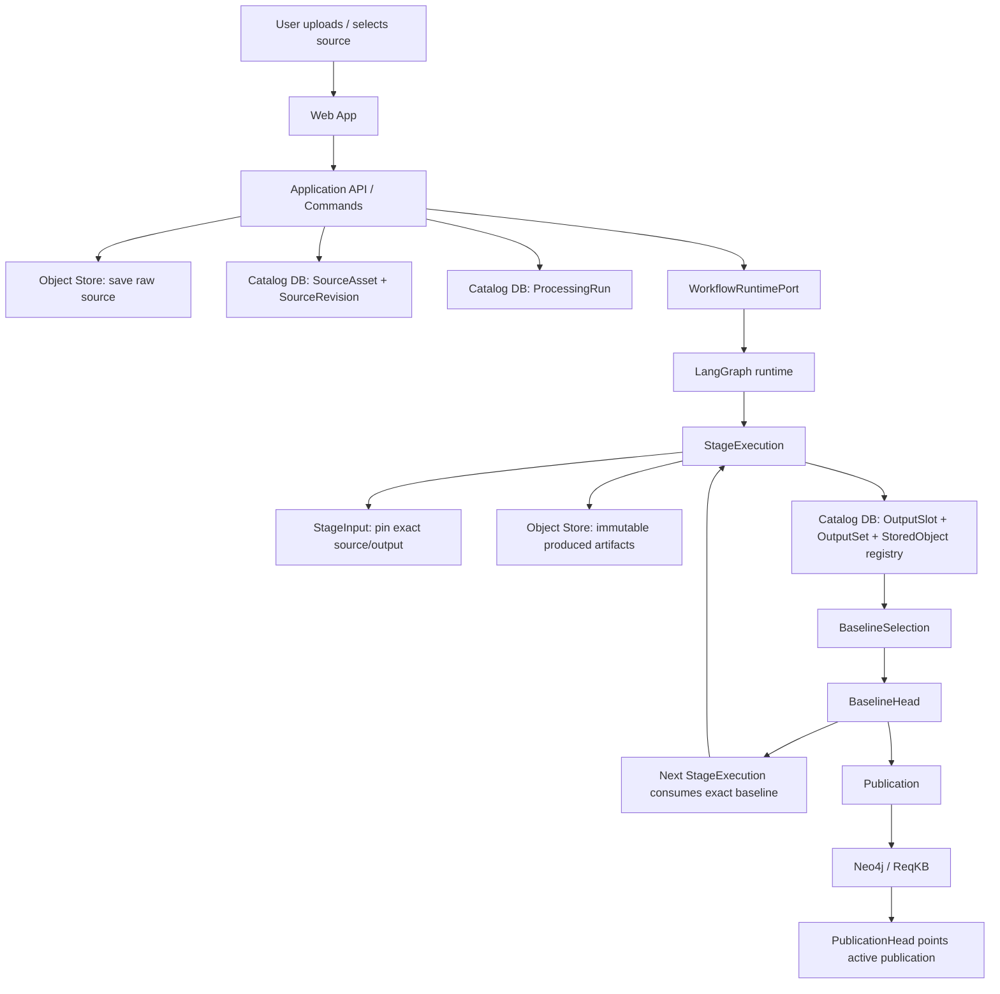
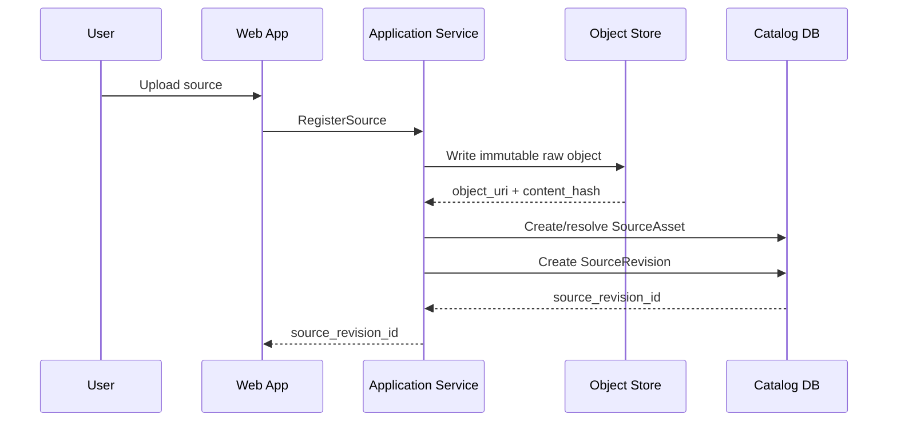
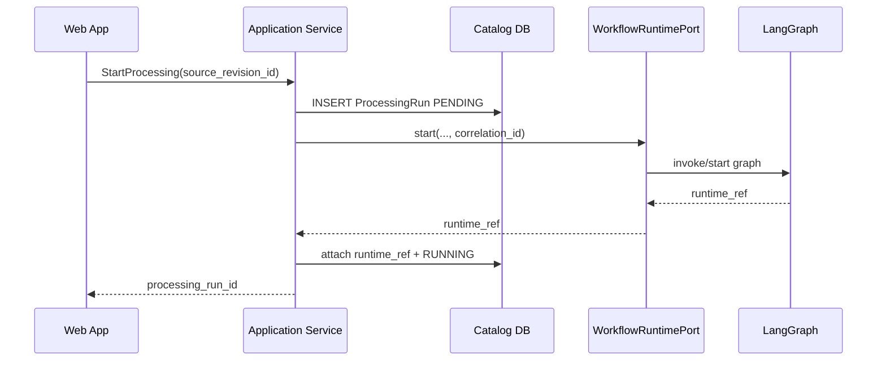
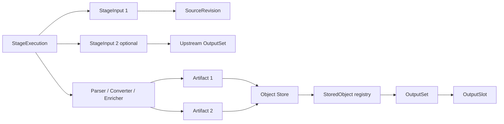
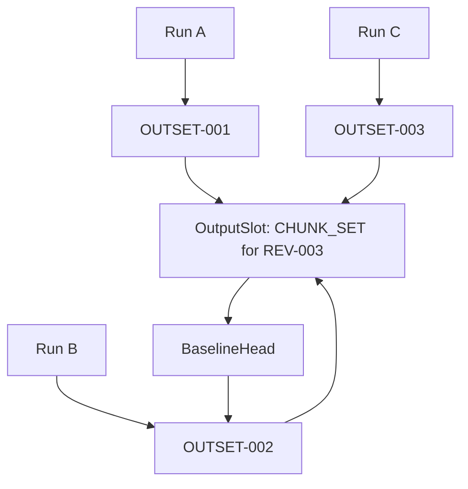
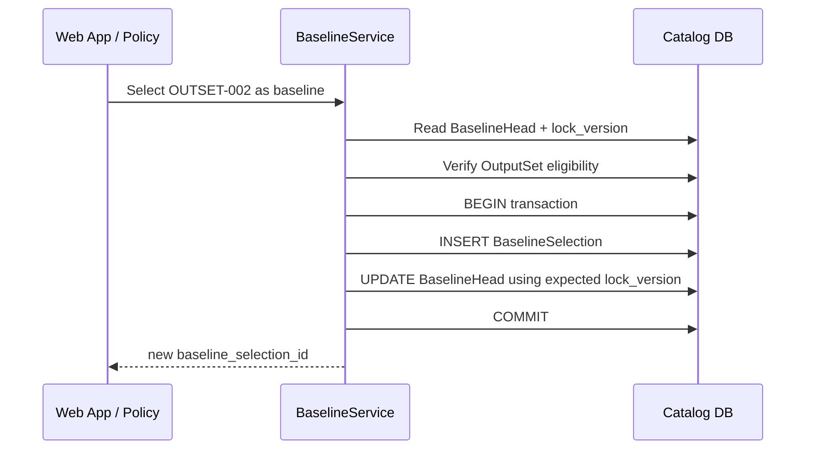
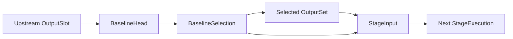
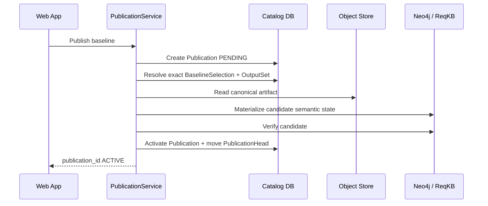
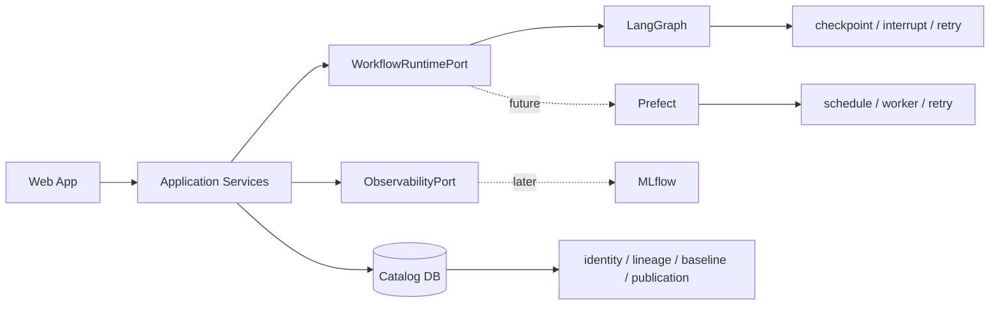

# ReqKB Database Data Flow

**Status:** POC implementation handoff  
**Audience:** Coding agent / backend developer  
**Scope:** Data movement qua Web App, workflow runtime, Catalog DB, Object Store và ReqKB/Neo4j  
**Depends on:** `02_storage_boundary.md`, `03_logical_data_model.md`, `04_physical_schema.md`, `05_implementation_guide.md`

---

## 1. Mục tiêu

Tài liệu này trả lời một câu hỏi thực dụng:

> Khi user chạy workflow trong Web App, dữ liệu đi đâu, table nào được ghi, object nào được tạo, và thành phần nào sở hữu state đó?

Đây **không phải** tài liệu ERD hoặc DDL. Tên table/field chi tiết nằm ở `03` và `04`.

Coding agent phải dùng file này để hiểu **thứ tự data flow và transaction boundary** trước khi implement repository/service.

---

## 2. Mental model ngắn nhất

Có ba loại state chính:

```text
Object Store
= immutable payload bytes

Catalog DB
= identity + lineage + baseline + publication governance

Neo4j / ReqKB
= semantic knowledge đã publish
```

Workflow runtime:

```text
LangGraph hiện tại
Prefect có thể thay sau
```

chỉ quản lý execution mechanics:

```text
start / pause / resume / retry / checkpoint
```

Runtime **không phải** System of Record cho baseline, publication hoặc artifact history.

---

## 3. End-to-end flow



### Coding rule

Mỗi mũi tên qua Catalog DB phải đi qua **application/domain command hoặc repository transaction**.

Không cho phép:

```text
UI → UPDATE table trực tiếp
LangGraph node → UPDATE baseline_head trực tiếp
Neo4j adapter → mutate Catalog governance trực tiếp
```

---

## 4. Flow A — ingest source

### Input

User upload một file source, ví dụ:

```text
requirement.xlsx
```

### Flow



### Data created

**Object Store**

```text
raw source bytes
```

**Catalog DB**

```text
source_asset
source_revision
```

### Important rules

```text
SourceAsset = stable document/business identity
SourceRevision = exact immutable content revision
```

Không tạo ProcessingRun trước khi SourceRevision đã được register thành công.

---

## 5. Flow B — start workflow



### Tables touched

```text
processing_run
```

Later each capability creates:

```text
stage_execution
```

### `runtime_ref`

Use provider-qualified opaque reference:

```text
langgraph:<opaque-id>
```

Future:

```text
prefect:<opaque-id>
```

Catalog DB uses it only for correlation. Runtime IDs không phải business identity.

---

## 6. Flow C — execute a stage

Ví dụ stage parse một SourceRevision hoặc consume OutputSet từ stage trước.



### Tables touched

```text
stage_execution
stage_input
output_slot
output_slot_scope_member
output_set
stored_object
```

### Important implementation order

```text
1. create StageExecution
2. pin exact StageInput(s)
3. execute capability
4. write artifact bytes to Object Store
5. verify hash/schema
6. resolve deterministic OutputSlot
7. register OutputSet
8. register StoredObjects
9. mark OutputSet VERIFIED / registration complete
10. mark StageExecution terminal
```

### Critical invariant

`StageInput` phải pin exact input đã consume.

Không được query kiểu:

```text
SELECT latest output
```

sau khi execution đã bắt đầu.

---

## 7. Flow D — OutputSlot và rerun

Một stage có thể chạy nhiều lần với cùng logical scope.



### Coding rule

Rerun **không tạo OutputSlot mới** nếu:

```text
workspace_id
artifact_role
scope_fingerprint
```

giống nhau.

Rerun tạo **OutputSet candidate mới** trong cùng OutputSlot.

### Why

Nếu mỗi run tạo slot mới:

```text
candidate history bị split
baseline governance bị vỡ
```

---

## 8. Flow E — select baseline

Baseline là governance decision, tách khỏi execution.



### Tables touched

```text
baseline_selection
baseline_head
```

### Important rule

```text
latest OutputSet != current baseline
```

Chỉ `BaselineHead` xác định candidate nào đang được dùng làm current baseline.

### Conflict

Nếu `lock_version` đã thay đổi:

```text
return BASELINE_CONFLICT
```

Không overwrite last-write-wins.

---

## 9. Flow F — next stage consumes baseline



`StageInput` phải lưu:

```text
output_set_id
source_baseline_selection_id
resolved_hash
```

### Why pin both baseline and output?

Để sau này biết:

```text
execution đã consume output nào
và output đó được chọn bởi baseline decision nào
```

Nếu upstream BaselineHead đổi, historical StageInput **không mutate**.

System chỉ derive rằng downstream output cũ là `STALE` relative to current baseline.

---

## 10. Flow G — publication vào ReqKB

Publication chỉ xảy ra sau khi đã có accepted baseline.



### Tables touched

```text
knowledge_space
publication_scope
publication
publication_head
```

### Stable publication scope

```text
KnowledgeSpace
+ SourceAsset
+ publication_role
```

Ví dụ:

```text
SOURCE-A REV-003 → PUB-003
SOURCE-A REV-004 → PUB-004
```

cùng nằm trong một PublicationScope.

Khi `PUB-004` active:

```text
PUB-003 → SUPERSEDED
PublicationHead → PUB-004
```

### Critical rule

Publication mới chưa `ACTIVE` thì downstream không được xem nó là current knowledge.

Implementation strategy để Neo4j giữ candidate invisible trước activation được quyết định riêng; không hard-code vào Catalog DB flow.

---

## 11. Runtime vs governance data flow



### Ownership summary

| Concern | Owner |
|---|---|
| Workflow checkpoint | LangGraph/Prefect runtime |
| Retry / pause / resume | Runtime |
| Source identity | Catalog DB |
| Stage execution identity | Catalog DB |
| Exact lineage | Catalog DB |
| Artifact bytes | Object Store |
| Baseline history/current | Catalog DB |
| Publication history/current | Catalog DB |
| Published semantics | Neo4j |
| Trace/evaluation experiment | MLflow later |

### Non-negotiable rule

Nếu LangGraph/Prefect state bị mất nhưng Catalog DB còn nguyên:

```text
business history vẫn phải đọc được
```

---

## 12. Failure flow coding agent phải support

### Case 1 — Object Store write success, DB register fail

```text
Object exists
Catalog registry missing
```

Action:

```text
reconciliation / orphan GC
```

Không overwrite object cũ.

---

### Case 2 — New run fail

```text
new StageExecution = FAILED
existing BaselineHead unchanged
```

Không rollback baseline cũ.

---

### Case 3 — Baseline committed, runtime resume fail

```text
BaselineSelection remains valid
runtime resume retried separately
```

Không rollback governance decision chỉ vì runtime unavailable.

---

### Case 4 — Publication materialization fail

```text
new Publication = FAILED
previous PublicationHead unchanged
previous ReqKB state remains active
```

---

## 13. Table touch map by application command

| Command | Main tables written | External store/runtime |
|---|---|---|
| RegisterSource | `source_asset`, `source_revision` | Object Store |
| StartProcessing | `processing_run` | Workflow runtime |
| StartStageExecution | `stage_execution`, `stage_input` | Runtime correlation |
| RegisterOutputSet | `output_slot`, `output_slot_scope_member`, `output_set`, `stored_object` | Object Store |
| SelectBaseline | `baseline_selection`, `baseline_head` | none |
| ResumeWorkflow | none/minimal runtime status correlation | Workflow runtime |
| PublishOutput | `publication_scope`, `publication`, `publication_head` | Object Store + Neo4j |

Coding agent nên implement theo command boundary này thay vì CRUD endpoint cho từng table.

---

## 14. Minimal API-to-data mapping

Ví dụ Web App API:

```text
POST /sources
→ RegisterSource

POST /runs
→ StartProcessing

GET /runs/{id}
→ ProcessingRun + StageExecution summary

GET /output-slots/{id}/candidates
→ OutputSet history

POST /output-slots/{id}/baseline
→ SelectBaseline

POST /runs/{id}/resume
→ ResumeWorkflow

POST /publication-scopes/{id}/publish
→ PublishOutput
```

API response trả business ID:

```text
source_revision_id
processing_run_id
stage_execution_id
output_set_id
baseline_selection_id
publication_id
```

Không expose direct DB row mutation semantics ra UI.

---

## 15. POC coding order from data-flow perspective

```text
1. Source registration flow
2. ProcessingRun / StageExecution flow
3. StageInput exact lineage
4. Object Store write + OutputSet registration
5. deterministic OutputSlot resolution
6. baseline selection + BaselineHead CAS
7. downstream baseline-bound StageInput
8. Web App runtime resume
9. PublicationScope + Publication flow
10. Neo4j materialization
11. reconciliation/failure paths
```

Nếu coding agent chưa pass step trước, không build step sau chỉ để hoàn thiện UI.

---

## 16. Acceptance scenario

Một implementation đúng phải chạy được scenario sau:

```text
1. Upload Requirement.xlsx
   → SOURCE-001 / REV-001

2. Start workflow
   → RUN-001

3. Parse lần 1
   → OUTSET-A trong SLOT-CHUNK-REV001

4. Parse lại
   → OUTSET-B trong cùng SLOT-CHUNK-REV001

5. User chọn OUTSET-B
   → BASELINE-002
   → BaselineHead = BASELINE-002

6. Ontology stage chạy
   → StageInput pin OUTSET-B + BASELINE-002
   → OUTSET-C

7. User thay baseline về OUTSET-A
   → BASELINE-003

8. OUTSET-C vẫn tồn tại
   nhưng được detect STALE relative to current baseline

9. Publish accepted output
   → PUB-001 ACTIVE
   → PublicationHead = PUB-001

10. Upload revision mới REV-002 và publish
    → PUB-002 ACTIVE
    → PUB-001 SUPERSEDED
```

Nếu data model/repository không support được scenario này thì implementation chưa đạt baseline architecture.

---

## 17. Coding agent checklist

Trước khi merge implementation:

- [ ] Không có code query `latest` để thay baseline semantics.
- [ ] Mọi StageExecution pin exact StageInput.
- [ ] Artifact bytes immutable sau registration.
- [ ] Rerun cùng scope reuse OutputSlot.
- [ ] OutputSet candidate mới không tự trở thành baseline.
- [ ] Baseline update dùng optimistic concurrency.
- [ ] Historical input/baseline/publication references không rewrite.
- [ ] Runtime state không thay Catalog DB governance state.
- [ ] Publication fail không làm mất active publication trước.
- [ ] Cross-store failure có reconciliation path.

---

## 18. Final implementation rule

Khi coding agent không chắc nên ghi state ở đâu, dùng rule:

```text
Payload bytes?          → Object Store
Business identity?      → Catalog DB
Lineage/governance?     → Catalog DB
Runtime checkpoint?     → LangGraph/Prefect
Published semantics?    → Neo4j
Trace/evaluation?       → MLflow later
```

Nếu một state có vẻ thuộc hai nơi, phải quay lại `02_storage_boundary.md` và xác định **canonical owner** trước khi code.