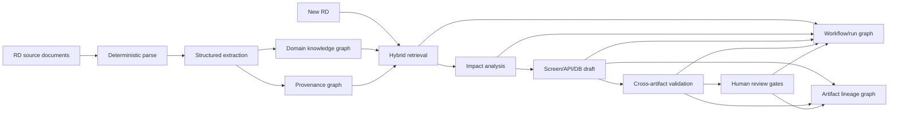

# Applying Graph Engineering to the RD → BD Chunk POC

## Source intake

This note records a design evaluation prompted by the following reading-list entry:

- **Shared by:** Shahzad Faisal — “bro you have AI, use it”
- **Article:** *Graph Engineering: From Karpathy’s Loops to Shared Knowledge Graphs*
- **URL:** https://pkhamdee.blog/2026/07/21/graph-engineering-from-karpathys-loops-to-shared-knowledge-graphs/?hl=en-GB
- **Status:** External synthesis and discovery source. Important claims must be checked against primary sources before becoming architecture standards.

The article is relevant because the POC already separates semantic object chunks, entity relationships, provenance, hybrid retrieval, generation workflow and human review. Graph engineering provides a clearer model for how those parts interact without collapsing every graph into one database or one runtime abstraction.

## Decision summary

For the POC, adopt graph engineering as a **logical architecture discipline**, not as a requirement to deploy Neo4j or a fully autonomous multi-agent runtime.

Use four distinct graph views:

1. **Domain knowledge graph** — requirements, business rules, screens, APIs, tables and their relationships.
2. **Provenance graph** — every extracted fact and generated statement linked to source document, version and exact evidence location.
3. **Workflow/run graph** — the actual RD → retrieval → impact → draft → validation → review execution, including retries and gates.
4. **Artifact lineage graph** — generated intermediate artifacts and BD drafts linked to inputs, model/tool versions, approvals and superseded outputs.

Do not merge these into a single universal graph schema. They may reference one another through stable identifiers.

## Mapping to the current POC



## Practical POC changes

### 1. Make every chunk an addressable semantic object

Each chunk must have a stable `chunk_id` and bind to one primary business/design object.

Minimum metadata:

```yaml
chunk_id: CHUNK-API-AUTH-01-v1.2
entity_id: API-AUTH-01
entity_type: API
document_id: BD-API-001
document_version: "1.2"
source_location: "Sheet: API一覧, Rows: 21-38"
status: active
module: Authentication
content_hash: sha256:...
extraction_method: deterministic_plus_llm
review_status: approved
```

This prevents the vector index from becoming the system of record. The chunk remains a retrievable projection of a governed entity and its evidence.

### 2. Add evidence edges, not only similarity links

The relation store should distinguish domain relations from evidence relations.

Domain examples:

```text
REQ-101 IMPLEMENTED_BY API-AUTH-01
API-AUTH-01 READS T_USER
API-AUTH-01 GOVERNED_BY BR-SEC-03
```

Evidence examples:

```text
REQ-101 ASSERTED_IN RD-001#Requirements!R18
API-AUTH-01 DESCRIBED_IN BD-API-001#API一覧!R21:R38
DRAFT-API-101 DERIVED_FROM CHUNK-API-AUTH-01-v1.2
```

The retrieval result must include both the semantic object and the evidence path used to justify it.

### 3. Record runtime lineage for each generated draft

Every POC run should create a run manifest:

```json
{
  "run_id": "RUN-20260729-001",
  "workflow_version": "rd-to-bd-poc-v0.1",
  "input_document_ids": ["RD-NEW-001"],
  "retrieved_chunk_ids": ["CHUNK-REQ-101-v1.2", "CHUNK-API-AUTH-01-v1.2"],
  "generated_artifacts": ["impact-analysis.json", "api-draft.json"],
  "model_versions": ["configured-at-runtime"],
  "validation_results": ["VAL-001"],
  "human_gate_status": "pending",
  "parent_run_id": null
}
```

A retry or revised proposal should point to the parent run rather than overwrite its history.

### 4. Use a bounded evaluator loop for draft improvement

The article’s loop concept maps to a constrained evaluator–optimizer pattern:

```text
Generate one bounded draft
→ validate against ontology, template and retrieved evidence
→ calculate coverage and unsupported-statement metrics
→ revise once or twice when below threshold
→ stop and escalate to human review
```

POC controls:

- maximum two automatic revisions;
- no change to source documents;
- no automatic baseline publication;
- every revision keeps its parent artifact ID;
- unsupported claims are removed or marked as assumptions;
- failure to improve triggers human review rather than more autonomous looping.

### 5. Retrieve a small evidence subgraph

Hybrid retrieval should return a compact evidence subgraph, not a flat bag of chunks.

Example:

```text
REQ-NEW-001
├── similar_to REQ-101
├── governed_by BR-SEC-03
├── likely_implemented_by API-AUTH-01
├── affects T_USER
└── evidence
    ├── RD-001 v1.2, row 18
    ├── BD-API-001 v1.2, rows 21-38
    └── DB-DESIGN-003 v3.0, table T_USER
```

The context builder can linearize this subgraph for the LLM while preserving IDs and citations in structured fields.

## Minimal schema additions

Add or reserve the following types:

### Nodes

- `Chunk`
- `EvidenceLocation`
- `WorkflowRun`
- `Artifact`
- `ArtifactVersion`
- `ValidationResult`
- `ReviewDecision`

### Relationships

- `ASSERTED_IN`
- `DESCRIBED_IN`
- `DERIVED_FROM`
- `GENERATED_IN`
- `VALIDATED_BY`
- `REVIEWED_BY`
- `SUPERSEDES`
- `RETRY_OF`

These additions complement the existing ontology. They should not replace the business/design entity model.

## Storage recommendation

For the current POC:

```text
PostgreSQL
├── entity table
├── relationship table
├── evidence table
├── chunk table
├── workflow_run table
├── artifact_version table
└── pgvector index
```

Use recursive SQL or application-level traversal for small subgraphs. Evaluate Neo4j only when multi-hop traversal, graph analytics or graph-native debugging becomes a measured bottleneck.

## Acceptance criteria

The graph-engineering addition is successful when:

1. every retrieved statement can be traced to an active document version and exact source location;
2. the system can produce a compact subgraph for one requirement covering requirement → rule → screen/API/table → evidence;
3. every generated BD section records its source chunks and run ID;
4. revised drafts preserve lineage instead of overwriting prior outputs;
5. graph-enhanced retrieval improves traceability completeness or reviewer correction count versus vector-only retrieval;
6. no additional graph infrastructure is introduced without a benchmark showing that relational storage is insufficient.

## Deferred items

- unrestricted runtime-generated workflows;
- large multi-agent experiment DAGs;
- autonomous graph mutation without schema validation;
- one shared graph database as the only storage layer;
- production-scale graph analytics before the golden dataset is stable.

## Related repository notes

- `poc/README.md`
- `poc/ontology/ontology-v0.1.yaml`
- `docs/harness-component-library/graph-engineering-components.md`
- `docs/harness-references/graph-engineering-manual.md`
- `docs/reading-list.md`
