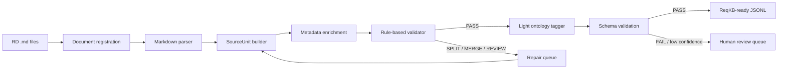

# ReqKB ingestion workflow: parse → metadata → validate → light ontology

## 1. Scope

This workflow covers only the preparation of Requirement Definition documents for the Requirement Knowledge Base (ReqKB):

```text
RD Markdown files
→ deterministic parse and metadata
→ SourceUnit validation
→ lightweight requirement ontology tagging
→ ReqKB-ready records
```

It does **not** cover design rules, BD artifact generation, graph construction or retrieval. Those stages consume the output of this workflow later.

## 2. Core principle

Use one canonical unit throughout the pipeline: `SourceUnit`.

- A `SourceUnit` contains an unchanged, meaningful fragment from the source document.
- Its `source_unit_id` is the stable ID used throughout ReqKB.
- There is no second Claim ID when the parsed fragment is already the smallest meaningful requirement unit.
- Metadata records where the unit came from and how it was parsed.
- Validation records whether the unit is structurally suitable for ReqKB.
- Ontology annotations describe the business meaning without replacing the raw text.

```text
SourceUnit = raw evidence + deterministic metadata + validation + semantic annotations
```

## 3. End-to-end workflow



## 4. Stage 1 — Document registration

Register each input file before parsing.

Minimum document metadata:

```yaml
document_id: RD-CAMPAIGN-001
source_path: input/campaign.md
file_name: campaign.md
content_hash: sha256:...
parser_version: markdown-it-py@x.y.z
ingestion_run_id: INGEST-20260730-001
```

### Tools

- Python `pathlib` for file discovery.
- Python `hashlib.sha256` for change detection.
- UUIDv5 or a deterministic hash for stable IDs.

A changed content hash causes the document to be reparsed. Unchanged documents can be skipped during incremental ingestion.

## 5. Stage 2 — Deterministic Markdown parsing

### Recommended tool

**`markdown-it-py`**

Use it as the canonical Markdown parser because it exposes a deterministic token stream, block types and source-line ranges. This gives more control than treating a RAG text splitter as the system-of-record parser.

Parse these structural elements:

- headings and heading hierarchy;
- paragraphs;
- ordered and unordered list items;
- block quotes;
- tables when enabled by the selected Markdown profile/plugin;
- fenced code blocks;
- horizontal rules;
- source line start/end.

The parser must not rewrite or summarize the source text.

## 6. Stage 3 — SourceUnit builder

A custom `SourceUnitBuilder` groups parser tokens into meaningful source units.

Default rules:

1. Preserve heading context as metadata, not as replacement text.
2. A paragraph is one candidate unit unless it exceeds configured limits.
3. Each list item is a separate candidate when it expresses an independent assertion.
4. Keep a table together with its header; do not create isolated cell fragments.
5. Keep fenced code or examples separate from requirement prose.
6. Never split in the middle of a sentence solely to satisfy a token limit.
7. Preserve exact raw text and source-line boundaries.

Example output before validation:

```yaml
source_unit_id: SU-3b31c7d8
raw_text: >
  Khi khách hàng nhấp vào liên kết trong email campaign,
  hệ thống phải cộng 10 điểm vào lead score.
metadata:
  document_id: RD-CAMPAIGN-001
  heading_path:
    - Campaign Management
    - Lead Scoring
  block_type: paragraph
  line_start: 42
  line_end: 43
  previous_source_unit_id: SU-4b0b8c21
  next_source_unit_id: SU-f9211aa0
  content_hash: sha256:...
```

### Stable ID rule

Generate `source_unit_id` deterministically from:

```text
document_id + normalized heading path + source line range + raw-text hash
```

Do not generate an ID from LLM output.

## 7. Stage 4 — Metadata enrichment

At this stage, add only facts the parser can determine with certainty.

Required metadata:

| Field | Purpose |
|---|---|
| `document_id` | Trace to registered RD document |
| `source_path` | Original file location |
| `heading_path` | Section hierarchy |
| `block_type` | Paragraph, list item, table, code block, etc. |
| `line_start`, `line_end` | Exact source boundary |
| `previous_source_unit_id` | Local document order |
| `next_source_unit_id` | Local document order |
| `content_hash` | Change and duplicate detection |
| `parser_name`, `parser_version` | Reproducibility |
| `ingestion_run_id` | Processing lineage |

Do not put actor, action, condition or requirement type into parser metadata. Those are ontology annotations and belong to a later stage.

## 8. Stage 5 — SourceUnit validator

Implement a custom, rule-based `SourceUnitValidator` after parsing.

### Validator output

```yaml
validation:
  status: PASS       # PASS | SPLIT | MERGE | REVIEW | REJECT
  rule_hits: []
  notes: []
  validator_version: source-unit-validator@0.1.0
```

### Validation rules

#### Traceability

- Raw text is not empty.
- Document ID exists.
- Line range is valid.
- Raw text hash can be reproduced.

#### Boundary quality

- Unit does not start or end with a broken Markdown construct.
- Unit does not contain an unclosed table, list or code fence.
- Unit is not only a heading with no content unless headings are intentionally indexed.
- Very short fragments are marked `MERGE` unless they are explicit requirements or list items.

#### Size

- Hard maximum protects downstream context and storage.
- Soft maximum marks a unit `SPLIT` for a second structural pass.
- Size thresholds are safety limits, not the primary chunking strategy.

#### Atomicity heuristics

Mark `REVIEW` or `SPLIT` when a unit appears to contain multiple independent requirement assertions, for example:

- multiple independent `must`, `shall`, `should`, `may` clauses;
- numbered obligations inside one paragraph;
- several unrelated actors/actions;
- an exception that governs a different action;
- explicit conjunctions connecting independently testable requirements.

A condition that only qualifies one action remains in the same SourceUnit.

### Tooling

- Custom Python rules and regular expressions.
- Optional language-specific sentence segmentation.
- No LLM on the default validation path.
- LLM assistance only for units that remain `REVIEW` after deterministic checks.

## 9. Stage 6 — Lightweight ontology tagging

Ontology tagging runs only on validated SourceUnits.

### Ontology is a schema, not an engine

The ontology defines the allowed annotation slots and values. An `OntologyTagger` reads the SourceUnit and fills that schema.

Recommended lightweight slots:

```yaml
requirement_type:
  - functional
  - business_rule
  - constraint
  - non_functional
  - assumption
  - definition
  - unknown
modality:
  - must
  - must_not
  - should
  - may
  - stated_fact
  - unknown
actors: []
actions: []
business_objects: []
events: []
conditions: []
exceptions: []
terms: []
```

Do not include design concepts such as API, Screen, DatabaseTable or Batch in this ontology phase.

### Recommended tools

- **Pydantic v2** to define and validate the annotation schema.
- **LangChain model `with_structured_output(...)`** or the model provider's native JSON Schema/structured-output feature.
- Deterministic rules for easy labels such as explicit modality keywords and known requirement IDs.
- LLM for natural-language interpretation that cannot be extracted reliably by rules.

Recommended execution order:

```text
rule-based annotations
→ LLM fills unresolved slots using structured output
→ Pydantic validation
→ ontology value validation
→ confidence/review policy
```

### Example annotation

```yaml
ontology:
  ontology_version: requirement-light@0.1.0
  requirement_type: functional
  modality: must
  actors:
    - Customer
    - System
  events:
    - EmailCampaignLinkClicked
  actions:
    - IncreaseLeadScore
  business_objects:
    - LeadScore
  conditions:
    - amount == 10 points
  exceptions: []
  tagging_method: rules_plus_llm
  confidence: 0.93
  review_status: auto_accepted
```

The raw SourceUnit remains unchanged. The annotation is an interpretation attached to its ID.

## 10. Final ReqKB-ready record

Store records as JSONL for the POC. One line represents one canonical SourceUnit.

```json
{
  "source_unit_id": "SU-3b31c7d8",
  "raw_text": "Khi khách hàng nhấp vào liên kết trong email campaign, hệ thống phải cộng 10 điểm vào lead score.",
  "metadata": {
    "document_id": "RD-CAMPAIGN-001",
    "source_path": "input/campaign.md",
    "heading_path": ["Campaign Management", "Lead Scoring"],
    "block_type": "paragraph",
    "line_start": 42,
    "line_end": 43,
    "content_hash": "sha256:...",
    "parser_name": "markdown-it-py",
    "parser_version": "x.y.z",
    "ingestion_run_id": "INGEST-20260730-001"
  },
  "validation": {
    "status": "PASS",
    "rule_hits": [],
    "validator_version": "source-unit-validator@0.1.0"
  },
  "ontology": {
    "ontology_version": "requirement-light@0.1.0",
    "requirement_type": "functional",
    "modality": "must",
    "actors": ["Customer", "System"],
    "events": ["EmailCampaignLinkClicked"],
    "actions": ["IncreaseLeadScore"],
    "business_objects": ["LeadScore"],
    "conditions": ["amount == 10 points"],
    "exceptions": [],
    "tagging_method": "rules_plus_llm",
    "confidence": 0.93,
    "review_status": "auto_accepted"
  }
}
```

## 11. Tool selection summary

| Stage | Recommended tool | Responsibility |
|---|---|---|
| File discovery | Python `pathlib` | Find input Markdown files |
| Hashing and stable IDs | `hashlib`, UUIDv5 | Incremental ingestion and deterministic identity |
| Markdown parse | `markdown-it-py` | Token stream, block type, heading and line provenance |
| SourceUnit assembly | Custom Python | Group tokens into canonical meaningful units |
| Validation | Custom Python rules | PASS/SPLIT/MERGE/REVIEW/REJECT |
| Data models | Pydantic v2 | SourceUnit and ontology schema validation |
| Ontology tagging | Rules + LLM structured output | Business-level semantic annotation |
| Workflow orchestration | Plain Python initially; LangGraph only if needed | Execute stages, retries and review queues |
| POC output | JSONL | Portable ReqKB-ready records |

## 12. Recommended package layout

```text
poc/reqkb-ingestion/
├── README.md
├── pyproject.toml
├── src/reqkb_ingestion/
│   ├── models.py
│   ├── registry.py
│   ├── markdown_parser.py
│   ├── source_unit_builder.py
│   ├── validator.py
│   ├── ontology_schema.py
│   ├── ontology_tagger.py
│   └── pipeline.py
├── config/
│   ├── validator-rules.yaml
│   └── requirement-ontology-light.yaml
├── input/
├── output/
│   ├── source-units.jsonl
│   └── review-queue.jsonl
└── tests/
    ├── fixtures/
    ├── test_parser.py
    ├── test_validator.py
    └── test_ontology_tagger.py
```

## 13. Definition of done

A document is ready for ReqKB when:

1. every accepted SourceUnit has one stable ID;
2. raw source text is preserved unchanged;
3. every unit traces to document, heading and line range;
4. parser and validator versions are recorded;
5. every unit has a deterministic validation status;
6. ontology output conforms to the lightweight schema;
7. low-confidence or ambiguous units are routed to review;
8. no API, screen, database or BD design decision is introduced;
9. rerunning an unchanged file produces the same IDs and equivalent records;
10. a changed file is detected through its content hash and reprocessed incrementally.

## 14. POC implementation order

```text
1. Markdown parser + SourceUnit ID
2. Metadata and JSONL output
3. Rule-based validator
4. Golden test fixtures
5. Pydantic lightweight ontology schema
6. Rule-based ontology labels
7. LLM structured-output fallback
8. Review queue and metrics
```

Do not add graph storage or BD generation until this workflow produces stable, traceable SourceUnits on the selected RD golden dataset.
