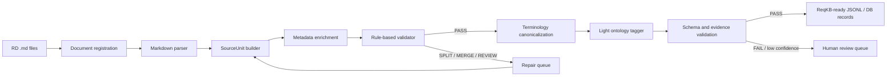

# ReqKB ingestion workflow: parse → metadata → validate → light ontology

## 1. Scope

This workflow covers only the preparation of Requirement Definition documents for the Requirement Knowledge Base (ReqKB):

```text
RD Markdown files
→ document registration
→ deterministic structural parsing
→ SourceUnit construction
→ parser metadata enrichment
→ SourceUnit validation and repair routing
→ terminology canonicalization
→ lightweight requirement ontology tagging
→ annotation/schema validation
→ ReqKB-ready persistence
```

It does **not** cover design rules, BD artifact generation, design ontology, graph construction, graph retrieval or impact analysis. Those stages consume the output of this workflow later.

The workflow follows an ontology-guided ingestion model, but only at the requirement/business-semantic level. It deliberately excludes API, Screen, DatabaseTable, Batch, TestCase and DesignDecision from the ontology used here.

## 2. Core principle

Use one canonical unit throughout the pipeline: `SourceUnit`.

- A `SourceUnit` contains an unchanged, meaningful fragment from the source document.
- Its `source_unit_id` is the stable ID used throughout ReqKB.
- There is no second Claim ID when the parsed fragment is already the smallest meaningful requirement unit.
- Metadata records where the unit came from and how it was parsed.
- Validation records whether the unit is structurally suitable for ReqKB.
- Ontology annotations describe the business meaning without replacing the raw text.

```text
SourceUnit = raw evidence + deterministic metadata + validation + semantic annotations
```

The source text remains the authoritative evidence. Ontology annotations are interpretations attached to the SourceUnit and must never overwrite or silently rewrite the source.

## 3. End-to-end workflow



## 4. Stage 1 — Document registration

### Objective

Create one deterministic identity and processing record for every RD file before any parsing occurs.

### Input

- One `.md` file.
- Workspace/project identifier.
- Optional document manifest containing business key, version, status and owner.

### Output

A `DocumentRecord` such as:

```yaml
document_id: RD-CAMPAIGN-001
workspace_id: WS-001
source_path: input/campaign.md
file_name: campaign.md
document_version: "1.0"
document_status: active
content_hash: sha256:...
parser_version: markdown-it-py@x.y.z
ingestion_run_id: INGEST-20260802-001
registered_at: 2026-08-02T16:00:00+09:00
```

### Requirements

1. `document_id` must be deterministic and independent from LLM output.
2. `content_hash` must be computed from the exact file bytes.
3. The registry must detect unchanged, changed, added and removed files.
4. Document version and status must be preserved when supplied by a trusted manifest.
5. Duplicate content under multiple filenames must be detectable but not automatically merged.
6. Registration failure for one document must not stop the complete ingestion batch.

### Tools

- Python `pathlib` for file discovery.
- Python `hashlib.sha256` for content change detection.
- UUIDv5 or a deterministic business-key hash for stable IDs.
- Pydantic `DocumentRecord` model for validation.

### Failure conditions

- Missing or unreadable file.
- Duplicate `document_id` with different content.
- Invalid version/status metadata.
- Source path escaping the configured ingestion root.

### Acceptance criteria

- Re-registering the same unchanged file returns the same `document_id` and content hash.
- A changed file is marked for reprocessing.
- An unchanged file can be skipped by incremental ingestion.
- Every downstream SourceUnit can resolve its parent `DocumentRecord`.

## 5. Stage 2 — Deterministic Markdown parsing

### Objective

Convert Markdown into a deterministic token/block representation while preserving document structure and source-line provenance.

### Recommended tool

**`markdown-it-py`**

Use it as the canonical Markdown parser because it exposes a deterministic token stream, block types and source-line ranges. This gives more control than treating a RAG text splitter as the system-of-record parser.

### Input

- Registered Markdown file.
- Parser configuration and enabled plugins.

### Output

A sequence of parsed blocks/tokens with:

```yaml
token_type: paragraph_open
line_start: 42
line_end: 44
heading_path:
  - Campaign Management
  - Lead Scoring
raw_slice: "..."
```

### Structural elements to parse

- headings and heading hierarchy;
- paragraphs;
- ordered and unordered list items;
- block quotes;
- tables when enabled by the selected Markdown profile/plugin;
- fenced code blocks;
- horizontal rules;
- inline links and references when they affect traceability;
- source line start/end.

### Requirements

1. The parser must not rewrite, summarize or translate source text.
2. Parser configuration must be versioned.
3. Heading hierarchy must be reconstructed deterministically.
4. Table headers must be associated with table rows.
5. Code blocks and examples must remain distinguishable from requirement prose.
6. The parser must preserve enough location data to recreate the exact source slice.
7. Unsupported Markdown constructs must be surfaced as parser warnings, not silently dropped.

### Failure conditions

- Unclosed code fence or malformed table.
- Token without a valid source range where a range is expected.
- Parser output that cannot reproduce the source slice.
- Plugin-dependent behavior without the plugin/version being recorded.

### Acceptance criteria

- Parsing the same file with the same parser version produces equivalent token output.
- Every parsed block resolves to an exact source line range.
- No source text is introduced by the parser.
- Round-trip comparison confirms that normalized parsed slices are grounded in the original file.

## 6. Stage 3 — SourceUnit builder

### Objective

Group deterministic parser blocks into the smallest useful source units for later validation and ontology tagging.

A SourceUnit is a source-level unit, not an LLM-written claim. Its `raw_text` remains verbatim.

### Input

- Parsed token/block sequence.
- Current heading context.
- SourceUnit construction rules.

### Output

```yaml
source_unit_id: SU-3b31c7d8
raw_text: >
  Khi khách hàng nhấp vào liên kết trong email campaign,
  hệ thống phải cộng 10 điểm vào lead score.
metadata:
  document_id: RD-CAMPAIGN-001
  heading_path:
    - Campaign Management
    - Lead Scoring
  block_type: paragraph
  line_start: 42
  line_end: 43
  previous_source_unit_id: SU-4b0b8c21
  next_source_unit_id: SU-f9211aa0
  content_hash: sha256:...
```

### Construction rules

1. Preserve heading context as metadata, not as replacement text.
2. A paragraph is one candidate unit unless deterministic rules identify a required merge or split.
3. Each list item is a separate candidate when it expresses an independent assertion.
4. A lead-in sentence and its dependent list must remain linked; do not detach list items from required context.
5. Keep a table together with its header; do not create isolated cells without row/column context.
6. Keep fenced code, examples and notes separate from requirement prose.
7. Never split in the middle of a sentence solely to satisfy a token limit.
8. Keep conditions and exceptions with the action they qualify when they are locally expressed.
9. Preserve exact raw text and source-line boundaries.
10. Retain previous/next and parent/child structural relationships for repair and context reconstruction.

### Stable ID rule

Generate `source_unit_id` deterministically from:

```text
workspace_id
+ document_id
+ normalized structural path
+ source line range
+ raw-text hash
```

Do not generate IDs from LLM output, extracted actor/action names or mutable summaries.

### Failure conditions

- Unit contains text from non-contiguous source ranges without explicit composition metadata.
- Unit loses its table header or list lead-in context.
- Unit ID changes when only unrelated parts of the document change.
- Unit contains generated or normalized text rather than verbatim source.

### Acceptance criteria

- Every unit has a stable, reproducible ID.
- Every unit has exact source boundaries.
- Units preserve dependent Markdown context.
- Unit construction is deterministic for a fixed input and ruleset.

## 7. Stage 4 — Parser metadata enrichment

### Objective

Attach only deterministic facts known from registration and parsing.

### Required metadata

| Field | Purpose |
|---|---|
| `workspace_id` | Tenant/workspace boundary |
| `document_id` | Trace to registered RD document |
| `source_path` | Original file location |
| `document_version` | Source version when available |
| `document_status` | Active/draft/obsolete status when available |
| `heading_path` | Section hierarchy |
| `block_type` | Paragraph, list item, table, code block, etc. |
| `line_start`, `line_end` | Exact source boundary |
| `previous_source_unit_id` | Local document order |
| `next_source_unit_id` | Local document order |
| `parent_source_unit_id` | Structural parent when applicable |
| `content_hash` | Change and duplicate detection |
| `parser_name`, `parser_version` | Reproducibility |
| `builder_version` | SourceUnit construction reproducibility |
| `ingestion_run_id` | Processing lineage |

### Requirements

1. Metadata must answer where the unit came from and how it was produced.
2. Metadata must be deterministic and reproducible.
3. Parser metadata must not include inferred actor, action, condition or requirement type.
4. Missing optional metadata must be explicit as `null`, not replaced by guesses.
5. Metadata changes must be auditable by ingestion run and component version.

### Acceptance criteria

- Metadata can locate the exact original source unit.
- Metadata contains no LLM-inferred business semantics.
- Every field has a documented owner and generation rule.

## 8. Stage 5 — SourceUnit validation

### Objective

Determine whether a SourceUnit is structurally and contextually suitable for ReqKB semantic processing.

Validation does not decide the business meaning. It checks source quality, boundary integrity, atomicity indicators and traceability.

### Input

- SourceUnit with parser metadata.
- Versioned validation rule configuration.

### Output

```yaml
validation:
  status: PASS       # PASS | SPLIT | MERGE | REVIEW | REJECT
  rule_hits: []
  notes: []
  proposed_neighbors: []
  validator_version: source-unit-validator@0.1.0
```

### Status semantics

- `PASS`: structurally suitable for ontology tagging.
- `SPLIT`: contains multiple likely independent source assertions and needs deterministic or reviewed splitting.
- `MERGE`: insufficient meaning/context alone and needs adjacent source context.
- `REVIEW`: ambiguous boundary or rule conflict; requires LLM-assisted or human adjudication.
- `REJECT`: non-requirement noise, corrupted content or unsupported structure that should not enter the normal ReqKB path.

### Validation rules

#### Traceability

- Raw text is not empty.
- Document ID exists.
- Line range is valid.
- Raw text hash can be reproduced.
- Source range maps to the registered document version.

#### Boundary quality

- Unit does not start or end with a broken Markdown construct.
- Unit does not contain an unclosed table, list or code fence.
- Unit is not only a heading with no content unless headings are intentionally indexed.
- Pronoun-only or reference-only fragments are marked `MERGE` or `REVIEW` when required context is absent.
- Very short fragments are marked `MERGE` unless they are explicit requirements, definitions or independent list items.

#### Size

- Hard maximum protects downstream context and storage.
- Soft maximum marks a unit `SPLIT` for a second structural pass.
- Size thresholds are safety limits, not the primary chunking strategy.

#### Atomicity heuristics

Mark `REVIEW` or `SPLIT` when a unit appears to contain multiple independently testable assertions, for example:

- multiple independent `must`, `shall`, `should`, `may` clauses;
- numbered obligations inside one paragraph;
- several unrelated actors/actions;
- an exception that governs a different action;
- explicit conjunctions connecting independently testable requirements.

A condition, qualifier or exception that only governs one action remains in the same SourceUnit.

#### Context completeness

- Table rows must carry table-header context.
- List items must retain required list lead-in context.
- Cross-references must retain their literal target text or identifier.
- A unit using “this”, “the above”, “the following”, etc. without a resolvable context is marked `REVIEW` or `MERGE`.

### Tooling

- Custom Python rules and regular expressions.
- Optional language-specific sentence segmentation.
- YAML configuration for versioned thresholds and rule switches.
- No LLM on the default validation path.
- LLM assistance only for units that remain `REVIEW` after deterministic checks.

### Repair requirements

1. Repairs must create a new processing result while preserving lineage to original SourceUnit IDs.
2. A split must record the parent SourceUnit ID.
3. A merge must record all contributing SourceUnit IDs and source ranges.
4. Repairs must never silently change raw text.
5. Human decisions must record reviewer, timestamp and reason.

### Acceptance criteria

- Every unit receives exactly one current validation status.
- `PASS` units satisfy all hard traceability and boundary rules.
- Split/merge operations are lineage-preserving and reproducible.
- Rejected and review units are excluded from automatic ontology acceptance.

## 9. Stage 6 — Terminology canonicalization

### Objective

Normalize known requirement terminology and identifiers before ontology tagging without changing the raw source.

### Input

- Validated SourceUnit.
- Versioned terminology/alias dictionary.
- Deterministic ID patterns and document reference rules.

### Output

```yaml
canonicalization:
  canonical_terms:
    - source_text: "PR"
      canonical_id: BusinessObject:PurchaseRequest
      method: alias_dictionary
  extracted_ids:
    - REQ-001
  unresolved_terms:
    - "PurchaseApplication"
  dictionary_version: requirement-terms@0.1.0
```

### Requirements

1. Raw text remains unchanged.
2. Exact IDs and approved aliases are resolved deterministically first.
3. Alias resolution must be workspace/domain scoped.
4. Ambiguous aliases must not be auto-merged.
5. Every canonicalization decision must record method and dictionary version.
6. Unresolved terms remain explicit for ontology tagging or review.

### Tools

- Versioned YAML/JSON alias dictionary.
- Regex for known requirement IDs and references.
- Optional embedding similarity only for candidate generation, never automatic acceptance by itself.

### Acceptance criteria

- Approved aliases resolve consistently.
- Ambiguous mappings are not silently accepted.
- Canonicalization is reversible to the original source text and span.

## 10. Stage 7 — Lightweight requirement ontology tagging

### Objective

Attach a controlled business-semantic interpretation to validated SourceUnits.

Ontology tagging is not document parsing and not design generation. The ontology defines allowed annotation slots and values; the `OntologyTagger` fills them.

### Allowed ontology scope

Recommended classes/slots:

```yaml
requirement_type:
  - functional
  - business_rule
  - constraint
  - non_functional
  - assumption
  - definition
  - unknown
modality:
  - must
  - must_not
  - should
  - may
  - stated_fact
  - unknown
actors: []
actions: []
business_objects: []
events: []
conditions: []
exceptions: []
terms: []
references: []
```

Do not include design concepts such as API, Screen, DatabaseTable, Batch, TestCase or DesignDecision in this phase.

### Input

- `PASS` SourceUnit.
- Parser metadata.
- Canonicalization result.
- Requirement ontology schema and version.
- Approved terminology dictionary.

### Output

```yaml
ontology:
  ontology_version: requirement-light@0.1.0
  requirement_type: functional
  modality: must
  actors:
    - Customer
    - System
  events:
    - EmailCampaignLinkClicked
  actions:
    - IncreaseLeadScore
  business_objects:
    - LeadScore
  conditions:
    - amount == 10 points
  exceptions: []
  tagging_method: rules_plus_llm
  confidence: 0.93
  review_status: auto_accepted
```

### Recommended tools

- **Pydantic v2** for the annotation schema.
- **LangChain `with_structured_output(...)`** or provider-native JSON Schema structured output.
- Deterministic rules for explicit modality keywords, known IDs and approved aliases.
- LLM for natural-language interpretation that cannot be extracted reliably by deterministic rules.

### Execution order

```text
rule-based annotations
→ LLM fills unresolved slots using structured output
→ Pydantic validation
→ ontology value validation
→ evidence support validation
→ confidence/review policy
```

### Prompt requirements

The ontology tagger prompt must:

1. Include the exact SourceUnit raw text.
2. Include heading context and approved canonical terms.
3. Enumerate allowed classes and values.
4. Explicitly prohibit design inference.
5. Require empty/unknown values rather than guessing.
6. Preserve conditions, exceptions, negation and modality.
7. Return only structured output conforming to the schema.
8. Identify the source text span supporting each non-trivial annotation when feasible.

### Tagging policy

- Rule-derived explicit modality may be auto-accepted when unambiguous.
- LLM-derived actor/action/object annotations require schema validation and evidence support.
- Unknown or overlapping ontology classes must route to review rather than forced classification.
- Confidence is a triage signal, not proof of correctness.
- The tagger must not invent entities absent from the SourceUnit or approved context.

### Failure conditions

- Annotation violates the Pydantic schema.
- Unsupported ontology value.
- Design concept introduced in requirement ontology.
- Condition, exception, negation or modality dropped.
- Annotation cannot be supported by source text.
- LLM output contains free-form prose outside the structured schema.

### Acceptance criteria

- Every accepted annotation conforms to the ontology version.
- Every non-trivial annotation is grounded in the SourceUnit or deterministic canonical context.
- Unknown values remain explicit.
- Low-confidence or conflicting outputs enter human review.
- Reprocessing records tagger/model/prompt versions.

## 11. Stage 8 — Annotation, schema and evidence validation

### Objective

Validate the ontology-tagging result before persistence as trusted ReqKB data.

### Validation layers

1. **Schema validation** — data types, required fields and enums.
2. **Ontology validation** — only allowed classes, slots and value forms.
3. **Evidence validation** — annotations are supported by source text or approved canonical mappings.
4. **Consistency validation** — modality, negation, conditions and exceptions do not contradict each other.
5. **Duplicate/conflict detection** — detect likely duplicate units or conflicting assertions without silently merging them.
6. **Version validation** — ontology, dictionary, prompt, model and validator versions are recorded.

### Output

```yaml
annotation_validation:
  status: ACCEPTED   # ACCEPTED | REVIEW | REJECTED
  violations: []
  warnings: []
  validator_version: ontology-validator@0.1.0
  reviewed_by: null
```

### Review triggers

- Ambiguous ontology class.
- Actor/action/object unsupported by source.
- Negative requirement interpreted as positive.
- Exception detached from the governed action.
- Conflicting deterministic and LLM annotations.
- Alias resolution with multiple plausible targets.
- Ontology or schema migration failure.

### Acceptance criteria

- No accepted record violates the active ontology schema.
- No accepted annotation lacks provenance to its SourceUnit.
- Review and rejection reasons are machine-readable.
- Human corrections are stored separately from raw source and preserve audit history.

## 12. Stage 9 — ReqKB persistence

### Objective

Persist evidence-backed requirement records in a form suitable for later keyword, vector and relationship indexing.

### POC output

Use JSONL initially. One line represents one canonical SourceUnit.

```json
{
  "source_unit_id": "SU-3b31c7d8",
  "raw_text": "Khi khách hàng nhấp vào liên kết trong email campaign, hệ thống phải cộng 10 điểm vào lead score.",
  "metadata": {
    "workspace_id": "WS-001",
    "document_id": "RD-CAMPAIGN-001",
    "source_path": "input/campaign.md",
    "heading_path": ["Campaign Management", "Lead Scoring"],
    "block_type": "paragraph",
    "line_start": 42,
    "line_end": 43,
    "content_hash": "sha256:...",
    "parser_name": "markdown-it-py",
    "parser_version": "x.y.z",
    "builder_version": "source-unit-builder@0.1.0",
    "ingestion_run_id": "INGEST-20260802-001"
  },
  "validation": {
    "status": "PASS",
    "rule_hits": [],
    "validator_version": "source-unit-validator@0.1.0"
  },
  "canonicalization": {
    "canonical_terms": [],
    "unresolved_terms": [],
    "dictionary_version": "requirement-terms@0.1.0"
  },
  "ontology": {
    "ontology_version": "requirement-light@0.1.0",
    "requirement_type": "functional",
    "modality": "must",
    "actors": ["Customer", "System"],
    "events": ["EmailCampaignLinkClicked"],
    "actions": ["IncreaseLeadScore"],
    "business_objects": ["LeadScore"],
    "conditions": ["amount == 10 points"],
    "exceptions": [],
    "tagging_method": "rules_plus_llm",
    "confidence": 0.93,
    "review_status": "auto_accepted"
  },
  "annotation_validation": {
    "status": "ACCEPTED",
    "violations": [],
    "validator_version": "ontology-validator@0.1.0"
  }
}
```

### Production-oriented logical stores

The POC may start with JSONL, but the logical model should separate:

- document registry;
- SourceUnit/evidence store;
- validation results;
- ontology annotations;
- terminology/alias registry;
- processing lineage and review decisions.

A later PostgreSQL implementation can store these logical entities without changing the SourceUnit contract.

### Requirements

1. Persistence must be idempotent by stable identity and component version.
2. Raw source and generated annotations must remain separately addressable.
3. A new source version must not silently overwrite historical evidence.
4. Removed or obsolete units must be marked inactive/tombstoned before downstream indexes are updated.
5. Every record must retain ingestion, validation and ontology-processing lineage.
6. Review corrections must not mutate the original raw text.

### Acceptance criteria

- Reprocessing unchanged files does not create duplicate current records.
- Source version history remains queryable.
- Every annotation resolves to exactly one SourceUnit evidence record.
- Stale units can be identified for later index/graph cleanup.

## 13. Incremental ingestion and update behavior

### Objective

Keep ReqKB consistent when source documents change without rebuilding all documents.

### Required flow

```text
Detect changed document hash
→ parse changed document
→ build new SourceUnits
→ compare old/new stable identities and content hashes
→ classify added / unchanged / changed / removed units
→ validate and tag only affected units
→ persist new version
→ mark removed assertions inactive
→ emit downstream re-index events
```

### Requirements

- Never append a changed document as if all content were new.
- Preserve prior SourceUnit versions for audit.
- Downstream indexing must receive explicit add/update/remove operations.
- Ontology or dictionary version changes may trigger re-tagging without reparsing unchanged source.
- Parser or builder version changes must trigger controlled compatibility evaluation before mass reprocessing.

### Acceptance criteria

- One changed paragraph does not require full-corpus reprocessing.
- Removed text does not remain active in ReqKB.
- Every current record identifies its active document and ontology versions.

## 14. Tool selection summary

| Stage | Recommended tool | Responsibility |
|---|---|---|
| File discovery | Python `pathlib` | Find input Markdown files |
| Hashing and stable IDs | `hashlib`, UUIDv5 | Incremental ingestion and deterministic identity |
| Document models | Pydantic v2 | Validate registry and pipeline contracts |
| Markdown parse | `markdown-it-py` | Token stream, block type, heading and line provenance |
| SourceUnit assembly | Custom Python | Group tokens into canonical meaningful units |
| Metadata enrichment | Custom Python | Attach deterministic provenance and component versions |
| Validation | Custom Python rules | PASS/SPLIT/MERGE/REVIEW/REJECT |
| Terminology canonicalization | YAML/JSON dictionary + regex | Normalize approved aliases and IDs |
| Ontology schema | Pydantic v2 + versioned YAML | Define allowed requirement annotations |
| Ontology tagging | Rules + LLM structured output | Business-level semantic annotation |
| Annotation validation | Pydantic + custom evidence checks | Reject unsupported or invalid annotations |
| Workflow orchestration | Plain Python initially; LangGraph only if needed | Execute stages, retries and review queues |
| POC output | JSONL | Portable ReqKB-ready records |
| Later persistence | PostgreSQL | Documents, SourceUnits, annotations, provenance and workflow state |

## 15. Recommended package layout

```text
poc/reqkb-ingestion/
├── README.md
├── pyproject.toml
├── src/reqkb_ingestion/
│   ├── models.py
│   ├── registry.py
│   ├── markdown_parser.py
│   ├── source_unit_builder.py
│   ├── metadata_enricher.py
│   ├── validator.py
│   ├── repair.py
│   ├── canonicalizer.py
│   ├── ontology_schema.py
│   ├── ontology_tagger.py
│   ├── annotation_validator.py
│   ├── persistence.py
│   └── pipeline.py
├── config/
│   ├── validator-rules.yaml
│   ├── requirement-terms.yaml
│   └── requirement-ontology-light.yaml
├── input/
├── output/
│   ├── source-units.jsonl
│   ├── review-queue.jsonl
│   └── ingestion-report.json
└── tests/
    ├── fixtures/
    ├── test_registry.py
    ├── test_parser.py
    ├── test_source_unit_builder.py
    ├── test_validator.py
    ├── test_canonicalizer.py
    ├── test_ontology_tagger.py
    └── test_incremental_ingestion.py
```

## 16. Quality metrics

Track at least:

### Parsing and SourceUnit quality

- percentage of source text represented by SourceUnits;
- invalid source range count;
- deterministic rerun consistency;
- split/merge/review rate;
- unit boundary correction rate after human review.

### Ontology tagging quality

- class precision/recall on a manually labeled sample;
- actor/action/object precision;
- modality and negation accuracy;
- condition/exception preservation rate;
- unsupported annotation rate;
- human correction rate;
- unknown/abstention rate.

### Operational quality

- documents processed successfully;
- unchanged documents skipped;
- changed units reprocessed;
- stale records correctly deactivated;
- average processing time and LLM cost per SourceUnit.

## 17. Definition of done

A document is ready for ReqKB when:

1. every accepted SourceUnit has one stable ID;
2. raw source text is preserved unchanged;
3. every unit traces to document, version, heading and line range;
4. parser, builder and validator versions are recorded;
5. every unit has a deterministic validation status;
6. terminology canonicalization records approved, ambiguous and unresolved terms;
7. ontology output conforms to the lightweight requirement schema;
8. every accepted annotation is supported by SourceUnit evidence;
9. low-confidence, ambiguous or conflicting units are routed to review;
10. no API, screen, database or BD design decision is introduced;
11. rerunning an unchanged file produces the same IDs and equivalent records;
12. a changed file is detected and reprocessed incrementally;
13. removed or obsolete SourceUnits are not left active;
14. raw evidence, generated annotation and human correction remain distinguishable.

## 18. POC implementation order

```text
1. Document registry + content hash
2. Markdown parser + SourceUnit stable ID
3. Metadata and JSONL output
4. Rule-based validator and repair lineage
5. Golden test fixtures
6. Terminology dictionary and canonicalization
7. Pydantic lightweight ontology schema
8. Rule-based ontology labels
9. LLM structured-output fallback
10. Annotation/evidence validator
11. Review queue and quality metrics
12. Incremental add/update/remove processing
```

Do not add graph storage, GraphRAG or BD generation until this workflow produces stable, traceable, evidence-backed SourceUnits on the selected RD golden dataset.
